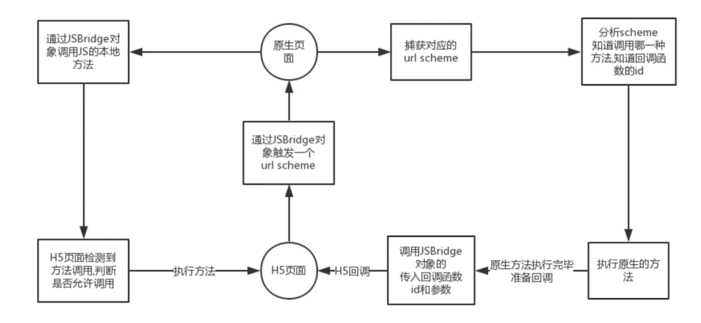
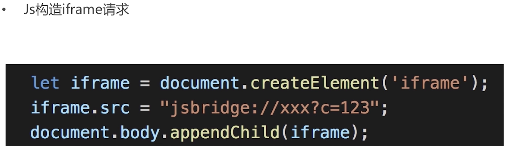
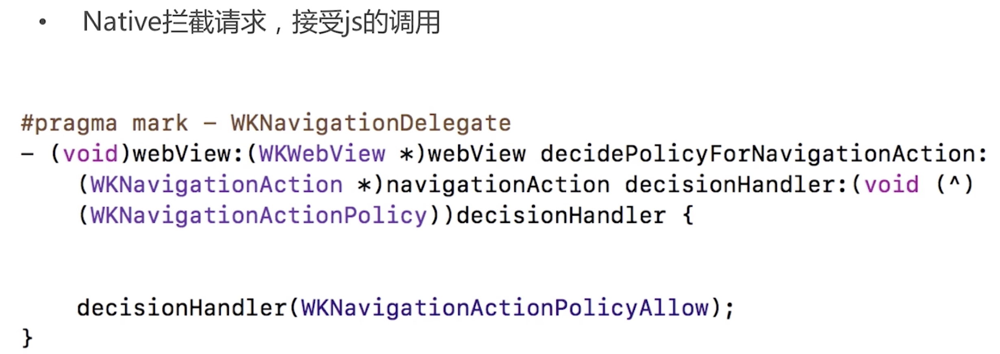

# 混合开发的原理
h5通过window.location.href发起一个自定义的get请求，原生拦截到我们h5发送到的自定义请求然后做相应的处理，之后在webview中注入一段js代码，这段js代码会执行h5的js代码并且会传递数据给h5，这样就完成了一次h5和原生混合开发的过程

# JS bridge 原理

  1. JS bridge
   native webview window 我们的代码使用webview来承载 我们的webview就像是 native的一个组件 就像我们的浏览器一样
  
  
  
  

  native对我们的webview做了一个监听 所有的请求都有走一个native的方法

# 开发 ios webview

# 编写 jsAPI 接口

# 集成 ios app
