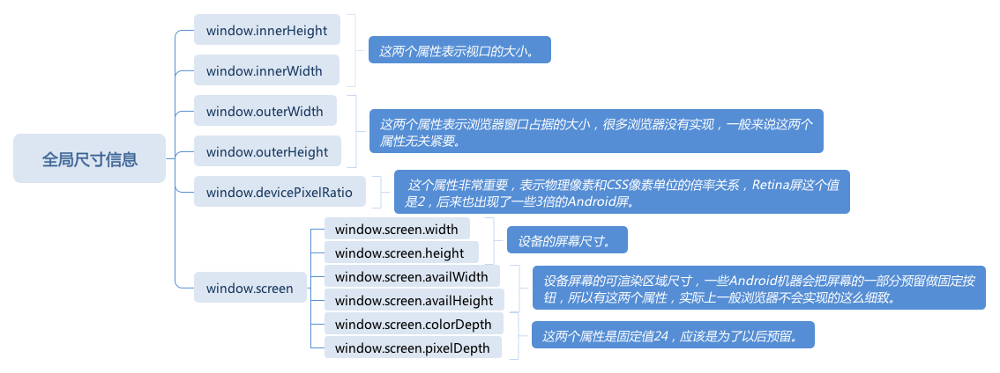

# 浏览器实现原理 与 API

4. 阶段四
   盒模型 浏览器又可以支持元素和文字的混排，元素被定义为占据长方形的区域，还允许边框、边距和留白
   在正常流的基础上，浏览器还支持两类元素 绝对定位元素和浮动元素

- 绝对定位元素把自身从正常流抽出，直接由 top 和 left 等属性确定自身的位置，不参加排版计算，也不影响其它元素。绝对定位元素由 position 属性控制
- 浮动元素则是使得自己在正常流的位置向左或者向右移动到边界，并且占据一块排版空间。浮动元素由 float 属性控制
  除了正常流，浏览器还支持其它排版方式，比如现在非常常用的 Flex 排版，这些排版方式由外部元素的 display 属性来控制（注意，display 同时还控制元素在正常流中属于 inline 等级还是 block 等级）

* 正常流文字排版
  正常流是唯一一个文字和盒混排的排版方式

  在正常流的文字排版中，多数元素被当作长方形盒来排版，而只有 display 为 inline 的元素，是被拆成文本来排版的

* 正常流中的盒

在正常流中，display 不为 inline 的元素或者伪元素，会以盒的形式跟文字一起排版。多数 display 属性都可以分成两部分：内部的排版和是否 inline，带有 inline- 前缀的盒，被称作行内级盒。
根据盒模型，一个盒具有 margin、border、padding、width/height 等属性，它在主轴方向占据的空间是由对应方向的这几个属性之和决定的，而 vertical-align 属性决定了盒在交叉轴方向的位置，同时也会影响实际行高。所以，浏览器对行的排版，一般是先行内布局，再确定行的位置，根据行的位置计算出行内盒和文字的排版位置。块级盒比较简单，它总是单独占据一整行，计算出交叉轴方向的高度即可。

- 绝对定位元素
  position 属性为 absolute 的元素，我们需要根据它的包含块来确定位置，这是完全跟正常流无关的一种独立排版模式，逐层找到其父级的 position 非 static 元素即可。

- 浮动元素排版
  float 元素非常特别，浏览器对 float 的处理是先排入正常流，再移动到排版宽度的最左 / 最右（这里实际上是主轴的最前和最后）。 移动之后，float 元素占据了一块排版的空间

- 其它的排版
  CSS 的每一种排版都有一个很复杂的规定，实际实现形式也各不相同。比如如 Flex 排版，支持了 flex 属性，flex 属性将每一行排版后的剩余空间平均分配给主轴方向的 width/height 属性。浏览器支持的每一种排版方式，都是按照对应的标准来实现的。

5.  阶段五
    我们已经经历了把 URL 变成字符流，把字符流变成词（token）流，把词（token）流构造成 DOM 树，把不含样式信息的 DOM 树应用 CSS 规则，变成包含样式信息的 DOM 树，并且根据样式信息，计算了每个元素的位置和大小

- 渲染
  浏览器中渲染这个过程，就是把每一个元素对应的盒变成位图。这里的元素包括 HTML 元素和伪元素，一个元素可能对应多个盒（比如 inline 元素，可能会分成多行）。每一个盒对应着一张位图。
  这个渲染过程是非常复杂的，但是总体来说，可以分成两个大类：图形和文字。 都需要底层库来支持
  讲的渲染过程，是不会把子元素绘制到渲染的位图上的，这样，当父子元素的相对位置发生变化时，可以保证渲染的结果能够最大程度被缓存，减少重新渲染
- 合成
  合成是一个性能考量，那么合成的目标就是提高性能，根据这个目标，我们建立的原则就是最大限度减少绘制次数原则
- 绘制
  绘制是把“位图最终绘制到屏幕上，变成肉眼可见的图像”的过程.不过，一般来说，浏览器并不需要用代码来处理这个过程，浏览器只需要把最终要显示的位图交给操作系统即可

  绘制面积

  我们考虑一个情况：鼠标划过浏览器显示区域。这个过程中，鼠标的每次移动，都造成了重新绘制，如果我们不重新绘制，就会产生大量的鼠标残影
  计算机图形学中，我们使用的方案就是“脏矩形”算法，也就是把屏幕均匀地分成若干矩形区域。
  当鼠标移动、元素移动或者其它导致需要重绘的场景发生时，我们只重新绘制它所影响到的几个矩形区域就够了。比矩形区域更小的影响最多只会涉及 4 个矩形，大型元素则覆盖多个矩形。

  设置合适的矩形区域大小，可以很好地控制绘制时的消耗。设置过大的矩形会造成绘制面积增大，而设置过小的矩形则会造成计算复杂。
  我们重新绘制脏矩形区域时，把所有与矩形区域有交集的合成层（位图）的交集部分绘制即可。

  总结
  浏览器中的位图操作部分，这包括了渲染、合成和绘制三个部分。渲染过程把元素变成位图，合成把一部分位图变成合成层，最终的绘制过程把合成层显示到屏幕上。

  当绘制完成时，就完成了浏览器的最终任务，把一个 URL 最后变成了一个可以看的网页图像。

  浏览器渲染出的结果如果是位图，请问输入框是怎么实现的？

  实际上渲染过程除了位图，最终绘制上去还产生一个"热区"，这个“热区”不但跟你说的 input 相关，还跟用户选择、鼠标事件和 scroll 等交互相关。

  从服务器端获取文档数据 ☞ 浏览器解析成 DOM 树 ☞CSS 根据 DOM 规则开始排版文档内容 ☞ 浏览器分文字和图形进行渲染在窗口展现 ☞ 接下来就是 JS 的交互了。

# 浏览器 DOM

HTML 文档是一个由标签嵌套而成的树形结构，因此，DOM 也是使用树形的对象模型来描述一个 HTML 文档

DOM API

- 节点：DOM 树形结构中的节点相关 API。
- 事件：触发和监听事件相关 API。
- Range：操作文字范围相关 API。
- 遍历：遍历 DOM 需要的 API。

1. 节点
   DOM 的树形结构所有的节点有统一的接口 Node
   HTML 代码并且运行后，就会在内存中得到这样一棵 DOM 树，HTML 的写法会被转化成对应的文档模型，而我们则可以通过 JavaScript 等语言去访问这个文档模型。
   DocumentFragment 也非常有用，它常常被用来高性能地批量添加节点。因为 Comment、DocumentType 和 ProcessingInstruction 很少需要运行时去修改和操作

2. node
   Node 是 DOM 树继承关系的根节点，它定义了 DOM 节点在 DOM 树上的操作，首先，Node 提供了一组属性，来表示它在 DOM 树中的关系，它们是：

- parentNode
- childNodes
- firstChild
- lastChild
- nextSibling
- previousSibling
  Node 中也提供了操作 DOM 树的 API

* appendChild
* insertBefore
* removeChild
* replaceChild
  除此之外，Node 还提供了一些高级 API

* compareDocumentPosition 是一个用于比较两个节点中关系的函数。
* contains 检查一个节点是否包含另一个节点的函数。
* isEqualNode 检查两个节点是否完全相同。
* isSameNode 检查两个节点是否是同一个节点，实际上在 JavaScript 中可以用“===”。
* cloneNode 复制一个节点，如果传入参数 true，则会连同子元素做深拷贝。

DOM 标准规定了节点必须从文档的 create 方法创建出来，不能够使用原生的 JavaScript 的 new 运算。于是 document 对象有这些方法

createElementcreate
TextNode
createCDATASection
createComment
createProcessingInstruction
createDocumentFragment
createDocumentType

3. Element 与 Attribute
   Node 提供了树形结构上节点相关的操作
   首先，我们可以把元素的 Attribute 当作字符串来看待，这样就有以下的 API

- getAttribute
- setAttribute
- removeAttribute
- hasAttribute

此外，如果你喜欢 property 一样的访问 attribute，还可以使用 attributes 对象，比如 document.body.attributes.class = “a” 等效于 document.body.setAttribute(“class”, “a”)。

4. 查找元素
   document 节点提供了查找元素的能力

- querySelector
- querySelectorAll
- getElementById
- getElementsByName
- getElementsByTagName
- getElementsByClassName

我们需要注意，getElementById、getElementsByName、getElementsByTagName、getElementsByClassName，这几个 API 的性能高于 querySelector

而 getElementsByName、getElementsByTagName、getElementsByClassName 获取的集合并非数组，而是一个能够动态更新的集合

```
var collection = document.getElementsByClassName('winter');
console.log(collection.length);
var winter = document.createElement('div');
winter.setAttribute('class', 'winter')
document.documentElement.appendChild(winter)
console.log(collection.length);
```

尽管 querySelector 系列的 API 非常强大，我们还是应该尽量使用 getElement 系列的 API。

5. 遍历

前面已经提到过，通过 Node 的相关属性，我们可以用 JavaScript 遍历整个树。实际上，DOM API 中还提供了 NodeIterator 和 TreeWalker 来遍历树。

比起直接用属性来遍历，NodeIterator 和 TreeWalker 提供了过滤功能，还可以把属性节点也包含在遍历之内。
NodeIterator 的基本用法示例如下：

```

var iterator = document.createNodeIterator(document.body, NodeFilter.SHOW_TEXT | NodeFilter.SHOW_COMMENT, null, false);
var node;
while(node = iterator.nextNode())
{
    console.log(node);
}
```

6. Range
   Range API 是一个比较专业的领域，如果不做富文本编辑类的业务，不需要太深入。这里我们就仅介绍概念和给出基本用法的示例，你只要掌握即可

# 如何获取一个元素的准确位置

2. CSSOM View
   CSSOM View 这一部分的 API，可以视为 DOM API 的扩展，它在原本的 Element 接口上，添加了显示相关的功能，这些功能，又可以分成三个部分：窗口部分，滚动部分和布局部分，下面我来分别带你了解一下。

- 窗口 API 窗口 API 用于操作浏览器窗口的位置、尺寸等

  1. moveTo(x, y) 窗口移动到屏幕的特定坐标；
  2. moveBy(x, y) 窗口移动特定距离；
  3. resizeTo(x, y) 改变窗口大小到特定尺寸；
  4. resizeBy(x, y) 改变窗口大小特定尺寸。

3. 滚动 API

视口滚动 API 可视区域（视口）滚动行为由 window 对象上的一组 API 控制

1. scrollX 是视口的属性，表示 X 方向上的当前滚动距离，有别名 pageXOffset；
2. scrollY 是视口的属性，表示 Y 方向上的当前滚动距离，有别名 pageYOffset；
3. scroll(x, y) 使得页面滚动到特定的位置，有别名 scrollTo，支持传入配置型参数 {top, left}；
4. scrollBy(x, y) 使得页面滚动特定的距离，支持传入配置型参数 {top, left}。

要想监听视口滚动事件，我们需要在 document 对象上绑定事件监听函数 document.addEventListener("scroll", function(event)})

视口滚动 API 是页面的顶层容器的滚动，大部分移动端浏览器都会采用一些性能优化，它和元素滚动不完全一样，请大家一定建立这个区分的意识

4. 元素滚动 API

- scrollTop 元素的属性，表示 Y 方向上的当前滚动距离。
- scrollLeft 元素的属性，表示 X 方向上的当前滚动距离。
- scrollWidth 元素的属性，表示元素内部的滚动内容的宽度，一般来说会大于等于元素宽度。
- scrollHeight 元素的属性，表示元素内部的滚动内容的高度，一般来说会大于等于元素高度。
- scroll(x, y) 使得元素滚动到特定的位置，有别名 scrollTo，支持传入配置型参数 {top, left}。
- scrollBy(x, y) 使得元素滚动到特定的位置，支持传入配置型参数 {top, left}。scrollIntoView(arg) 滚动元素所在的父元素，使得元素滚动到可见区域，可以通过 arg 来指定滚到中间、开始或者就近。

可滚动的元素也支持 scroll 事件，我们在元素上监听它的事件即可

5. 布局 API

- 全局尺寸信息
  
  我们主要使用的是 innerHeight、innerWidth 和 devicePixelRatio 三个属性，因为我们前端开发工作只需要跟视口打交道
- 元素的布局信息
  最后我们来到了本节课一开始提到的问题，我们是否能够取到一个元素的宽（width）和高（height）呢？实际上，我们首先应该从脑中消除“元素有宽高”这样的概念，我们课程中已经多次提到了，有些元素可能产生多个盒，事实上，只有盒有宽和高，元素是没有的。

所以我们获取宽高的对象应该是“盒”，于是 CSSOM View 为 Element 类添加了两个方法：

1. getClientRects()
2. getBoundingClientRect()

getClientRects 会返回一个列表，里面包含元素对应的每一个盒所占据的客户端矩形区域，这里每一个矩形区域可以用 x, y, width, height 来获取它的位置和尺寸。

getBoundingClientRect ，这个 API 的设计更接近我们脑海中的元素盒的概念，它返回元素对应的所有盒的包裹的矩形区域，需要注意，这个 API 获取的区域会包括当 overflow 为 visible 时的子元素区域。

这两个 API 获取的矩形区域都是相对于视口的坐标，这意味着，这些区域都是受滚动影响的。

如果我们要获取相对坐标，或者包含滚动区域的坐标，需要一点小技巧

```
如这段代码所示，我们只需要获取文档跟节点的位置，再相减即可得到它们的坐标。

var offsetX = document.documentElement.getBoundingClientRect().x - element.getBoundingClientRect().x;
```

- 我们首先就说到了，就像 HTML 和 CSS 分别承担了语义和表现的分工，DOM 和 CSSOM 也有语义和表现的分工

- CSSOM 是 CSS 的对象模型，在 W3C 标准中，它包含两个部分：描述样式表和规则等 CSS 的模型部分（CSSOM），和跟元素视图相关的 View 部分（CSSOM View）。

```
把页面上的所有盒的轮廓画到一个 canvas 元素上。

const canvas = document.getElementById('rect');
canvas.width = document.documentElement.getBoundingClientRect().width;
canvas.height = document.documentElement.getBoundingClientRect().height;

canvas.style.position = 'absolute';
canvas.style.top = 0;
canvas.style.left = 0;
canvas.style.border = '1px solid red';

const ctx = canvas.getContext('2d');

console.log(document.childNodes);

function travaldom(root) {
  if (root.tagName && root.tagName !== 'text' && root.tagName !== 'canvas') {
    const { x, y, width, height } = root.getBoundingClientRect();
    ctx.beginPath();
    ctx.lineWidth = '1';
    ctx.strokeStyle = 'blue';
    ctx.rect(x, y, width, height);
    ctx.stroke();
  }
  root.childNodes.forEach((node) => {
    travaldom(node);
  });
}
travaldom(document);

```
