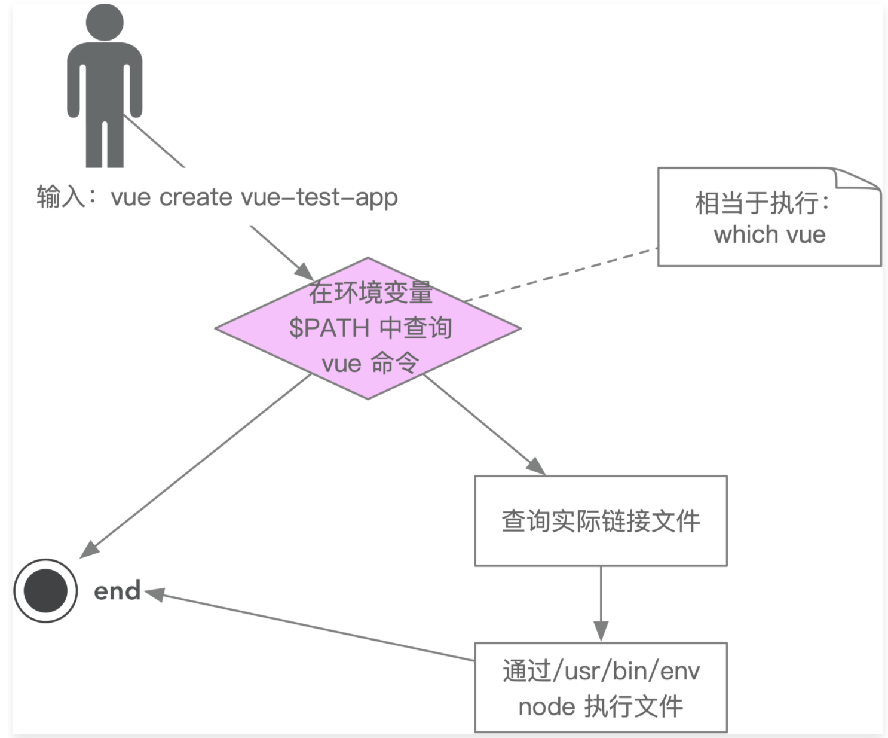

# 脚手架设计和框架搭建

## 必要性

1. 研发效能
   核心目的，提升前端研发效能
2. 核心价值
   将研发过程：

- 自动化：项目重复代码拷贝/git 操作/发布上线操作
- 标准化：项目创建/git flow/发布流程/回滚流程
- 数据化：研发过程系统化、数据化，使得研发过程可量化

3. 和自动化构建的区别
   问题：jenkins、travis 等自动化构建工具已经比较成熟了，为什么还需要自研脚手架？

- 不满足需求：jenkins、travis 通常在 git hooks 中触发，需要在服务端执行，无法覆盖研发人员本地的功能，如：创建项目自动化、本地 git 操作自动化等
- 定制复杂：jenkins、travis 定制过程需要开发插件，其过程较为复杂，需要使用 Java 语言，对前端同学不够友好

## 命令基础

1. ~表示当前登录用户的主目录
2. node 的环境变量指向的就是 bin 这个文件夹，bin 下面的目录是用来存放可执行文件的，如果存在才会执行该命令。
3. 可以通过/usr/bin/env 命令查看一下 node 的环境变量

## 从使用角度来理解什么是脚手架

1. 脚手架简介
   脚手架本质是一个操作系统的客户端，它通过命令行执行，比如：
   <code>vue create vue-test-app</code>
   上面这条命令由 3 个部分组成：

- 主命令: vue
- command: create
- command 的 param: vue-test-app
  它表示创建一个 vue 项目，项目的名称为 vue-test-app ，以上是最一个较为简单的脚手架命令，但实际场景往往更加复杂，比如：
  当前目录已经有文件了，我们需要覆盖当前目录下的文件，强制进行安装

```js
vue create vue-test-app --force
```

这里的--force， 叫做 option，用来辅助脚手架确认在特定场景下用户的选择（可以理解为配置）。还有一种场景：
通过 vue create 创建项目时，会自动执行 npm i 帮用户安装依赖，如果我们希望使用淘宝源来安装，可以输入命令：

```js
vue create vue-test-app --force -r https://registry.npm.taobao.org
```

-r -> 也叫做 option,与 --force 不同的是 使用 -，并且使用简写，这里的-r 也可以替换成 --registry
--help -> 查看 vue create 支持的所有 options

-r https://registry.npm.taobao.org后面的 -r https://registry.npm.taobao.org 成为 option 的 param，
其实 --force 可以理解为: --force true,简写为: --force 或 -r

2. 脚手架执行原理
   
   执行原理如下

- 在终端输入 vue create vue-test-app
- 终端解析出 vue 命令
- 终端在环境变量中找到 vue 命令
- 终端根据 vue 命令链接到实际文件 vue.js
- 终端利用 node 执行 vue.js
- vue.js 解析 command / options
- vue.js 执行 command
- 执行完毕，退出执行

3. 从应用的角度看如何开发一个脚手架
   以 vue-cli 为例

- 开发 npm 项目，该项目中应包含一个 bin/vue.js,并发布到 npm
- 将 npm 项目安装到 node 的 lib/node_modules
- 在 node 的 bin 目录下配置 vue 软链接 指向 lib/node_modules/@vue/cli/bin/vue.js

这样我们在执行 <code>vue</code> 命令的时候 可以找到 vue.js 进行执行

4. 为什么全局安装 <code>@vue/cli</code> 后会添加的命令为 <code>vue</code>？
<code>npm install -g @vue/cli </code>
<p>全局安装 <code>@vue/cli</code> 时发生了什么？</p>
<p>为什么 <code>vue</code> 指向一个 <code>js</code> 文件，我们却可以直接通过 <code>vue</code> 命令直接去执行它？</p>

5. 脚手架原理进阶

- 为什么说脚手架本质是操作系统的客户端？它和我们在 PC 上安装的应用/软件有什么区别？
- 如何为 node 脚手架命令创建别名？
- 描述脚手架命令执行的全过程
  

  ```js
  #!/usr/bin/env node  // 在环境变量中查找 node
  #!/usr/bin/node  // 直接执行 usr/bin/ 目录 下面的node
  ```

## 脚手架开发流程

- 流程
  1.  开发流程
  2.  创建 npm 项目
  3.  创建脚手架入口文件，在最上方添加 <code>#!/usr/bin/env node</code>
  4.  配置 package.json，添加 bin 属性
  5.  编写脚手架代码
  6.  将脚手架发布到 npm
- 难点
  1.  分包: 将复杂的模块拆分成若干个模块
  2.  命令注册
      比如 vue create / vue add /vue invoke
      参数解析 1. options 的全称： --version --help 2. options 的简写： -V -h 3. 带 params 的 options：--path /usr/zl/Desktop/xxx
      代码块 <code>vue command [options] <params></code>
      帮助文档
      global help
      Usage 2. Options 3. Commands
      vue 的示例信息
      command help \* Usage Options
      vue create 的帮助信息
      还有很多
      命令行交互
      日志打印
      命令行文字变色
      网络通信
      文件处理

## 脚手架本地 link 标准流程 - 本地调试方法 

1. 链接本地脚手架

   cd your-cli-dir -> npm link
2. 链接本地库文件

   cd your-lib-dir   npm link</br>
   cd your-cli-dir   npm link your-lib

3. 取消链接本地库文件

   cd your-lib-dir npm unlink
   cd your-cli-dir
4. 解除 link - 也可以 npm remove/uninstall -g xxxx

- link 存在 npm unlink your-lib
- link 不存在 <code>rm -rf node_modules  npm install -S your-lib</code>

5. 理解 npm link
   - npm link your-lib: 将当前项目中的 node_modules 下指定的库文件链接到 node 全局 node_modules 下的库文件（ 全局的又指向我们开发的库文件）
   - npm link: 将当前项目链接到 node 全局 node_modules 中作为一个库文件，并解析 bin 配置创建可执行文件
6. 理解 npm unlink
   - npm unlink: 将项目从 node 全局 node_modlues 中移除
   - npm unlink your-lib: 将当前项目中的库文件移除依赖

7. 全局lib库地址 <code> /usr/local/lib/node_modules</code>


## lerna学习
123