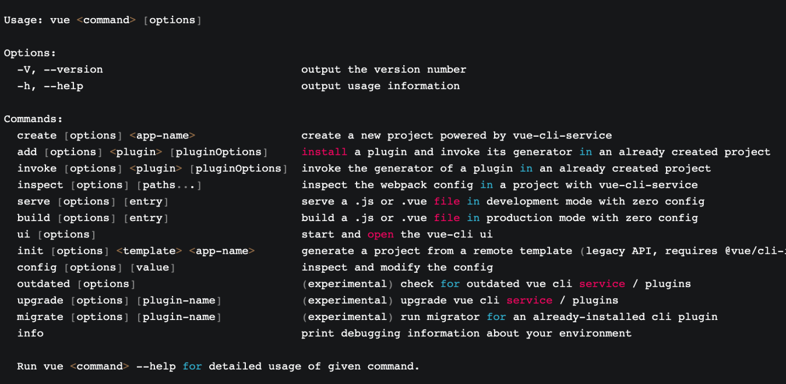
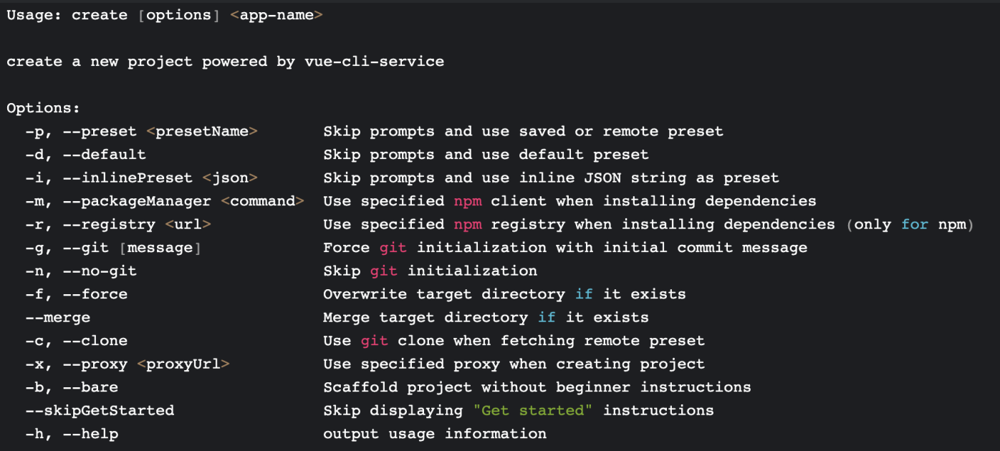

# 脚手架设计和框架搭建

## 必要性

1. 研发效能
   核心目的，提升前端研发效能
2. 核心价值
   将研发过程：

- 自动化：项目重复代码拷贝/git 操作/发布上线操作
- 标准化：项目创建/git flow/发布流程/回滚流程
- 数据化：研发过程系统化、数据化，使得研发过程可量化

3. 和自动化构建的区别
   问题：jenkins、travis 等自动化构建工具已经比较成熟了，为什么还需要自研脚手架？

- 不满足需求：jenkins、travis 通常在 git hooks 中触发，需要在服务端执行，无法覆盖研发人员本地的功能，如：创建项目自动化、本地 git 操作自动化等
- 定制复杂：jenkins、travis 定制过程需要开发插件，其过程较为复杂，需要使用 Java 语言，对前端同学不够友好

## 命令基础

1. ~表示当前登录用户的主目录
2. node 的环境变量指向的就是 bin 这个文件夹，bin 下面的目录是用来存放可执行文件的，如果存在才会执行该命令。
3. 可以通过/usr/bin/env 命令查看一下 node 的环境变量

## 从使用角度来理解什么是脚手架

1. 脚手架简介
   脚手架本质是一个操作系统的客户端，它通过命令行执行，比如：
   <code>vue create vue-test-app</code>
   上面这条命令由 3 个部分组成：

- 主命令: vue
- command: create
- command 的 param: vue-test-app
  它表示创建一个 vue 项目，项目的名称为 vue-test-app ，以上是最一个较为简单的脚手架命令，但实际场景往往更加复杂，比如：
  当前目录已经有文件了，我们需要覆盖当前目录下的文件，强制进行安装

```js
vue create vue-test-app --force
```

这里的--force， 叫做 option，用来辅助脚手架确认在特定场景下用户的选择（可以理解为配置）。还有一种场景：
通过 vue create 创建项目时，会自动执行 npm i 帮用户安装依赖，如果我们希望使用淘宝源来安装，可以输入命令：

```js
vue create vue-test-app --force -r https://registry.npm.taobao.org
```

-r -> 也叫做 option,与 --force 不同的是 使用 -，并且使用简写，这里的-r 也可以替换成 --registry
--help -> 查看 vue create 支持的所有 options

-r https://registry.npm.taobao.org后面的 -r https://registry.npm.taobao.org 成为 option 的 param，
其实 --force 可以理解为: --force true,简写为: --force 或 -r

2. 脚手架执行原理
   
   执行原理如下

- 在终端输入 vue create vue-test-app
- 终端解析出 vue 命令
- 终端在环境变量中找到 vue 命令 -> which vue -> /usr/local/bin/vue
- 终端根据 vue 命令链接到实际文件(因为是软链接，链向全局 node_modules 里面的 vue.js) vue.js
  - vue -> ../../../Users/zhangli/.config/yarn/global/node_modules/.bin/vue
  - umi -> ../lib/node_modules/umi/bin/umi.js
  - zhangli-cli-dev -> ../lib/node_modules/@zhangli-cli-dev/core/bin/index.js
  - create-umi-app -> ../../../Users/zhangli/.config/yarn/global/node_modules/.bin/create-umi-app
  - taro -> ../../../Users/zhangli/.config/yarn/global/node_modules/.bin/taro
  - /usr/local/lib/node_modules -> node 的全局依赖，通过 -g 全局安装的包都会放入此目录下
- 终端利用 node 执行 vue.js
- vue.js 解析 command / options
- vue.js 执行 command
- 执行完毕，退出执行

3. 从应用的角度看如何开发一个脚手架
   以 vue-cli 为例

- 开发 npm 项目，该项目中应包含一个 bin/vue.js,并发布到 npm
- 将 npm 项目安装到 node 的 lib/node_modules
- 在 node 的 bin 目录下配置 vue 软链接 指向 lib/node_modules/@vue/cli/bin/vue.js

这样我们在执行 <code>vue</code> 命令的时候 可以找到 vue.js 进行执行

4. 思考

- 为什么全局安装 <code>@vue/cli</code> 后会添加的命令为 <code>vue</code>？
  因为在 package.json 中进行了 bin 的配置
  <code>npm install -g @vue/cli </code>
- <p>全局安装 <code>@vue/cli</code> 时发生了什么？</p>

1. node 将下载包到 全局 node_modules 下
2. 接着去解析 package.json 中的 bin 目录，如果有，回去 bin 目录下配置一个软链接，执行 bin 目录配置的可执行文件

- <p>为什么 <code>vue</code> 指向一个 <code>js</code> 文件，我们却可以直接通过 <code>vue</code> 命令直接去执行它？</p>

```js
1. 去环境变量当中找到 vue，有没有被注册
2. 通过 /usr/bin/env node 会将 node 环境运行起来
   比如我们在桌面创建 vue-test/test.js 文件，进入 vue-test,直接 ./test.js 是可以执行的，和上面效果一样，直接调用
   等价于 /usr/bin/env node vue-test/test.js 直接去执行这个文件，等价于node vue-test/test.js

   如何创建一个软连接 去bin目录下，执行 ln -s zl123 文件path
```

5. 脚手架原理进阶

- 为什么说脚手架本质是操作系统的客户端？它和我们在 PC 上安装的应用/软件有什么区别？
  本质的执行是依靠 node 执行起来的，node 是一个操作系统客户端 我们的文件只是 node 的参数而已
- 如何为 node 脚手架命令创建别名？
  通过软连接的嵌套，也可使实现命令的别名 ln -s ./vue vue2
- 描述脚手架命令执行的全过程
  

  ```js
  #!/usr/bin/env node  // 在环境变量中查找 node, 如果改成 paython 会用其执行
  #!/usr/bin/node  // 直接执行 usr/bin/ 目录 下面的node
  ```

6. 私服 npm 的搭建参考
   https://blog.csdn.net/qq_29950673/article/details/89392978

## 脚手架开发流程

- 流程
  1.  开发流程
  2.  创建 npm 项目
  3.  创建脚手架入口文件，在最上方添加 <code>#!/usr/bin/env node</code>
  4.  配置 package.json，添加 bin 属性
  5.  编写脚手架代码
  6.  将脚手架发布到 npm
- 难点

  1.  分包: 将复杂的模块拆分成若干个模块
  2.  命令注册
      比如 vue create / vue add /vue invoke
  3.  参数解析
      - options 的全称： --version --help
      - options 的简写： -V -h
      - 带 params 的 options：--path /usr/zl/Desktop/xxx
        代码块 <code>vue command [options] <params></code>
  4.  帮助文档
      global help
      - Usage
      - Options
      - Commands

  vue 的示例信息
  
  vue create 的帮助信息
  
  还有很多
  命令行交互
  日志打印
  命令行文字变色
  网络通信
  文件处理

## 脚手架本地 link 标准流程 - 本地调试方法

1. 链接本地脚手架

   cd your-cli-dir -> npm link

2. 链接本地库文件

   cd your-lib-dir npm link</br>
   cd your-cli-dir npm link your-lib

3. 取消链接本地库文件

   cd your-lib-dir npm unlink
   cd your-cli-dir

4. 解除 link - 也可以 npm remove/uninstall -g xxxx

- link 存在 npm unlink your-lib
- link 不存在 <code>rm -rf node_modules npm install -S your-lib</code>

5. 理解 npm link
   - npm link your-lib: 将当前项目中的 node_modules 下指定的库文件链接到 node 全局 node_modules 下的库文件（ 全局的又指向我们开发的库文件）
   - npm link: 将当前项目链接到 node 全局 node_modules 中作为一个库文件，并解析 bin 配置创建可执行文件
6. 理解 npm unlink

   - npm unlink: 将项目从 node 全局 node_modlues 中移除
   - npm unlink your-lib: 将当前项目中的库文件移除依赖

7. 全局 lib 库地址 <code> /usr/local/lib/node_modules</code>

# 面试总结

- 熟悉 Yargs 脚手架开发框架
- 熟悉多 Package 管理工具 Lerna 的使用方法和实现原理
- 深入理解 Node.js 模块路径解析流程

# Yargs

如何通过 yargs 来开发一个脚手架？ 1. 介绍脚手架构成 2. 初始化流程

## 脚手架构成 - 主命令/命令/参数

- bin：package.json 中配置 bin 属性，npm link 本地安装
- command：命令
- options：参数（boolean/string/number）
- 文件顶部增加 #!/usr/bin/env node

## 脚手架初始化流程

- 构造函数：Yargs() // 直接调用 yargs 构造函数去生成脚手架，调用一系列脚手架的常用方法，对脚手架功能进行增强
- 常用方法：
  - Yargs.options // 注册脚手架的属性
  - Yargs.option
  - Yargs.group // 将属性分组
  - Yargs.demandCommand
  - Yargs.recommendCommands
  - Yargs.strict
  - Yargs.fail // 对脚手架的异常进行监听
  - Yargs.alias
  - Yargs.wrap
  - Yargs.epilogue

## 脚手架参数解析方法

- hideBin(process.argv) / Yargs.argv
- Yargs.parse(argv, options) // 第二个参数可以使参数列表，会全部注入到参数命令只中

## 命令注册方法

- Yargs.command(command, describe, builder, handler)
- Yargs.command({ command, describe, builder, handler })

# lerna 理解

1. lerna 有什么用？
2. 是如何实现命令调用的？

## Lerna 是基于 git+npm 的多 package 项目管理工具

主要是 降低我们很多 package 项目当中的操作成本，也可以帮我们完成一个发布的标准化

## 实现原理

- 通过 import-local 优先调用本地 lerna 命令
- 通过 Yargs 生成脚手架，先注册全局属性，再注册命令，最后通过 parse 方法解析参数
- lerna 命令注册时需要传入 builder 和 handler 两个方法
  - builder 方法用于注册命令专属的 options
  - handler 用来处理命令的业务逻辑
- lerna 通过配置 npm 本地依赖的方式来进行本地开发，具体写法是在 package.json 的依赖中写入：\* file:your-local-module-path ，在 lerna publish 时会自动将该路径替换

# Node.js 模块路径解析流程

- Node.js 项目模块路径解析是通过 require.resolve 方法来实现的
- require.resolve 就是通过 Module.\_resolveFileName 方法实现的
- require.resolve 实现原理：
  - Module.\_resolveFileName 方法核心流程有 3 点：

```js
1. 判断是否为内置模块
2. 通过 Module._resolveLookupPaths 方法生成 node_modules 可能存在的路径
3. 通过 Module._findPath 查询模块的真实路径
```

- Module.\_findPath 核心流程有 4 点：

```js
1. 查询缓存（将 request 和 paths 通过 \x00 合并成 cacheKey）
2. 遍历 paths，将 path 与 request 组成文件路径 basePath
3. 如果 basePath 存在则调用 fs.realPathSync 获取文件真实路径
4. 将文件真实路径缓存到 Module._pathCache（key 就是前面生成的 cacheKey）
```

- fs.realPathSync 核心流程有 3 点：

```js
  1. 查询缓存（缓存的 key 为 p，即 Module.\_findPath 中生成的文件路径）
  2. 从左往右遍历路径字符串，查询到 / 时，拆分路径，判断该路径是否为软链接，如果是软链接则查询真实链接，并生成新路径  p，然后继续往后遍历，这里有 1 个细节需要特别注意：
      遍历过程中生成的子路径 base 会缓存在 knownHard 和 cache 中，避免重复查询
  3. 遍历完成得到模块对应的真实路径，此时会将原始路径 original 作为 key，真实路径作为 value，保存到缓存中

```

- require.resolve.paths 等价于 Module.\_resolveLookupPaths，该方法用于获取所有 node_modules 可能存在的路径
- require.resolve.paths 实现原理：
  如果路径为 /（根目录），直接返回 ['/node_modules']
  否则，将路径字符串从后往前遍历，查询到 / 时，拆分路径，在后面加上 node_modules，并传入一个 paths 数组，直至查询不到 / 后返回 paths 数组
