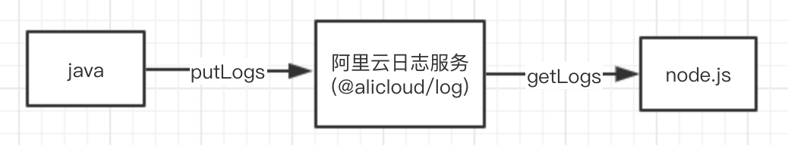

# 浑仪系统后端技术栈回顾总结
浑仪系统是公司内部做的一个埋点数据可视化的项目，属于前端基础建设之一。我参与了前后端部分开发工作，还是有一些成长的，也是第一次使用 [egg](https://eggjs.org/zh-cn/intro/) 框架，现对这个项目中用的一些技术（主要是后端）做个记录或总结。  

技术栈：
  - 前端：vue + vuex + vue-router + echarts + ant-design-vue
  - 后端：egg + sequelize(数据库ORM) + mysql +（docker 部署）

## 项目分析
既然是埋点可视化，那必然要先有数据，这个项目的埋点数据源是落在[阿里云日志服务](https://help.aliyun.com/document_detail/48869.html)上的，日志服务（Log Service，简称 SLS）提供了日志数据采集、消费、查询分析等功能，查询分析功能虽然也提供了一些数据可视化的功能，但是不方便公司其他人员查看，比如运营；有些想要的功能也没有，比如没有热图分析、漏斗分析等。 

日志服务初始就是提供了一些默认字段，当然也提供了 api 让开发者自己添加一些新的想要记录的字段，在项目中我们就添加了utmCnt_a、utmCnt_b、utmCnt_c、utmCnt_d，这四个的含义如下：
  - utmCnt_a：a段值，标识唯一项目，一个域名表示一个项目；
  - utmCnt_b：b段值，标识唯一页面（utmCnt_a.utmCnt_b），是根据路径pathname来；
  - utmCnt_c：c段值，标识页面上唯一区块（utmCnt_a.utmCnt_b.utmCnt_c），可以自己自定义，比如c0001；
  - utmCnt_d：d段值，标识区块下的唯一坑位（utmCnt_a.utmCnt_b.utmCnt_c.utmCnt_d），也可自定义，一般通过索引 index 或id。 
 
有了这些我们就可以统计出某个按钮一天的点击次数、页面点击热图等功能，当然项目中不止是加了这四个字段，不过这四个比较重要，用的最多。自定义字段的数据采集，是通过前端一个sdk收集的，然后调后端接口（java写的）添加日志到日志服务上，后续通过 node 服务消费数据，可视化展示到前台界面上（浑仪就是给这后半部分做的项目），数据流如下：



## 后端技术栈

#### 初始化数据库
本项目通过 sequelize 进行数据库操作，[中文文档](https://github.com/demopark/sequelize-docs-Zh-CN) 。

先安装 egg-sequelize、mysql2、sequelize-cli 模块
```
npm i -S egg-sequelize mysql2   // dependencies

npm i -D sequelize-cli    // devDependencies
```
  - egg-sequelize: 辅助我们将定义好的 Model 对象加载到 app 和 ctx 上
  - mysql2: node 程序下的 mysql 驱动 （如果没使用 sequelize 而是直接用的 egg-mysql，则不需要这个模块 ）
  - sequelize-cli: 实现 [Migrations(迁移)](https://segmentfault.com/a/1190000011583608)，方便我们对数据库数据结构做变更

过程：node app --> sequelize(ORM) --> 驱动（mysql2）--> mysql db

**1、新建 .sequelizerc 配置文件**  
在 egg 项目中，我们希望将所有数据库 Migrations 相关的内容都放在 database 目录下，所以我们在项目根目录下新建一个 .sequelizerc 配置文件：
```js
'use strict';

const path = require('path');

module.exports = {
  config: path.join(__dirname, 'database/config.json'), // 默认是 json 文件，本项目用的是 config.js 也是一样的
  'migrations-path': path.join(__dirname, 'database/migrations'),
  'seeders-path': path.join(__dirname, 'database/seeders'),
  'models-path': path.join(__dirname, 'app/model'),
};
```

**2、初始化 Migrations 配置文件和目录**
```
npx sequelize init:config
npx sequelize init:migrations
```
执行完后会生成 database/config.json 文件和 database/migrations 目录，我们修改一下 database/config.json 中的内容，将其改成我们项目中使用的数据库配置：
```js
development: {
  username: 'xxx',
  password: 'xxx',
  database: 'guardians',  // 数据库名称
  host: 'rm-bp1btllrpl19n08i9.mysql.rds.aliyuncs.com',  // 数据库所在服务器的地址（域名或者ip）
  dialect: 'mysql',
},
test: {
  username: 'xxx',
  password: 'xxx',
  database: 'guardians',
  host: 'rm-bp1btllrpl19n08i9.mysql.rds.aliyuncs.com',
  dialect: 'mysql',
},
production: {
  username: process.env.db_username,
  password: process.env.db_password,
  database: 'guardians',
  host: process.env.db_host,
  dialect: 'mysql',
},
```

**3、修改配置文件**
* 在 config/plugin.js 中引入 egg-sequelize 插件
```js
exports.sequelize = {
  enable: true,
  package: 'egg-sequelize',
};
```
* 在 config/config.{env}.js 中编写 sequelize 配置
```js
const databaseConf = require('../database/config');
module.exports = () => {
  const config = exports = {};
  ...
  config.sequelize = databaseConf[process.env.NODE_ENV];
  ...
  return config;
}
```

**4、创建表**  
此时 sequelize-cli 和相关的配置也都初始化好了，我们可以开始编写项目的第一个 Migration 文件来创建我们的一个 user 表了。
```
npx sequelize migration:generate --name=init-user
```
执行完后会在 database/migrations 目录下生成一个 migration 文件(${timestamp}-init-user.js)，我们修改它来处理初始化 user 表。

**5、执行 migrate 进行数据库变更**  
数据持久化
```
# 升级数据库
npx sequelize db:migrate  # 不指定 env， 默认取 development 的配置
# npx sequelize db:migrate --env=production  取 production 的配置
# 如果有问题需要回滚，可以通过 `db:migrate:undo` 回退一个变更
# npx sequelize db:migrate:undo
# 可以通过 `db:migrate:undo:all` 回退到初始状态
# npx sequelize db:migrate:undo:all
```
执行之后，我们的数据库初始化就完成了。更多介绍可以看 egg 官方文档[这里](https://eggjs.org/zh-cn/tutorials/sequelize.html)。

#### 编写业务逻辑代码
下面通过一个获取新老用户占比的接口 （/guardians/api/v2/user/comparison）例子，演示下操作 user 表，完成 CURD 功能。

**1、创建 model**  
首先在 app/model/ 目录下编写 user 这个 Model：
```js
module.exports = app => {
  const { STRING, DATE } = app.Sequelize;

  const User = app.model.define('user', {
    uuid: {
      primaryKey: true,
      type: STRING(64),
      comment: '电脑以及浏览器碰撞的uuid'
    },
    userid: {
      type: STRING(32),
      comment: '用户uid',
    },
    userType: {
      type: STRING(32),
      comment: '用户类型',
    },
    country: {
      type: STRING(32),
      comment: '国家',
    },
    province: {
      type: STRING(32),
      comment: '省份',
    },
    city: {
      type: STRING(32),
      comment: '地区',
    },
    createdTime: {
      type: DATE,
      comment: '账号创建时间'
    },
    updatedTime: {
      type: DATE,
      comment: '账号更新时间'
    }
  }, {
      freezeTableName: true,
      tableName: 'user',
    });

  return User;
};
```
这个 Model 就可以在 Controller 和 Service 中通过 app.model.User 或者 ctx.model.User 访问到了。

**2、创建路由 router**  
Router 主要用来描述请求 URL 和具体承担执行动作的 Controller 的对应关系，框架约定了 app/router.js 文件用于统一所有路由规则。由于本项目路由比较多，所以根据不同模块拆分成不同路由文件，最后统一遍历路由文件。
```js
// app/router.js
const path = require('path');
const Promise = require('bluebird');
const _ = require('lodash');
const fs = Promise.promisifyAll(require('fs'));

module.exports = app => {
  // 遍历路由文件，加载路由
  const routerDir = path.join(__dirname, './router');
  fs.readdirAsync(routerDir).then(files => {
    _.forEach(files, file => {
      const routerItemPath = path.join(routerDir, file);
      require(routerItemPath)(app);
    });
  }).catch(error => {
    app.logger.error('load router error', error);
  });
};

// app/router/user.js
module.exports = app => {
  const { router, controller } = app;
  router.get(
    '/guardians/api/v2/user/comparison',
    controller.user.userComparison
  )
}
```

**3、创建控制器 controller**  
Controller 负责解析用户的输入，处理后返回相应的结果。框架推荐 Controller 层主要对用户的请求参数进行处理（校验、转换），然后调用对应的 service 方法处理业务，得到业务结果后封装并返回。
```js
// app/controller/user.js
const { Controller } = require('egg');
class UserController extends Controller {
  async userComparison() {
    let { startDate, endDate } = this.ctx.query;  // 获取前端传过来的 query 上的参数
    let data = {
      newusernum: 0,
      oldusernum: 0
    }
    // 调对应 user service 层 getUserComparsion 方法
    data = await this.ctx.service.user.getUserComparsion({ startDate, endDate });
    // 返回数据 response 
    this.ctx.body = data;
  }
}
```

**4、创建服务 service**  
Service 就是在复杂业务场景下用于做业务逻辑封装的一个抽象层。
```js
// app/service/user.js
const { Service } = require('egg');
class User extends Service {
  async getUserComparsion({ startDate, endDate }) {
    ...
    try {
      // 通过 logs service 中的 getLogsByTime 方法去日志服务（SLS）查询当前时间段内访问总人数
      let allUsers = await this.ctx.service.logs.getLogsByTime(
        startTs,
        endTs,
        (from, to) => {
          return `* | SELECT uuid GROUP by uuid limit ${from}, ${to}` // sql
        },
      );
      // 在数据库 user 表，查所有满足条件的新用户数据（findAll）
      let newUsers = await this.ctx.model.User.findAll({
        where: {
          createdTime: {
            [lt]: endTs,
            [gt]: startTs,
          },
        }
      });
      target.newusernum = newUsers.length;
      target.oldusernum = allUsers.length - newUsers.length;
      return this.ctx.helper.success(target);
    } catch (error) {
      return this.ctx.helper.fail(error.message);
    }
  }
}

// app/service/logs.js
class Logs extends Service {
  async getLogsByDate(options = {}, from, to) {
    ...
    const { project, store } = this.app.config.alicloudLogConfig;
    // getLogs 是阿里云日志服务 sdk 提供的获取日志的方法，关于 app 如何绑定上 alicloudLog 对象的，后面会讲到
    return this.ctx.app.alicloudLog.getLogs(
      project,
      store,
      from,
      to,
      options,
      {
        timeout: 30000,
      }
    );
  }

  async getLogsByTime(startTime, endTime, getQuery, syncFn, pageNo = 0, pageSize = 1000) {
    const start = pageNo * pageSize;
    const query = getQuery(start, pageSize);
    const data = await this.getLogsByDate({ query }, startTime, endTime);
    if (!data || !data.length) {
      return [];
    }

    // 递归下一页
    pageNo++;
    const nextPageData = await this.getLogsByTime(startTime, endTime, getQuery, syncFn, pageNo, pageSize);
    return data.concat(nextPageData);
  }
}
```
从上面可以看到这个接口用到的数据源来自两部分：一是日志服务，二是数据库。在查询 user 表的时候，用到了 `model.User.findAll` 方法，sequelize model 类的 CURD 方法还有很多，具体可以[这里](https://itbilu.com/nodejs/npm/V1PExztfb.html)。    
这里你可能有个疑问，user 表中已经存在的数据哪里来的？本项目是通过**定时任务**捞取日志，从日志中解析出与用户相关的信息，更新（update 或 create）到 user 表中。  

**5、定时任务**  
定时任务不是必须的，根据自己项目实际需要来。所有的定时任务都统一存放在 app/schedule 目录下，每一个文件都是一个独立的定时任务，可以配置定时任务的属性和要执行的方法。上面提到的定时任务如下：
```js
// app/schedule/daily_log_user.js
const { Subscription } = require('egg');

class LoggerUser extends Subscription {
  // 通过 schedule 属性来设置定时任务的执行间隔等配置
  static get schedule() {
    return {
      cron: '0 0 0 * * *',  // 每天晚上 0 点
      // interval: '30s', // 1 s间隔
      type: 'worker', // 指定所有的 worker 都需要执行
    };
  }

  // subscribe 是真正定时任务执行时被运行的函数
  async subscribe() {
    await this.ctx.service.user.getlogsByDay(1);
  }
}

module.exports = LoggerUser;
```
可以看到定时任务会定时执行 user service 中的 getlogsByDay 方法：
```js
class User extends Service {
  async getlogsByDay(day = 1) {
    // 拉取日志
    await this.ctx.service.logs.getLogsByDay(
      day,
      (from, size) => {
        return `*|select a.uuid,a.uid,a.ipaddr,a.createtime from log a inner join (SELECT uuid,max(createtime) AS maxDate FROM log GROUP BY uuid) b on a.uuid = b.uuid and a.createtime = b.maxDate LIMIT ${from}, ${size}`;
      },
      async item => {
        const {
          uuid,
          uid,
          ipaddr,
          createtime,
        } = item;
        ...
        const exist = await ctx.model.User.findOne({ where: { uuid } });
        if (exist && exist.uuid) {
          ...
          // update user 表
          await ctx.model.User.update({
            uuid,
            userid: uid,
            userType,
            updatedTime: new Date(Number(createtime)),
            country: area.countryName,
            province: area.regionName,
            city: area.cityName
          }, {
              where: {
                uuid,
              },
            });
        } else {
          ...
          // create user 表
          await ctx.model.User.create({
            uuid,
            userid: uid,
            userType,
            createdTime: new Date(Number(createtime)),
            updatedTime: new Date(Number(createtime)),
            country: area.countryName,
            province: area.regionName,
            city: area.cityName,
          });
        }
      }
    );
  }
}
```
这样 user 表就得到数据了，便于后续查询使用，例如前面查新用户。

至此这个接口的业务逻辑就完成，整个流程还是比较清晰的，router --> controller --> service --> model --> 数据库。

**6、插件**  
前面获取日志时有用到 `app.alicloudLog.getLogs`，那么 alicloudLog 对象是如何绑定到 app 上的呢？答案就是通过插件，
插件使用和配置看[这里](https://eggjs.org/zh-cn/basics/plugin.html)，插件开发看[这里](https://eggjs.org/zh-cn/advanced/plugin.html)。   
日志服务 alicloudLog 全局实例插件开发，是通过 @alicloud/log 包进行封装的：
```js
// lib/plugin/egg-alicloud-log/lib/index.js
const AlicloudLog = require('@alicloud/log');

/**
 * @param  {Object} config   对应 config/config.{env}.js 中 alicloudLog 对象的 client 属性的值
 * @param  {Application} app 当前的应用
 */
function createAlicloudLog(config, app) {
  const client = new AlicloudLog(config);
  app.coreLogger.info('[egg-alicloud-log] init done', config);

  return client;
}

module.exports = app => {
  // 第一个参数 alicloudLog 指定了挂载到 app 上的字段，我们可以通过 `app.alicloudLog` 访问到 alicloudLog singleton 实例
  // 第二个参数 createAlicloudLog 接受两个参数(config, app)，并返回一个 alicloudLog 的实例
  app.addSingleton('alicloudLog', createAlicloudLog);
};
```
然后在 config/plugin.js 配置使用插件：
```js
// config/plugin.js
alicloudLog: {
  enable: true,
  path: path.join(__dirname, '../lib/plugin/egg-alicloud-log'),
},
```

## 后端代码部署
这个项目是通过 docker 部署的，根目录 Dockerfile 文件配置如下：
```bash
# 设置基础镜像,如果本地没有该镜像，会从Docker.io服务器pull镜像
FROM node:12.3-alpine

#项目维护者
MAINTAINER cjjcsu

# 设置时区和创建 app 目录
RUN apk --update add tzdata \
    && cp /usr/share/zoneinfo/Asia/Shanghai /etc/localtime \
    && echo "Asia/Shanghai" > /etc/timezone \
    && apk del tzdata \
    && mkdir -p /opt/app  # 创建 app 目录

# 设置工作目录
WORKDIR /opt/app

# 拷贝 package.json 文件到工作目录
# !!重要：package.json 需要单独添加。
# Docker 在构建镜像的时候，是一层一层构建的，仅当这一层有变化时，重新构建对应的层。
# 如果 package.json 和源代码一起添加到镜像，则每次修改源码都需要重新安装 npm 模块，这样木有必要。
# 所以，正确的顺序是: 添加 package.json；安装npm模块；添加源代码。
COPY package.json /opt/app/package.json

# 安装 npm 依赖
RUN npm i --production --registry=https://registry.npm.taobao.org \
    && npm i sequelize-cli --save --registry=https://registry.npm.taobao.org

# 拷贝所有源代码到工作目录
COPY . /opt/app/

# 暴露容器端口
EXPOSE 8010

# 运行迁移和启动 node 应用
CMD sh -c 'NODE_ENV=production npx sequelize db:migrate && npm start'

```
"sh -c" 命令，它可以让 bash 将一个字串作为完整的命令来执行。  

服务端执行构建并打 tag（公司走的 jenkins）：  
```
# 根据 Dockerfile 文件的配置进行构建，‘.’ 必须要，‘-f Dockerfile’ 表示以哪个文件构建，不指定的话默认 Dockerfile
docker build -t docker-image.cai-inc.com/app-prod-ready/front-guardians:280 . -f Dockerfile
```
docker-image.cai-inc.com/app-prod-ready/front-guardians:280 各含义：
  - docker-image.cai-inc.com： 私有仓库域名
  - app-prod-ready：项目名称
  - front-guardians：镜像名称
  - 280：镜像版本号

镜像推送到 docker hub：
```
docker push docker-image.cai-inc.com/app-prod-ready/front-guardians:280
```

## 扩展阅读
  - [前端工程实践之数据埋点分析系统](https://juejin.im/post/5e3fb599f265da573f3563b9)