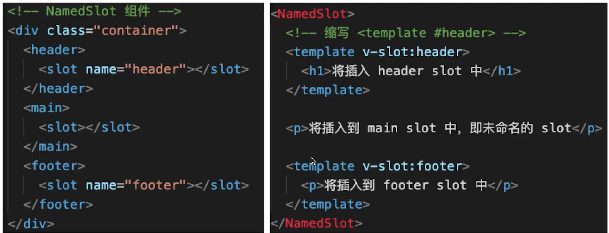

# 自定义 v-modal

```
// 自定义 v-model
<p>{{name}}</p>
<CustomVModel v-model="name"/>

<template>  // CustomVModel
    <!-- 例如：vue 颜色选择 -->
    <input type="text"
        :value="text1"
        @input="$emit('change1', $event.target.value)"
    >f
    <!--
        1. 上面的 input 使用了 :value 而不是 v-model
        2. 上面的 change1 和 model.event1 要对应起来
        3. text1 属性对应起来
    -->
</template>

<script>
export default {
    model: {
        prop: 'text1', // 对应 props text1
        event: 'change1'
    },
    props: {
        text1: String,
        default() {
            return ''
        }
    }
}
</script>
```

# \$nextTick

组件更新之后如果获取最新 dom

1. vue 是异步渲染
2. data 改变之后，dom 不会立刻渲染
3. \$nextTick 会在 dom 渲染之后触发，以获取最新的 dom 节点

```
  methods: {
    addItem() {
        this.list.push(`${Date.now()}`)
        this.list.push(`${Date.now()}`)
        this.list.push(`${Date.now()}`)

        // 1. 异步渲染，$nextTick 待 DOM 渲染完再回调
        // 3. 页面渲染时会将 data 的修改做整合，多次 data 修改只会渲染一次
        this.$nextTick(() => {
          // 获取 DOM 元素
          const ulElem = this.$refs.ul1
          // eslint-disable-next-line
          console.log( ulElem.childNodes.length )
        })
    }
  }
```

# slot

1. 基本使用

```
<SlotDemo :url="website.url">
  {{website.title}}
</SlotDemo>

<template>    //SlotDemo
  <a :href="url">
    <slot>
      默认内容，即父组件没设置内容时，这里显示
    </slot>
  </a>
</template>

<script>
export default {
  props: ['url'],
  data() {
    return {};
  }
};
</script>
```

2. 作用域插槽
   我们子组件中有一个 data 我们怎么把这个数据扔出来 让父组件接收到

- 在子组件 slot 中定义一个动态属性 B，对应到我们的 data 上
- 在外面的组件中我们定义一个模板 template 中 v-slot name 随意取 A A.B 要对应起来

```

<ScopedSlotDemo :url="website.url">
    <template v-slot="slotProps">
        {{slotProps.slotData.title}}
    </template>
</ScopedSlotDemo>
<template>
  <a :href="url">
    <slot :slotData="website">
      {{ website.subTitle }}
      <!-- 默认值显示 subTitle ，即父组件不传内容时 -->
    </slot>
  </a>
</template>
<script>
export default {
  props: ['url'],
  data() {
    return {
      website: {
        url: 'http://wangEditor.com/',
        title: 'wangEditor',
        subTitle: '轻量级富文本编辑器'
      }
    };
  }
};
</script>
```

3. 具名插槽



# 动态 异步组件

:is = 'component name'
需要根据数据，动态渲染场景即组件类型不确定

```
// 异步组件
<component :is="NextTickName"/>
data =>  NextTickName: "NextTick",  这个NextTick和我们的组件名对应起来

const newData = {
  1: { type: 'text' },
  2: { type: 'images' },
  3: { type: 'video' }
};
<div v-for="(val,key) in newData" :key="key"><component :is={val.type}/></div>
```

to -B 一般会有比较大的组件 比如编辑器 富文本 这些在开发同步打包进来 体积会很大 最好异步加载

1. import 函数
2. 按需加载大的组件

```
<!-- 异步组件 -->
<FormDemo v-if="showFormDemo"/>
<button @click="showFormDemo = true">show form demo</button>
// 点击的时候我们引入这个组件
components: {
  FormDemo: () => import('FormDemo'),
},
```

# keep-alive

1. 频繁切换 不需要重新渲染
2. 缓存组件

```
  <keep-alive>
    <!-- tab 切换 -->
    <KeepAliveStageA v-if="state === 'A'" />
    <!-- v-show -->
    <KeepAliveStageB v-if="state === 'B'" />
    <KeepAliveStageC v-if="state === 'C'" />
  </keep-alive>
```

# mixin

1. 多个组件有相同逻辑，抽离出来
2. mixin 并不是完美的解决方案，有一些问题

- 变量来源不明确，不利于阅读
- 混入的变量有可能 命名冲突
- 一个组件引多个 mixin 的关系 mixin 可能会组件出现多对多的关系，复杂度较高

3. Vue 3 提出的 Composition API 解决这些问题

```
export default {
  data() {
    return {
      city: '北京'
    };
  },
  methods: {
    showName() {
      // eslint-disable-next-line
      console.log(this.name);
    }
  },
  mounted() {
    // eslint-disable-next-line
    console.log('mixin mounted', this.name);
  }
};

<template>
  <div>
    <p>{{ name }} {{ major }} {{ city }}</p>
    <button @click="showName">显示姓名</button>
  </div>
</template>

<script>
import myMixin from './mixin';

export default {
  mixins: [myMixin], // 可以添加多个，会自动合并起来
  data() {
    return {
      name: '双越',
      major: 'web 前端'
    };
  },
  methods: {},
  mounted() {
    // eslint-disable-next-line
    console.log('component mounted', this.name);
  }
};
</script>

```

# vuex 使用

关注 state 数据结构的设计

1. state
2. getters
3. action
4. mutation

用于 vue 的组件的方式
dispatch commit mapState mapGetters mapActions mapMutations

# vue-router

1. 路由模式 hash h5 history http://abc.com/#/user/10 http://abc.com/user/10
2. 路由配置 动态路由 懒加载 动态路劲参数，已冒号开头 /user/:id 懒加载 我们 import 一个组件 异步加载组件
