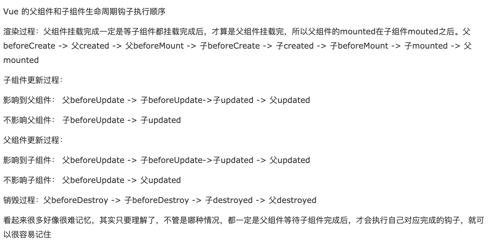

# 指令 差值

1. 差值 表达式
2. 指令 动态属性

```
  <p :class="{ black: isBlack, yellow: isYellow }">使用 class</p>
  <p :class="[black, yellow]">使用 class （数组）</p>
  <p :style="styleData">使用 style</p>
  isBlack: true,
  isYellow: true,

  black: 'black',
  yellow: 'yellow',

  styleData: {
      fontSize: '40px', // 转换为驼峰式
      color: 'red',
      backgroundColor: '#ccc' // 转换为驼峰式
  }
```

```
<p>文本插值 {{message}}</p>
  <p>JS 表达式 {{ flag ? 'yes' : 'no' }} （只能是表达式，不能是 js 语句）</p>

  <p :id="dynamicId">动态属性 id</p>

  <hr/>
  <p v-html="rawHtml">
      <span>有 xss 风险</span>
      <span>【注意】使用 v-html 之后，将会覆盖子元素</span>
  </p>
```

3. v-html 会有 xss 风险 会覆盖子组件

# computed watch

1. computed 有缓存，data 不变则不会重新计算

```
<p>double1 {{double1}}</p>
<input v-model="double2"/>
  computed: {
      double1() {
          return this.num * 2
      },
      double2: {
          get() {
              return this.num * 2
          },
          set(val) {
              this.num = val/2
          }
      }
  }
```

2. watch 如何深度监听(默认是浅层监听)
3. watch 监听引用类型，拿不到 oldVal

```
  watch: {
      name(oldVal, val) {
          // eslint-disable-next-line
          console.log('watch name', oldVal, val) // 值类型，可正常拿到 oldVal 和 val
      },
      info: {
          handler(oldVal, val) {
              // eslint-disable-next-line
              console.log('watch info', oldVal, val) // 引用类型，拿不到 oldVal 。因为指针相同，此时已经指向了新的 val
          },
          deep: true // 深度监听
      }
  }
```

```
* 内存空间:  我们将js的内存分为栈内存和堆内存；基本类型存放于栈内存中，包括变量以及变量的值 引用类型是大小不固定的数据，但是他们的地址大小是固定的，所以把地址存在栈中而值存在堆中
* 对值的操作
基本类型值：按值访问，操作的是他们实际保存的值

引用类型值：按引用访问，当查询时，我们需要先从栈中读取内存地址，然后再找到保存在堆内存中的值。对于引用类型的值，我们可以为其添加属性和方法，也可以改变和删除其属性的方法。
* 变量的复制
基本类型变量的复制：从一个变量向另一个复制时，会在栈中创建一个新值，然后把值复制到为新变量分配的位置上。

    引用类型变量的复制：复制的是存储在栈中的指针，将指针复制到栈中为新变量分配的空间中，而这个指针副本和原指针指向存储在堆中的同一个对象，复制操作结束后，两个变量实际上将引用同一个对象，因此改变其中一个，将影响另一个

```

# 条件判断

如果切换的很频繁我们可以用 v-show 或者一次性显示隐藏 v-if
区别 v-show 我们通过 css 来控制 v-if 我们是通过 vue 本身的机制去判断组件是不是动态的去显示或者销毁

```
  <p v-if="type === 'a'">A</p>
  <p v-else-if="type === 'b'">B</p>
  <p v-else>other</p>

  <p v-show="type === 'a'">A by v-show</p>
  <p v-show="type === 'b'">B by v-show</p>
```

# 循环列表

如何遍历对象？ v-for 也可以使用了
key 的重要性 key 不能乱写 如 random 或者 index 为什么要用key呢
v-for v-if 是不能一起使用的 v-for 的运算优先级高于 v-if

```
listObj: {
          a: { title: '标题1' },
          b: { title: '标题2' },
          c: { title: '标题3' },
         }
<p>遍历数组</p>
<ul>
    <li v-for="(item, index) in listArr" :key="item.id">
        {{index}} - {{item.id}} - {{item.title}}
    </li>
</ul>

<p>遍历对象</p>
<ul >
    <li v-for="(val, key, index) in listObj" :key="key">
        {{index}} - {{key}} -  {{val.title}}
    </li>
</ul>
```

# 事件 event

```
  methods: {
      increment1(event) {
          console.log('event', event, event.__proto__.constructor) // 是原生的 event 对象
          console.log(event.target)
          console.log(event.currentTarget) // 注意，事件是被注册到当前元素的，和 React 不一样
          this.num++

          // 1. event 是原生的
          // 2. 事件被挂载到当前元素
          // 和 DOM 事件一样
      },
      increment2(val, event) {
          console.log(event.target)
          this.num = this.num + val
      },
      loadHandler() {
          // do some thing
      }
  },
  mounted() {
      window.addEventListener('load', this.loadHandler)
  },
  beforeDestroy() {
      //【注意】用 vue 绑定的事件，组建销毁时会自动被解绑
      // 自己绑定的事件，需要自己销毁！！！
      window.removeEventListener('load', this.loadHandler)
  }
```

# 表单

```
  <p>输入框: {{name}}</p>
    <input type="text" v-model.trim="name"/>
    <input type="text" v-model.lazy="name"/>
    <input type="text" v-model.number="age"/>

    <p>多行文本: {{desc}}</p>
    <textarea v-model="desc"></textarea>
    <!-- 注意，<textarea>{{desc}}</textarea> 是不允许的！！！ -->

    <p>复选框 {{checked}}</p>
    <input type="checkbox" v-model="checked"/>

    <p>多个复选框 {{checkedNames}}</p>
    <input type="checkbox" id="jack" value="Jack" v-model="checkedNames">
    <label for="jack">Jack</label>
    <input type="checkbox" id="john" value="John" v-model="checkedNames">
    <label for="john">John</label>
    <input type="checkbox" id="mike" value="Mike" v-model="checkedNames">
    <label for="mike">Mike</label>

    <p>单选 {{gender}}</p>
    <input type="radio" id="male" value="male" v-model="gender"/>
    <label for="male">男</label>
    <input type="radio" id="female" value="female" v-model="gender"/>
    <label for="female">女</label>

    <p>下拉列表选择 {{selected}}</p>
    <select v-model="selected">
        <option disabled value="">请选择</option>
        <option>A</option>
        <option>B</option>
        <option>C</option>
    </select>

    <p>下拉列表选择（多选） {{selectedList}}</p>
    <select v-model="selectedList" multiple>
        <option disabled value="">请选择</option>
        <option>A</option>
        <option>B</option>
        <option>C</option>
    </select>
```

# 组件通信

1. props 和\$emit 父到子 传递一个数据 子到父 触发一个事件把参数带过去 让父组件处理一些事情
2. 组件间通信 自定义事件
3. 组件生命周期 vuex

# 如何进行自定义事件进行 vue 组件通信 兄弟

```
index.vue
<template>
    <div>
        <Input @add="addHandler"/>
        <List :list="list" @delete="deleteHandler"/>
    </div>
</template>

<script>
import Input from './Input'
import List from './List'

export default {
    components: {
        Input,
        List
    },
    data() {
        return {
            list: [
                {
                    id: 'id-1',
                    title: '标题1'
                },
                {
                    id: 'id-2',
                    title: '标题2'
                }
            ]
        }
    },
    methods: {
        addHandler(title) {
            this.list.push({
                id: `id-${Date.now()}`,
                title
            })
        },
        deleteHandler(id) {
            this.list = this.list.filter(item => item.id !== id)
        }
    },
    created() {
        // eslint-disable-next-line
        console.log('index created')
    },
    mounted() {
        // eslint-disable-next-line
        console.log('index mounted')
    },
    beforeUpdate() {
        // eslint-disable-next-line
        console.log('index before update')
    },
    updated() {
        // eslint-disable-next-line
        console.log('index updated')
    },
}
</script>
list.vue
<template>
    <div>
        <ul>
            <li v-for="item in list" :key="item.id">
                {{item.title}}

                <button @click="deleteItem(item.id)">删除</button>
            </li>
        </ul>
    </div>
</template>

<script>
import event from './event'

export default {
    // props: ['list']
    props: {
        // prop 类型和默认值
        list: {
            type: Array,
            default() {
                return []
            }
        }
    },
    data() {
        return {

        }
    },
    methods: {
        deleteItem(id) {
            this.$emit('delete', id)
        },
        addTitleHandler(title) {
            // eslint-disable-next-line
            console.log('on add title', title)
        }
    },
    created() {
        // eslint-disable-next-line
        console.log('list created')
    },
    mounted() {
        // eslint-disable-next-line
        console.log('list mounted')

        // 绑定自定义事件
        event.$on('onAddTitle', this.addTitleHandler)
    },
    beforeUpdate() {
        // eslint-disable-next-line
        console.log('list before update')
    },
    updated() {
        // eslint-disable-next-line
        console.log('list updated')
    },
    beforeDestroy() {
        // 及时销毁，否则可能造成内存泄露
        event.$off('onAddTitle', this.addTitleHandler)
    }
}
</script>

input.vue
<template>
    <div>
        <input type="text" v-model="title"/>
        <button @click="addTitle">add</button>
    </div>
</template>

<script>
import event from './event'
我们input的点击的时候触发这个 addTitle 调用我们的自定义事件 我们兄弟组价中 绑定的自定义事件就会触发 打印输出
我们的event是什么呢 import Vue from 'vue' export default new Vue()
vue实例已经帮我们实现了这个 本身具有这个自定义事件的能力  $on $emit 不要再自己去引入event bus  或者自己写一个自定义事件
绑定自定义事件的时候 我们用了一个函数 而不是箭头函数 为了方便解绑
比如说我我们在  beforeDestroy 会做哪些事情 比如说解绑自定义事件  event.$off
export default {
    data() {
        return {
            title: ''
        }
    },
    methods: {
        addTitle() {
            // 调用父组件的事件   注意这个地方的调用 一个this 一个event
            this.$emit('add', this.title)

            // 调用自定义事件
            event.$emit('onAddTitle', this.title)

            this.title = ''
        }
    }
}
</script>
```

# 生命周期

[生命周期](https://cn.vuejs.org/v2/guide/instance.html#%E7%94%9F%E5%91%BD%E5%91%A8%E6%9C%9F%E5%9B%BE%E7%A4%BA)

1. 挂载阶段
   beforeCreate created beforeMount mount
   新建 vue 实例 new Vue - > 初始化生命周期 & 事件 -> 初始化注入校验 ->是否指定模板选项 ->是的话我们将模板编译到 render 函数中 否的话 将 el 外的 html 作为模板编译 创建 vm.\$el 并用其替换 el mount 挂载完毕了

   生命周期注意点

   - mount 和 created 有什么区别  
     created 呢是我们把 vue 的一个实例初始化了，他只是存在于 js 内存模型中的一个变量而已，并没有开始渲染
     mount 这个使我们真正在网页上绘制完成了 ajax 绑定时间 dom 操作

2. 更新阶段
   beforeUpdate update
3. 销毁阶段
   beforeDestroy 接触绑定呀 销毁子组件以及事件监听器
   destroyed
   理解我们前面的 list input index 组件
   index created list created list mounted index mount js 模型的创建顺序从父组件到子组件 创建 vue 实例是从外向内的
   但是 渲染是由内向外的，因为只有把子组件渲染完，才能渲染父组件
   我们点击添加 触发了父组件的方法 修改了其 data 执行 before updated 开始更新 更新谁呢 子组件 list 开始更新 只有 list 更新完了之后 才算是更新完了 index updated

   
