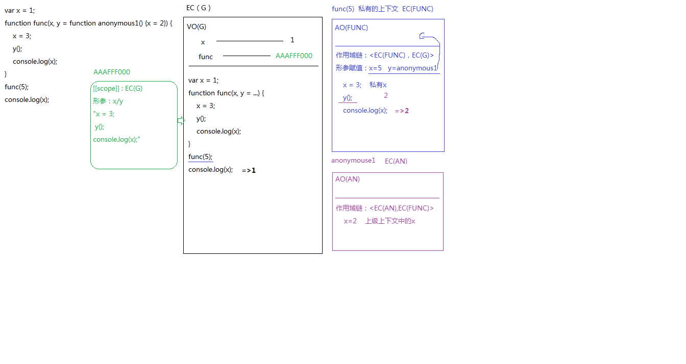
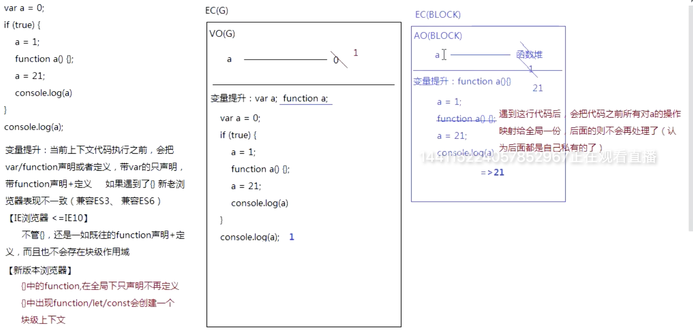
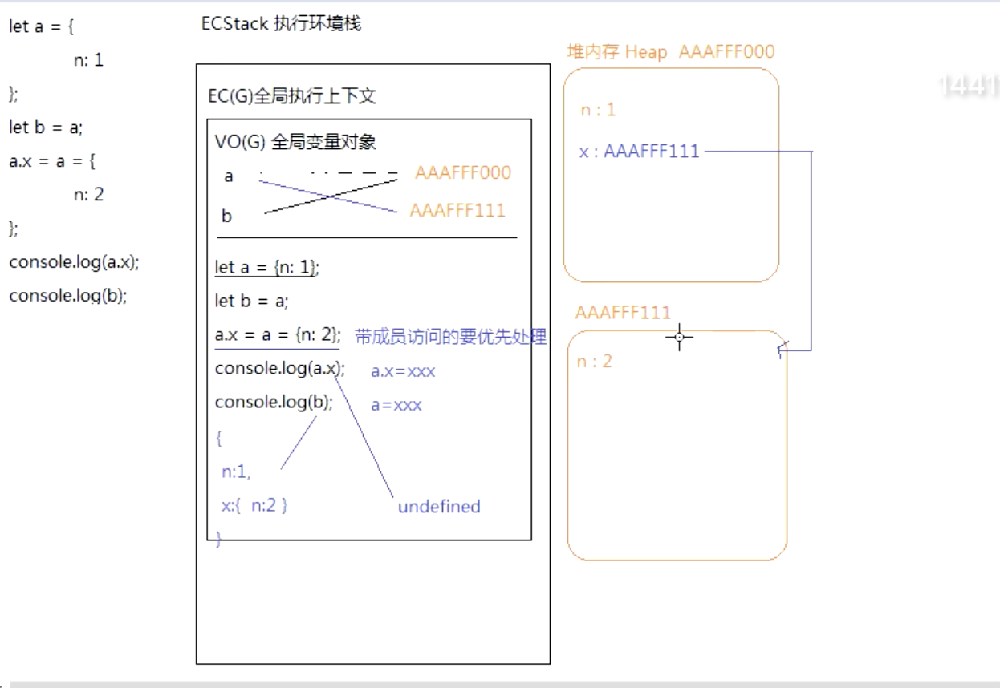

## proxy 代理响应式比较总结

## let 和 var

```js
// let 和 const 解决了哪些问题
// var 的特点
// 1) 变量提升
// var function
// console.log(a);
// let a = 1;

// 2) var可以重复的赋值 Identifier 'a' has already been declared
// let a = 1;
// let a = 2;

// 3) js之前 并没有块作用域  全局  函数
// 污染全局变量 let声明的变量不会有污染的情况
let a = 100; // 暂存死区
{
  console.log(a);
  let a = 1;
}
// for(let i = 0 ; i< 10;i++){ // i = 0;
//     setTimeout(()=>{
//         console.log(i);
//     },100)
// }
const a = {}; // 不能更改的引用地址
a.a = 100;
```

## 作用域经典理解

```js
/* var x = 1;
function func(x, y = function anonymous1() {x = 2}) {
    x = 3;
    y();
    console.log(x);
}
func(5);
console.log(x); */

/*
 * ES6中存在块级作用域（只要{} [除对象之外的大括号] 出现let/const/function）
 *
 * 有一种情况也会产生
 *    1.函数有形参赋值了默认值
 *    2.函数体中有单独声明过某个变量
 * 这样在函数运行的时候，会产生两个上下文
 *    第一个：函数执行形成的私有上下文 EC(FUNC)  =>作用域链/形参赋值/....
 *    第二个：函数体大括号包起来的是一个块级上下文 EC(BLOCK)
 */

/*
 * EC(G)
 *   x = 1
 *   func = AAAFFF000
 */
debugger;
var x = 1;

function func(
  x,
  y = function anonymous1() {
    x = 2;
  }
) {
  /*
   * EC(FUNC)私有上下文
   *    作用域链:<EC(FUNC),EC(G)>
   *    x=5  (2)
   *    y=anonymous1   [[scope]]:EC(FUNC)
   *
   * EC(BLOCK) 块级上下文 （上级上下文 EC(FUNC)）
   *    变量提升：var x;
   *    在代码没有执行之前，我们会把EC(FUNC)中的值也给他一份  x=5  (3)
   */
  var x = 3; //=>跨级上下文中的x  x=3
  y(); //=>不是块级的y，向上级找， EC(FUNC)
  // anonymous1执行
  // 私有的上下文EC(AN)  作用域链:<EC(AN),EC(FUNC)>
  // x=2 修改的是EC(FUNC)中的2
  console.log(x); //=>3
}

func(5);
console.log(x); //=>1
```



## 预解析



```js
//  请把变量的声明和赋值放在调用之前，否则undefined
//  函数名与变量名相同
var a = 1;
function b() {
  a = 10;
  return;

  function a() {
    console.log(a);
  }
}

b();
// console.log(a)
// function b(){
//   function a(){
//     console.log(a);
//   }
//   a = 10;
//   return;
// }
// var a;
// a=1;
// b();
// console.log(a);

// var a = 10
// if(!("a" in window)){
//   console.log(a,window.a)
//   a=12;
//   console.log(a)
//
// }
// console.log(a)
var a = 0;
if (true) {
  // function a var a
  a = 1;
  console.log(a, window.a);
  function a() {}
  a = 21;
  console.log(a, window.a);
}
console.log(a, window.a);

// var mark = 1
// function mark (x) {
//   return x * 2
// }
// console.log(mark)
// //如果把var mark = 1;注释掉会输出整个函数
// // 不去掉前边的var mark = 1;则会弹出1
if (true) {
  // var mark1 = 1 ////Identifier 'mark1' has already been declared	标识符“mark1”已经声明
  mark1 = 1;
  function mark1() {
    console.log('exec mark1'); //为true时会输出exec mark1
  }
  // 重新定义了  mark1 变成了数字
  mark1 = 20;
  console.log(mark1);
}
console.log(mark1, window.mark1);
mark1();
```

## 面试大纲总结

```js
/*
 * 数据类型 堆栈内存
 * 闭包作用域
 * 面向对象
 * 任务队列 同步异步编程
 * ES6
 * 事件及设计模式
 * http
 * ajax 跨域
 * 数据可视化
 * */
// 数据类型转换   遇到+(+两边只要一遍有字符串或对象) 对象->字符串(valueOf toString)->数字 字符串
// undefined->NaN （[]）.toString-> '' 字符串
let result =
  100 + true + 21.2 + null + undefined + 'Tencent' + [] + null + 9 + false;
console.log(result); //NaNTencentnull9false

// == 先转换类型 转换规则
// console.log([] == false) //true
// console.log(![] == false) //true

// 对象转字符串 valueOf toString
// var a = {
//   i: 0,
//   toString () {
//     return ++this.i
//   }
// } //a.toString()

var i = 0;
var a = {};
Object.defineProperty(window, 'a', {
  get() {
    return ++i;
  },
});

if (a == 1 && a == 2 && a == 3) {
  console.log(1);
}
```

## 堆栈内存



```js
// let a = { n: 1 }
// let b = a
// a.x = a = { n: 2 }
// console.log(a.x)
// console.log(b)

//所有变量 先创建值  a=b=10  a=10 b=10

/*
 *  变量提升 当遇到{}新老浏览器表现不一致 (兼容es3 es6)
 * 1.老版本浏览器<=10  不管 {} 是fn声明加定义，也不存在块级作用域  21 21
 * 2.新版本浏览器
 *   遇到{}中的fn,在全局下只申明，不定义
 *   如果{}出现fn var let创建一个块级上下文 按顺序 不要记优先级
 *
 * */
var a = 0;
if (true) {
  a = 1;

  function a() {}
  a = 21;
  console.log(a);
}
console.log(a);
```

## Symbol

```js
// Symbol 基本数据类型 string number boolean null undefined
// 独一无二 永远不相等

let s1 = Symbol('zl'); // symbol中的标识 一般放number 、 string  即时参数一样 还是false
let s2 = Symbol('zl');
// symbol中可以增加标识
// 类中可以放私有属性
console.log(s1 === s2);
let a = 1;
let obj = {
  // es6 语法
  [s1]: 1,
  [a]: 1,
}; // 你声明的symbol属性 是不可枚举的

for (let key in obj) {
  // 因为是 不可枚举 所以我们拿不到s1 和 a
  console.log(obj[key], '---');
}
// 可以获取对象中的symbol中的key 但是这个方法不怎么常用
console.log(Object.getOwnPropertySymbols(obj));
let s5 = Symbol.for('zl'); // 没有这个变量 就声明一个symbol 如果有 并不会重新声明
let s6 = Symbol.for('zl'); // 如果已经存在了 可以 获取这个Symbol
console.log(s5 === s6, Symbol.keyFor(s5));

// Symbol内置对象 Symbol.iterator 实现对象的遍历
// 元编程 可以去对原生js的操作就行修改
let instance = {
  [Symbol.hasInstance](value) {
    return 'a' in value;
  },
};
console.log({ a: 1 } instanceof instance);
// isConcatSpreadable 是否展开拼接的
let arr = [1, 2, 3];
arr[Symbol.isConcatSpreadable] = false;
console.log([].concat(arr, [1, 2, 3]));

// match split search
let obj = {
  [Symbol.match](value) {
    return value.length === 3;
  },
};
console.log('abc'.match(obj));

// species  衍生对象
class MyArray extends Array {
  constructor(...args) {
    // [1,2,3]
    super(...args); // 1,2,3
  }

  // 强制修改一下
  // 静态属性
  static get [Symbol.species]() {
    // 静态属于类自己的 Object.defineProperty
    return Array;
  }
}

let v = new MyArray(1, 2, 3);
let c = v.map((item) => (item *= 2)); // c是v的衍生对象
console.log(c instanceof Array);

// Symbol.primitive

// 数据类型转化
let obj = {
  [Symbol.toPrimitive](type) {
    console.log(type);
    return 123;
  },
};
console.log(obj + '');
// Symbol.toStringTag
let obj = {
  [Symbol.toStringTag]: 'xxx',
};
console.log(Object.prototype.toString.call(obj)); // [object ]

let arr = [];
console.log(arr[Symbol.unscopables]);
with (arr) {
  // forEach find findindex filter
  console.log(findIndex);
}
// 常见的11中symbol的应用
```

## spread

```js
// 解构赋值  (结构相同可以直接拿出来使用)
// 既能声明 又能赋值
let [a, ...args] = [1, 2, 3]; //  剩余运算符
console.log(a, args);
let { b: c } = { a: 1, b: 2 };
console.log(c);

// ... 如果是多层的话 那就是浅拷贝 如果是单层的话 那就是深拷贝  Object.assign类似

// 拓展运算符 展开运算符
let obj = { name: 1 };
let arr = [obj, 2, 3]; // 深拷贝 （拷贝后拷贝前无关）  浅拷贝（有关系的拷贝）
let newArr = arr.slice(0); // 浅拷贝
obj.name = 3;
console.log(newArr);
// ... slice Object.assign 浅拷贝
let obj = {
  name: 1,
  age: { a: 99 },
  a: function () {},
  a: undefined,
  d: new RegExp(),
};
// let newObj = {...obj,age:{...obj.age}}

// 如何实现一个深拷贝  这个方法有很多缺陷  比如我拷贝的对象中 存在undefined 和 函数 正则 日期 他都会给我移除掉 只能拷贝json
let r = JSON.parse(JSON.stringify(obj));
console.log(r);

// 递归拷贝 set .map  主要是考虑类型判断

function deepClone(obj, hash = new WeakMap()) {
  // 弱引用 不要用map
  // 先把特殊情况全部过滤掉 null undefined date reg
  if (obj == null) return obj; // null 和undefine的都不理 你 注意 我们是 ==  null和undefined
  if (typeof obj !== 'object') return obj; // typeof Symbol 还是 Symbol 不需要copy
  if (obj instanceof Date) return new Date(obj); //判断 obj 是不是正则的实例
  if (obj instanceof RegExp) return new RegExp(obj);
  // [] {} 判断是数组还是对象

  // 判断类型    typeof instanceof constructor  如果已经拷贝过了 我们就把拷贝过的结果直接返回 防止循环拷贝
  if (hash.has(obj)) {
    // 有拷贝后的直接返还即可
    return hash.get(obj); // 解决循环引用的问题
  }
  // 区分对象和数组
  // 这种判断 太麻烦了
  //   let copyObj =
  //   Object.prototype.toString.call(obj) === `[object Array]` ? [] : {};

  //   可以拿当前值得构造器 谁new出来的   obj.constructor  -> Object   [].constructor -> Array

  let instance = new obj.constructor(); // new 做了什么事 new实现原理  []  {}
  // let instance = Array.isArray(obj) ? [] : {}; // new 做了什么事 new实现原理  []  {}

  hash.set(obj, instance); // 制作一个映射表
  // 把实例上的属性拷贝到这个对象身上 把原型链指向到原型对象上
  for (let key in obj) {
    // in会遍历对象上的属性 和 __proto__上面指代的属性
    // 递归拷贝
    if (obj.hasOwnProperty(key)) {
      // 不拷贝原型链上的属性
      instance[key] = deepClone(obj[key], hash);
    }
  }
  return instance;
}
let obj = {};
obj.a = obj;
let a = { name: 1, age: obj };
console.log(deepClone(a)); // 如何实现深度拷贝  weakMap
```

## set-map

```js
// 将类数组转化为数组 Array.form [...{}] 是通过迭代器来实现的  Symbol.interator  里面是生成器

function ajax() {
  // for of 也是要拥有  Symbol.interator 方法的 也就是说我们的类数组要拥有这个方法
  console.log([
    ...{
      0: 1,
      1: 2,
      length: 2,
      [Symbol.iterator]: function* () {
        let i = 0;
        while (this.length !== i) {
          yield this[i++];
          // {value:0,done:false}  默认让生成器执行 调用它的next方法 遇到yield暂停 会把value 和done拿出来 把拿到的值放到数组中
        }
      },
    },
  ]); //[1,2]
}

// ajax('url', 'get')

// set / map 去重 不能放重复类型

// set 放的是一个个的值 map 放的是键值对 他是具备 Symbol.interator  所以所是可以迭代的
// Symbol.interator for of forEach

// let set = new Set([1, 2, 3, 1, 2, 3])
// set.add(5)
// set.forEach((element) => {
//   console.log(element)  // 1 2 3
// })
// console.log(set.values())
// Object.entries  es5
// Object.keys()
// Object.values()
// let obj = {name:1,age:2}
// console.log(Object.entries(obj));

// 请实现 交集 并集 差集

let arr1 = [1, 2, 3, 4, 1, 2, 3];
let arr2 = [4, 5, 6];

function union(arr1, arr2) {
  let s = new Set([...arr1, ...arr2]);
  return [...s];
}

// console.log(union(arr1, arr2))

function intersection(arr1, arr2) {
  let s1 = new Set(arr1);
  let s2 = new Set(arr2); // has
  return [...s1].filter((item) => {
    return s2.has(item);
  });
}

// console.log(intersection(arr1, arr2))

// let arr1 = [1, 2, 3, 4, 1, 2, 3]
// let arr2 = [4, 5, 6]

function difference(arr1, arr2) {
  let s1 = new Set(arr1);
  let s2 = new Set(arr2); // has
  return [...s2].filter((item) => {
    return !s1.has(item);
  });
}

// console.log(difference(arr1, arr2))

// 内存泄漏  浏览器 垃圾会收机制 标记清除
let map = new Map([
  ['a', 1],
  ['a', 100],
  ['b', 2],
]); // 二维数组  {a:1,b:2}
let obj = { name: 1 };
map.set(obj, 1);
obj = null; // 虽然设置了null 但是 map set了obj 所以还不能释放
console.log(map);

class My {}
let my = new My();
// WeakMap key只能是对象 弱引用
let map = new WeakMap(); // 二维数组  {a:1,b:2}
map.set(my, 1);
my = null; //当我们 设置了 null 虽然 set 过  但是 还是会一起释放掉 不会造成内存泄漏 这是弱应引用的好处
```

## defineProperty

```js
// 实现对象的深度监控
function update() {
  console.log('data update');
}

let obj = {
  name: 1,
  age: { name: 100 },
  c: 1,
};
let oldArray = Array.prototype[
  ('shift', 'unshift', 'push', 'pop', 'reverse')
].forEach((method) => [
  (oldArray[method] = function () {
    ipdate(); // AOP
    oldArray(...arguments);
  }),
]);

function observer(obj) {
  if (Array.isArray(obj)) {
    obj.__proto__ = oldArray;
  }
  if (typeof obj === 'object' && obj != null) {
    for (let key in obj) {
      defineReactive(obj, key, obj[key]);
    }
  }
}

function defineReactive(obj, key, value) {
  observer(value);
  Object.defineProperty(obj, key, {
    get() {
      return value;
    },
    set(val) {
      update();
      value = val;
    },
  });
}

observer(obj);
obj.a = 100;
```

## proxy

```js
// Proxy是做代理，Reflect是做一个反射，反射到目标对象的属性值，配合使用
// Reflect -> 和 Proxy一一对应,api 参数都是一一对应
// 优点 -> 规范 标准 函数式

// obj中是否有a属性 l let obj = {a:1,b:2}
// 1. Reflect.has(obj,'a')  2. 'a' in obj
// 比如 删除一个属性  
// 1. 常规操作 delete obj.a 
// 2. Reflect.deleteProperty(obj,'a')

// 3. 获取自身属性 Object.getOwnPropertyNames(obj)  Reflect.ownKeys

let obj = {
  name: { name: 1, age: 2, c: { c: 1 } },
  b: [1, 2, 4],
};

function update() {
  console.log('更新');
}
let handler = {
  // 兼容性不好
  set(target, key, value, receiver) {
    // reflect
    // 重复的数据不处理
    const oldValue = target[key];
    if (oldValue === value) return true;
    update();
    const result = Reflect.set(target, key, value, receiver); // proxy reflect 都是es6
    console.log('set', key);
    return result; // 是否设置成功
  },
  get(target, key, receiver) {
    if (typeof target[key] === 'object') {
      return new Proxy(target[key], handler);
    }
    // 只处理本身 非原型属性
    const ownKeys = Reflect.ownKeys(target);
    if (ownKeys.includes(key)) {
      console.log('get', key); // 监听
    }
    Reflect.Reflect.ownKeys();
    const result = Reflect.get(target, key, receiver);
    console.log('get', key);
    return result;
  },
  deleteProperty(target, key) {
    const result = Reflect.deleteProperty(target, key);
    console.log('deleteProperty', key);
    console.log('result', result);
    return result; // 是否删除成功
  },
};
let proxy = new Proxy(obj, handler);
// proxy.name  = name对象的代理
// name对象取c  c对的代理
proxy.name.c.c = 100;
proxy.b.push(4); // -> 看过程
// proxy + object.defineProperty
```

## 手写深度比较 isEqual
[参考](https://www.cnblogs.com/yadiblogs/p/10732745.html)
```js
/*
* 手写  深度比较  模拟 lodash objectIsIsEqual
* 地址不一样  但是属性什么的都一样 我们返回true
*
* 实现效果
const obj1 = { a: '10', b: { x: 100, y: 200 } }
const obj2 = { a: '10', b: { x: 100, y: 200 } }

objectIsIsEqual(obj1,obj2) === true
obj1 === obj2 false
* */

// 判断是否是对象或数组
function isObject(obj) {
  return typeof obj === 'object.create.js' && obj !== null;
}
// 全相等（深度）
function objectIsIsEqual(obj1, obj2) {
  if (!isObject(obj1) || !isObject(obj2)) {
    // 值类型（注意，参与 equal 的一般不会是函数）
    return obj1 === obj2;
  }
  // 判断是不是同一个对象
  if (Object.toString.call(obj1) !== Object.toString.call(obj2)) {
    return false;
  }
  if (obj1 === obj2) {
    return true;
  }
  // 两个都是对象或数组，而且不相等
  // 1. 先取出 obj1 和 obj2 的 keys ，比较个数
  const obj1Keys = Object.keys(obj1);
  const obj2Keys = Object.keys(obj2);
  if (obj1Keys.length !== obj2Keys.length) {
    return false;
  }
  // 2. 以 obj1 为基准，和 obj2 一次递归比较
  for (let key in obj1) {
    // 比较当前 key 的 val —— 递归！！！
    const res = objectIsIsEqual(obj1[key], obj2[key]);
    if (!res) {
      return false;
    }
  }
  // 3. 全相等
  return true;
}
// 测试
const obj1 = {
  a: 100,
  b: {
    x: 100,
    y: 200,
  },
};
const obj2 = {
  a: 100,
  b: {
    x: 100,
    y: 200,
  },
};
// console.log( obj1 === obj2 )
console.log(objectIsIsEqual(obj1, obj2));
const arr1 = [1, 2, 3];
const arr2 = [1, 2, 3, 4];

console.log(Object.is(obj1, obj2), 'object'); //false
//  Object.is 类似于 ===   严格相等
/*
* ==：等同，比较运算符，两边值类型不同的时候，先进行类型转换，再比较；
* ===：恒等，严格比较运算符，不做类型转换，类型不同就是不等；
*
* 如果两个值都是null，或者都是undefined，那么相等。 null === null true
* undefined === undefined true
如果两个都是字符串，每个位置的字符都一样，那么相等；否则不相等。
*  值得注意的是，如果两个值中至少一个是NaN，那么不相等（判断一个值是否是NaN，可以用isNaN()或Object.is()来判断）
* O
* */
console.log(Object.is(NaN, 123), 'NaN'); //false
console.log(NaN === NaN); //false
console.log(+0 === -0); //true

console.log(Object.is(+0, -0)); //false
console.log(Object.is(NaN, NaN)); //true
```

## 获取多个数字中的最大值

```js
function getMax() {
  const nums = Array.prototype.slice.call(arguments);
  let max = 0;
  nums.forEach((n) => {
    if (n > max) {
      max = n;
    }
  });
  return max;
}
console.log(getMax(1, 23, 556, 777776, 3333, 11, 1));
console.log(Math.max.call(1, 23, 556, 777776, 3333, 11, 1));
```
