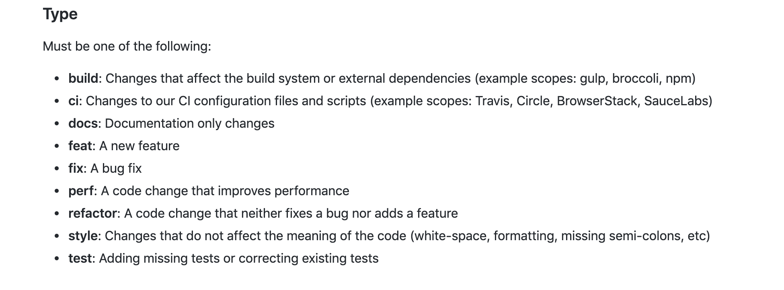

# commit message 规范

## 规范
格式
```
type(scope) : subject
```
### type
必须，类别如下:
  - feat: 新功能（feature)
  - fix: 修复bug
  - docs: 文档改变
  - style: 代码格式改变（不影响代码运行的变动，注意并不是样式修改，样式修改应属于 feat）
  - build: 构建过程或外部依赖项的更改
  - refactor: 某个已有功能重构 (即不是新增功能，也不是修改bug的代码变动）
  - revert: 撤销上一次的 commit
  - test: 增加测试
  - perf: 性能优化
  - ci: 与CI（持续集成服务）有关的改动

### scope
可选，用于说明 commit 影响的范围，比如数据层、控制层、视图层等等，视项目不同而不同。

### subject
必须，commit message 的简短描述，不超过50个字符。

## 扩展阅读
  - [angular commit 规范](https://github.com/angular/angular/blob/22b96b9/CONTRIBUTING.md#-commit-message-guidelines)
  
  - [git commit 代码提交规范](https://segmentfault.com/a/1190000017205604?utm_source=tag-newest)
  - [详解使用git commit 工作流的标准姿势](http://www.imooc.com/article/43615)