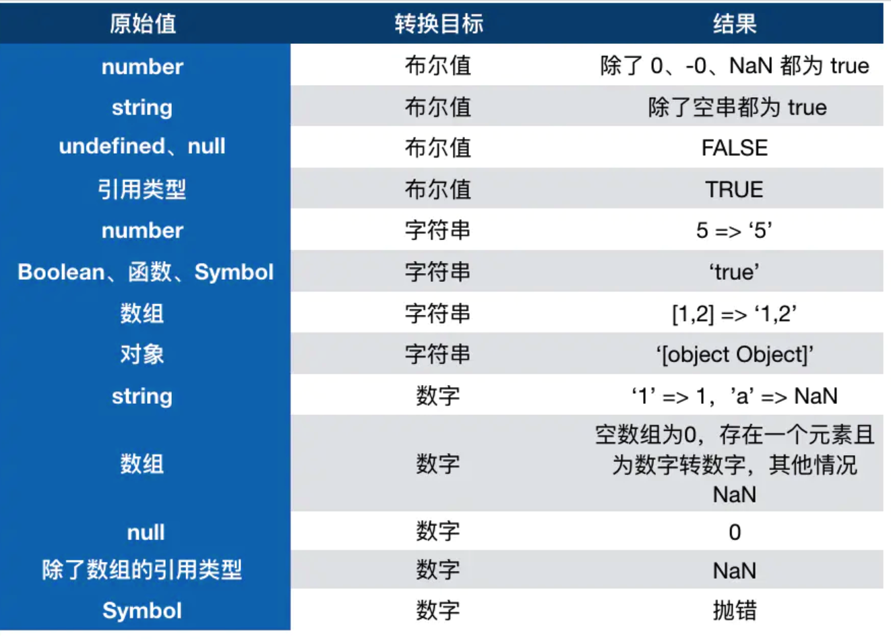
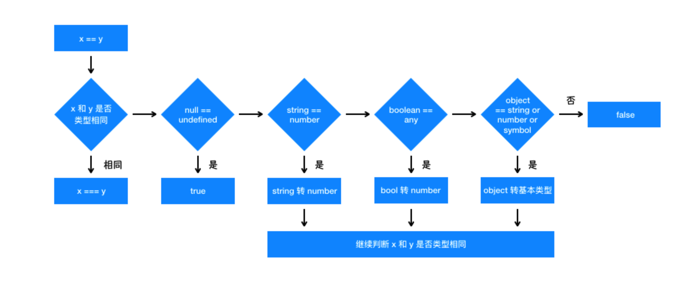

# 值类型 和 引用类型的区别

1. 值类型 undefined number null string boolean Symbol BigInt
2. 引用类型 对象 数组 null--特殊引用类型，指针指向空数组 函数--特殊引用类型，但不用于存储数据，所以没有拷贝复制函数这一说

## 为什么会有 BigInt 的提案？

javaScript 中 Number.MAX_SAFE_INTEGER 表示最⼤安全数字,计算结果是 9007199254740991，即在这个数范围内不 会出现精度丢失（⼩数除外）。 但是⼀旦超过这个范围，js 就会出现计算不准确的情况，这在⼤数计算的时候不得不依靠⼀些第三⽅库进⾏解决，因此 官⽅提出了 BigInt 来解决此问题。

## null 与 undefined 的区别是什么？

- null 表示为空，代表此处不应该有值的存在，⼀个对象可以是 null，代表是个空对象，⽽ null 本身也是对象。
- undefined 表示『不存在』，JavaScript 是⼀⻔动态类型语⾔，成员除了表示存在的空值外，还有可能根本就不存在（因 为存不存在只在运⾏期才知道），这就是 undefined 的意义所在。
## 0.1+0.2为什么不等于0.3？
## JavaScript的参数是按照什么⽅式传递的？
1. 基本类型传递⽅式
```js
// 由于js中存在复杂类型和基本类型,对于基本类型⽽⾔,是按值传递的.
var a = 1;
function test(x) {
  x = 10;
  console.log(x);
}
test(a); // 10
console.log(a); // 1
// 虽然在函数 test 中 a 被修改,并没有有影响到 外部 a 的值,基本类型是按值传递的.
```
2. 复杂类型按引⽤传递?
```js
// 我们将外部 a 作为⼀个对象传⼊ test 函数.
var a = { a: 1, b: 2 };
function test(x) {
  x.a = 10;
  console.log(x);
}
test(a); // { a: 10, b: 2 }
console.log(a); // { a: 10, b: 2 }
// 可以看到,在函数体内被修改的 a 对象也同时影响到了外部的 a 对象,可⻅复杂类型是按引⽤传递的.
--------

var a = { a: 1, b: 2 };
function test(x) {
  x = 10;
  console.log(x);
}
test(a); // 10
console.log(a); // { a: 1, b: 2 }
// 外部的 a 并没有被修改,如果是按引⽤传递的话,由于共享同⼀个堆内存, a 在外部也会表现为 10 才对. 此时的复杂类型 同时表现出了 按值传递 和 按引⽤传递 的特性.
```
3. 按共享传递
```js
复杂类型之所以会产⽣这种特性,原因就是在传递过程中,对象 a 先产⽣了⼀个 副本a ,这个 副本a 并不是深克隆得到的 副 本a , 副本a 地址同样指向对象 a 指向的堆内存. 因此在函数体中修改 x=10 只是修改了 副本a , a 对象没有变化. 但是如果修改了 x.a=10 是修改了两者指向的同⼀堆内 存,此时对象 a 也会受到影响.
有⼈讲这种特性叫做传递引⽤,也有⼀种说法叫做按共享传递.
```

# 如何在JavaScript中实现不可变对象
实现不可变数据有三种主流的⽅法
1. 深克隆，但是深克隆的性能⾮常差，不适合⼤规模使⽤ 
2. Immutable.js，Immutable.js是⾃成⼀体的⼀套数据结构，性能良好，但是需要学习额外的API 
3. immer，利⽤Proxy特性，⽆需学习额外的api，性能良好

# typeOf 运算符

1. 判断所有值类型
2. 能判断函数
3. 能识别引用类型(但不能继续识别)

```js

Symbol.hasInstance  -- 其实就是可以让我们自定义 instanceof 行为的东西 以上代码等同于 typeof 'hello world' === 'string'， instanceof 也不是百分之百可信的

class PrimitiveString {
  static [Symbol.hasInstance](x) {
    return typeof x === 'string'
  }
}
console.log('hello world' instanceof PrimitiveString) // true
```

# 数据类型转化



三种情况

1. 转换为布尔值
   在条件判断时，除了 undefined， null， false， NaN， ''， 0， -0，其他所有值都转为 true，包括所有对象。
2. 转换为数字
3. 转换为字符串

# 对象转换类型

对象在转换类型的时候，会调用内置的 [[ToPrimitive]] 函数，对于该函数来说，算法逻辑一般来说如下

1. 如果已经是原始类型了，那就不需要转换了
2. 如果需要转字符串类型就调用 x.toString()，转换为基础类型的话就返回转换的值。不是字符串类型的话就先调用 valueOf，结果不是基础类型的话再调用 toString
3. 调用 x.valueOf()，如果转换为基础类型，就返回转换的值
4. 如果都没有返回原始类型，就会报错

```js
当然你也可以重写 Symbol.toPrimitive ，该方法在转原始类型时调用优先级最高。

let a = {
  valueOf() {
    return 0
  },
  toString() {
    return '1'
  },
  [Symbol.toPrimitive]() {
    return 2
  }
}
1 + a // => 3
```

## 数据类型转化总结

```js
/*
 * 把其他数据类型转换为Number类型
 *     1.特定需要转换为Number的
 *       + Number([val])
 *       + parseInt/parseFloat([val])
 *     2.隐式转换（浏览器内部默认要先转换为Number在进行计算的）
 *       + isNaN([val])
 *       + 数学运算（特殊情况：+在出现字符串的情况下不是数学运算，是字符串拼接）
 *       + 在==比较的时候，有些值需要转换为数字再进行比较
 *       + ...
 *     .......
 */

/*
 * 把其它数据类型转换为字符串
 *    1. 能使用的办法
 *      + toString()
 *      + String()
 *    2. 隐式转换（一般都是调用其toString）
 *      + 加号运算的时候，如果某一边出现字符串，则是字符串拼接
 *      + 把对象转换为数字，需要先toString()转换为字符串，再去转换为数字
 *      + 基于alert/confirm/prompt/document.write...这些方式输出内容，都是把内容先转换为字符串，然后再输出的
 *      + ...
 *    ......
 */

/*
 * 在==比较的过程中，数据转换的规则：
 *  【类型一样的几个特殊点】
 *     {}=={}：false  对象比较的是堆内存的地址
 *     []==[]：false
 *     NaN==NaN：false
 *  【类型不一样的转换规则】
 *     1. null==undefined：true，但是换成===结果是false（因为类型不一致），剩下null/undefined和其它任何数据类型值都不相等
 *     2. 字符串==对象  要把对象转换为字符串
 *     3. 剩下如果==两边数据类型不一致，都是需要转换为数字再进行比较
 */

/*
 * 把其它数据类型转换为布尔
 *    1. 基于以下方式可以把其它数据类型转换为布尔
 *      + ! 转换为布尔值后取反
 *      + !! 转换为布尔类型
 *      + Boolean([val])
 *    2. 隐式转换
 *      + 在循环或者条件判断中，条件处理的结果就是布尔类型值
 *      + ...
 *
 * 规则：只有 ‘0、NaN、null、undefined、空字符串’ 五个值会变为布尔的FALSE，其余都是TRUE
 */

// 对象转换为字符串：valueOf() toString()
// a.toString  //=> Object.prototype.toString() 检测数据类型的
```

### 小题目

```js
let arr = [10.18, 0, 10, 25, 23];
arr = arr.map(parseInt);
console.log(arr);
// arr.map((item,index) => {});

/*
 * parseInt('10.18',0)
 *   =>10
 * parseInt(0,1)
 *   =>NaN
 * parseInt('10',2)
 *   =>看做二进制  '10'  在把它转换为十进制
 *   =>0*2^0 + 1*2^1 => 0 + 2 => 2
 * parseInt('25',3)
 *   =>看做三进制 '2'
 *   =>2*3^0 => 2
 * parseInt('23',4)
 *   =>看做四进制 '23'
 *   =>3*4^0 + 2*4^1 = 3 + 8 =>11
 * parseInt([value]) 把value转换为数字（内核机制：需要把value先变为字符串，然后从字符串左侧第一个字符查找，把找到的有效数字字符转换为数字，直到遇到一个非有效数字字符为止）
 * parseInt([value],[n]) 把[value]看做[n]进制的数据，最后转换为十进制
 *    [n]不写：默认是10，特殊情况字符串是以0X开头，默认值是16进制
 *    [n]范围 2~36之间  不在这个之间的  除了0和10一样,剩下结果都是NaN
 */
```

```js
let result =
  100 + true + 21.2 + null + undefined + 'Tencent' + [] + null + 9 + false;
```

# 四则运算符

1. 运算中其中一方为字符串，那么就会把另一方也转换为字符串
2. 如果一方不是字符串或者数字，那么会将它转换为数字或者字符串

```js
1 + '1'; // '11'
true + true; // 2   将true转换为1
4 + [1, 2, 3]; // "41,2,3"  将数组通过 toString 转为字符串 1,2,3，得到结果 41,2,3

另外注意 'a' + + 'b'   -> aNAN
因为 + 'b' 等于 NaN  所以我们有时候可以通过 + '1'来快速获取number类型

那么对于除了加法的运算符来说，只要其中一方是数字，那么另一方就会被转为数字
4 * '3'  //12
4 * []  // 0
4 * [1, 2] // NaN   Number([1,2])
```

# 比较运算符

1. 如果是对象，就通过 toPrimitive 转换对象
2. 如果是字符串，就通过 unicode 字符索引来比较

```js
let a = {
  valueOf() {
    return 0
  },
  toString() {
    return '1'
  }
}
a > -1 // true
因为 a 是对象，所以会通过 valueOf 转换为原始类型再比较值。

```

# 变量计算-类型转换

- 字符串拼接
- ==
- if 语句 逻辑判断

```js
const b = 100 + '10'
console.log(b); // 10010  100+ parseInt('10)

// 除了 == null 其他地方都用 ===
const obj = { x: 100 };
if (obj.a == null) {}
//相当于 if(obj) if (obj.a === null || obj.a === undefined) {}

truely变量：  !!a === true 的变量
falsely变量：  !!a === false 的变量 比如 !!0 undefined null '' false NaN

我们if语句里面其实判断的就是 truely变量 或者 falsely变量 并不是判断 true/false
```

# == vs ===



# 深拷贝

拷贝之后保持原始对象的值不变
思考？

1. object.assign 是深拷贝还是浅拷贝?
2. 函数，特殊的引用类型，不用于存储，是一个功能，并不是一个数据。拷贝，是拷贝数据,拷贝一个函数，没啥意义。

因为 Object.assign()拷贝的是属性值。假如源对象的属性值是一个对象的引用，那么它也只指向那个引用。也就是说，如果对象的属性值为简单类型（如 string， number），通过 Object.assign({},srcObj);得到的新对象为深拷贝；如果属性值为对象或其它引用类型，那对于这个对象而言其实是浅拷贝的

注意

1. 注意判断值类型还是引用类型
2. 注意判断是数组还是对象
3. 递归
   实现深拷贝的几种方法

## 1.JSON.stringify 和 JSON.parse

用 JSON.stringify 把对象转换成字符串，再用 JSON.parse 把字符串转换成新的对象。如果对象中包含 function 或 RegExp 这些就不能用这种方法了

缺点

- 对象的属性值是函数时，无法拷贝 不能序列化函数。
- 原型链上的属性无法拷贝
- 不能正确的处理 Date 类型的数据
- 不能处理 RegExp
- 会忽略 symbol
- 会忽略 undefined
- 不能解决循环引用的对象

```js
function deepClone(obj) {
  let _obj = JSON.stringify(obj);
  let objClone = JSON.parse(_obj);
  return objClone;
}
```

## 2.Object.assign

Object.assign()拷贝 当对象中只有一级属性，没有二级属性的时候，此方法为深拷贝，但是对象中有对象的时候，此方法，在二级属性以后就是浅拷贝。

```js
let a = { a: '123', b: { s: '345' } };
let b = a;
b.b.s = '456';
let c = { ...a };
a.b.s = '123';
console.log(c); //c.b.s = '123'了 所以说 有对象嵌套的时候 就是个浅拷贝
a.a = '456';
console.log(c); // c.a='123' 没有变

// 对象去重;
const newResult = uniqBy([...selectedList, ...data.user], 'userinfoId');

// 对象中有重复项;
var hash = {};
arr = arr.reduce(function (item, next) {
  hash[next.name] ? '' : (hash[next.name] = true && item.push(next));
  return item;
}, []);
console.log(arr);

// 使用set;
hasDuplicates = (data) => {
  let seen = new Set();
  const hasDuplicates = data.some((cur) => {
    return seen.size === seen.add(cur.name).size;
  });
  return hasDuplicates;
};
```

## 3.lodash.cloneDeep

```js
let _ = require('lodash');
let obj1 = {
  a: 1,
  b: { f: { g: 1 } },
  c: [1, 2, 3],
};
let obj2 = _.cloneDeep(obj1);
```

## 4.通过 jQuery 的 extend 方法实现深拷贝

```js
let $ = require('jquery');
let obj1 = {
  a: 1,
  b: {
    f: {
      g: 1,
    },
  },
  c: [1, 2, 3],
};
let obj2 = $.extend(true, {}, obj1);
```

## 5.使用递归的方式实现深拷贝

```js
const obj = {
  name: 'zhangli',
  age: 20,
  address: {
    city: 'beijing',
  },
  arr: [1, 2, 3],
};
/**
 * 深拷贝
 * @param {*} obj  要拷贝的对象
 */

function deepClone(obj = {}) {
  //如果不是对象或者数组 直接返回false
  function isObject(o) {
    return (typeof o === 'object' || typeof o === 'function') && o !== null;
  }
  if (
    typeof obj !== 'object' ||
    typeof obj == null ||
    typeof obj === 'function'
  ) {
    return obj;
  }
  //初始化结果
  let result;
  if (obj instanceof Array) {
    result = [];
  } else {
    result = {};
  }
  for (let key in obj) {
    //保证key不是原型的属性
    if (obj.hasOwnProperty(key)) {
      //递归调用
      result[key] = deepClone(obj[key]);
    }
  }
  return result;

  // let isArray = Array.isArray(obj);
  // let newObj = isArray ? [...obj] : { ...obj };
  // Reflect.ownKeys(newObj).forEach((key) => {
  //   newObj[key] = isObject(obj[key]) ? deepClone(obj[key]) : obj[key];
  // });

  // return newObj;
}
const obj2 = deepClone(obj);
obj2.address.city = 'gansu';
obj2.arr[0] = 'a3';
console.log(obj.address.city); //beijing
console.log(obj.arr[0]); // a3
```
