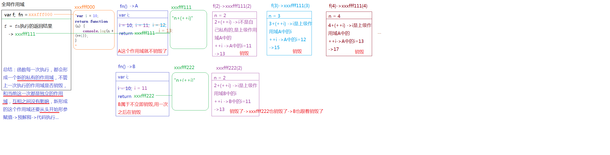

#

# 声明语句与语法改变了 JavaScript 语言核心性质

## 声明

1. 严格意义上讲，JavaScript 只有变量和常量两种标识符

- let x … 声明变量 x。不可在赋值之前读。
- const x … 声明常量 x。不可写。
- var x … 声明变量 x。在赋值之前可读取到 undefined 值。
- function x … 声明变量 x。该变量指向一个函数。
- class x … 声明变量 x。该变量指向一个类（该类的作用域内部是处理严格模式的）。
- import … 导入标识符并作为常量（可以有多种声明标识符的模式和方法）。

1. 都意味着 JavaScript 将可以通过“静态”语法分析发现那些声明的标识符；
2. 标识符对应的变量 / 常量“一定”会在用户代码执行前就已经被创建在作用域中。

## 从读取值到赋值

声明是在语法分析阶段就处理的，并且因此它会使得当前代码上下文在正式执行之前就拥有了被声明的标识符，例如 x。

```js
var y = "outer";
function f() {
  console.log(y); // undefined
  console.log(x); // throw a Exception
  let x = 100;
  var y = 100;
  ...
}
fn()

正是由于var y所声明的那个标识符在函数 f() 创建（它自己的闭包）时就已经存在，所以才阻止了console.log(y)访问全局环境中的y。类似的，let x所声明的那个x其实也已经存在 f() 函数的上下文环境中。访问它之所以会抛出异常（Exception），不是因为它不存在，而是因为这个标识符被拒绝访问了。

在 ECMAScript 6 之后出现的let/const变量在“声明（和创建）一个标识符”这件事上，与var并没有什么不同，只是 JavaScript 拒绝访问还没有绑定值的let/const标识符而已。 所以说会存在一个暂时性死区


在这之前 js是允许访问没有绑定值的var所声明的标识符 这个标识符 -> 统一约定称为 变量声明
而 let /const 则称为 词法声明

所有的声明方式本质上只有三种处理模式
var 变量声明、let 变量声明和 const 常量声明
类的内部是处于严格模式中，它的名字是按 let 来处理的，而 import 导入的名字则是按 const 的规则来处理的
```

## 赋值

```js
也就是将右操作数（的值）赋给左操作数（的引用）,也就是说，在 JavaScript 中，一个赋值表达式的左边和右边其实“都是”表达式！
lRef = rValue
```

# 堆栈内存释放问题

## 浏览器的内存分为两类

1. 堆内存 - 引用数据类型开辟的那个存储空间(用来存储对象的键值对和函数的代码字符串的) ->存储仓库
2. 栈内存 - 就是我们的作用域(全局作用域/私有的作用域)->执行环境

## 内存释放

浏览器为了保证执行的性能，有一套相对完善的内存释放的机制(把没有用的内存释放掉来节省存储的空间)

1. 堆内存的释放

   把没有用的引用数据类型的值置为 null,可以释放无用的堆内存

```js
let obj1 = { name: '小明' }; //->obj1=xxxfff000;
let obj2 = obj1; //->obj2=xxxfff000;
obj1 = null;
obj2 = null;
// null是空对象指针(谁也不指向),把obj1/obj2都置为null,xxxfff000对应的堆内存就会在浏览器空闲的时候被释放掉了
```

2. 栈内存的释放

- 全局作用域,在浏览器加载页面的时候形成,只有在浏览器关闭页面的时候才能释放->"全局作用域属于不销毁的作用域"
- 立即销毁的私有作用域：一般情况下,函数执行完成后,当前形成的这个私有的作用域,就没有用了,为了提高性能,浏览器会自动的把它释放掉
- 不销毁的私有作用域：函数执行形成一个私有的作用域 A，但是 A 中的某一部分内容被 A 以外的东西(变量)给占用了，那么 A 这个作用域就不能销毁了

一个函数执行,形成一个私有的作用域 A,A 中返回一个引用的数据类型值(函数、对象、数组...),并且被外面的一个变量接收了,此时 A 这个作用域就不能释放了

```js
// ++i和i++  都是在自身的基础上累加1  在和另外一个值进行运算的时候,累加的顺序不一样
var i = 2;
console.log(3 + i++); //->5  3+i->5  i++->i=3
i = 2;
console.log(3 + ++i); //->6 ++i->i=3 3+i->6

var i = 5;
console.log(1 + ++i + ++i + 2 + i++ + i++); //1+6+7+2+7+8

------------function fn() {
  var i = 10;
  return function (n) {
    console.log(n + ++i);
  };
};
var f = fn();
f(2);
fn()(2); //->首先执行fn,然后把fn执行的返回结果(一个小的函数)在执行
fn()(3);
f(3);
```



## 内存泄漏

```js
/*
 * 虽然有垃圾回收机制，但是，我们编写代码操作不当还是会造成内存泄漏
 * 1.意外的全局变量引起的内存泄漏。 原因：全局变量，不会被回收。 原因：全局变量，不会被回收。
 * 2.被遗忘的定时器或者回调 原因：定时器中有dom的引用，即使dom删除了，但是定时器还在，所以内存中还是有这个dom。
 * 解决：手动删除定时器和dom。
 * 3.子元素存在引用引起的内存泄漏
 * 4. 闭包引起的内存泄漏 原因：闭包可以维持函数内局部变量，使其得不到释放。
 * 解决：将事件处理函数定义在外部，解除闭包,或者在定义事件处理函数的外部函数中，删除对dom的引用。
 * https://www.cnblogs.com/yanglongbo/articles/9762359.html
 *
 *
 * */
// 内存泄露解决举例：
//由于是函数内定义函数，并且内部函数--事件回调的引用外暴了，形成了闭包。闭包可以维持函数内局部变量，使其得不到释放。
function bindEvent() {
  var obj = document.createElement('XXX');
  obj.onclick = function () {
    Ï;
    //Even if it's a empty function
  };
  obj = null; //  忘记这一步 容易形成闭包
}

//当页面中元素被移除或替换时，若元素绑定的事件仍没被移除，在IE中不会作出恰当处理，此时要先手工移除事件，不然会存在内存泄露。
```

# 构造函数的理解

## 直接方法 原型方法

```js
function Foo() {
  Foo.a = function () {
    console.log(1);
  };
  this.a = function () {
    console.log(2);
  };
}

// 以上只是 Foo 的构建⽅法，没有产⽣实例，此刻也没有执⾏
Foo.prototype.a = function () {
  console.log(3);
};
// 现在在 Foo 上挂载了原型⽅法 a ，⽅法输出值为 3
Foo.a = function () {
  console.log(4);
};
// 现在在 Foo 上挂载了直接⽅法 a ，输出值为 4
Foo.a();
// ⽴刻执⾏了 Foo 上的 a ⽅法，也就是刚刚定义的，所以
// # 输出 4
let obj = new Foo();
/* 这⾥调⽤了 Foo 的构建⽅法。Foo 的构建⽅法主要做了两件事：
1. 将全局的 Foo 上的直接⽅法 a 替换为⼀个输出 1 的⽅法。
2. 在新对象上挂载直接⽅法 a ，输出值为 2。
*/
obj.a();
// 因为有直接⽅法 a ，不需要去访问原型链，所以使⽤的是构建⽅法⾥所定义的 this.a，
// # 输出 2
Foo.a();
// 构建⽅法⾥已经替换了全局 Foo 上的 a ⽅法，所以
// # 输出 1
```
