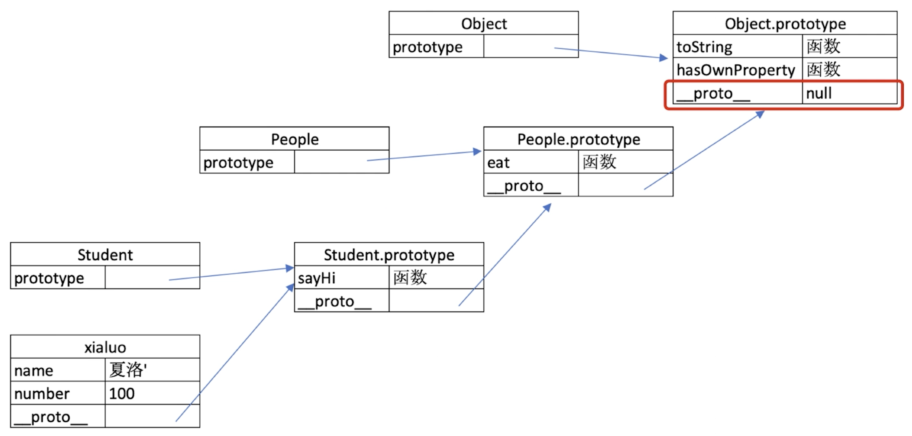

# class 和继承

本质上类似于一个模板，我们可以通过这个模板去构造一些东西
constructor 属性 方法

```js
class People {
  constructor(name) {
    this.name = name;
  }
  eating() {
    console.log('我是你爸爸');
  }
}
class Student extends People {
  constructor(name, number) {
    // this 当前构造的实例
    super(name);
    this.number = number;
  }
  sayHigh() {
    console.log(`我叫${this.name},学号是${this.number}`);
  }
}

class Teacher extends People {
  constructor(name, major) {
    super(name);
    this.major = major;
  }
  teach() {
    console.log(`我是老师${this.name},教大家${this.major}`);
  }
}
const xiaohong = new Student('zl', 333);
const xiaoming = new Student('xiaoming', 555);
const lis = new Teacher('missLi', 'English');
xiaohong.sayHigh(); //我叫zl,学号是333
xiaoming.eating(); //我是你爸爸
lis.teach(); //我是老师missLi,教大家English
```

# instanceof

1. 可以判断引用类型
2. Object 是所有人的一个父类
   instanceof 判断这个类型到时属于哪个 class 或者属于哪个构造函数

instanceof 前面这个变量顺着 xiaohong 隐式原型 往上找 能不能找到 第二个操作数 对应的显式原型
我们 xiaohong 顺着隐式原型一层一层往上找 能不能对应到 class 的显示原型 如果能对应到，instanceof 成立

```js
console.log(xiaohong instanceof Student); //true
console.log(xiaohong instanceof People); // true
console.log(xiaohong instanceof Object); //true
console.log([] instanceof Object, {} instanceof Object); // true true
```

# 原型和原型链

class 实际上是函数，可见是语法糖 typeof Student; //function
隐式原型 **proto** 和 显式原型 prototype

```js
console.log(xiaohong.__proto__);
console.log(Student.prototype);
console.log(xiaohong.__proto__  === Student.prototype); // 引用的是一个内存地址

我们 class 一个 Student的时候 会把 sayHigh  等一系列方法放到  Student.prototype上面
这个 sayHigh 我们是通过  这个 隐式原型 来去指向  Student.prototype 获取

原型关系
1. 每个class都有显示原型 prototype
2. 每个实例都有隐式原型  __proto__
3. 实例的 __proto__ 指向对应 class 的 prototype

基于原型的执行规则 也就是属性查找法则
1. 获取属性 xiaohong.name 或执行 sayHigh方法时
2. 现在自身属性和方法寻找
3. 如果找不到就去 __proto__ 中查找

原型链  你也可以把  People.prototype 理解成一个对象 是通过people 实例化的
console.log(Student.prototype.__proto__);
console.log(People.prototype);
console.log(Student.prototype.__proto__ === People.prototype);

怎么去判断是不是自己的属性呢
xiaohong.hasOwnProperty('name') // true
lis.hasOwnProperty('teach') //false 这个 teach 是对应 Teacher.prototype里的方法

Object.prototype上面有很多属性  toString hasOwnProperty
console.log(People.prototype.__proto__);
console.log(Object.prototype);
console.log(People.prototype.__proto__ === Object.prototype); //true
console.log(Object.prototype.__proto__ );   //null

```



简易版 jquery

```js
jQuery-demo
class jQuery {
  constructor(selector) {
    // 伪数组
    const result = document.querySelector(selector);
    const length = result.length;
    for (let i = 0; i < result.length; i++) {
      this[i] = result[i];
    }
    this.length = length;
    this.selector = selector;
  }
  get(index) {
    return this[index];
  }
  each(fn) {
    for (let i = 0; i < this.length; i++) {
      const element = this[i];
      fn(element);
    }
  }
  on(type, fn) {
    return this.each(element => {
      element.addEventListener(type, fn, false);
    });
  }
}
考虑拓展性
插件
jQuery.prototype.dialog = function(info) {
  alert(info);
};
复写 造轮子
class myJquery extends jQuery {
  constructor(selector) {
    super(selector);
  }
  // 拓展自己的新方法
  addClass(className) {}
  style(data) {}
}
const $p = new jQuery('p')
$p.get(0)
$p.each((elem)=>console.log(elem.nodeName))
$p.on('click',()=>alert('11'))

```