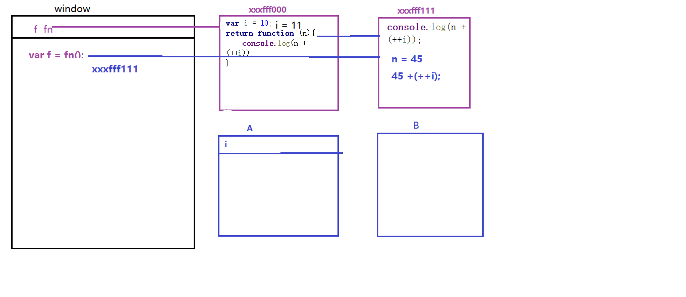

# 作用域

变量的合法使用范围
全局作用域 函数作用域 块级作用域

## 作用域链
* JavaScript属于静态作⽤域，即声明的作⽤域是根据程序正⽂在编译时就确定的，有时也称为词法作⽤域。 
* 其本质是JavaScript在执⾏过程中会创造可执⾏上下⽂，可执⾏上下⽂中的词法环境中含有外部词法环境的引⽤，我们 可以通过这个引⽤获取外部词法环境的变量、声明等，这些引⽤串联起来⼀直指向全局的词法环境，因此形成了作⽤域 链。

# 变量提升
JavaScript引擎的⼯作⽅式是，先解析代码，获取所有被声明的变量，然后再⼀⾏⼀⾏地运⾏。这造成的结果，就是所 有的变量的声明语句，都会被提升到代码的头部，这就叫做变量提升（hoisting）

# 自由变量

一个变量在当前作用域没有定义，但被使用了 向上级作用域(父级作用域)层层查找，直到找到为止 如果到全局作用域还没有找到，那就是 not defined 属性查找机制

自由变量的查找，是在函数定义的地方，向上级作用域查找，不是在执行的地方！！！(注意)

```js
var num = 12;
function fn() {
  var num = 120;
  return function () {
    console.log(num);
  };
}
var f = fn();
f(); //->120
function sum() {
  var num = 1200;
  f(); //->120
}
sum();
```

# 闭包
## 闭包是什么？
MDN的解释：闭包是函数和声明该函数的词法环境的组合。
按照我的理解就是：闭包 =『函数』和『函数体内可访问的变量总和』
```js
(function () {
  var a = 1;
  function add() {
    var b = 2;
    var sum = b + a;
    console.log(sum); // 3
  }
  add();
})();
// add 函数本身，以及其内部可访问的变量，即 a = 1 ，这两个组合在⼀起就被称为闭包，仅此⽽已。
```
作用域应用的特殊情况，有两种表现

1. 函数作为参数被传递
2. 函数作为返回值被返回

## 闭包的两大作用？

1. 避免全局变量之间的冲突,保护私有变量不被外界干扰 (所有框架/类库的源码都是写在一个闭包函数中的,目的就是为了不和别人的代码冲突)
2. 利用他不销毁的原理存储一些值(单例)

注意？所有的自由变量的查找，是在函数定义的地方，向上级作用域查找，不是在执行的地方

如果按照我的理解 JavaScript 里面所有的函数都是闭包，因为有全局环境，所有的函数都可以访问全局变量。但是真正⼴泛流⾏的其实是使⽤闭包。

```js
// 函数作为返回值
function A() {
  //a 就是 用 ES5 实现私有变量
  let a = 100;
  return function () {
    console.log(a); // 此处的a就是自由变量 没有定义 要从他定义的地方向父级作用域去查找
  };
}
const fn = A();
let a = 200;
fn(); //100
----------------// 函数作为参数
function print(fn) {
  let a = 300;
  fn();
};
let a = 200;
function fn() {
  console.log(a);
}
print(fn); //200   一定要注意 是在函数定义的时候的作用域的上级查找
```

简单点来讲 函数 A 内部有一个函数 B，函数 B 可以访问函数 A 中的变量，那么函数 B 就是闭包

```js
function A (){
  let a = 'zl'
  window.B = function(){
    console.log(a);
  }
}
A()
B()
对于闭包的解释可能是函数嵌套了函数，然后返回一个函数。其实这个解释是不完整的

循环中使用闭包解决 `var` 定义函数的问题

for (var i = 1; i <= 5; i++) {
  setTimeout(function timer() {
    console.log(i)
  }, i * 1000)
}
首先因为 setTimeout 是个异步函数，所以会先把循环全部执行完毕，这时候 i 就是 6 了，所以会输出一堆 6。
解决方式
1. 使用闭包的方式
for (var i = 1; i <= 5; i++) {
  ;(function(j) {
    setTimeout(function timer() {
      console.log(j)
    }, j * 1000)
  })(i)
}
我们首先使用了立即执行函数将 i 传入函数内部，这个时候值就被固定在了参数 j 上面不会改变，当下次执行 timer 这个闭包的时候，就可以使用外部函数的变量 j，从而达到目的
2. 使用 setTimeout 的第三个参数，这个参数会被当成 timer 函数的参数传入。
for (var i = 1; i <= 5; i++) {
  setTimeout(
    function timer(j) {
      console.log(j)
    },
    i * 1000,
    i
  )
}
3. 使用let
```

点击标签 依次弹出序号

```js
let i, a;
for (i = 0; i < 10; i++) {
  a = window.document.createElement('a');
  a.innerHTML = i + '<br>';
  a.addEventListener('click', function (e) {
    // 点击的时候执行
    e.preventDefault();
    alert(i);
  });
  document.body.appendChild(a);
}
// 这样没次点击 都会是10 为什么呢？ 因为 i 的作用域是全局 alert 的i 是自由变量 当我们开始点击的时候 事件循环早就结束了
// 改善  让每次循环的时候都去生成新的区块 i 就会不同
let a;
for (let i = 0; i < 10; i++) {
  a = window.document.createElement('a');
  a.innerHTML = i + '<br>';
  a.addEventListener('click', function (e) {
    e.preventDefault();
    alert(i);
  });
  document.body.appendChild(a);
}
```
# this 的几种赋值情况总结

## 基础实例总结

```js
/*  在全局作用域声明的变量可以看作是window的一个属性
 *   this关键字不仅仅存在于函数中，但是我们主要研究函数体内的this
 *   但是函数中的this无外乎就5种情况
 *       1 给元素绑定事件，当事件被触发的时候，this就是当前元素
 *       2 this是谁跟函数在哪里定义和执行没什么关系，就看函数执行的时候前面的'.'点，点前面是谁this就是谁,没有点就是window
 *       3 自运行函数的this永远是window,无论这个自运行函数在哪
 *       4  构造函数（类）中的this是当前实例
 *       5  this可以通过call和apply去改变,这个优先级最高
 *
 * */
//1
document.getElementById('div1').onclick = function () {
  //this div1
  fn();
};
//2
function fn() {
  console.log(this);
}
var obj = {
  fn: fn,
};
//window.fn(); //this?   window
//obj.fn(); //obj
//a = 7; //
//console.log(window.a); //???
var oo = {
  a: 123,
  sum: function () {
    console.log(this);
    console.log(this.a);
    fn();
  },
};
//fn();
//oo.sum(); //this????  oo 谁调用就是谁
//3

var obj2 = {
  fn: (function () {
    console.log(this); //自执行函数的this永远是window
    return function () {
      //var xxx = 89;
      console.log(this);
      return function () {};
    };
  })(),
};
console.log(obj2.fn);
//obj2.fn()//???? window obj2
alert(window.xxx); //???
```

1. 在 class 方法中调用
2. 箭头函数
   注意: this 取什么值 是在函数执行的时候确认的 不是在定义的时候 我们的 call 调用 是在执行的时候
3. 箭头函数没有 argument，没有原型 除非传入

```js
let say = (...argument) => {
  console.log(argument); // 正确，如果不传是没有的
};
function fn1() {
  console.log(this);
}
fn1(); // 对于直接调用 foo 来说，不管 foo 函数被放在了什么地方，this 一定是 window  我们只需要记住，谁调用了函数，就是 this
fn1.call({ x: 200 }); //{ x: 200 }
const fn2 = fn1.bind({ x: 300 });
fn2(); // { x: 300 }
const c = new foo(); // 对于 new 的方式来说，this 被永远绑定在了 c 上面，不会被任何方式改变 this
```

注意 bind 也可以改变 this 的指向 只不过会返回一个新的函数去执行，要手动调用 call 不一样，直接调用就执行了 bind 不会立即调用,其他两个会立即调用

箭头函数的 this 永远取他上级的 this 不会产生执行上下文 取决于他的外部，
因为箭头函数没有自己的执行上下文，所以它会继承调用函数中的 this

```js
箭头函数其实是没有 this 的，只取决包裹箭头函数的第一个普通函数的 this
在这个例子中，因为包裹箭头函数的第一个普通函数是 a，所以此时的 this 是 window
function a() {
  return () => {
    return () => {
      console.log(this)
    }
  }
}
console.log(a()()())
注意 另外对箭头函数使用 bind 这类函数是无效的。 对于这些函数来说，this 取决于第一个参数，如果第一个参数为空，那么就是 window
思考？ 如果对一个函数多次bind 那么上下文是什么呢？
let a = {}
let fn = function () { console.log(this) }
fn.bind().bind(a)() // => ?

// fn.bind().bind(a) 等于
let fn2 = function fn1() {
  return function() {
    return fn.apply()
  }.apply(a)
}
fn2()
管我们给函数 bind 几次，fn 中的 this 永远由第一次 bind 决定，所以结果永远是 window
可能会发生多个规则同时出现的情况，这时候不同的规则之间会根据优先级最高的来决定 this 最终指向哪里
首先，new 的方式优先级最高，接下来是 bind 这些函数，然后是 obj.foo() 这种调用方式，最后是 foo 这种调用方式，同时，箭头函数的 this 一旦被绑定，就不会再被任何方式所改变。
```

```js
const zhangsan = {
  // 这个 setTimeout 的执行是 setTimeout 本身触发的执行 不是张三 zhagnsan.wait 这种方式执行
  wait() {
    setTimeout(function () {
      // window
      console.log(this);
    });
  },
};
const zhangsan = {
  sayHigh(){
    // 当前对象
    console.log(this)
  }
  wait() {
  // 这个地方箭头函数是被  setTimeout 触发的 this 永远取他上级的 this
    setTimeout(() => {
      // 指向当前对象
      console.log(this);
    });
  },
};
我们构造函数的这个this 指向的就是当前这个实例
```

## 相同点、不同点

1. call 和 apply 的第一个参数 thisArg，都是 func 运行时指定的 this，如果这个函数处于非严格模式下，则指定为 null 或 undefined 时会自动替换为指向全局对象，原始值会被包装。
2. 都可以只传递一个参数。

```js
'use strict';
var doSth2 = function (a, b) {
  console.log(this);
  console.log([a, b]);
};
doSth2.call(0, 1, 2); // this 是 0 // [1, 2]
doSth2.apply('1'); // this 是 '1' // [undefined, undefined]
doSth2.apply(null, [1, 2]); // this 是 window // [1, 2]
```

## 手写 call、bind 实现

this 的不同场景，如何取值
当做普通函数调用 使用 call apply bind 作为对象方法调用 在 class 方法中调用 箭头函数

```js
Function.prototype.bind1 = function (arguements) {
  // 接受很多参数 第一个 this  将arguements参数拆解为数组  伪数组->数组
  // call 通过  Array.prototype.slice执行的时候 将arguements赋值给其this
  // 1. call接受一些离散的值 apply接受数组 第一个参数 this
  // 2. 获取数组 this第一项
  // 3. 返回一个函数
  const args = Array.prototype.slice.call(arguements);
  const t = args.shift();
  // fn1.bind(...) 中的fn1  this 谁调用他了
  const self = this;
  return function () {
    return self.apply(t, args);
  };
};

function fn1(a, b, c) {
  console.log('this', this);
  console.log(a, b, c);
  return 'this is fn1';
}
const fn2 = fn1.bind1({ x: 100 }, 10, 20, 30);
fn2();
console.log(fn1.__proto__ === Function.prototype); //true
// 我们要重写 bind 就需要 Function.prototype
var args = Array.prototype.slice.call(arguments);
var args = [].slice.call(arguments);
// 将参数转换为真实的数组
var args = Array.from(arguments);
var args = [...arguments];

--------实现2---------
Function.prototype.bind2 = function(context) {
    var _this = this;
    var argsParent = Array.prototype.slice.call(arguments, 1);
    return function() {
        var args = argsParent.concat(Array.prototype.slice.call(arguments)); //转化成数组
        _this.apply(context, args);
    };
}
--------实现3---------
~function () {
  function bind (context, ...args) {
    // this -> func
    let _this = this
    context = context == undefined ? window : context
    let type = typeof context
    if (!/^(object|function)$/.test(type)) {
      if (/^(symbol|bigint)$/.test(type)) {
        context = Object(context)
      } else {
        context = new context.constructor(context)
      }
    }
    return function anonymous (...innerArgs) {
      _this.call(context, ...args.concat(innerArgs))
    }
  }

  Function.prototype.bind = bind
}()
var obj = {
  name: 'zhufeng'
}

function func () {
  console.log(this, arguments)
}

document.body.onclick = func.bind(obj, 100, 200)

/* document.body.onclick = function anonymous(ev) {
	func.call(obj, 100, 200,ev);
}; */
```

## apply 实现

```js
Function.prototype.apply = function (context, args) {
  context = context ? Object(context) : window;
  // 想法  构造对象的fn方法 调用
  context.fn = this;
  // 直接调用
  if (!args) {
    return context.fn();
  }

  //  利用数组的 toString 特性
  let r = eval('context.fn(' + args + ')');
  delete context.fn;
  return r;
};
fn1.apply('hello', [1, 2, 3]);
```

思路总结
函数定义在哪里 ?

1. call 是可以被所有方法调用的,所以毫无疑问的定义在 Function 的原型上!
2. 函数接收参数 ?
   绑定函数被调用时只传入第二个参数及之后的参数
3. 如何显式绑定 this ?
   如果调用者函数，被某一个对象所拥有，那么该函数在调用时，内部的 this 指向该对象。

- [手写 call 实现 1](https://www.cnblogs.com/web-chuan/p/11592261.html)
- [手写 call 实现 2](https://cloud.tencent.com/developer/article/1475924)

```js
function fn1(name, age) {
  this.say = '123';
  console.log(this);
  console.log(`我养了一直${this.name},今年${name},${age}${this.test}`);
}

function fn2() {
  console.log(this);
}
Function.prototype.call = function (context) {
  var context = Object(context) || window; //因为传进来的context有可能是null
  context.fn = this;
  var args = [];
  for (var i = 1; i < arguments.length; i++) {
    args.push('arguments[' + i + ']'); //不这么做的话 字符串的引号会被自动去掉 变成了变量 导致报错
  }
  args = args.join(',');

  var result = eval('context.fn(' + args + ')'); //相当于执行了context.fn(arguments[1], argument[2]);
  delete context.fn;
  return result; //因为有可能this函数会有返回值return
};
// 一般会将fn1中的this指向hello 不能直接把this 给一个hello 构造对象fn
// xxx.fn1() 可以将hello作为.前面的值   {}.fn = fn1
// fn1.call('hello', '1', '2')
// fn1.call(fn2)
// fn1.call.call.call(fn2) //fn2最后执行的时候前面并没有.
// 如果多个call会让call方法执行 并且把call中的this变成fn2

----------   实现2 -----------
~ function () {
	function change(context, ...args) {
		// this -> func
		context = context == undefined ? window : context;
		let type = typeof context;
		if (!/^(object|function)$/.test(type)) {
			if (/^(symbol|bigint)$/.test(type)) {
				context = Object(context);
			} else {
				context = new context.constructor(context);
			}
		}
		let key = Symbol('key'),
			result;
		context[key] = this;
		result = context[key](...args);
		delete context[key];
		return result;
	};
	Function.prototype.change = change;
}();

let obj = {
	name: 'zhufeng'
};

function func(x, y) {
	this.total = x + y;
	return this;
}
let res = func.call(0, 100, 200);
console.log(res);
//res => {name:'Alibaba',total:300}
```

# 闭包的应用

1. 隐藏数据
2. 做一个简单的 cache 工具

```js
// 闭包隐藏数据，只提供 API
function createCache() {
  const data = {}; //闭包中的数据被隐藏，不被外界访问
  return {
    get(key) {
      return data[key];
    },
    set: function (key, value) {
      data[key] = value;
    },
  };
}

const a = createCache();
a.set('a', 200);
console.log(a.get('a')); // 200
```

jquery 闭包思想总结
先对立即执行函数做个总结
什么是立即执行函数 也是匿名函数 立即函数就是将函数定义和执行放在一起了。不需要调用，自动执行

```js
/*团队 成员1 --tab 组件*/
(function () {
  var name = '我的同位是好人';
  function fn() {
    console.log(name);
  }
  fn();
})();
传参(function (x, y) {
  alert(x + y);
})(3, 4);
将立即函数赋值给其他变量;
const rainman = (function (x, y) {
  return x + y;
})(2, 3);
特殊写方法;
~+-!(function () {
  alert('run!');
})();
~!(function () {
  alert('run!');
})();
(function () {
  alert('run!');
}.call());
(function () {
  alert('run!');
}.apply());
```

# 立即函数存在的问题

如果别人需要访问里面的多个函数或者变量 那么我们需要给 window 定义多个全局变量
呢么怎么做呢

1. 将我们需要获取的值赋值给 window 全局变量，使其成为 window 的一个属性
2. 定义一个含有闭包特性的匿名函数

```js
(function () {
  var name = 'SK';
  var sex = '男';
  function get1() {
    return name + ':' + sex;
  }
  function get2() {
    return name + ':' + sex;
  }
  var json = {
    name: name,
    sex: sex,
    get1: get1,
    get2: get2,
    on: function () {
      console.log('事件框架 - on');
    },
    html: function () {},
  };
  // 外界无法访问闭包中的函数，方法
  // 通过如下方式访问 相当于给全局对象扩充一个属性
  window.$$ = json;
})();
```

或者 将我们需要获取的值赋值给任意一个全局变量，使其成为这个全局变量的属性

```js
// window是默认系统全局面向，其实任何全局变量都可以，任何全局变量都可以
var o = new Object();
// 定义一个含有闭包特性的匿名函数
(function (w, obj) {
  var name = '书奎';
  var sex = '男';
  function get1() {
    return name + ':' + sex;
  }
  function get2() {
    return name + ':' + sex;
  }
  //        外界无法访问闭包中的函数，方法
  //        通过如下方式访问  相当于给全局对象扩充一个属性
  o.get = get1;
})();
console.log(o.get()); //书奎:男

/**
 * 1.必须将立即函数返回给另外一个变量 my
 * 2.在内部定义一个return {}
 * 3.通过my.get来访问立即函数中的变量
 */
const my = (function () {
  const name = '田佩瑶';
  const sex = '男';
  return {
    get: function () {
      return `${name}:${sex}`;
    },
  };
})();
console.log(my.get());
```

# 自己实现 自定义框架

```js
(function (w) {
  var zhangli = {
    add: function () {
      console.log('test');
    },
  };
  w.$$ = zhangli;
})(window);
$$.add();
```

# 理解小题目

```js
var num = 20; //window.num = 20;  ==> 60 ==>240
var obj = {
  num: 30,
  fn: (function (num) {
    // 形参num相当于在函数体声明了一个num变量，并且赋值20; var num = 20;
    //var num = 20;  相当于在这个作用于声明了一个num变量，并且赋值20。并且是这个作用域的私有变量
    //this.num *= 3; //自执行函数的this是window ==>window.num *=3;
    num += 15; // 35
    var num = 45; //在函数执行的时候，如果在声明的变量之前有和变量名字相同的形参，那么有var和没有var的效果是一样的。代码执行到这的时候就是一个赋值操作
    return function () {
      this.num *= 4; //window.num *= 4;
      num += 20; //当前作用域没有声明一个叫num的变量，那就去上一级作用域去寻找，一直到window。如果没有就报错了
      console.log(num);
    };
  })(num), //num?? obj.num 我们这里的num是全局的20，而不是对象里的num30
};

var fn = obj.fn; //
fn(); //65
//obj.fn();//  85
//console.log(window.num, obj.num);//240,120

=================================================================
function fn(i) {
  //参数相当于在函数体内声明了一个变量
  var i = 10; //第一次执行完27行的时候，我们的i被修改了一次
  i = 10;
  //debugger;
  //console.log(a);
  return function (n) {
    //return的值即使是一个函数也不会被提前声明
    console.log(n + ++i);
  };
};
//fn();
//var f = fn();  //首先产生一个私有的作用域，形参赋值，预解释，逐行执行

//f(45);//56 形参赋值，预解释，代码执行
//f(34); //46
//f(45);
//fn()(34); //45  函数执行完的返回值立即执行，也是作用域不被释放情况之一
//fn()(56); //67
```
