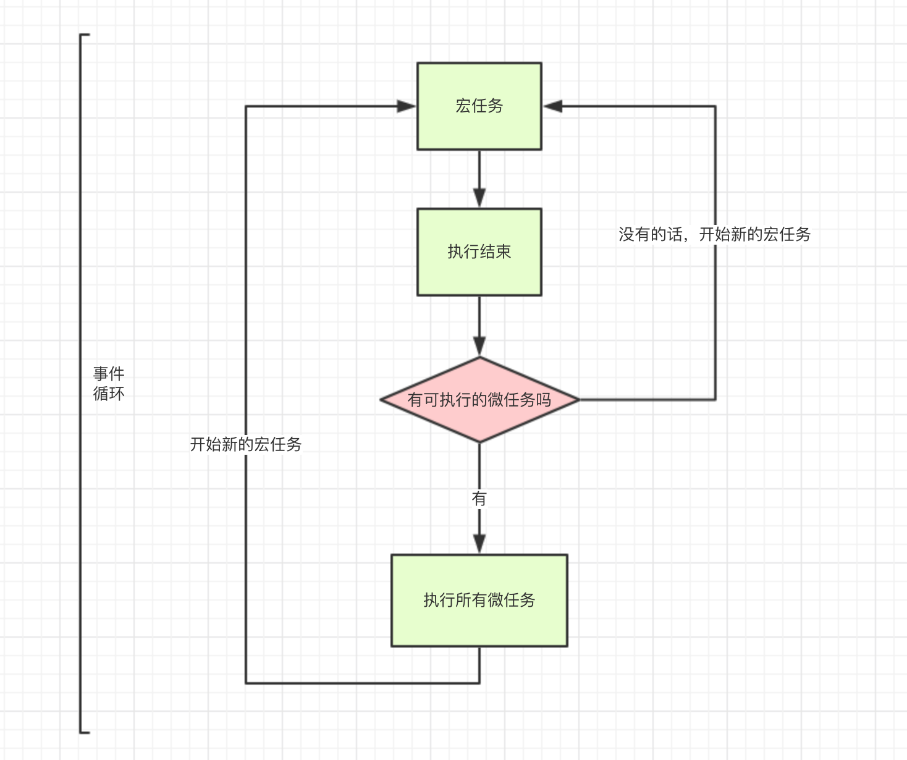

# 异步和单线程

1. 同步和异步的区别

    任务队列池  执行区

   * 同步->上一件事情没有完成,继续处理上一件事情,只有上一件事情完成了,才会做下一件事情(JS中大部分都是同步编程的)
   * 异步->规划要做一件事情,但是不是当前立马去执行这件事情,需要等一定的时间,这样的话,我们不会等着它执行,而是继续
     执行下面的操作, "只有当下面的事情都处理完成了,才会返回头处理之前的事情;如果下面的事情并没有处理完成,不管之前的事情有没有到时间,都踏踏实等实的给我等着"

   - js 是单线程语言，只能同时做一件事(JS就是个傻子,脑子一根筋,做着当前的这件事情,没有完成之前,绝对不会做下一件是事情)
   - 浏览器和 nodejs 已经支持 js 启动进程 ，如 web Worker
   - js 和 dom 渲染公用一个进程，因为 js 可修改 dom 结构(js 执行的过程中 dom 渲染必须 stop dom 渲染的时候 js 必须停止)
   - 遇到等待(网络请求，定时任务)，不能卡主
   - 异步 基于 callback 形式来调用
   - 基于 js 是单线程语言，异步不会阻塞代码执行 同步会阻塞代码执行

   在JS中异步编程只有四种情况

   * 定时器都是异步编程的
   * 所有的事件绑定都是异步编程的
  ```
    for(var i=0;i<oLis.length;i++){ oLis[i].onclick=function(){ tabChange(i);} }
  ```
   * Ajax读取数据的时候,我们一般都设置为异步编程
   * 回调函数也是异步编程的

   注意

  * 每一个浏览器对于定时器的等待时间都有一个最小的值,谷歌:5~6ms IE:10~13ms,如果设置的等待时间小于这个值,不起作用,还是需要等到最小时间才执行的;尤其是写0也不是立即执行;
  
  * 我们定时器设置的等待时间不一定就是最后执行的时间,如果定时器之后还有其他的事情正在处理中,不管定时器的时间有没有到,都是不会执行定时器的


  ```
    // for循环就是同步编程的,只有循环结束后,才会继续执行下面的代码
    for (var i = 0; i < 100000; i++) {
        if (i == 99999) {
            console.log("循环结束了~~");//->(1)
        }
    }
    console.log("ok");//->(2)

    //
    while(1){}  console.log("ok");//->永远都不会执行的,因为上面的循环是死循环,循环永远都不会结束
  ```

2. 手写 promise 加载一张图片

promise 解决了什么问题 回调地狱

```
function getImage(src) {
  return new Promise((resolve, reject) => {
    const img = document.createElement('img');
    img.onload = () => {
      resolve(img);
    };
    img.onerror = () => {
      const err = new Error('图片加载失败');
      reject(err);
    };
    img.src = src;
  });
}
```

3. 前端使用异步场景
   网路请求，如 ajax 加载图片
   定时任务 如果没有定时任务，js 读不需要异步了

```
console.log(1);
setTimeout(() => {
  console.log(2);
}, 1000);
console.log(3);
setTimeout(() => {
  console.log(4);
}, 0);
console.log(5);  // 1 3 5 4 2
```

# JS 事件循环

[微任务和宏任务](https://segmentfault.com/a/1190000014940904?utm_source=tag-newest)

- 事件循环中分为宏任务队列和微任务队列
- JS 是单线程语言：顺序执行
  先执宏任务里面的 js 栈中的所有代码 console.log 什么的 再开始微任务 再开始红任务
  我们需要知道 浏览器什么时候会渲染？ 其实是在一个宏任务之后去渲染  promise会有一个很好的体验 赶在浏览器渲染之前
   如果我们这个事情能安排在浏览器渲染之前提前做了，有效的利用浏览器的渲染周期，提升用户体验

- 任务队列
  

```
//sleep为一个同步任务，10000为执行时间 执行的同时 task先被放到了event table 等三秒之后才会把他放到事件队列里面，因为是异步的
// 10s执行的时候 3s也在计数
setTimeout(() => {
  task(); // 10后执行
}, 3000);
sleep(10000);
```

注：即便主线程为空，0 毫秒实际上也是达不到的。根据 HTML 的标准，最低是 4 毫秒。

- Promise
  Promise 新建后就会立即执行。
  Promise 本身是同步的立即执行函数， 当在 executor 中执行 resolve 或者 reject 的时候, 此时是异步操作， 会先执行 then/catch 等，当主栈完成后，才会去调用 resolve/reject 中存放的方法执行，打印 p 的时候，是打印的返回结果，一个 Promise 实例。

  1. macro-task(宏任务)：整体代码 script，setTimeout，setInterval
  2. micro-task(微任务)： Promise
     注：在事件循环中，永远先执行可执行的微任务

  - settimeout 的回调函数放到宏任务队列里，等到执行栈清空以后执行
  - promise.then 里的回调函数会放到相应宏任务的微任务队列里，等宏任务里面的同步代码执行完再执行 .then又被放到微任务队列里面了，只要我们的js栈里面还有任务 我们的微任务和宏任务都不能走，等代码执行完 js栈被清空 微任务就开始执行了
  - async 函数表示函数里面可能会有异步方法，await 后面跟一个表达式，async 方法执行时，遇到 await 会立即执行表达式，然后把表达式后面的代码放到微任务队列里，让出执行栈让同步代码先执行
    

  ```
    console.log('11');
    setTimeout(function() {
        console.log('1');
    });

    new Promise(function(resolve) {
      console.log('2');
      for (var i = 0; i < 10000; i++) {
        i == 99 && resolve();
      }
    }).then(function() {
      console.log('3');
    });
    console.log('4');
    // 11 2 4 3 1
  ```

  ```
  console.log('1');
  setTimeout(function() {
    console.log('2');
    new Promise(function(resolve) {
      console.log('3');
      resolve();
      //先执行.then 还是 setTimeout呢
    }).then(function() {
      console.log('4');
    });
  });
  new Promise(function(resolve) {
    console.log('5');
    resolve();
  }).then(function() {
    console.log('6');
  });
  setTimeout(function() {
    console.log('7');
    new Promise(function(resolve) {
      console.log('8');
      resolve();
    }).then(function() {
      console.log('9');
    });
  });
  1 5 6 2 3 4 7 8 9
  ```

  ```
  console.log('script start')
  let promise1 = new Promise(function (resolve) {
    console.log('promise1')
    resolve()
    console.log('promise1 end')
  }).then(function () {
    console.log('promise2')
  })
  setTimeout(function(){
    console.log('settimeout')
  })
  console.log('script end')
  // 输出顺序: script start->promise1->promise1 end->script end->promise2->settimeout
  ```

  当 JS 主线程执行到 Promise 对象时，

  promise1.then() 的回调就是一个 task
  promise1 是 resolved 或 rejected: 那这个 task 就会放入当前事件循环回合的 microtask queue
  promise1 是 pending: 这个 task 就会放入 事件循环的未来的某个(可能下一个)回合的 microtask queue 中
  setTimeout 的回调也是个 task ，它会被放入 macrotask queue 即使是 0ms 的情况

# 函数柯里化

1. 什么事函数柯里化？

```
// 通过把一个多参函数转换成一系列嵌套的函数，每个函数依次接受一个参数，这就是函数柯里化。
function multiply(a, b, c) {
return a * b * c;
}
multiply(1, 2, 3); // 6
// 柯里化后：
function multiply(a) {
return b => {
  return c => {
    return a * b * c;
  };
};
}
multiply(1)(2)(3); // 6
console.log(multiply(1)(2)(3));

```

```
// length 是函数对象的一个属性值,指该函数有多少个必须要传入的参数,即形参的个数
  let _fn = curry(function(a, b, c, d, e) {
    console.log(a + b + c + d + e, '11');
  });

  function curry(fn, len = fn.length) {
    return _curry.call(this, fn, len);
  }

  function _curry(fn, len, ...args) {
    return function(...params) {
      console.log(params);
      let _args = [...args, ...params];
      console.log(_args);
      if (_args.length >= len) {
        return fn.apply(this, _args);
      } else {
        // 没达到五个参数 递归调用 和前面的参数进行拼接
        return _curry.call(this, fn, len, ..._args);
      }
    };
  }
  // 最终拼成了原始的 _fn(1,2,3,4,5)
  // _fn(1,2,3,4,5);    //15
  // _fn(1)(2)(3,4,5);  //15
  // _fn(1,2)(3,4)(5);  //15
  // _fn(1)(2)(3)(4)(5);  //15

```
