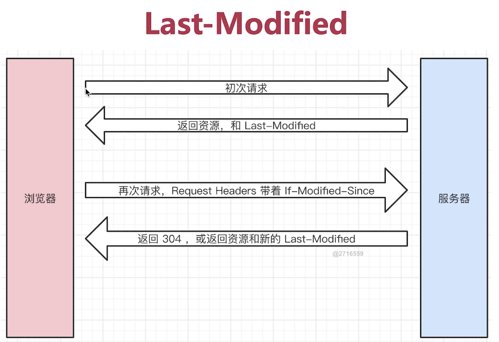
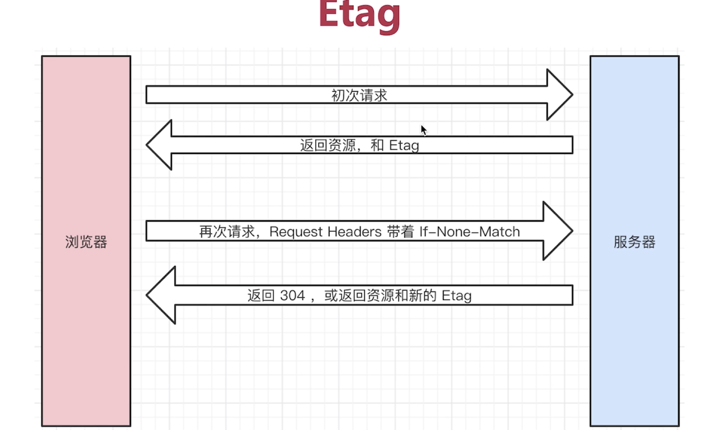
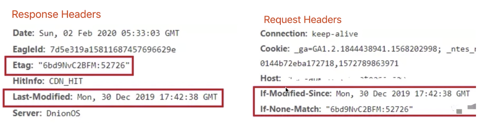
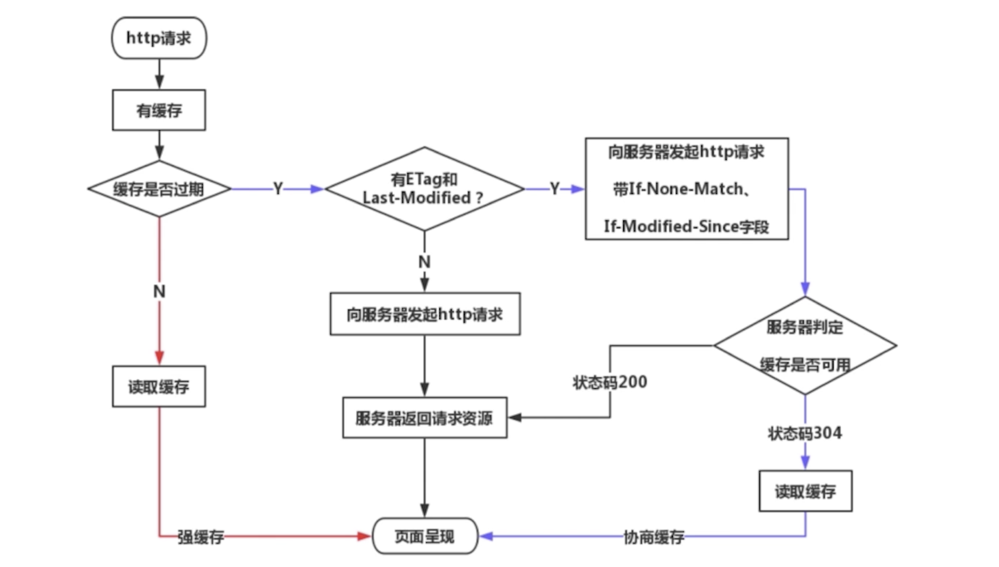
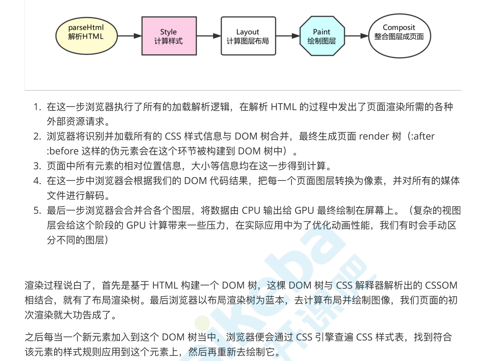
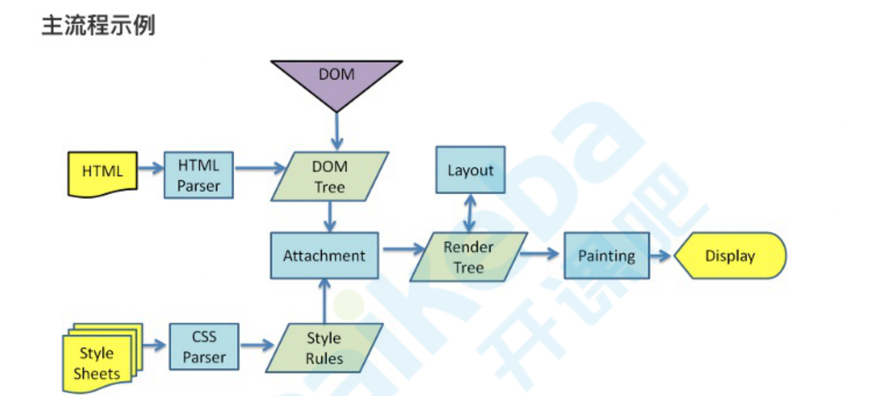
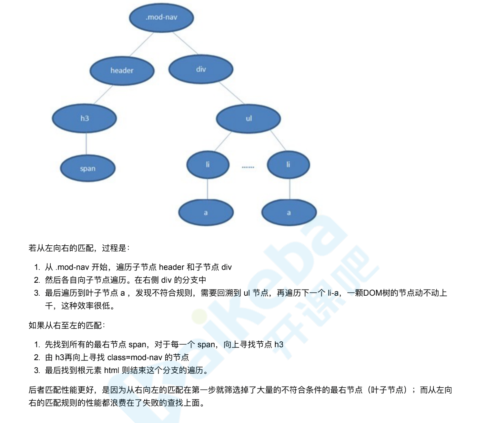

# 上线之后在哪里运行

浏览器(本身也是 app，以浏览器功能为主 webView) server 端有 nodejs
下载网页代码，渲染出页面，期间会执行若干 js
针对这些过程做一些优化 下载速度 渲染速度 js 加载执行速度 让页面显示更快
保证代码在浏览器中 稳定高效

# 原则方向

- 原则：多使用内存缓存，减少计算，减少网络请求
- 方向：加载页面，页面渲染，页面操作流畅度

# DNS

1. 查看 dns 缓存
2. 本地没缓存，发起 dns 请求，向本地配置的 dns 服务器发请求(递归)
   优化图片的方式 -- 比如说用到了 img.lt.com 的图片 在浏览器解析 dom 的时候 图片还没加载时 使用 prefetch 的方式 把 dns 先解析了
   到图片这里的时候 就不解析 dns 了 直接去获取图片

- prefetch 预获取，比如使用了 cdn 的域名

# 图片格式怎么选择

图片通常是最占用流量的， pc 平均加载的图片是 600k，简直比 js 打包后的文件还大了，所以整队图片的优化，也是受益不错的
不同的场景

1. jpg
   - 有损压缩
   - 体积小，不支持透明
   - 一般用于 轮播图，背景图
2. png
   - 无损压缩 质量高 ，支持透明 体积稍微大点
   - 色彩线头更丰富，小图 ，比如 logo 商品 icon
3. svg
   - 文本 体积小 矢量图
   - 渲染成本 学习成本

# http 缓存

- 请求 headers
  - Accept 可接受的数据格式
  - Accept-Encoding 请求报头域类似于 Accept，但是它是用于指定可接受的内容编码(浏览器可接受的压缩算法，gzip)
  - Accept-Language: 浏览器可接受的语言
  - connect: keep-alive 一次 Tcp 连接的重复使用
  - cookie: 不支持跨域，同域每次都会携带
  - host: 请求域名是什么
  - User-Agent (ua 浏览器信息)
  - Authorization 请求报头域主要用于证明客户端有权查看某个资源
  - Content-Type 发送数据的格式 application/json
- 响应 headers
  - Content-type 返回数据格式
  - ContentL-length 返回数据大小,多少字节
  - Content-Encoding 告诉你用什么方法压缩的 gzip
  - Set-Cookie 服务端设置 cookie
  - Location 重定向的地址
- 自定义 header

  - headers :{'x':'a'} //比如说有些 api 接口需要 headers 里面加一些秘钥或者特定的值，才能给你通过请求，不然认为你是非法的

- 缓存相关的 headers

  - Cache-control
  - Expires
  - Last-Modified
  - If-Modified-Since
  - Etag
  - If-None-Match

1. 缓存介绍,什么是缓存？

   把没有必要重新获取的东西，再获取一遍(本地，服务端，存一份)，让页面加载更快，因为网络的不稳定性
   哪些资源可以被缓存？(静态资源 js css img 上线后不会再修改 webpack hash，不是说必须要缓存)
   网络请求相对于 cpu 的计算是非常慢的，如果做性能优化，肯定是针对网络请求去做，尽量减少其体积和数量，
   让整个加载和渲染的过程更快一点

2. http 缓存策略(强缓存，协商缓存)，
   初次请求，服务端觉得资源可以被缓存 会加一个 Cache-control 在 res header 中，返回资源和资源标识(Last-Modified/etag)，控制强制缓存的逻辑
   eg: cache-control: max-age=3153600 秒
   客户端再次请求(会带着资源标识,If-Modified-Since:值是 Last-Modified) 之前有 cache-control 会判断时间 若时间没过期，浏览器回去本地缓存中找，找到了就返回资源 如果时间过期，缓存失效，再次请求服务端，服务端返回资源和 cache-control

   协商缓存- 服务端缓存策略/对比缓存

   - 服务端来判断资源是不是能用缓存的内容 (服务端可以告诉我这个资源没有动，你可以用本地缓存)
   - 服务端判断客户端资源和服务器资源是否一样，一致返回 304，否则返回 200 和最新资源(新的资源标识)
     怎么判断资源是不是一样呢？

   资源标识？在 res headers 中 有两种

   1. Last-Modified 资源最后修改时间
   2. Etag(资源唯一标识，一个字符串，类似指纹)

3. 刷新操作方式，对缓存的影响

- 正常操作: 地址栏输入 url 链接跳转 前进后退 强制缓存有效 协商缓存有效
- 手动刷新 强制缓存无效 协商缓存有效
  F5 就是告诉浏览器，别偷懒，好歹去服务器看看这个文件是否有过期了。于是浏览器就胆胆襟襟的发送一个请求带上 If-Modify-since
- 强制刷新 shift cmd r 都失效 给最新结果
  告诉浏览器，你先把你缓存中的这个文件给我删了，然后再去服务器请求个完整的资源文件下来。于是客户端就完成了强行更新的操作






# 浏览器缓存机制
 [memory cache和DiskCache](https://blog.csdn.net/baidu_38742725/article/details/77181078)
 * 它与memoryCache最大的区别在于，当退出进程时，内存中的数据会被清空，而磁盘的数据不会，所以，当下次再进入该进程时，该进程仍可以从diskCache中获得数据，而memoryCache则不行
 * 一般图片会用disk cache, js文件用memory cache

缓存策略基本上都是有浏览器自动发起的 基本都是服务端配置的 用 node 可以设置 res header 控制缓存

1. http Cache
   浏览器⼤佬： 需要获取 main.js ，看下强缓存⾥有么有

- Expires 和 Cache-Control 两个 header 来控制强缓存

```js
 //后端返回，在这个时间之前都可以使用强缓存 (expires被cache-control代替了，兼容两种写法)
expires: Wed, 11 Mar 2019 16:12:18 GMT
cache-control
max-age=31536000 // 1.1 精准 优先级⾼ 前端访问 max-age
no-cache(不用本地缓存，正常向服务端请求)
no-store(不用本地缓存，也不用服务端的一些缓存措施)
private 是最终用户做一些缓存
public可以允许中间代理做一些缓存
```

- 如果命中强缓存，就不会和服务器交互了，直接⽤缓存
  如果强缓存失效了，需要执⾏协商缓存

资源标识 在 res header 中 Last-Modified 资源最后修改时间 Etag(资源唯一标识，一个字符串，类似指纹)

- 服务器⼩⽼弟。浏览器⼤佬需要 main.js 这个⽂件上次修改 会使用下面的 header 问一下后台 从这个时间点开始这个文件有没有被修改 请求头带上 If-Modified-Since，如果匹配，走缓存

```js
If-Modified-Since: Fri, 27 Oct 2017 06:35:57 GMT
```

- 服务器： ⼩⽼弟，没改过，直接⽤缓存把，这次请求返回 304 not Modified
  两者共存，如果有 etag 类似⽂件的指纹，这个优先级更⾼ 因为更准确，如果资源被重复生成而内容不变，etag 更精确 // etag 去算文件 hash

```js
ETag: W/"2aaa-129892f459"
If-None-Match: W/"2aaa-129892f459"
```

- 没有上述header，或者缓存已经过期，或者etag、last-modified不匹配的时候，浏览器直接去服务器下载资源

2. memory Cache
   内存缓存，短命 ⽐如常⽤数据存 js ⾥，浏览器也有⾃⼰的策略， base64 图⽚，体积⼩的静态资

3. Service Worker Cache
   Service Worker 是⼀种独⽴于主线程之外的 Javascript 线程。它脱离于浏览器窗体，算是幕后⼯作，可
   以实现离线缓存，⽹络代理等

```js
window.navigator.serviceWorker
  .register('/kaikeba.js')
  .then(function () {
    console.log('注册成功');
  })
  .catch((err) => {
    console.error('注册失败');
  });
```

4. push cache
   http2 的缓存

# 缓存场景

对于大部分的场景都可以使用强缓存配合协商缓存解决，但是在一些特殊的地方可能需要选择特殊的缓存策略

1. 对于某些不需要缓存的资源，可以使用 Cache-control: no-store ，表示该资源不需要缓存
2. 对于频繁变动的资源，可以使用 Cache-Control: no-cache 并配合 ETag 使用，表示该资源已被缓存，但是每次都会发送请求询问资源是否更新
3. 对于代码文件来说，通常使用 Cache-Control: max-age=31536000 并配合策略缓存使用，然后对文件进行指纹处理，一旦文件名变动就会立刻下载新的文件

# 前端部署最佳实践(缓存)

怎么最好的利用缓存？

1. html 不缓存 不设置缓存时间 nocache
2. 文件加指纹 并且修改文件名
3. 静态资源都在 cdn 专门的 cdn 域名

- cdn 缩减用户和服务器的距离，提升加载效率
- 浏览器对一个域名的并发数有限制 所以用 cdn 域名专门加载静态资源(甚至我们的 css 和 js 图片的域名也分开，这样加载的并发数更高)

4. html 和 css 要分开上线 问题来了

- 先上哪一个
- 先上 html，加载的 js 如果有缓存，使用老的 js 报错
- 先上 js，如果加载的 js 缓存失败，老的 html 访问新的 js 报错
- js 由于内容修改了，生成了新文件
- 先上静态资源(缓存设置时间比较长，有变化就是新文件，老的放哪里 只不过会文件冗余)
- html 不设置强缓存

# CDN

海南的哥们，访问，光电线就要那么远，肯定慢，所以我们可以吧静态资源，部署在分布式的
cdn 上，海南的哥们，就近获取资源，⽐如⼴州机房，
cdn 单独的域名，浏览器并发获取

# 网页渲染过程

1. 从输入 url 到渲染出页面的整个过程

- 加载资源的形式
  - html 代码
  - 媒体文件 - 图片视频
  - javascript css
- 加载资源的过程
  - 浏览器通过 DNS 把 url 地址解析成 ip 的过程(如果有缓存直接返回缓存,否则递归解析)  
    域名 -> ip (dns 可以理解成一种网络协议或者服务)
  - 通过 DNS 解析得到了目标服务器的 IP 地址后，与服务器建立 TCP 连接
    - ip 协议： 选择传输路线,负责找到
    - tcp 协议： 三次握手，分片，可靠传输，重新发送的机制
  - 浏览器通过 http 协议发送请求 (增加 http 的报文信息) 头 体 行
  - 服务器接受请求后，查库，读文件，拼接好返回的 http 响应
- 渲染页面的过程

  - 浏览器收到首屏 html,开始渲染 解析 html 为 DOM Tree
  - 根据 css 代码生成 CSSOM 对象模型,也就是 解析 css 为 CSSOM -css tree
    将 DOM 树和 CSSOM 整合形成 -> Render Tree(框架和样式合并出来的一个结构,可以理解成每个节点挂了很多 css 属性)(dom+css 生成 render-tree 绘图)
  - 根据 Render Tree 渲染页面
  - 遍历渲染树开始布局，计算每个节点的位置大小信息
  - 将渲染树每个节点绘制到屏幕
  - 加载 js 文件,运行 js 脚本 ,如果遇到 script 则暂停渲染，优先加载并执行 js 代码，完成再继续 (因为 js 的进程和渲染进是共用一个进程)

    因为我们的 js 中有可能会改变 dom 结构,改变我们当前渲染的结果 你再渲染的话就没用了

  - 只至把 Render Tree 渲染完

2. window.onLoad 和 DOMContentLoad 的区别

```js
window.addEventListener('load', function () {
  //页面的全部资源全部加载完才会执行，包括图片 视频
});
window.addEventListener('DOMContentLoaded', function () {
  // DOM 渲染完即可执行 此时图片 视频 可能还没加载完
  // 比如 jquery 一般都会监听这个事件 如果监听到 我们就默认网页加载结束了
});
```

# 前端性能优化

1. 性能优化原则

- 多使用内存 缓存或其他方法

  - 强缓存

  1.  缓存生效的情况下，不需要和服务器进行交互，直接使用

  - 弱缓存

  1.  缓存数据失效了，需要问下服务器，还能不能用缓存

  用户请求浏览器一张图片(可以设置缓存策略 cache-control)

  - no-cache 先和服务器确认下响应是否变化，走协商缓存
  - no-store 禁止浏览器和中间缓存 存储任何版本
  - max-age 指定请求的时间开始和允许响应可以被使用的时间(秒)
    后端返回一张图片

  静态文件资源加 hash 后缀，根据文件内容计算 hash 文件内容不变，则 hash 不变
  url 和文件不变，则会自动触发 http 缓存机制，返回 304

- 减少 cpu 计算量 减少网络耗时

1. 让加载更快 减少资源体积：压缩代码 服务器 gzip 图片格式和压缩 少加载文件
   少执行代码
2. 减少访问次数
   - 合并代码(打包后的一个 js(webpack output->fileName :'bundle.[contenthash].js'))
   - ssr 服务端渲染 缓存(命中) 比如雪碧图 很多图合称为一个，css 定位展示
3. 使用更快的网络：cdn (是根据区域来做一个服务器的处理) 用户与内容之间的物理距离缩短，用户的等待时间也得以缩短
4. 长列表(对内存做优化 针对移动端 比如淘宝首页无限滚动 如果直接渲染)

- dom 过段会蹦掉
- 内存存储数据过多 也会崩掉
- 比如一个长度是 10000 的商品列表 怎么显示

```
Content Delivery Network，内容分发网络
CDN就是采用更多的缓存服务器（CDN边缘节点），布放在用户访问相对集中的地区或网络中。当用户访问网站时，利用全局负载技术，将用户的访问指向距离最近的缓存服务器上，由缓存服务器响应用户请求
有点像电商的本地仓

CDN并不是只能缓存视频内容，它还可以对网站的静态资源（例如各类型图片、html、css、js等）进行分发，对移动应用APP的静态内容（例如安装包apk文件、APP内的图片视频等）进行分发

CDN=更智能的镜像+缓存+流量导流

```

- [cdn 详解](https://blog.csdn.net/CSDN_bang/article/details/85110274)

让渲染更快

- ssr 调整首页文件执行顺序
- css 放在 head js 放在 body 最下面
- 尽早开始执行 js，用 DOMContentLoaded 触发
- 懒加载(图片懒加载，上滑加载更多)

```js
 图片懒加载作用:保证页面打开的速度(3s之内如果首页打不开就已经算是死亡页面了)
 对于首屏内容中的图片:首先给对应的区域一张默认图片占着位置(默认图需要非常的小,一般可以维持在5kb以内),当首屏内容都加载完成后(或者也可以给一个延迟的时间),我在开始加载真实的图片
 对于其它屏中的图片:也是给一张默认的图片占位,当滚动条滚动到对应区域的时候,我们在开始加载真实的图片
 当浏览器判断到用户往上滑 图片露出屏幕的时候 我们把设置的真实 img-url 赋值给 img src

 扩展:数据的异步加载,开始只把前两屏的数据加载绑定出来,后面的数据不进行处理,当页面滚动到对应区域的时候在从新请求数据然后绑定渲染数据

  .banner img
    display: none; /*在开始的时候IMG的SRC属性没有地址,这样的话在IE浏览器中容器中会显示一张碎图,不美观,所以我们让其默认是隐藏的,当真实的图片加载完成后在显示*/
    width: 100%;
    height: 100%;

  window.setTimeout(function () {
    //imgFir.src = imgFir.getAttribute("trueImg");
    //imgFir.style.display = "block";
    //->以上处理还是不完整的：如果我们获取的真实图片地址是错误的，当赋值给IMG的SRC属性的时候,不仅控制台会报错,而且页面中会出现碎图/叉子图,影响视觉效果

    //->获取图片的地址,验证地址的有效性,是有效的才赋值,不是有效的是不进行赋值处理的
    //var oImg = document.createElement("img");
    var oImg = new Image(); //->创建一个临时的IMG标签
    oImg.src = imgFir.getAttribute('trueImg');
    oImg.onload = function () {
      //->当图片能够正常的加载
      imgFir.src = this.src;
      imgFir.style.display = 'block';
      oImg = null;
      //console.log("图片加载完成....");
      //var nowTime = new Date;
      //console.log(nowTime - time);
    };
    //console.log("图片正在加载中....");
    //var time = new Date;
  }, 500);

```

- 对 dom 查询做缓存
- 频繁操作 dom，合并到一起插入 dom 结构
- 节流 throttle debounce

4. 节流防抖

1. 防抖

```js
防抖 用户在输入结束 或 暂停的时候我们开始请求 频繁操作，频繁输入最后触发
触发高频事件后n秒内函数只会执行一次，如果n秒内高频事件再次被触发，则重新计算时间
思路 每次触发事件时都取消之前的延时调用方法
const input1 = document.getElementById('input1');
function debounce(fn, delay = 500) {
  let timer = null; // 此时timer是在闭包中的
  // 返回函数
  return function(...args) {
  // return function() {
    if (timer) {
      // 每当用户输入的时候把前一个 setTimeout clear 掉
      clearTimeout(timer);
    }
    //然后又创建一个新的 setTimeout, 这样就能保证输入字符后的 interval 间隔内如果还有字符输入的话，就不会执行 fn 函数
    timer = setTimeout(() => {
      // fn() 这个函数可能会接受一些参数
      fn.apply(this, args);
      // fn.apply(this, argument);
      timer = null;
    }, delay);
  };
}
input1.addEventListener(
  'keyup',
  debounce(function() {
    // 这里 注意this指向
    console.log(this); // <input type="text" id="input1">
    console.log(input1.value);
  }, 600)
);
```

2. 节流 保持一个频率连续触发
   高频事件触发，但在 n 秒内只会执行一次，所以节流会稀释函数的执行频率
   思路？ 每次触发事件时都判断当前是否有等待执行的延时函数

```js
节流场景
1. 拖拽一个元素时，要随时拿到该元素被拖拽的位置
2. 直接用drag事件，则会频繁触发，很容易导致卡顿
3. 节流：无论拖拽速度多快，都会每隔100ms触发一次
4. 滚动

const div1 = document.getElementById('div1');
div1.addEventListener(
  'drag',
  throttle(function(e) {
    //加上 apply 确保 在 sayHi 函数里的 this 指向的是 input对象(不然就指向 window 了，不是我们想要的)。
    console.log(e.offsetX, e.offsetY);
  }, 100)
);

function throttle(fn, delay = 100) {
  let timer; // 被拖拽的时候 timer 就有值了   通过闭包保存一个标记
  return function(...args) {
    if (timer) {
      return;
    }
    timer = setTimeout(() => {
      //关键在第一个参数，为了确保上下文环境为当前的this，所以不能直接用fn
      fn.apply(this, args);
      timer = null;
    }, delay);
  };
}
```

3. 懒加载
   图片我们不写 src data-src 在滑动的过程中 图片不动了 判断这个图片出现在视窗中了 将 data-scr 赋值给 src
   判断滚动的事件 是否加载懒加载判断的这个函数 就可以使用防抖

```js
// 获取所有的图⽚标签
const imgs = document.getElementsByTagName('img');
// 获取可视区域的⾼度
const viewHeight = window.innerHeight || document.documentElement.clientHeight;
// num⽤于统计当前显示到了哪⼀张图⽚，避免每次都从第⼀张图⽚开始检查是否露出
let num = 0;
function lazyload() {
  for (let i = num; i < imgs.length; i++) {
    // ⽤可视区域⾼度减去元素顶部距离可视区域顶部的⾼度
    let distance = viewHeight - imgs[i].getBoundingClientRect().top;
    // 如果可视区域⾼度⼤于等于元素顶部距离可视区域顶部的⾼度，说明元素露出
    if (distance >= 0) {
      // 给元素写⼊真实的src，展示图⽚
      imgs[i].src = imgs[i].getAttribute('data-src');
      // 前i张图⽚已经加载完毕，下次从第i+1张开始检查是否露出
      num = i + 1;
    }
  }
}
// 监听Scroll事件
window.addEventListener('scroll', lazyload, false);
```

# 首屏加载优化方法总结

- Vue-Router 路由懒加载（利用 Webpack 的代码切割）
- 使用 CDN 加速，将通用的库从 vendor 进行抽离
- Nginx 的 gzip 压缩
- Vue 异步组件
- 服务端渲染 SSR
- Webpack 开启 gzip 压缩
- Service Worker 缓存文件处理
- 使用 link 标签的 rel 属性设置 prefetch
- prefetch（这段资源将会在未来某个导航或者功能要用到，但是本资源的下载顺序权重比较低，prefetch 通常用于加速下一次导航）
- preload（preload 将会把资源得下载顺序权重提高，使得关键数据提前下载好，优化页面打开速度）

# 雅虎军规

尽量减少 HTTP 请求个数——须权衡
使⽤ CDN（内容分发⽹络）
为⽂件头指定 Expires 或 Cache-Control ，使内容具有缓存性。
避免空的 src 和 href
使⽤ gzip 压缩内容
把 CSS 放到顶部
把 JS 放到底部
避免使⽤ CSS 表达式
将 CSS 和 JS 放到外部⽂件中
减少 DNS 查找次数
精简 CSS 和 JS
避免跳转
剔除重复的 JS 和 CSS
配置 ETags
使 AJAX 可缓存
尽早刷新输出缓冲
使⽤ GET 来完成 AJAX 请求
延迟加载
预加载
减少 DOM 元素个数
根据域名划分⻚⾯内容
尽量减少 iframe 的个数
避免 404
减少 Cookie 的⼤⼩
使⽤⽆ cookie 的域
减少 DOM 访问
开发智能事件处理程序
⽤ 代替 @import
避免使⽤滤镜
优化图像
优化 CSS Spirite
不要在 HTML 中缩放图像——须权衡
favicon.ico 要⼩⽽且可缓存
保持单个内容⼩于 25K
打包组件成复合⽂本

# 浏览器渲染



## 浏览器是如何渲染 UI 的

1. 浏览器获取 HTML ⽂件，然后对⽂件进⾏解析，形成 DOM Tree
2. 与此同时，进⾏ CSS 解析，⽣成 Style Rules
3. 接着将 DOM Tree 与 Style Rules 合成为 Render Tree
4. 接着进⼊布局（Layout）阶段，也就是为每个节点分配⼀个应出现在屏幕上的确切坐标
5. 随后调⽤ GPU 进⾏绘制（Paint），遍历 Render Tree 的节点，并将元素呈现出来



## 浏览器如何解析 css 选择器？

浏览器会『从右往左』解析 CSS 选择器。 我们知道 DOM Tree 与 Style Rules 合成为 Render Tree，实际上是需要将 Style Rules 附着到 DOM Tree 上，因此需要根 据选择器提供的信息对 DOM Tree 进⾏遍历，才能将样式附着到对应的 DOM 元素上。 以下这段 css 为例

```js
.mod-nav h3 span {font-size: 16px;}
```

我们对应的 DOM Tree 如下


## DOM Tree 是如何构建的？

1. 转码: 浏览器将接收到的⼆进制数据按照指定编码格式转化为 HTML 字符串
2. ⽣成 Tokens: 之后开始 parser，浏览器会将 HTML 字符串解析成 Tokens
3. 构建 Nodes: 对 Node 添加特定的属性，通过指针确定 Node 的⽗、⼦、兄弟关系和所属 treeScope
4. ⽣成 DOM Tree: 通过 node 包含的指针确定的关系构建出 DOM Tree

## 回流和重绘区别？

重排和重绘代价是⾼昂的，它们会破坏⽤户体验，并且让 UI 展示⾮常迟缓，⽽相⽐之下重排的性能影响更⼤，在两者⽆ 法避免的情况下，⼀般我们宁可选择代价更⼩的重绘。 『重绘』不⼀定会出现『重排』，『重排』必然会出现『重绘』。
1、什么是回流和重绘
回流：当rendertree的一部分或者全部元素因改变了自身的宽高，布局，显示或隐藏，或元素内部的文字结构发生变化,导致需要重新构建页面的时候，回流就产生了。
重绘: 当一个元素自身的宽高，布局，及显示或隐藏没有改变，而只是改变了元素的外观风格的时候，就产生了重绘。
结论：回流必定触发重绘，而重绘不一定触发回流。

## 如何触发重排和重绘？

任何改变⽤来构建渲染树的信息都会导致⼀次重排或重绘：

- 添加、删除、更新 DOM 节点
- 通过 display: none 隐藏⼀个 DOM 节点-触发重排和重绘
- 通过 visibility: hidden 隐藏⼀个 DOM 节点-只触发重绘，因为没有⼏何变化
- 移动或者给⻚⾯中的 DOM 节点添加动画 添加⼀个样式表，调整样式属性
- ⽤户⾏为，例如调整窗⼝⼤⼩，改变字号，或者滚动。

## 如何避免重绘或者重排？

1. 集中改变样式
   我们往往通过改变 class 的⽅式来集中改变样式

```js
// 判断是否是⿊⾊系样式 const theme = isDark ? 'dark' : 'light'
// 根据判断来设置不同的class ele.setAttribute('className', theme)
```

2. 使⽤ DocumentFragment
   我们可以通过 createDocumentFragment 创建⼀个游离于 DOM 树之外的节点，然后在此节点上批量操作，最后插⼊ DOM 树中，因此只触发⼀次重排

```js
var fragment = document.createDocumentFragment();
for (let i = 0; i < 10; i++) {
  let node = document.createElement('p');
  node.innerHTML = i;
  fragment.appendChild(node);
}
document.body.appendChild(fragment);
```
3. 提升为合成层
将元素提升为合成层有以下优点： 
* 合成层的位图，会交由 GPU 合成，⽐ CPU 处理要快 
* 当需要 repaint 时，只需要 repaint 本身，不会影响到其他的层 
* 对于 transform 和 opacity 效果，不会触发 layout 和 paint

提升合成层的最好⽅式是使⽤ CSS 的 will-change 属性：
```js
#target { will-change: transform; }
```