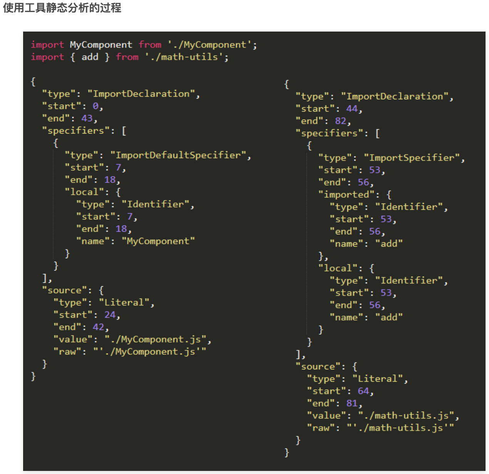

#

# 模块化的概念

保护多个文件之间、相互独立、互不影响，node 中里面为了实现模块化给每个文件都包装了一个函数，这个函数中的 this 就被更改掉了。

1. 如果定义在 global 上的属性，肯定是要给全局变量属性
2. node 里面默认在文件中打印 this 的问题

前端模块化和组件化
我觉的 前端模块化和组件化 是前端工程化下面相对具体的开发方式，可以看成是前端工程化的一种表现形式

一个模块采用一定的方式进行模块化编写 既能实现复用还可以分而治之
JS 模块化方案有很多
AMD/CommonJS/UMD/ES6 Module

1. CommonJS 服务器端模块的规范 ,一个单独的文件就是一个模块

CommonJS 加载模块是同步的，所以只有加载完成才能执行后面的操作

像 Node.js 主要用于服务器的编程，加载的模块文件一般都已经存在本地硬盘，所以加载起来比较快，不用考虑异步加载的方式，所以 CommonJS 规范比较适用

但如果是浏览器环境，要从服务器加载模块，这是就必须采用异步模式。所以就有了 AMD CMD 解决方案

2. Amd--它是一个在浏览器端模块化开发的规范

- 异步方式加载模块
- 采用 require()语句加载模块，但是不同于 CommonJS，它要求两个参数：
- 仅仅需要在全局定义 require 和 define,不需要其他全局变量
  两个参数 require([module], callback);

```js
require(['math'], function (math) {
  math.add(2, 3);
});
define(function (require) {
  // 通过相对路径获取依赖模块
  const bar = require('./bar');
  // 模块产出
  return function () {};
});
```

主要有两个 Javascript 库实现了 AMD 规范：require.js 和 curl.js。

AMD 异步加载模块。它的模块支持对象 函数 构造器 字符串 JSON 等各种类型的模块。

适合在浏览器环境中异步加载模块。可以并行加载多个模块。
缺点？ 提高了开发成本，并且不能按需加载，而是必须提前加载所有的依赖。

3. CommonJS

当使用 require 命令加载某个模块时，就会运行整个模块的代码。
当使用 require 命令加载同一个模块时，不会再执行该模块，而是取到缓存之中的值。也就是说，CommonJS 模块无论加载多少次，都只会在第一次加载时运行一次，以后再加载，就返回第一次运行的结果，除非手动清除系统缓存。
循环加载时，属于加载时执行。即脚本代码在 require 的时候，就会全部执行。一旦出现某个模块被"循环加载"，就只输出已经执行的部分，还未执行的部分不会输出。

4. es6

ES6 模块中的值属于【动态只读引用】。
对于只读来说，即不允许修改引入变量的值，import 的变量是只读的，不论是基本数据类型还是复杂数据类型
支持复杂的静态分析
当模块遇到 import 命令时，就会生成一个只读引用。等到脚本真正执行时，再根据这个只读引用，到被加载的那个模块里面去取值。
循环加载时，ES6 模块是动态引用。只要两个模块之间存在某个引用，代码就能够执行。

<!-- https://www.jianshu.com/p/bf8017a01ab8 egg -->

# 打包工具

- 原因：使用 import export 这种同步的加载的方式在大多数浏览器中无法使用
- 工具：将浏览器不支持的模块进行编译，转换，合并最后生成的代码可以在浏览器端良好的运行的工具。

## Rollup

```js
// https://rollupjs.org/guide/en/
// https://github.com/rollup/awesome
npx rollup main.js --file dist/bundle.js --format iife
```

- Rollup 设计之初就是面向 ES module ** 的，构建出结构扁平，性能出众**的类库。
- ES module 的规则

```js
import只能作为模块顶层的语句出现，不能出现在 function 里面或是 if 里面。
ES import的模块名只能是字符串常量。
不管 import 的语句出现的位置在哪里，在模块初始化的时候所有的 import 都必须已经导入完成。
```



- Tree shaking 机制 - 摇树！让死了的叶子掉下来。
- 目的就是将 es modules 打包生产特定的 JS 模块文件，并减小它的体积。

## 对比

通过以上的对比可以得出，构建 App 应用时，webpack 比较合适，如果是类库（纯 js 项目），rollup 更加适合。

- Webpack 的优势

  - 强大的生态插件
  - 面向开发应用的特性支持 HMR，按需加载，公共模块提取
  - 简化 Web 开发的环节，图片自动转 base64，资源的缓存（添加 chunkId）

- Rollup 的优势

  - 构建高性能的 模块文件，这正是类库所需要的。
  - 编译出来的代码可读性好，内容更小，执行效率更高。
  - 配置比较简单。

## 打包什么类型的文件

- Commonjs, es6 modules - 需要 特殊的 module bundler 支持
- AMD 已经有点过时了 - 需要使用特殊的 Loader - require.js
- 浏览器中直接使用 - UMD（Universal Module Definition）
  通用的一种 Javascript 格式
  兼容 common.js, AMD, 浏览器
  https://github.com/umdjs/umd
  Vue 和 React 都提供了这样的格式
  不是一种推荐的格式，太大了！不支持 tree shaking

```js
// - package.json支持module字段，会根据不同的场景，选择不同的文件行进加载
// - types: 入口类型文件
"main": "dist/lego-bricks-wcc.umd.js",
"module": "dist/lego-bricks-wcc.esm.js",
"types": "dist/index.d.ts",
```

## npm

- npm install xxxx --loglevel verbose

# CI/CD 的概念

业务组件库的开发和发布是随着一系列任务进化的

- 本地 commit 钩子函数完成 commit 验证
- 代码 push 到远端以后
- 跑特定的 test （不仅仅是本机的 unit test，也可能有时间很长的 E2E test）
- test 通过以后检查是否有新的 tag，假如有就自动 publish 一个新的版本
- 甚至还有更多，自动部署文档站点等等。
  这些任务如果手动操作，费时费力，不是很好的解决方案

## CI（Continuous integration） - 持续集成

持续集成指的是，频繁地（一天多次）将代码集成到主干。一旦开发人员对应用所做的更改被合并，系统就会通过自动构建应用并运行不同级别的自动化测试（通常是单元测试和集成测试）来验证这些更改，确保这些更改没有对应用造成破坏。

- 快速发现错误
- 防止分支大幅偏离主干。

## CD（Continuous Delivery）- 持续交付

持续交付（Continuous delivery）指的是，频繁地将软件的新版本，交付给质量团队或者用户，以供评审。

## CD(Continuous Deployment) - 持续部署

持续部署（continuous deployment）是持续交付的下一步，指的是代码通过评审以后，自动部署到生产环境。

## 两大服务

- Github Actions （https://github.com/features/actions）
- Travis (https://www.travis-ci.com/)
