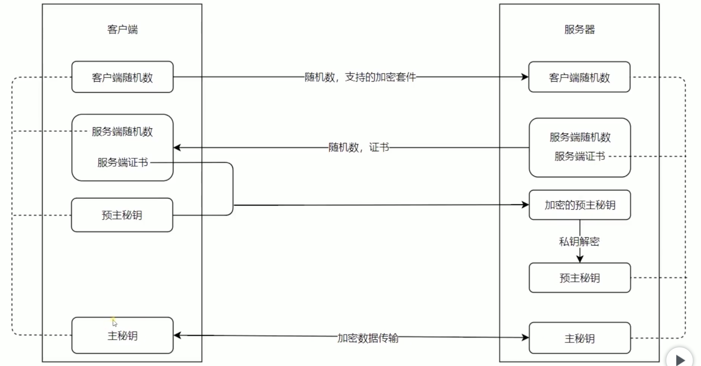

# 中间层存在的意义

()[https://blog.csdn.net/weixin_44329718/article/details/85339869]

# TCP

ip tcp http 的关系
网络协议就是和机器聊天

1. 知道目标是谁 ip 协议 负责寻址
2. TCP 协议基于 ip，负责数据的完整和有序 像快递公司

- 为了保证数据的完整和有序 做了很多事情 比如 三次握手
- 重发 滑动窗口 粘包 慢启动

3. HTTP 基于 tcp 负责应用层
   header 和 body 构成
4. UDP 也是基于 ip 的，只管发和收，不管数据丢不丢

- 适合场景？适合性能要求高 不在乎偶尔丢帧的场景(不用分包，包足够小) 比如游戏 语音视频聊天 DNS
- 这样导致性能好 没有检查策略 进地铁一样

# http 请求概述三次握手简介

1. DNS 解析 建立 TCP 连接 发送 http 请求
2. server 接受 http 请求，处理 返回
3. 客户端接收到返回数据，处理数据（渲染页面 执行 js）

- www.baidu.com 通过一个域名解析到 ip 地址 Remote Address ip:443 443 是 https 的一个默认端口 http 默认端口 80
- 域名也有可能是有缓存的 如果缓存过期了 会去通过域名 去 dns 服务器获取 ip 这样客户端找到 IP 地址之后就会 三次握手 tcp 连接

为什么要创建 tcp 连接呢？就是为了防止开启无用的连接 比如客户端发过来，服务端直接返回，由于一些网络延时原因，失败了客户端设置超时时间后，关闭了，服务端还在等待，端口资源就浪费掉了，所以就需要三次握手来确保因为..不要让响应一直等着

1. 客户端询问服务器 你在吗，你是否可以用(发起一个创建连接的数据包请求，SYN=1，Seq=X) 2.服务器告诉客户端可以访问(开启一个端口，返回 SYN=1,ACK=X+1,Seq=Y) 2. 客户端再次告诉服务端，知道了 我要访问了 开始发送请求(ACK=Y+1.Seq=Z 新的数字) url method 连接就建立了 由于这三次握手 每一次连接都要握这三次手 所以除了我们数据的大小之外 三次握手的网络包也是网络延迟的主要原因之一，也是我们的文件为什么要打包 少发网络请求的原因 比如雪碧图啊 这都是三次握手导致的

前置理解 tcp 连接和 http 请求的关系
当我们客户端和服务端发送 http 请求的时候，会创建一个 http connection 的东西，因为 http 是不存在连接这样一个概念的，只有请求和响应这个概念 请求和响应都是数据包，是要经过一个传输的通道，在哪里呢，就是我们建立的这个连接，一直保持在，http 请求是在这个连接的基础之上去发送的

# mysql 基本命令

mysql.server status ps aux | grep mysql sudo kill <pid1> <pid2> <pid3> ... mysql.server start

[处理数据库初始化问题](https:blog.csdn.net/zhipeng321/article/details/79134904)

# async 和 await

1. await 后面可以追加 promise 对象 获取 resolve 的值
2. await 必须包裹在 async 函数里面
3. async 函数执行 返回的也是一个 promise 对象
4. try catch 可以截获 promise 中 reject 的值

# buffer

[ buffer ](https://blog.csdn.net/qq_34629352/article/details/88037778)

1. 官方概念
   JavaScript 语言没有读取或操作二进制数据流的机制。 Buffer 类被引入作为 Node.js API 的一部分，使其可以在 TCP 流或文件系统操作等场景中处理二进制数据流
2. 字符集：字符集就是定义数字所代表的字符的一个规则表，同样定义了怎样用二进制存储和表示。那么，用多少位来表示一个数字，这个就叫字符编码(Character Encoding)

有一种字符编码叫做 UTF-8。它规定了，字符应该以字节为单位来表示。一个字节是 8 位(bit)。所以 8 个 1 和 0 组成的序列，应该用二进制来存储和表示任意一个字符。

3. stream: 在 Node.js 中，流(stream)就是一系列从 A 点到 B 点移动的数据.完整点的说，就是当你有一个很大的数据需要传输、搬运时，你不需要等待所有数据都传输完成才开始下一步工作。实际上，巨型数据会被分割成小块(chunks)进行传输

思考？buffer 到底在流(stream)中，是如何操作二进制数据的？buffer 到底是个什么呢？

总之，这里总会有一个等待的地方，这个等待的区域就是 Node.js 中的 Buffer Node.js 不能控制数据什么时候传输过来，传输速度，就好像公交车站无法控制人流量一样。他只能决定什么时候发送数据。如果时间还不到，那么 Node.js 就会把数据放入 buffer–”等待区域”中，一个在 RAM 中的地址，直到把他们发送出去进行处理。

```js
// 创建一个长度为10字节以0填充的Buffer  就是为了操作二进制数
// 为了处理二进制数  alloc分配一个内存空间 c里面也有 十六进制表示的二进制 每两个0都是两个十六进制数 代表一个字节

// 用于在 TCP 流、文件系统操作、以及其他上下文中与八位字节流进行交互。 八位字节组成的数
// 组，可以有效的在JS中存储二进制数据,让其与二进制数据流的操作和交互成为可能
const buf1 = Buffer.alloc(10);
const buf5 = Buffer.alloc(12);
const totalLength = buf1.length + buf5.length;
// console.log(buf1)
// 创建一个Buffer包含ascii.
// ascii 查询 http://ascii.911cha.com/
const buf2 = Buffer.from('a'); //61 -》代表啊  6是十六进制
// console.log(buf2,buf2.toString())

buf2.toJSON()
// { type: 'Buffer',data: [ 104, 101, 108, 108, 111, 32, 98, 117, 102, 102, 101, 114 ] }
// the toJSON() 方法可以将数据进行Unicode编码并展示


// 创建Buffer包含UTF-8字节
// UFT-8:一种变长的编码方案，使用 1~6 个字节来存储;
// UFT-32:一种固定长度的编码方案，不管字符编号大小，始终使用 4 个字节来存储;
// UTF-16:介于 UTF-8 和 UTF-32 之间，使用 2 个或者 4 个字节来存储，长度既固定又可变。
const buf3 = Buffer.from('中文'); //utf-8编码 每个汉字占了三个字节  根据内容直接创建buffer
// console.log(buf3)
// 合并Buffer  拼接操作
// 如果没有提供 totalLength ，它将计算 list 中的 Buffer（以获得该值）
//  Buffer.concat(list[, totalLength])
const buf4 = Buffer.concat([buf2, buf3]);
const result = Buffer.concat([buf1, buf5], totalLength);
console.log(result);

// console.log(buf4, buf4.toString());
//写入数据到buffer
buf1.write('hello');
// console.log(buf1,'hello')
//Buffer类似数组，所以很多数组方法它都有 GBK 转码 iconv-lite
// 解码buffer
buf1.toString()
```

# http

```js
const http = require('http');
const fs = require('fs');
const server = http.createServer((request, response) => {
  // response.end('hello ...')
  const { url, method, headers } = request;
  if (url === '/' && method === 'GET') {
    // 静态页面服务
    fs.readFile('index.html', (err, data) => {
      if (err) {
        response.writeHead(500, { 'Content-Type': 'text/plain;charset=utf-8' });
        response.end('500，服务器错误');
        return;
      }
      response.statusCode = 200;
      response.setHeader('Content-Type', 'text/html');
      response.end(data);
    });
  } else if (url === '/users' && method === 'GET') {
    // Ajax服务
    response.writeHead(200, {
      'Content-Type': 'application/json',
    });
    response.end(
      JSON.stringify({
        name: 'laowang',
      })
    );
  } else if (method === 'GET' && headers.accept.indexOf('image/*') !== -1) {
    // 图片文件服务
    fs.createReadStream('./' + url).pipe(response);
  }
});

server.listen(3005);
```

# Socket.IO 库特点：

源于 HTML5 标准
支持优雅降级
WebSocket
WebSocket over FLash
XHR Polling
XHR Multipart Streaming
Forever Iframe
JSONP Polling

# stream

标准输入输出 process.stdin.pipe(process.stdout)

将流作为 结果返回 直接返回一个文件

```js
http
  .createServer((req, res) => {
    if (req.method === 'GET') {
      // req.pipe(res);  //主要
      const fileName = path.resolve(__dirname, 'a.txt');
      const stream = fs.createReadStream(fileName);
      stream.pipe(res); //将res作为 stream 的dest
    }
  })
  .listen('8001');
```

stream 复制文件

```js
const fileName1 = path.resolve(**dirname, 'a.txt');
const fileName2 = path.resolve(**dirname, 'b.txt');

// 读取文件的 stream 对象 创建水桶
const readStream = fs.createReadStream(fileName1);
// 写入文件的 stream 对象
const writerStream = fs.createWriteStream(fileName2);
// 执行拷贝 通过 pipe
readStream.pipe(writerStream);
// 读取数据完成，即完成拷贝 一点一点读取
readStream.on('data', (chunk) => {
// 监听每一次读取的内容
console.log(chunk.toString());
});
readStream.on('end', function () {
console.log('copy end');
});
```

二进制友好，图片操作 stream - 是用于与 node 中流数据交互的接口

```js
//从哪里读取的流 创建一个管道
const rs = fs.createReadStream('./img.png');
//写到哪里的流   也创建了一个管道 虚的
const ws = fs.createWriteStream('../test/img2.png');
// pipe连接
rs.pipe(ws);
```

写日志 写文件 我们想要写一个很大的文件 怎么办？ 那我们就要去学习 stream 了

```js
const content = '这是新写入的内容11\n';
// 是重写还是追歼
const opt = {
  flag: 'a', //追加写入a 重写w
};

fs.writeFile(filePath, content, opt, (err) => {
  if (err) {
    console.error(err);
  }
});

// 判断文件是否存在
fs.exists(filePath, (exists) => {
  console.log(exists); //true false
});

// IO操作的网络瓶颈  网络IO(回忆post处理数据) 文件 IO 相比于cpu的计算和内存读写 IO突出的特点就是 慢
// 我们之前的读文件操作 是一下子读 搬过去 类似于给桶子倒水一样 stream 一点一点倒

// 标准输入输出 pipe就是管道（符合水流管道的模型图）
// process.stdin获取数据 直接通过管道换递给 process.stdout
process.stdin.pipe(process.stdout)

```

上传文件

```js
  const outputFile = path.resolve(__dirname, fileName)
  const fis = fs.createWriteStream(outputFile)
  //Buffer connect
  request.on('data',data => {
      chunk.push(data)
      size += data.length
      console.log('data:',data ,size)
  })
  request.on('end',() => {
      console.log('end...')
      const buffer = Buffer.concat(chunk,size)
      size = 0
      fs.writeFileSync(outputFile,buffer)
      response.end()
  })
  // 流事件写入 流是可以通过write一点点写入的
  request.on('data', data => {
      console.log('data:',data)
      fis.write(data)
  })
  request.on('end', () => {
      fis.end()
      response.end()
  })
```

# 下载

# promise

```js
//实现一个 promise
module.exports = function promisify(fn){
    return function(...args){
        return new Promise(function(reject,resolve){
            args.push((function(err,...arg){
                if(err){
                    reject(err)
                }else{
                    resolve(...arg)
                }
            }))
           fn.apply(null,args)
        })
    }
}
//传统
function fun(arg, callback) {
  try {
    callback(null, 'result'); //第一个参数永远是err or null
  } catch (error) {
    callback(error);
  }
  console.log('fs' + arg);
}
//回调方式
fun('./test.js', (err, data) => {
  if (err) throw err;
  console.log(err ? 'read-err' : data);
});
//promise 方式
const promisify = require('./promisify');

const promise = promisify(fun);

promise('index.js')
  .then((data) => {
    console.log(data);
  })
  .catch((err) => {
    console.log(err);
  });
setTimeout(async () => {
  try {
    await promise('./test.txt');
  } catch (error) {
    console.log(error);
  }
});

```

# 使用模块

```js
const repo = 'github:su37josephxia/vue-template';
const desc = '../test';
const {clone} = require('./download')
clone(repo, desc);
-----------
const { promisify } = require('util');
const ora = require('ora');
//如何让异步任务串行化 promisefy
const download = promisify(require('download-git-repo'));
//导出内容可以是导出对象的属性
module.exports.clone = async function clone(repo, desc) {
  const process = ora(`正在下载....${repo}`);
  process.start();
  try {
    await download(repo, desc);
  } catch (error) {
    process.fail();
  }
  process.succeed();
  download(repo, desc, (err) => {
    if (err) {
      process.fail();
    } else {
      process.succeed();
    }
  });
};
```

# https

http 本身没有安全属性，明文传输的

- 私钥
- 公钥 放在互联网上所有人都能拿到的加密的字符串，用来加密我们传输的信息，传输到服务器之后，服务器通过私钥解密之后，才能拿到我们公钥加密的那些数据，没私钥 你是解密不了的
  来看看 https 的三次握手
  

# 相对于 HTTP1.0，HTTP1.1 的优化：

1. 缓存处理：多了 Entity tag，If-Unmodified-Since, If-Match, If-None-Match 等缓存信息（HTTTP1.0 If-Modified-Since,Expires）
2. 带宽优化及网络连接的使用
3. 错误通知的管理
4. Host 头处理
5. 长连接：HTTP1.1 中默认开启 Connection：keep-alive，一定程度上弥补了 HTTP1.0 每次请求都要创建连接的缺点。

# HTTP1.1，HTTP2 的优化：

1. 多路复用，分桢传输 - 雪碧图、多域名 CDN、接口合并

- 官方演示 - https://http2.akamai.com/demo
- 多路复用允许同时通过单一的 HTTP/2 连接发起多重的请求-响应消息(我们只建立一个 tcp 连接即可)

  而 HTTP/1.1 协议中，浏览器客户
  端在同一时间，针对同一域名下的请求有一定数量限制。超过限制数目的请求会被阻塞(比如 chrome 6 个 超过这 6 个就需要等待这 6 个执行结束，才能发送请求，相对串行，效率不高)，再者，我们发送 6 个请求，要进行 6 次 tcp 的三次握手，创建连接的开销也是比较大的，对于服务器来说，可创建的连接数是有限制的

  在 http1.1 里面，在 tcp 连接上去发送数据，是一个请求发送完成之后，再发第二个请求，同时，服务端必须要把前一个请求的全部数据返回之后，才能返回第二个数据（比如第一个请求很慢，第二个很快完成了，还是要等第一个，串行 ）

2. 首部压缩，减少了传输体积

- http/1.x 的 header 由于 cookie 和 user agent 很容易膨胀，而且每次都要重复发送。
  http/2 使用 encoder 来减少需要传输的 header 大小，通讯双方各自 cache 一份 header fields 表，既避免了重复 header 的传输，又减小了需要传输的大小。高效的压缩算法可以很大的压缩 header，减少发送包的数
  量从而降低延迟

3. 服务端推送(主动，以前都是客户端主动，服务端被动)

- 在 HTTP/2 中，服务器可以对客户端的一个请求发送多个响应。举个例子，如果一个请求请求的是
  index.html，服务器很可能会同时响应 index.html、logo.jpg 以及 css 和 js 文件，因为它知道客户端会
  用到这些东西。这相当于在一个 HTML 文档内集合了所有的资源

4. HTTP2 支持二进制传送（实现方便且健壮），HTTP1.x 是字符串传送
