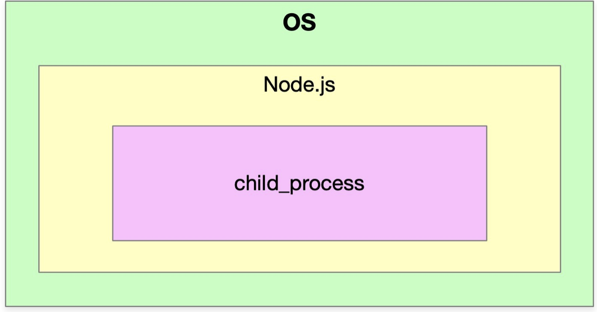
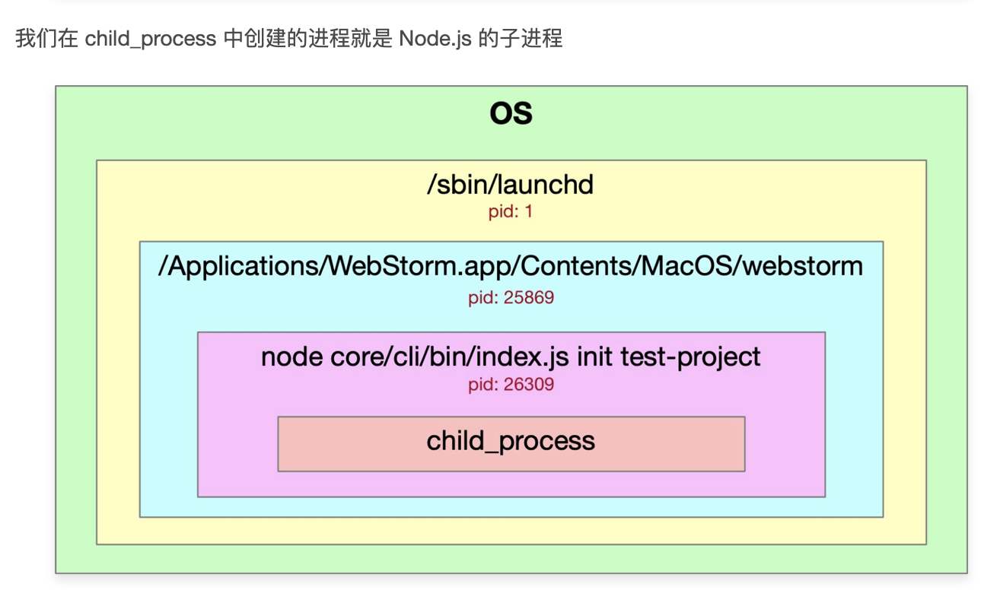
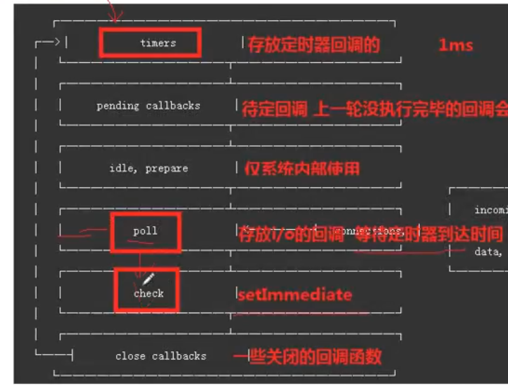

#

## 变量基础

```js
// node里面默认在文件中打印this的问题
// 1. 在文件中运行 -> {} 这个对象 其实是 module.exports 在文件默认执行的时候，这个文件会被加一层函数
// 2. 在node环境中运行 this===global ->true
console.log(this === module.exports); // => true
/**
 * 每次每个模块运行的时候 会默认传入 这几个参数 exports require Module __filename __dirname
 * 通过函数的参数进行传入我们在文件中可以直接访问
 * 1. __filename 代表当前执行文件 - 绝对路径
 * 2. __dirname 代表当前文件运行的文件夹 - 绝对路径
 * 3. process.cwd() 当前工作目录下,是可以改变的
 */
// console.log(arguments) // 会打印出上面4个参数，直接运行的话
console.log(__filename); // /Users/zhangli/framework_zl/node/1.global.js
console.log(__dirname); //  /Users/zhangli/framework_zl/node
/**
 * exports require module,node中模块化会使用到这三个参数
 * 模块化好处
 * 1. 帮我们解决命名冲突的问题(原理：每个文件外面都会包装一个函数)
 * 2. 高内聚低耦合 (把相关的代码放到一个模块中)
 * node 的规范 commonjs规范(每个js就是一个模块)
 * 2. 模块之间可以项目引用，前提 -> 模块的导出  module.exports
 * 3. 模块的导入 require
 *
 * 常用规范
 * 1. esModule es6模块规范 export import
 * 2. cmd -> seajs
 * 3. amd -> requirejs
 * 4. umd -> 统一模块化规范

 * 主流的两个模块 -> es6模块规范和commonjs的简单区别
 * 1. node中默认不支持es6模块,需要babel去转义
 * 2. commonjs是动态引入、可以根据条件引入，import静态引入
 * 3. CommonJS是对模块的浅拷⻉，ES6 Module是对模块的引⽤,即ES6 Module只存只读，不能改变其值，具体点就 是指针指向不能变，类似const
 *
 * node中的模块化实现  === webpack模块化的引入 (node中模块如何进行加载)
 *
 * node中的模块分类
 * 1. 核心模块/内置模块 fs http path 不需要安装 引入的时候不需要增加相对路径、绝对路径
 * 2. 第三方模块 需要安装
 * 3. 自定义模块 需要通过相对路径或者绝对路径引入
 */
```

## this 概念

```js
console.log(this)
// 1. 在文件中运行 -> {} 这个对象 其实是 module.exports 在文件默认执行的时候，这个文件会被加一层函数
// 2. 在node环境中运行 this===global ->true
console.log(this===module.exports)  => true
```

## 进程 process

```js
// console.log(Object.keys(global))
console.log(process);
// 常用方法 process.platform  argv cwd env nextTick:
console.log(process.platform); // 进程运行的平台 比如cli要判断平台 max-> darwin  window-> win32
console.log(process.argv); // 当前进程执行时所带的参数 默认是数组类型参数，前两个是固定的
// 1. 当前node的执行命令文件
// 2. 当前执行的文件是谁 -> node+文件执行时 可以传递参数 这些参数可以放到数组第三项...
// 主要用来用来解析用户传递的参数 看看是否存在port端口
// node 1.global.js --port 3000 --config true
// ->{ port: '3000', config: 'true' }
// -> help的各种提示 流行库 commander yargs(webpack) ora可以实现进度条
const r = process.argv.slice(2).reduce((memo, current, index, array) => {
  if (current.startsWith('--')) {
    memo[current.slice(2)] = array[index + 1];
  }
  return memo;
}, {});
// 当前进程执行时的工作目录 current working directory
// 比如 1. http-server 在当前目录展示资源列 2. webpack找配置文件，也是在当前根工作目录下
console.log(process.cwd());
// 当前进程的环境变量 在当前命令行设置环境变量 mac cross-env 设置 在process.env去拿
// process.env.NODE_ENV  production developement (export / set)

console.log(process.env);
```

## 子进程

核心(http://nodejs.cn/api/child_process.html) - 依附在当前进程下面，核心库 child_process

1. 什么是进程
进程（Process）是计算机中的程序关于某数据集合上的一次运行活动，是系统进行资源分配和调度的基本单位，是操作系统结构的基础。


<!-- ps -ef | grep -->

```js
// 进程的概念主要有两点：
第一，进程是一个实体。每一个进程都有它自己的地址空间。
第二，进程是一个“执行中的程序”，存在嵌套关系。
```

2. child_process 用法

- 异步
  - exec
  - execFile
  <!-- 主要用来执行文件 -->
  - fork
  - spawn
- 同步

  - execSync
  - execFileSync
  - spawnSync

```js
cp.exec('ls -al', function (err, stdout, stderr) {});

// test.shell
// ls -al
// echo $1
// echo $2
// 主要用来执行一个文件
cp.execFile(
  path.resolve(__dirname, 'test.shell'),
  ['-al', '-bl'],
  function (err, stdout, stderr) {
    console.log(err);
    console.log(stdout);
    console.log(stderr);
  }
);
```

## node 的事件环

浏览器是一个宏任务队列，node 是多个宏任务队列，执行顺序是一样的


```js
1. process.nextTick
console.log(process.nextTick);
// node中实现的微任务 优先级比 promise还高
// nextTick和promise是两个队列 所以会先清空 nextTick 队列
process.nextTick(() => {
  console.log(1)
  process.nextTick(() => {
    console.log(2)
    process.nextTick(() => {
      console.log(3)
    })
  })
})
Promise.resolve().then(() => console.log('promise'))
// 1 2 3 promise
2. 在nodeV10版本之后，统一执行效果和浏览器一致 新增了 nextTick和 setImmediate
// 如果 setImmediate 和  setTimeout在默认的环境下执行 ，会受性能影响，在不设置时间的前提下
// 注意：每个宏任务执行完毕之后都会执行微任务 老版本是每个队列清空后清空微任务
// https://nodejs.org/zh-cn/docs/guides/event-loop-timers-and-nexttick/
const fs = require('fs'); // readFile 是在pool执行 poo l之后是 check setImmediate 之后 在执行timers把
fs.readFile('.gitignore', 'utf8', (err, data) => {
  setImmediate(() => { // node中的宏任务，会立即执行，和setTimeout有什么区别呢？
    // 异步
    console.log('异步 -> setImmediate'); // node中的宏任务
  });
  setTimeout(() => {
    console.log('setTimeout');
  }, 2);
});

3. 事件环  - 关注 timers+pool+check的执行顺序
当主站代码执行完毕后，会进入node的事件环(node自己实现的 event loop 每一个任务都有这样的一个队列，一个队列一个队列执行)
阶段概述
1. 定时器(timers)：存放定时器回调的 (执行成功都会放到timers这个队列，node中专门弄了一个队列，浏览器是统一的)。浏览器中呢 会开辟一个宏任务队列去存储
2. 待定回调(pending callbacks)： 就是上一个没执行完毕的回调会在这里统一执行
3. idle, prepare：仅系统内部使用。
4. 轮询(pool)：1. 存放IO的回调 2. 等待定时器到达时间
5. 检测(check)：存放 setImmediate() 回调函数，且回调函数在这里执行。
6. 关闭的回调函数( close callbacks)：一些关闭的回调函数，如：socket.on('close', ...)。
 在每次运行的事件循环之间，Node.js 检查它是否在等待任何异步 I/O 或计时器，如果没有的话，则完全关闭。

-------------------------------------------------------------------
默认当前主站代码执行完毕后，会进入事件环

1.  会看当前定时器是否到达时间，如果到达时间，会执行定时器的回调
2.  如果没到达 会走到 pool 阶段 pool 会执行 IO 操作的回调，如果没有 IO，会看下有没有 setImmediate，如果有会进入到 check 阶段
3.  如果没有 要检查是否有定时器，如果没有定时器，IO 操作则结束循环
4.  如果有定时器，定时器到达时间后，会返回 timers 阶段 执行定时器的回调
5.  每一个宏任务执行完毕后都会清空
    两种可能 - 从 pool 绕，从根绕
6.  当前进来之后，走到 pool 就停住了，等会儿 定时器到了，在回到 timers，不停的这样轮询
7.  还有一种情况就是 刚进来 发现有 check，有 close，接着走底部回调，再到 timers

setImmediate(() => {
  console.log('setImmediate1')
  Promise.resolve().then(() => {
    console.log('promise1')
  })
})
setImmediate(() => {
  console.log('setImmediate2')
  Promise.resolve().then(() => {
    console.log('promise2')
  })
  process.nextTick(() => {
    console.log('nextTick2')
  })
})
process.nextTick(() => {
  console.log('nextTick1')
})
// nextTick1  setImmediate1 promise1 setImmediate2 nextTick2 promise2
```

# 模块加载机制

## 基本原理理解

```js
/**
 * node中可以使用同步的方式读取文件 - 性能更高点，一运行就读取了过来
 * 一调用 require 会读取文件，把当前用户写的代码包装到一个函数中
 * 实现了一个闭包，将模块中的变量都私有化到这个作用域中了，起到了隔离作用
 */
// 通过读取文件内容 将内容包装自执行函数中 默认返回 module.exports 作为函数的结果会转义成下方代码
let result = function (exports, require,module, __filename, __dirname) {
  module.exports = 'zhangLi'
  return module.exports
}(exports, require,module, __filename, __dirname)

// 代码调试
1. node --inspect-brk
2. chrome://inspect
```

## 核心模块

```js
/**
 * 1. fs
 * 2. path
 * 3. vm 做一个虚拟机运行环境
 */
const fs = require('fs');
// readdirSync 同步api
const path = require('path');
const filePath = path.resolve(__dirname, '../../.gitignore');
// 返回path的目录
console.log(path.dirname(filePath), 'dirname'); // /Users/zhangli/framework_zl
// 判断文件是否存在 不过已经被废弃掉了 返回布尔值
let isFileExist = fs.existsSync(filePath);
console.log(isFileExist); //true
// 读取文件全部采用绝对路径
// console.log(path.resolve(__dirname)) // /Users/zhangli/framework_zl/node/module
if (isFileExist) {
  let content = fs.readFileSync(filePath, 'utf8');
  console.log(content, 'content');
}
/**
 * 都有拼接的能力，但是要注意 有没有拼接 /
 * 如果需要拼接 / 必须使用join,因为resolve会回到根目录下
 * @type {string}
 */
let s = path.join('a', 'b', 'c'); // 拼接 可以拼接/
let s2 = path.resolve(__dirname, 'a', 'b', 'c');
console.log(s, s2); // /Users/zhangli/framework_zl/node/module/a/b/c
// 获取文件拓展名
let ext = path.extname('a.min.js'); // .js
let basename = path.basename('a.min.ts', 'ts');
console.log(ext, basename);
/**
 * 如何让一个字符串执行
 * 1. eval  存在问题 模块间需要相互独立,不希望模块的变量共享
 * 2. new Function 可以字符串转换为函数 再去调用 一般前端中让一个模块可以运行采用这种方式
 * @type {module:vm}
 */
let vm = require('vm');
let a = 100;
// let str = `console.log(a)` // 100
let fn = new Function('a', 'b', `console.log(a); return 100`);
console.log(fn(1, 2));
// console.log(fn.toString())
vm.runInThisContext('console.log(a)'); // node 的模块使用的是这种方法,直接运行字符串，运行函数字符串
```

## 运行步骤+实现

```js
/**
 * 运行步骤
 * 1. Module._load 加载模块
 * 2. Module._resolveFilename 把相对路径转化成绝对路径
 * 3. let module = new Module 创建一个模块 模块的信息 id exports
 * 4. 尝试加载这个模块
 * 5. 通过不同的后缀进行加载 json/js
 * 6. Module._extensions 文件的处理方式
 * 7. 核心就是读取文件
 * 8. 给文件外层增加一个函数 并且让函数执行 改变了this，传入了  exports, require, module,filename, dirname属性
 * 9. 用户会给  module.exports 赋值
 * 10.最终返回  module.exports 拿到最终结果
 简单理解-> 把文件读出来 包个函数 执行 执行传入对象 用户填值 填完返回
 */
const path = require('path');
const fs = require('fs');
const vm = require('vm');

function Module(id) {
  // node比较早，基本都是es5写法
  this.id = id; // id是我们传入模块的绝对路径 filename
  this.exports = {}; // 代表最终模块的返回结果
}
// .commonjs规范规定会先查找.js 文件 找不到查找.json
Module._extensions = {
  '.js'(module) {
    console.log('加载js模块');
    let content = fs.readFileSync(module.id, 'utf8');
    // 给读取出来的文件内容 添加自执行函数
    content = Module.wrapper[0] + content + Module.wrapper[1];
    // 需要让函数字符串变成真正的函数
    let fn = vm.runInThisContext(content);
    // console.log(fn.toString()) // function (exports, require, module,__filename, __dirname) {module.exports = 'zhangLi'}
    let exports = module.exports; // {}
    let dirname = path.dirname(module.id); // /Users/zhangli/framework_zl/node/module
    // 让包装的函数执行 require是会让包装的函数执行 并且会改变this
    fn.call(exports, exports, req, module, module.id, dirname);
  },
  '.json'(module) {
    // 在json中只需要将 结果赋予给exports 对象上即可
    let content = fs.readFileSync(module.id, 'utf8');
    module.exports = JSON.parse(content);
  },
};
Module.wrapper = [
  `(function (exports, require, module,__filename, __dirname) {`,
  `})`,
];
// 解析文件的绝对路径 可以尝试添加后缀
Module._resolveFilename = function (filePath) {
  let absPath = path.resolve(__dirname, filePath);
  // 如果文件名没后缀 我需要依次添加后缀 如果没有 就报错了
  let ext = path.extname(absPath); // 去查找当前有没有后缀
  let finalPath = absPath;
  if (!ext) {
    let exts = Object.keys(Module._extensions); // [.js,.json]
    for (let i = 0; i < exts.length; i++) {
      finalPath = absPath + exts[i]; // xxx
      try {
        fs.accessSync(finalPath);
        break;
      } catch (e) {
        finalPath = path.basename(finalPath, exts[i]);
      }
    }
    if (!path.extname(finalPath)) {
      // 如果循环后文件还是没有后缀
      throw new Error('文件不存在');
    }
  } else {
    try {
      fs.accessSync(finalPath);
    } catch (e) {
      throw new Error('文件不存在');
    }
  }
  return finalPath;
};
/**
 * 加载文件，主要是 取到不同的后缀，调用对应的处理方法去处理
 */
Module.prototype.load = function () {
  let extname = path.extname(this.id);
  Module._extensions[extname](this); // load执行完毕得到 module.exports = {"name":"zhangLi"}
};
Module._cache = {};
function req(filename) {
  // 默认传入的文件名可能是没有.js .json后缀的,如果没有 尝试添加
  // 解析出绝对路径
  filename = Module._resolveFilename(filename); // /Users/zhangli/framework_zl/node/module/a.js
  // 创建一个模块
  // 加载前先看一眼 是否加载过了  如果加载过了 我们直接读缓存
  let cacheModule = Module._cache[filename]; // 多次引用同一个模块只运行一次
  if (cacheModule) {
    return cacheModule.exports; //返回缓存的结果
  }
  // 根据路径创建一个模块
  let module = new Module(filename);
  Module._cache[filename] = module;
  // 加载模块
  module.load();
  return module.exports;
}
const result = req('./a');
const result2 = req('./zl.json');
// exports 和 module.exports 的关系  exports = module.exports  = {}
console.log(result, result2);
```

## module.exports + exports 理解

```js
console.log(this); // {} module.exports 改了但是 this 还为空的原因，引用类型的特点
module.exports.a = 'zhangLi';
console.log(this); // {a:'zhangLi'}
/**
 * module.exports = {}
 * let exports = module.exports
 * module.exports = 'zhangLi'
 * console.log(this)  -> {}
 * exports会改变？不会
 *
 * 错误的姿势
 * exports = xxxxx
 * 正确导出姿势
 * 1. exports.xxx = '123123'  // 同一个地址引用
 * 2. module.exports = 'zhangLi'
 * 3. module.exports.xxxx = 'zhangLi'
 * 4. global.xx 声明全局方法，但是不建议
 *
 * 如果 exports.a 和 module.exports.a 都写了 取最后一个
 */
// 引用类型的特点
let obj = {};
let o1 = obj;
// 刚开始 是指向同一个内存地址的 但是 obj = { name: 'zhangLi' }
// 让obj指向了一个新的地址 o1 还是指向老地址
obj = { name: 'zhangLi' };
o1.a = 123;
console.log(o1);

let aa = { name: 123 };
aa.x = 123;
let bb = aa;
aa = { x: 123 };
console.log(bb); // {name:123} 如果 aa.x = 123 那就是同一个结果
```

## 面试题总结

1. 请介绍一下 node 里的模块是什么

```js
// https://www.jb51.net/article/171511.htm
function Module(id, parent) {
  this.id = id;
  this.exports = {};
  this.parent = parent;
  this.filename = null;
  this.loaded = false;
  this.children = [];
}
module.exports = Module;
var module = new Module(filename, parent);
所有的模块都是 Module 的实例。可以看到，当前模块（module.js）也是 Module 的一个实例。
```

2. 加载模块时，为什么每个模块都有**dirname,**filename 属性呢，new Module 的时候我们看到 1.1 部分没有这两个属性的，那么这两个属性是从哪里来的?

也就是说，每个 module 里面都会传入**filename, **dirname 参数，这两个参数并不是 module 本身就有的，是外界传入的-原因，是内容包装成了函数

3. exports.xxx=xxx 和 Module.exports={}有什么区别吗
4. Node 事件循环的流程
5. V8 的垃圾回收机制
6. Buffer 模块
7. Buffer.alloc 和 Buffer.allocUnsafe 的区别
