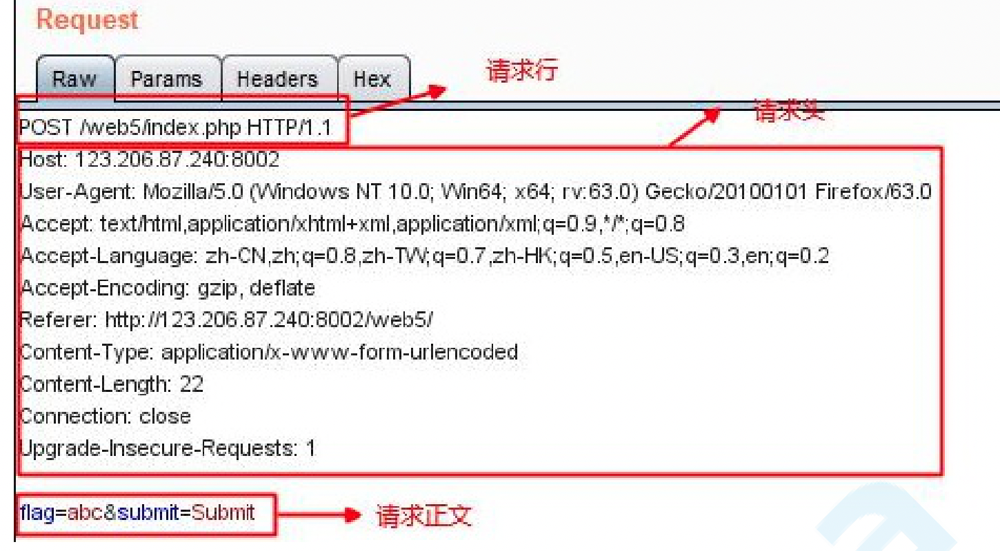
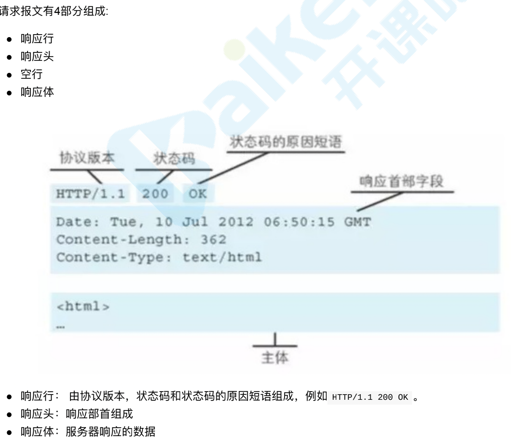
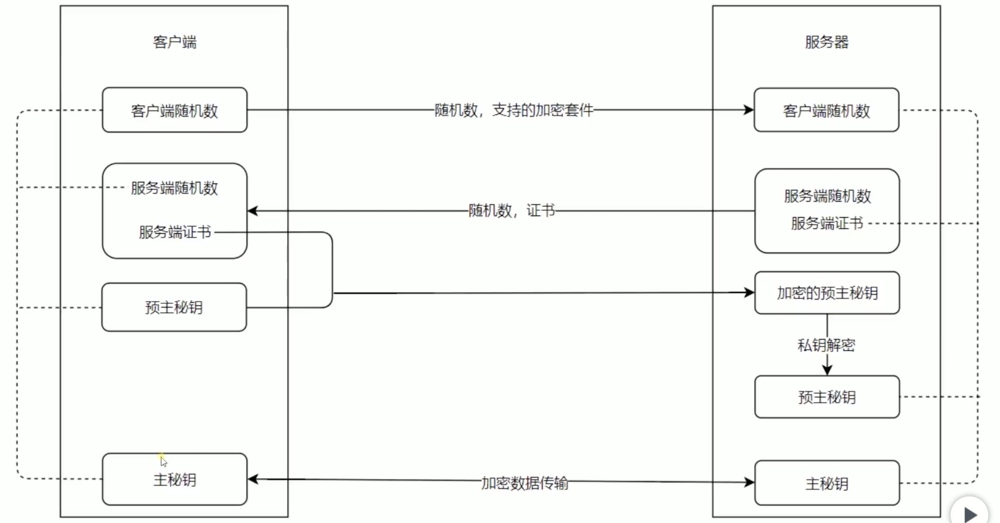
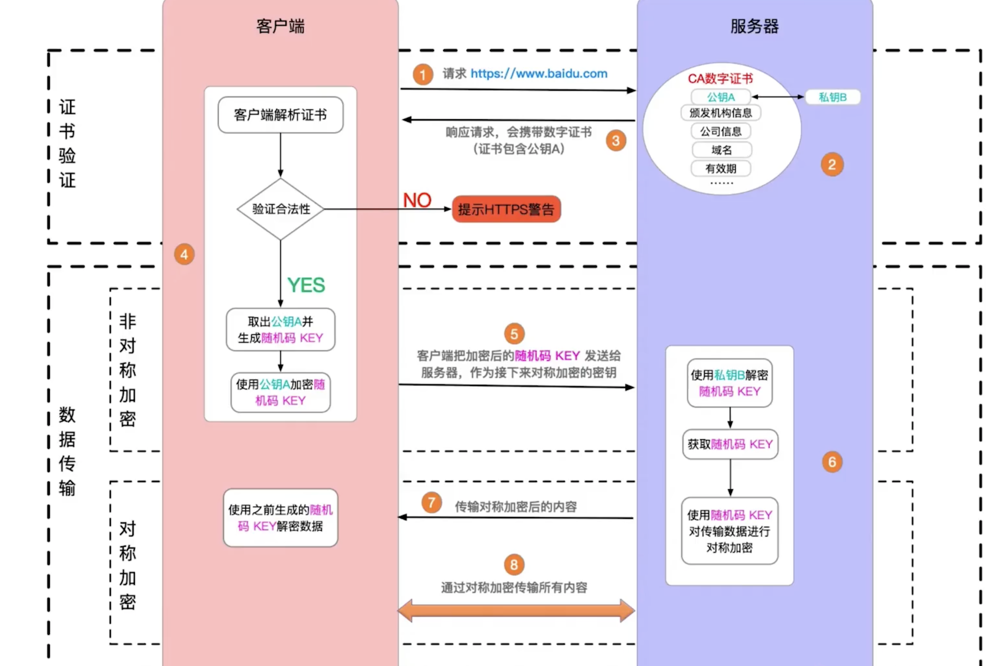
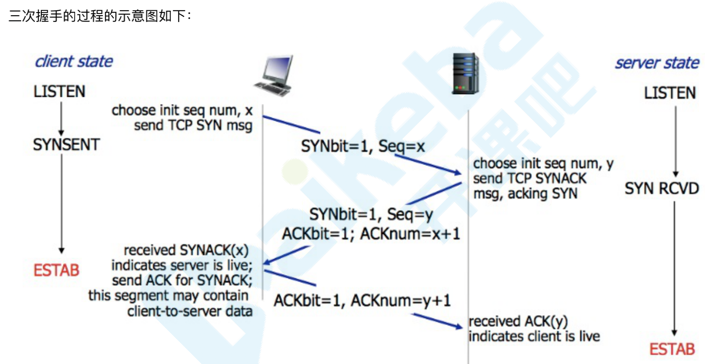
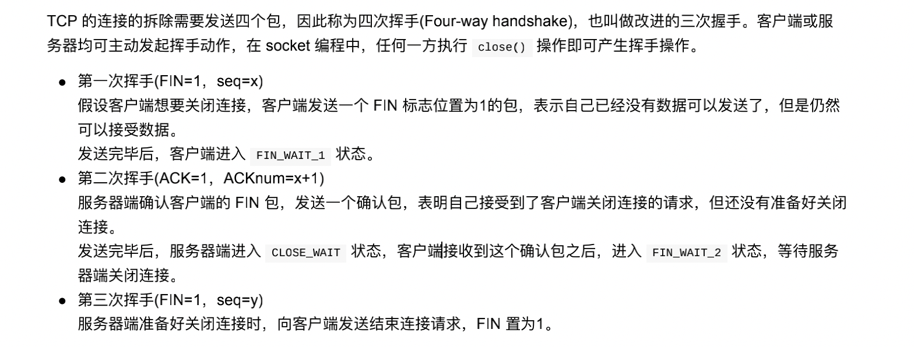
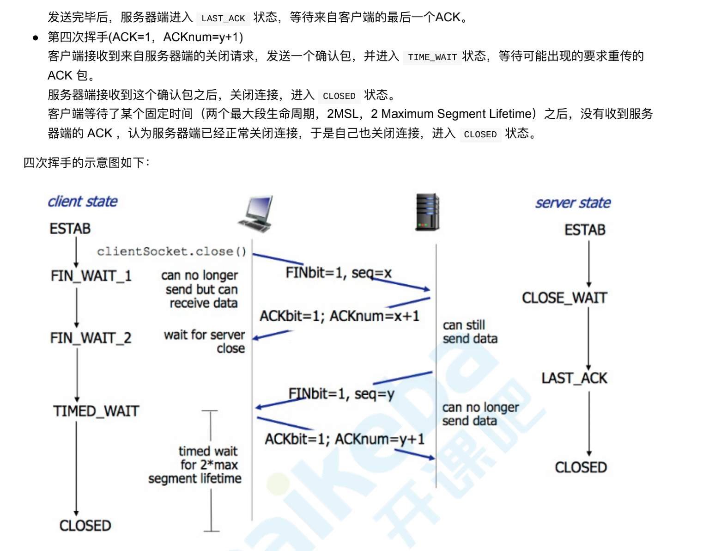

# HTTP 协议详解

1. HTTP 协议详解之 URL
2. HTTP 协议详解之请求篇
3. HTTP 协议详解之响应篇
4. HTTP 协议详解之消息报头篇

# 概述

HTTP 是一个属于应用层的面向对象的协议，由于其简捷、快速的方式，适用于分布式超媒体信息系统。
HTTP 协议的主要特点可概括如下

1. 支持客户/服务器模式。
2. 简单快速：客户向服务器请求服务时，只需传送请求方法和路径。请求方法常用的有 GET、HEAD、POST。每种
   方法规定了客户与服务器联系的类型不同。由于 HTTP 协议简单，使得 HTTP 服务器的程序规模小，因而通信速度很
   快。
3. 灵活：HTTP 允许传输任意类型的数据对象。正在传输的类型由 Content-Type 加以标记。
4. 无连接：无连接的含义是限制每次连接只处理一个请求。服务器处理完客户的请求，并收到客户的应答后，即断
   开连接。采用这种方式可以节省传输时间。
5. 无状态：HTTP 协议是无状态协议。无状态是指协议对于事务处理没有记忆能力。缺少状态意味着如果后续处理
   需要前面的信息，则它必须重传，这样可能导致每次连接传送的数据量增大。另一方面，在服务器不需要先前信息
   时它的应答就较快。

## HTTP URL

(URL 是一种特殊类型的 URI，包含了用于查找某个资源的足够的信息)的格式如下：

- http://host:port/abs_path
- http 表示要通过 HTTP 协议来定位网络资源；
- host 表示合法的 Internet 主机域名或者 IP 地址；
- port 指定一个端口号，为空则使用缺省端口 80；
- abs_path 指定请求资源的 URI；如果 URL 中没有给出 abs_path，那么当它作为请求 URI 时，必须以“/”的形式给出，
  通常这个工作浏览器自动帮我们完成。
  eg:
  1、输入：www.kaikeba.com 浏览器自动转换成：http://www.guet.edu.cn/
  2、http://192.168.0.116:8080/index

## HTTP 协议详解之请求篇

### 有哪些方法

- HTTP1.0 定义了三种请求⽅法： GET, POST 和 HEAD ⽅法 HTTP1.1 新增了五种请求⽅法：OPTIONS, PUT, DELETE, TRACE 和 CONNECT
- http 请求由三部分组成，分别是：请求行、消息报头、请求正文

### 作用是什么？

- GET 请求获取 Request-URI 所标识的资源
- POST 在 Request-URI 所标识的资源后附加新的数据
- HEAD 请求获取由 Request-URI 所标识的资源的响应消息报头
- PUT 请求服务器存储一个资源，并用 Request-URI 作为其标识
- DELETE 请求服务器删除 Request-URI 所标识的资源
- TRACE 请求服务器回送收到的请求信息，主要用于测试或诊断
- CONNECT 保留将来使用
- OPTIONS 请求查询服务器的性能，或者查询与资源相关的选项和需求

1. 请求行以一个方法符号开头，以空格分开，后面跟着请求的 URI 和协议的版本，格式如下：
   Method Request-URI HTTP-Version CRLF
   其中 Method 表示请求方法；
   Request-URI 是一个统一资源标识符；
   HTTP-Version 表示请求的 HTTP 协议版本；
   CRLF 表示回车和换行（除了作为结尾的 CRLF 外，不允许出现单独的 CR 或 LF 字符）。
   请求方法（所有方法全为大写）有多种，各个方法的解释如下：

### get 和 post 的区别

- 数据传输⽅式不同：GET 请求通过 URL 传输数据，⽽ POST 的数据通过请求体传输。
- 安全性不同：POST 的数据因为在请求主体内，所以有⼀定的安全性保证，⽽ GET 的数据在 URL 中，通过历史记 录，缓存很容易查到数据信息。
- 数据类型不同：GET 只允许 ASCII 字符，⽽ POST ⽆限制
- GET ⽆害： 刷新、后退等浏览器操作 GET 请求是⽆害的，POST 可能重复提交表单
- 特性不同：GET 是安全（这⾥的安全是指只读特性，就是使⽤这个⽅法不会引起服务器状态变化）且幂等（幂等的 概

### PUT 和 POST 都是给服务器发送新增资源，有什么区别？

- PUT 和 POST ⽅法的区别是,PUT ⽅法是幂等的：连续调⽤⼀次或者多次的效果相同（⽆副作⽤），⽽ POST ⽅法是⾮幂 等的。
- 除此之外还有⼀个区别，通常情况下，PUT 的 URI 指向是具体单⼀资源，⽽ POST 可以指向资源集合。

```js
举个例⼦，我们在开发⼀个博客系统，当我们要创建⼀篇⽂章的时候往往⽤ POST
https://www.jianshu.com/articles ，
这个请求的语义是，在 articles 的资源集合下创建⼀篇新的⽂章，
如果我们多次提交这个请求会创建多个⽂章，这是⾮幂 等的。
⽽ PUT https://www.jianshu.com/articles/820357430
的语义是更新对应⽂章下的资源（⽐如修改作者名称等），
这个 URI 指向的就是单⼀资源，⽽且是幂等的，⽐如你把『刘德华』修改成『蔡徐坤』，
提交多少次都是修改成『蔡徐坤』

ps: 『POST表示创建资源，PUT表示更新资源』这种说法是错误的，两个都能创建资源，根本区别就在于幂等性
```

### PUT 和 PATCH 都是给服务器发送修改资源，有什么区别？

PUT 和 PATCH 都是更新资源，⽽ PATCH ⽤来对已知资源进⾏局部更新。

```js
⽐如我们有⼀篇⽂章的地址 https://www.jianshu.com/articles/820357430 ,这篇⽂章的可以表示为:
article = {
  author: 'dxy',
  creationDate: '2019-6-12',
  content: '我写⽂章像蔡徐坤',
  id: 820357430,
};
当我们要修改⽂章的作者时，我们可以直接发送 PUT https://www.jianshu.com/articles/820357430 ，这个时候的数据应 该是:
{
  author: '蔡徐坤',
  creationDate: '2019-6-12',
  content: '我写⽂章像蔡徐坤',
  id: 820357430,
};
// 这种直接覆盖资源的修改⽅式应该⽤put，但是你觉得每次都带有这么多⽆⽤的信息，那么可以发送 PATCH
{ author:'蔡徐坤'}
```

### http 的请求报⽂是什么样的？

- 请求⾏包括：请求⽅法字段、URL 字段、HTTP 协议版本字段。它们⽤空格分隔。例如，GET /index.html HTTP/1.1。
- 请求头部:请求头部由关键字/值对组成，每⾏⼀对，关键字和值⽤英⽂冒号“:”分隔
- User-Agent：产⽣请求的浏览器类
- Accept：客户端可识别的内容类型列表。
- Host：请求的主机名，允许多个域名同处⼀个 IP 地址，即虚拟主机。
- 请求体: post put 等请求携带的数据



```js
GET方法：在浏览器的地址栏中输入网址的方式访问网页时，浏览器采用GET方法向服务器获取资源，eg:
GET /form.html HTTP/1.1 (CRLF)
POST方法要求被请求服务器接受附在请求后面的数据，常用于提交表单。e
POST /reg HTTP/ (CRLF)
Accept:image/gif,image/x-xbit,... (CRLF)
 ... HOST:www.guet.edu.cn (CRLF) // 请求域名
Content-Length:22 (CRLF)
Connection:Keep-Alive (CRLF) // 一次tcp连接重复使用
Cache-Control:no-cache (CRLF)
(CRLF) //该CRLF表示消息报头已经结束，在此之前为消息报头
user=jeffrey&pwd=1234 //此行以下为提交的数据
```

HEAD 方法与 GET 方法几乎是一样的，对于 HEAD 请求的回应部分来说，它的 HTTP 头部中包含的信息与通过 GET 请
求所得到的信息是相同的。利用这个方法，不必传输整个资源内容，就可以得到 Request-URI 所标识的资源的信
息。该方法常用于测试超链接的有效性，是否可以访问，以及最近是否更新。

2. 请求报头后述
3. 请求正文(略)

## HTTP 协议详解之响应篇



在接收和解释请求消息后，服务器返回一个 HTTP 响应消息。
HTTP 响应也是由三个部分组成，分别是：状态行、消息报头、响应正文

1. 状态行格式如下：
   HTTP-Version Status-Code Reason-Phrase CRLF
   其中，HTTP-Version 表示服务器 HTTP 协议的版本；Status-Code 表示服务器发回的响应状态代码；ReasonPhrase 表示状态代码的文本描述。
   状态代码有三位数字组成，第一个数字定义了响应的类别，且有五种可能取值：

- 1xx：指示信息--表示请求已接收，继续处理
- 2xx：成功--表示请求已被成功接收、理解、接受
- 3xx：重定向--要完成请求必须进行更进一步的操作 (301 所有请求页面转到 url 302 所有请求转移到临时重定向)
- 4xx：客户端错误--请求有语法错误或请求无法实现
- 5xx：服务器端错误--服务器未能实现合法的请求
  常见状态代码、状态描述、说明：
  200 OK //客户端请求成功
- 400 Bad Request //客户端请求有语法错误，不能被服务器所理解
- 401 Unauthorized //请求未经授权，这个状态代码必须和 WWW-Authenticate 报头域一起使用
- 403 Forbidden //服务器收到请求，但是拒绝提供服务
- 404 Not Found //请求资源不存在，eg：输入了错误的 URL
- 500 Internal Server Error //服务器发生不可预期的错误
- 503 Server Unavailable //服务器当前不能处理客户端的请求，一段时间后可能恢复正常

eg：HTTP/1.1 200 OK （CRLF） 2、响应报头后述

3. 响应正文就是服务器返回的资源的内容

## HTTP 协议详解之消息报头篇

HTTP 消息由客户端到服务器的请求和服务器到客户端的响应组成。请求消息和响应消息都是由开始行（对于请求
消息，开始行就是请求行，对于响应消息，开始行就是状态行），消息报头（可选），空行（只有 CRLF 的行），
消息正文（可选）组成。
HTTP 消息报头包括普通报头、请求报头、响应报头、实体报头。
每一个报头域都是由 名字+“:”+空格+值 组成，消息报头域的名字是大小写无关的。

1. 普通报头
   在普通报头中，有少数报头域用于所有的请求和响应消息，但并不用于被传输的实体，只用于传输的消息。

   - eg：
     Cache-Control 用于指定缓存指令，缓存指令是单向的（响应中出现的缓存指令在请求中未必会出现），且是独立
     的（一个消息的缓存指令不会影响另一个消息处理的缓存机制），HTTP1.0 使用的类似的报头域为 Pragma。
     请求时的缓存指令包括：no-cache（用于指示请求或响应消息不能缓存）、no-store、max-age、max-stale、
     min-fresh、only-if-cached;
     响应时的缓存指令包括：public、private、no-cache、no-store、no-transform、must-revalidate、proxyrevalidate、max-age、s-maxage.
   - eg：为了指示 IE 浏览器（客户端）不要缓存页面，服务器端的 node.js 程序可以编写如下：
     response.setHeader("Cache-Control","no-cache");
     这句代码将在发送的响应消息中设置普通报头域：Cache-Control:no-cache
     Date 普通报头域表示消息产生的日期和时间
     Connection 普通报头域允许发送指定连接的选项。例如指定连接是连续，或者指定“close”选项，通知服务器，在
     响应完成后，关闭连接

2. 请求报头
   请求报头允许客户端向服务器端传递请求的附加信息以及客户端自身的信息。
   常用的请求报头
   - Accept
     Accept 请求报头域用于指定客户端接受哪些类型的信息(可接受的数据格式)。eg：Accept：image/gif，表明客户端希望接受 GIF 图象格
     式的资源；Accept：text/html，表明客户端希望接受 html 文本。
     Accept-Charset
     Accept-Charset 请求报头域用于指定客户端接受的字符集。eg：Accept-Charset:iso-8859-1,gb2312.如果在请求消
     息中没有设置这个域，缺省是任何字符集都可以接受。
     Accept-Encoding
     Accept-Encoding 请求报头域类似于 Accept，但是它是用于指定可接受的内容编码(浏览器可接受的压缩算法)。eg：AcceptEncoding:gzip.deflate.如果请求消息中没有设置这个域服务器假定客户端对各种内容编码都可以接受。
     Accept-Language: 浏览器可接受的语言

Accept-Language 请求报头域类似于 Accept，但是它是用于指定一种自然语言。eg：Accept-Language:zh-cn.如果
请求消息中没有设置这个报头域，服务器假定客户端对各种语言都可以接受。

- Authorization
  Authorization 请求报头域主要用于证明客户端有权查看某个资源。当浏览器访问一个页面时，如果收到服务器的
  响应代码为 401（未授权），可以发送一个包含 Authorization 请求报头域的请求，要求服务器对其进行验证。
  Host（发送请求时，该报头域是必需的）
  Host 请求报头域主要用于指定被请求资源的 Internet 主机和端口号，它通常从 HTTP URL 中提取出来的，eg：
  我们在浏览器中输入：http://www.kaikeba.com/
  浏览器发送的请求消息中，就会包含 Host 请求报头域，如下：
  Host：www.kaikeba.com
  此处使用缺省端口号 80，若指定了端口号，则变成：Host：www.kaikeba.com:指定端口号

- User-Agent (ua 浏览器信息)
  我们上网登陆论坛的时候，往往会看到一些欢迎信息，其中列出了你的操作系统的名称和版本，你所使用的浏览器
  的名称和版本，这往往让很多人感到很神奇，实际上，服务器应用程序就是从 User-Agent 这个请求报头域中获取到
  这些信息。User-Agent 请求报头域允许客户端将它的操作系统、浏览器和其它属性告诉服务器。不过，这个报头域
  不是必需的，如果我们自己编写一个浏览器，不使用 User-Agent 请求报头域，那么服务器端就无法得知我们的信息
  了。

```
GET /form.html HTTP/1.1 (CRLF)
 Accept:image/gif,image/x-xbitmap,image/jpeg,application/x-shockwave- flash,application/vnd.ms-excel,application/vnd.ms-powerpoint,application/msword,*/* (CRLF)
  Accept-Language:zh-cn (CRLF)

   Accept-Encoding:gzip,deflate (CRLF)
   If-Modified-Since:Wed,05 Jan 2007 11:21:25 GMT (CRLF)
   If-None-Match:W/"80b1a4c018f3c41:8317" (CRLF)
    User-Agent:Mozilla/4.0(compatible;MSIE6.0;Windows NT 5.0) (CRLF)
    Host:www.guet.edu.cn (CRLF)
    Connection:Keep-Alive (CRLF) (CRLF)
```

3. 响应报头
   响应报头允许服务器传递不能放在状态行中的附加响应信息，以及关于服务器的信息和对 Request-URI 所标识的资
   源进行下一步访问的信息。
   常用的响应报头

   - Content-type 返回数据格式
   - ContentL-length 返回数据大小 多少字节
   - Content-Encoding 告诉你用什么方法压缩的 gzip
   - set-cookie
   - Location
     Location 响应报头域用于重定向接受者到一个新的位置。Location 响应报头域常用在更换域名的时候。
   - Server
     Server 响应报头域包含了服务器用来处理请求的软件信息。与 User-Agent 请求报头域是相对应的。下面是
     Server 响应报头域的一个例子：
     Server：Apache-Coyote/1.1
   - WWW-Authenticate
     WWW-Authenticate 响应报头域必须被包含在 401（未授权的）响应消息中，客户端收到 401 响应消息时候，并发
     送 Authorization 报头域请求服务器对其进行验证时，服务端响应报头就包含该报头域。
     eg：WWW-Authenticate:Basic realm="Basic Auth Test!" //可以看出服务器对请求资源采用的是基本验证机制。

4. 实体报头
   请求和响应消息都可以传送一个实体。一个实体由实体报头域和实体正文组成，但并不是说实体报头域和实体正文
   要在一起发送，可以只发送实体报头域。实体报头定义了关于实体正文（eg：有无实体正文）和请求所标识的资源
   的元信息。
   常用的实体报头
   - Content-Encoding
     Content-Encoding 实体报头域被用作媒体类型的修饰符，它的值指示了已经被应用到实体正文的附加内容的编
     码，因而要获得 Content-Type 报头域中所引用的媒体类型，必须采用相应的解码机制。Content-Encoding 这样用
     于记录文档的压缩方法，eg：Content-Encoding：gzip

- Content-Language
  Content-Language 实体报头域描述了资源所用的自然语言。没有设置该域则认为实体内容将提供给所有的语言阅
  读
  者。eg：Content-Language:da
- Content-Length
- Content-Length 实体报头域用于指明实体正文的长度，以字节方式存储的十进制数字来表示。
- Content-Type
  Content-Type 发送数据的格式 实体报头域用语指明发送给接收者的实体正文的媒体类型。
  eg：
  Content-Type:text/html;charset=UTF-8
  Content-Type:application/json;charset=UTF-8
- Last-Modified
  Last-Modified 实体报头域用于指示资源的最后修改日期和时间。
- Expires
  Expires 实体报头域给出响应过期的日期和时间。为了让代理服务器或浏览器在一段时间以后更新缓存中(再次访问
  曾访问过的页面时，直接从缓存中加载，缩短响应时间和降低服务器负载)的页面，我们可以使用 Expires 实体报头
  域指定页面过期的时间。
  eg：Expires：Thu，15 Sep 2006 16:23:12 GMT
  HTTP1.1 的客户端和缓存必须将其他非法的日期格式（包括 0）看作已经过期。eg：为了让浏览器不要缓存页面，
  我们也可以利用 Expires 实体报头域，设置为 0，jsp 中程序如下：response.setDateHeader("Expires","0");

http 这一块，其实是一个非常复杂的体系，要深挖的东西特别多。
http 进行非对称加密，得到 https，这个过程是怎么样的？什么是 CA 证书？整个网站进行验证的流程是什么？
http 各个版本的区别是什么？解决了哪些问题？比如头部缩减的优化，那你了解这个优化的具体策略吗？缩减了什么？又增加了什么？要深挖细节。
http 的底层协议？tcp/ip 协议的三次握手，四次挥手，具体是怎么通信的？什么叫满启动？甚至延伸到整个网络协议的领域，什么是 socket？udp 是干什么的？dns 解析？ftp？以及不常用的其他协议？

# https 理解

## 加密方式

- http 本身没有安全属性，是明文传输的，铭感信息容易被中间劫持
- https = http + 加密，劫持了也无法解密，就是
- 现代浏览器已开始强制 https 协议

1. 对称加密(不安全，成本低):

- 一个 key 同时负责加密和解密
- 问题 ？对称加密虽然很简单性能也好，但是⽆法解决⾸次把秘钥发给对⽅的问题，很容易被⿊客拦截秘钥。

2. 非对称加密(安全，成本高)：
   - 一对 key，A 加密之后，只能用 B 来解密，反之亦然. 私钥+公钥 = 密匙对
   - 即⽤私钥加密的数据,只有对应的公钥才能解密,⽤公钥加密的数据,只有对应的私钥才能解密
   - 因为通信双⽅的⼿⾥都有⼀套⾃⼰的密钥对,通信之前双⽅会先把⾃⼰的公钥都先发给对⽅
   - 然后对⽅再拿着这个公钥来加密数据响应给对⽅,等到到了对⽅那⾥,对⽅再⽤⾃⼰的私钥进⾏解密
   - 当客户端请求服务端的时候，服务端会将 公钥 给客户端，客户端再次请求，先使用公钥加密，服务端拿 key 去解密
   - 存在问题：虽然安全性更⾼，但是带来的问题就是速度很慢，影响性能。
3. https 同时用到了两种加密方式

   - 先采用非对称加密的方式，获取公钥，然后返回给客户端，客户端用密匙加密完之后，将数据传输到服务端，服务端用 key 来解密，这个 数据 就是安全的，在将这些 数据 作为对称加密的 key 来加密，之所以这样考虑是为了成本

   - 那么结合两种加密⽅式，将对称加密的密钥使⽤⾮对称加密的公钥进⾏加密，然后发送出去，接收⽅使⽤私钥进⾏解密 得到对称加密的密钥，然后双⽅可以使⽤对称加密来进⾏沟通。

- 私钥
- 公钥 放在互联网上所有人都能拿到的加密的字符串，用来加密我们传输的信息，传输到服务器之后，服务器通过私钥解密之后，才能拿到我们公钥加密的那些数据，没私钥 你是解密不了的
  来看看 https 的三次握手
  

## 解析过程总结

### http 证书

1. 中间人攻击

- 如果此时在客户端和服务器之间存在⼀个中间⼈,这个中间⼈只需要把原本双⽅通信互发的公钥,换成⾃⼰的公钥,这样中 间⼈就可以轻松解密通信双⽅所发送的所有数据。
- 所以这个时候需要⼀个安全的第三⽅颁发证书（CA），证明身份的身份，防⽌被中间⼈攻击。
- 证书中包括：签发者、证书⽤途、使⽤者公钥、使⽤者私钥、使⽤者的 HASH 算法、证书到期时间等

但是问题来了，如果中间⼈篡改了证书，那么身份证明是不是就⽆效了？这个证明就⽩买了，这个时候需要⼀个新的技 术，数字签名。 数字签名就是⽤ CA ⾃带的 HASH 算法对证书的内容进⾏ HASH 得到⼀个摘要，再⽤ CA 的私钥加密，最终组成数字签 名。

当别⼈把他的证书发过来的时候,我再⽤同样的 Hash 算法,再次⽣成消息摘要，然后⽤ CA 的公钥对数字签名解密,得到 CA 创建的消息摘要,两者⼀⽐,就知道中间有没有被⼈篡改了。

这个时候就能最⼤程度保证通信的安全了。

2. 使用第三方证书 - 技术手段不太好规避
3. 浏览器校验证书



## 相对于 HTTP1.0，HTTP1.1 的优化：

1. 缓存处理：多了 Entity tag，If-Unmodified-Since, If-Match, If-None-Match 等缓存信息（HTTTP1.0 If-Modified-Since,Expires）
2. 带宽优化及网络连接的使用
3. 错误通知的管理
4. Host 头处理
5. 长连接：HTTP1.1 中默认开启 Connection：keep-alive，一定程度上弥补了 HTTP1.0 每次请求都要创建连接的缺点。

## HTTP1.1，HTTP2 的优化：

1. 多路复用，分桢传输 - 雪碧图、多域名 CDN、接口合并
   

- HTTP 1.x 中，如果想并发多个请求，必须使⽤多个 TCP 链接，且浏览器为了控制资源，还会对单个域名有 6-8 个的 TCP 链接请求限制。

- HTTP2 中：

1.  同域名下所有通信都在单个连接上完成。
2.  单个连接可以承载任意数量的双向数据流
3.  数据流以消息的形式发送，⽽消息⼜由⼀个或多个帧组成，多个帧之间可以乱序发送，因为根据帧⾸部的流标识可以重新组装

- 官方演示 - https://http2.akamai.com/demo
- 多路复用允许同时通过单一的 HTTP/2 连接发起多重的请求-响应消息(我们只建立一个 tcp 连接即可)

  而 HTTP/1.1 协议中，浏览器客户端在同一时间，针对同一域名下的请求有一定数量限制。超过限制数目的请求会被阻塞(比如 chrome 6 个 超过这 6 个就需要等待这 6 个执行结束，才能发送请求，相对串行，效率不高)，再者，我们发送 6 个请求，要进行 6 次 tcp 的三次握手，创建连接的开销也是比较大的，对于服务器来说，可创建的连接数是有限制的

  在 http1.1 里面，在 tcp 连接上去发送数据，是一个请求发送完成之后，再发第二个请求，同时，服务端必须要把前一个请求的全部数据返回之后，才能返回第二个数据（比如第一个请求很慢，第二个很快完成了，还是要等第一个，串行 ）

2. 首部(头部)压缩，减少了传输体积 - 你可以理解为只发送差异数据，⽽不是全部发送，从⽽减少头部的信息量

- HTTP/2 在客户端和服务器端使⽤“⾸部表”来跟踪和存储之前发送的键－值对，对于相同的数据，不再通过每次请求 和响应发送
- ⾸部表在 HTTP/2 的连接存续期内始终存在，由客户端和服务器共同渐进地更新;
- 每个新的⾸部键－值对要么被追加到当前表的末尾，要么替换表中之前的值。

3. 服务端推送(主动，以前都是客户端主动，服务端被动)

- 服务端可以在发送⻚⾯ HTML 时主动推送其它资源，⽽不⽤等到浏览器解析到相应位置，发起请求再响应。例如服务端 可以主动把 JS 和 CSS ⽂件推送给客户端，⽽不需要客户端解析 HTML 时再发送这些请求。

- 服务端可以主动推送，客户端也有权利选择是否接收。如果服务端推送的资源已经被浏览器缓存过，浏览器可以通过发 送 RST_STREAM 帧来拒收。主动推送也遵守同源策略，服务器不会随便推送第三⽅资源给客户端。

4. ⼆进制分帧 -> HTTP/2 采⽤⼆进制格式传输数据，⽽⾮ HTTP 1.x 的⽂本、字符串格式，⼆进制协议解析起来更⾼效

- 帧：HTTP/2 数据通信的最⼩单位消息：指 HTTP/2 中逻辑上的 HTTP 消息。例如请求和响应等，消息由⼀个或多个帧 组成。
- 流：存在于连接中的⼀个虚拟通道。流可以承载双向消息，每个流都有⼀个唯⼀的整数 ID

# TCP 的特性

## TCP 的特性

- TCP 提供⼀种⾯向连接的、可靠的字节流服务
- 在⼀个 TCP 连接中，仅有两⽅进⾏彼此通信。⼴播和多播不能⽤于 TCP
- TCP 使⽤校验和，确认和重传机制来保证可靠传输
- TCP 给数据分节进⾏排序，并使⽤累积确认保证数据的顺序不变和⾮重复
- TCP 使⽤滑动窗⼝机制来实现流量控制，通过动态改变窗⼝的⼤⼩进⾏拥塞控制

## 请简述 TCP\UDP 的区别


## 三次握⼿?

- 所谓三次握⼿(Three-way Handshake)，是指建⽴⼀个 TCP 连接时，需要客户端和服务器总共发送 3 个包。
- 三次握⼿的⽬的是连接服务器指定端⼝，建⽴ TCP 连接，并同步连接双⽅的序列号和确认号，交换 TCP 窗⼝⼤⼩信 息。
  在 socket 编程中，客户端执⾏ connect() 时。将触发三次握⼿。

1. 第⼀次握⼿(SYN=1, seq=x): 客户端发送⼀个 TCP 的 SYN 标志位置 1 的包，指明客户端打算连接的服务器的端⼝，以及初始序号 X,保存在包头 的序列号(Sequence Number)字段⾥。 发送完毕后，客户端进⼊ SYN_SEND 状态。
2. 第⼆次握⼿(SYN=1, ACK=1, seq=y, ACKnum=x+1): 服务器发回确认包(ACK)应答。即 SYN 标志位和 ACK 标志位均为 1。服务器端选择⾃⼰ ISN 序列号，放到 Seq 域 ⾥，同时将确认序号(Acknowledgement Number)设置为客户的 ISN 加 1，即 X+1。 发送完毕后，服务器端进⼊ SYN_RCVD 状态。
3. 第三次握⼿(ACK=1，ACKnum=y+1) 客户端再次发送确认包(ACK)，SYN 标志位为 0，ACK 标志位为 1，并且把服务器发来 ACK 的序号字段+1，放在确 定字段中发送给对⽅，并且在数据段放写 ISN 的+1 发送完毕后，客户端进⼊ ESTABLISHED 状态，当服务器端接收到这个包时，也进⼊ ESTABLISHED 状态，TCP 握⼿ 结束。


## 四次握⼿?
* TCP 的连接的拆除需要发送四个包，因此称为四次挥⼿(Four-way handshake)，也叫做改进的三次握⼿。
* 客户端或服务器均可主动发起挥⼿动作，在 socket 编程中，任何⼀⽅执⾏ close() 操作即可产⽣挥⼿操作。



