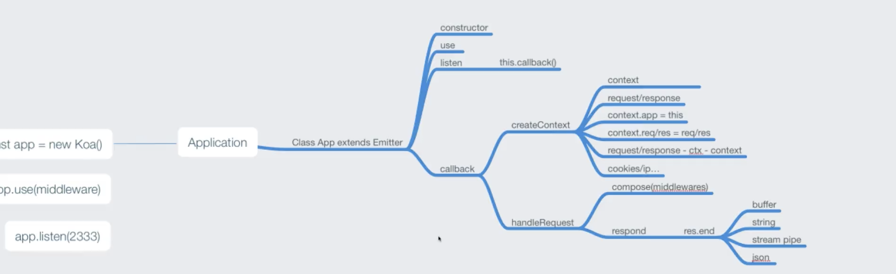

## koa2

思考？

1. 原生 http 的不足，令人困惑的 request 和 response，res.end
2. 流是个什么东西？
3. 对复杂业务的描述（流程描述，切面 aop 描述） 没有给出一些解决方法，所以才引出了 koa

对于 request 和 response 他提供了一种上下文环境 context
对于 对复杂业务的描述 他引入了 中间件的机制

概述：Koa 是一个新的 web 框架， 致力于成为 web 应用和 API 开发领域中的一个更小、更富有表现力、更
健壮的基石

特点：
轻量，无捆绑
中间件架构
优雅的 API 设计
增强的错误处理

目标: koa 的目标是用更简单化、流程化、模块化的方式实现回调部分

- [koa 入门文档](https://koa.bootcss.com/)
- [koa2 进阶学习笔记](https://chenshenhai.github.io/koa2-note/)

# koa1 和 koa2 的区别

从 generator 到 async 和 await
中间件是如何知道来的是请求还是响应呢 不需要知道 以为请求肯定比响应早处理 分界其实就是 next()

```js
var mid = function () {
  return function* (next) {
    this.body = '123';
    yield next();
  };
};
```

## 洋葱模型

1. Koa 的中间件和 Express 不同，Koa 选择了洋葱圈模型。所有的请求经过一个中间件的时候都会执行两次，Koa 的模型可以非常方便的实现后置处理逻辑。




2. 中间件
   Koa 中间件机制：Koa 中间件机制就是函数组合的概念，将一组需要顺序执行的函数复合为一个函数，外层函
   数的参数实际是内层函数的返回值。洋葱圈模型可以形象表示这种机制，是源码中的精髓和难点

3. 中间价有什么特点？

- 在中间件函数中 处理封装公共的属性和逻辑 添加方法和属性 ctx.request.body
- 决定是否向下执行，不掉用当前操作就结束了(权限校验，有权限继续向下，没有，直接返回) 也就是 提前处理请求，给 koa 提前处理静态资源
- 封装公共逻辑

````js
/**
 * 每个中间件都是 async 的格式  中间件才是把整个http在koa中的运转串起来的一个非常核心的东西
  为什么能够按照use的方式 一个一个执行 为什么可以在依次执行的过程中暂停下来 走后面的流程 再回来继续执行
  总结
  application 就是提供了一种能力 通过new的实例 传入中间件 实例端口 生成的实例 能够在nodejs能通过拿到进来的http
  逐层过中间件数组 把生成的结果交给了 处理响应函数 具体返回内容
  1.  在koa中 一切的流程 都是中间件
  2.  我们的http请求进入koa中  都会流经配置好的中间件 middleware
  3.  在中间件执行 的过程中  会通过koa-compose 把这些中间件组合在一起 一个一个的把数组中的函数依次执行
      通过一个next的回调函数 不断的将执行权向下传递
  4.  每一个中间件都会拿到请求的上下文 通过context可以访问到 req res 很多属性和方法
  5.  贯穿中间件的请求上下文 res req context 的相互引用 方便调用 还有我们的req res 专门扩展除了两个对象 并非是node原生对象

      最重要的是
      http协议 资源啊 网络通信相关的知识 前后端请求的策略设定 请求流程的性能优化 一些硬知识

  两个概念
  1. 纯函数  x->y 无副作用
  2. 伪递归

  **/

  ```js
  // 调用 递归的时候 程序会保存当前方法的调用栈 调用tail(2)的时候 必须要记录是如何调用tail(1)的
  // 这样才能在执行完tail(2)之后 返回tail(1)的下一行代码 打印一下 这个1  缺点 记录了太多的状态和堆栈深度 执行的结果就是下一次的入参
  function tail(i) {
    if (i > 3) return;
    console.log('调用前', i);
    tail(i + 1);
    console.log('调用后', i);
  }
  tail(0);

  ```
 application 就是提供了一种能力 通过new的实例 传入中间件 实例端口 生成的实例 能够在nodejs能通过拿到进来的http
 逐层过中间件数组 把生成的结果交给了 处理响应函数 具体返回内容
 http 上下文对象 context(ctx)
 1. 我们 new koa() 之后 其实并没有对网络层进行一个监听 任何的请求都没有进来 在listen之后我们会对特定的端口进行监听,到具体的某次http请求
 2. new koa -> 难理解的可能是 listen监听的回调函数 this.callback()
 3. koa在封装 application 的时候,对callback多做了一些事情
 4. callback
 * -> 1. createContext (便于我们在各个中间件或者业务处理的时候拿到进来的request请求和响应 把request 和 responese上面的所有属性都给了context)
 * -> 2. handlerequest (调用整个中间件的数组 等全部结束之后，再调用封装的res返回数据给客户端,有多种返回格式 1. buffer 2. string 3. stream pipe 4.json)
 */

## koa-compress，koa核心处理方法

koa 中间件执行顺序实现主要靠的就是源码中的 koa-compress.js。
源码分析:

```
module.exports = compose;
// 把一个个不想关的中间件串到一起
function compose(middleware) {
  // 请求进来的时候会调 handleRequest  next 钩子函数 串联下一个中间件
  return function (context, next) {
    let index = -1;
    return dispatch(0); // 执行第一个中间件
    function dispatch(i) {
      if (i <= index)
        return Promise.reject(new Error('next() called multiple times'));
      index = i;
      let fn = middleware[i];
      if (i === middleware.length) fn = next;
      if (!fn) return Promise.resolve();
      try {
        return Promise.resolve(
          fn(context, function next() {
            return dispatch(i + 1); // 中间件中执行 next()，就会转移到执行下一个中间件（尾递归）
          })
        );
      } catch (err) {
        return Promise.reject(err);
      }
    }
  };
}
````

## 源码解读

context 上下文 基础 getter setter Object.create 对象继承

```js
// 测试代码，test-getter-setter.js
const zhangli = {
  info: { a: '1231' },
  get name() {
    return this.info.a;
  },
  set name(val) {
    console.log('new val');
    this.info.a = val;
  },
};
zhangli.name = '13';
console.log(zhangli.name);
```

## context

- koa 为了能够简化 API，引入上下文 context 概念，将原始请求对象 req 和响应对象 res 封装并挂载到 context
  上，并且在 context 上设置 getter 和 setter，从而简化操作。
  app.use(ctx=>{ ctx.body = 'hehe' })

## 封装 request、response 和 context

[代码](https://github.com/koajs/koa/blob/master/lib/response.js)

```js
// request.js
module.exports = {
  get url() {
    return this.req.url;
  },
  get method() {
    return this.req.method.toLowerCase();
  },
};
// response.js
module.exports = {
  _body: undefined,
  get body() {
    return this._body;
  },
  set body(val) {
    this._body = val;
  },
};
// context.js
module.exports = {
  get url() {
    return this.request.url;
  },
  get body() {
    return this.response.body;
  },
  set body(val) {
    this.response.body = val;
  },
  get method() {
    return this.request.method;
  },
};
```

## 模拟的 kkb 可以对复杂的对象进行简单的封装

[Object.create()和 new object()和{}的区别](https://www.cnblogs.com/bug-jin/p/10388672.html)

```js
var test = Object.create({x:123,y:345});  // __proto__ 上面有{x:123,y:345}
// 对比
var test1 = new Object({x:123,y:345});  //test1.__proto__.x undefined
var test2 = {x:123,y:345}; test2.__proto__.x); //undefined
```

```js
// 构建上下文, 把res和req都挂载到ctx之上，并且在ctx.req和ctx.request.req同时保存
// 使用Object.create()是将对象继承到__proto__属性上
const http = require('http');
const context = require('./context');
const request = require('./request');
const response = require('./response');

class KKB {
  // 初始化中间件数组
  constructor() {
    this.middlewares = [];
  }
  listen(...args) {
    const server = http.createServer(async (req, res) => {
      // 创建上下文
      let ctx = this.createContext(req, res);
      // this.callback(req,res)
      // this.callback(ctx)
      // 中间件合成
      const fn = this.compose(this.middlewares);
      // 执行合成函数并传入上下文
      await fn(ctx);
      // 响应
      res.end(ctx.body);
    });
    server.listen(...args);
  }
  // use(callback) {
  //     this.callback = callback
  // }
  use(middleware) {
    // 将中间件加到数组里
    this.middlewares.push(middleware);
  }
  // 构建上下文, 把res和req都挂载到ctx之上，并且在ctx.req和ctx.request.req同时保存
  createContext(req, res) {
    //http中的req,res
    const ctx = Object.create(context);
    ctx.request = Object.create(request);
    ctx.response = Object.create(response);
    ctx.req = ctx.request.req = req;
    ctx.res = ctx.response.res = res;
    return ctx;
  }
  /**
   * 1. 默认执行第一个，然后继续执行
   * 2. 返回值进行包装 返回 Promise
   */
  async compose(ctx) {
    // 默认将 middlewares 里的第一个执行
    let index = -1;
    const dispatch = (i) => {
      let middleware = this.middlewares[i];

      if (i === index) {
        return Promise.reject(new Error('next() cb 多次调用'));
      }
      index = i; // 相当于第一次调用时候 将 index 变为 0

      // 如果执行完毕会，返回的不是 promise 进行包装
      if (i === this.middlewares.length) {
        return Promise.resolve();
      }
      // 链式调用 之后 如果用户调用了 await next()
      // 这里需要增加 错误处理 负责直接抛出 需要捕获异常
      try {
        return Promise.resolve(middleware(ctx, () => dispatch(i + 1)));
      } catch (error) {
        return Promise.reject(error);
      }
    };
    return dispatch(0); // 默认取出第一个执行
  }
  //合成函数
  compose(middlewares) {
    return function (ctx) {
      return dispatch(0);
      function dispatch(i) {
        let fn = middlewares[i];
        if (!fn) {
          return Promise.resolve();
        }
        return Promise.resolve(
          fn(ctx, function (next) {
            //执行下一个
            return dispatch(i + 1);
          })
        );
      }
    };
  }
}
module.exports = KKB;
```

# 高阶函数思想

1. 函数组合

```js
const add = (x, y) => x + y;
const square = (z) => z * z;
const fn = (x, y) => square(add(x, y));
console.log(fn(1, 2));
```

上⾯就算是两次函数组合调⽤，我们可以把他合并成⼀个函数

```js
const compose =
  (fn1, fn2) =>
  (...args) =>
    fn2(fn1(...args));
const fn = compose(add, square);
```

多个函数组合：中间件的数⽬是不固定的，我们可以⽤数组来模拟

```js
const compose =
  (...[first, ...other]) =>
  (...args) => {
    let ret = first(...args);
    other.forEach((fn) => {
      ret = fn(ret);
    });
    return ret;
  };
const fn = compose(add, square);
console.log(fn(1, 2));
```

异步中间件：上⾯的函数都是同步的，挨个遍历执⾏即可，如果是异步的函数呢，是⼀个
promise，我们要⽀持 async + await 的中间件，所以我们要等异步结束后，再执⾏下⼀个中间件。

```js
function compose(middlewares) {
  return function () {
    return dispatch(0);
    // 执⾏第0个
    function dispatch(i) {
      let fn = middlewares[i];
      if (!fn) {
        return Promise.resolve();
      }
      return Promise.resolve(
        // 执行fn 这个结果的过程中 我们要把下一个传进去
        fn(function next() {
          // promise完成后，再执⾏下⼀个
          return dispatch(i + 1);
        })
      );
    }
  };
}

async function fn1(next) {
  console.log('fn1');
  await next();
  console.log('end fn1');
}
async function fn2(next) {
  console.log('fn2');
  await delay();
  await next();
  console.log('end fn2');
}
function fn3(next) {
  console.log('fn3');
}
function delay() {
  return new Promise((reslove, reject) => {
    setTimeout(() => {
      reslove();
    }, 2000);
  });
}

const middlewares = [fn1, fn2, fn3];
const finalFn = compose(middlewares);
finalFn();
```

# 模板引擎的实现

## 基础字符串

```js
/**
 * 1. 需要用户读取html，将最终的结果用一个字符串保存起来
 * 2. 通过 new Function 的方式，将字符串变成一个函数
 * 3. with来解决取值问题
 */
function anonymous(obj) {
  let str;
  with (obj) {
    str = `<!DOCTYPE html>
    <html lang="en">
    <head>
        <meta charset="UTF-8">
        <meta name="viewport" content="width=device-width, initial-scale=1.0">
        <meta http-equiv="X-UA-Compatible" content="ie=edge">
        <title>Document</title>
    </head>
    <body>
        `;
    arr.forEach((item) => {
      str += `
            <li>123</li>
        `;
    });
    str += `
    </body>
    </html>`;
  }
  return str;
}

let r = anonymous({ arr: [1, 2, 3] });
console.log(r);

let obj = { a: 1 };
with (obj) {
  console.log(a, 'a');
}
```

## render 函数的实现

```js
let ejs = require('ejs');
let fs = require('fs');
let templateStr = fs.readFileSync('./template.html', 'utf8');
// 把<%%> 语法替换掉 ，把我们需要的内容用str拼接起来
// 实现一个with(obj);
// new Function
function render(templateStr, data) {
  let start = `let str\r\n`;
  start += `with(data){\r\n`;
  start += 'str=`';
  templateStr = templateStr.replace(/<%=([\s\S]+?)%>/g, function () {
    return '${' + arguments[1] + '}';
  });
  let content = templateStr.replace(/<%([\s\S]+?)%>/g, function () {
    return '`\r\n' + arguments[1] + '\r\nstr+=`';
  });
  let tail = '`\r\n} \r\n return str';
  // 让字符串变成函数
  let htmlStr = start + content + tail;
  return new Function('data', htmlStr)(data);
}
let r = render(templateStr, { arr: [4, 2, 3] });
console.log(r);
```

# 常见 koa 中间件的实现

函数式编程 compose 异步 compose js 中间件对比学习 express koa redux 中间件重要原理 static router

## koa 中间件的规范

- 一个 async 函数
- 接收 ctx 和 next 两个参数
- 任务结束需要执行 next

```js
const mid = async (ctx, next) => {
  // 来到中间件，洋葱圈左边
  next(); // 进入其他中间件
  // 再次来到中间件，洋葱圈右边
};
```

## 中间件常见任务

- 请求拦截
- 路由
- 日志
- 静态文件服务

## router 实现

```js
class Router {
  constructor() {
    this.stack = [];
  }
  register(path, methods, middleware) {
    let route = { path, methods, middleware };
    this.stack.push(route);
  }
  // 现在只支持get和post，其他的同理
  get(path, middleware) {
    this.register(path, 'get', middleware);
  }
  post(path, middleware) {
    this.register(path, 'post', middleware);
  }
  routes() {
    let stock = this.stack;
    return async function (ctx, next) {
      let currentPath = ctx.url;
      let route;
      for (let i = 0; i < stock.length; i++) {
        let item = stock[i];
        if (
          currentPath === item.path &&
          item.methods.indexOf(ctx.method.toLowerCase) >= 0
        ) {
          // 判断path和method
          route = item.middleware;
          break;
        }
      }
      if (typeof route === 'function') {
        route(ctx, next);
        return;
      }
      await next();
    };
  }
}
module.exports = Router;
```

## 静态文件服务 koa-static

- 配置绝对资源目录地址，默认为 static
- 获取文件或者目录信息
- 静态文件读取
- 返回

```js
// static.js
const fs = require('fs');
const path = require('path');
module.exports = (dirPath = './public') => {
  return async (ctx, next) => {
    if (ctx.url.indexOf('/public') === 0) {
      // public开头 读取文件
      const url = path.resolve(__dirname, dirPath);
      const fileBaseName = path.basename(url);
      const filepath = url + ctx.url.replace('/public', '');
      // console.log(ctx.url);
      // console.log(url);
      // console.log(filepath, fileBaseName);

      try {
        // fs.statSync(fullPath).isDirectory() 判断文件目录是否存在
        // 不建议在调用 fs.open()、 fs.readFile() 或 fs.writeFile() 之前使用 fs.exists() 检查文件是否存在
        stats = fs.statSync(filepath);
        if (stats.isDirectory()) {
          const dir = fs.readdirSync(filepath);
          // console.log(dir);  //[ 'a.html', 'index.html' ]
          const ret = ['<div style="padding-left:20px">'];
          dir.forEach((filename) => {
            // 简单认为不带小数点的格式，就是文件夹，实际应该用statSync
            if (filename.indexOf('.') > -1) {
              ret.push(
                `<p><a style="color:black" href="${ctx.url}/${filename}">${filename}</a></p>`
              );
            } else {
              // 文件
              ret.push(
                `<p><a href="${ctx.url}/${filename}">${filename}</a></p>`
              );
            }
          });
          ret.push('</div>');
          ctx.body = ret.join('');
        } else {
          console.log('文件');
          const content = fs.readFileSync(filepath);
          ctx.body = content;
        }
      } catch (e) {
        // 报错了 文件不存在
        ctx.body = '404, not found';
      }
    } else {
      // 否则不是静态资源，直接去下一个中间件
      await next();
    }
  };
};
```

# cookie 和 session

## cookie

```js
/**
 * http header 默认 4k cookie 4k
 * 浏览器localstorage (跨域吗？大小限制 5M)
 * http无状态的 cookie 做登录 / jwt json web token
 * session 是服务器上的  cookie 服务器和客户端端都能设置
 * session 是基于cookie的 （如果什么都放到cookie上 可能占用流量 需要合理设置cookie）
 1. 摘要算法：摘要算法又称哈希/散列算法。它通过一个函数，把任意长度的数据转换为一个长度固定的数据串
 （通常用16进制的字符串表示）。算法不可逆
 */
let http = require('http');
let querystring = require('querystring');
let crypto = require('crypto');
http
  .createServer(function (req, res) {
    let sign = (value) => {
      return (
        crypto
          .createHmac('sha256', 'zf')
          .update(value.toString())
          // base64字符串在传输过程中，会把/+=变成'',
          .digest('base64')
          .replace(/\/|\+|\=/, '')
      );
    };
    res.getCookie = function getCookie(key, { signedCookie }) {
      let cookies = querystring.parse(req.headers.cookie, '; ');
      if (signedCookie) {
        // 如果内容签名了 我需要核实一下内容是否可靠
        let [value, signStr] = cookies[key].split('.');
        let s = sign([value]);
        if (s === signStr) {
          return value;
        } else {
          return '';
        }
      }
      return cookies[key] || '';
    };
    let cookiesArr = [];
    res.setCookie = function (key, value, options = {}) {
      let optionArgs = [];
      if (options.domain) {
        optionArgs.push(`domain=${options.domain}`);
      }
      if (options.path) {
        optionArgs.push(`path=${options.path}`);
      }
      if (options.httpOnly) {
        optionArgs.push(`httpOnly=true`);
      }
      if (options.signedCookie) {
        value = value + '.' + sign(value); // 10.xxx
      }
      cookiesArr.push(`${key}=${value}; ${optionArgs.join('; ')}`);
      res.setHeader('Set-Cookie', cookiesArr);
    };
    // cookie不能跨域设置，携带凭证
    // 读取cookie  如果超过最大存活时间会自动销毁
    if (req.url === '/read') {
      // name=zf; age=10  => {name:zf,age:10}
      console.log(req.headers.cookie);
      let age = res.getCookie('age', { signedCookie: true });
      res.end(age.toString());
      //res.end(JSON.stringify(querystring.parse(req.headers.cookie,'; ')));
    }
    // 设置cookie
    if (req.url === '/write') {
      //www.baidu.com music.baidu.com  => .baidu.com
      // domain 只能在某个域名下设置cookie
      // path 在哪个路径下可以访问cookie ，以 / 开头表示任何路径都可以, /xxx 以xxx开头即可
      // max-age(相对时间) expires(绝对时间) 设置缓存时间
      //   res.setHeader('Set-Cookie', [
      //     'name=zf; domain=.zf.cn; max-age=10',
      //     `age=10; max-age=10; httpOnly=true; expire=${new Date(
      //       Date.now() + 10 * 1000
      //     ).toGMTString()}`,
      //   ]);
      // httpOnly 是否服务端设置就，前端不能更改，保证cookie不能再浏览器端获取，但是依然可以伪造,篡改

      //   如果不设置 domain path 每次请求都会带上cookie，增加传输流量的浪费，合理设置，减少传输
      res.setCookie('name', 'jw.zxcvzxcx', {
        httpOnly: true,
        domain: '.baidu.com',
        path: '/',
        maxAge: 10,
      }); // md5
      res.setCookie('age', 10, { signedCookie: true });
      res.end('ok');
    }
    res.end('路径有误');
  })
  .listen(3000);
// 有一个秘钥 ，这个秘钥只有我有，如果用户改了cookie
// 加盐
// let r = crypto.createHmac('sha256','zf1').update('hello').digest('base64');
// console.log(r);
```

## session

```js
/**
 * session 保证我们的cookie更加安全
   就是一个对象，保存着每次客户请求过来的信息
   借助于cookie，没有大小限制，存储于服务器中，持久化存储
   主要用于 前后端不分离，服务端渲染
 */
let http = require('http');
let querystring = require('querystring');
let uuid = require('uuid');
// 我去洗澡店消费
let session = {}; // 更安全的 可以存储用户的状态, 存在问题，服务器重启之后会信息会丢失,可以存储到redis里面
// 怎么证明是第一次来
// 我先给店铺起个名，然后发卡
let shopName = 'zl';
// 用户的信息 用户的名 做一个关联
http
  .createServer((req, res) => {
    // 可能有卡号 但是店铺黄了
    if (req.url === '/') {
      //  看用户是否有卡，卡号是否注册过
      let cardId = querystring.parse(req.headers.cookie, '; ')[shopName];
      if (cardId && session[cardId]) {
        // 第二次来
        session[cardId].mny -= 10;
        res.end('current money is ' + session[cardId].mny);
      } else {
        // 第一次
        let cardId = uuid.v4(); // 生成一个卡号
        res.setHeader('Set-Cookie', `${shopName}=${cardId}`);
        console.log('====================================');
        console.log(1);
        console.log('====================================');
        session[cardId] = { mny: 100 };
        res.end('weclome current money is ' + session[cardId].mny);
      }
    }
  })
  .listen(3003);
```

## session 在 koa 中的应用

```js
let Koa = require('koa');
let Router = require('koa-router');
let bodyparser = require('koa-bodyparser');
let views = require('koa-views');
let session = require('koa-session');
let app = new Koa();
let router = new Router();
app.keys = ['zf'];
app.use(
  session(
    {
      // 续命 访问淘宝 30分钟之内一直访问
      expires: new Date(Date.now() + 10000),
    },
    app
  )
);
app.use(
  views(__dirname + '/views', {
    map: {
      html: 'ejs',
    },
  })
);
router.get('/', async (ctx) => {
  await ctx.render('home.html');
});
router.post('/login', async (ctx) => {
  let { username, password } = ctx.request.body;
  if (username === '1' && password === '1') {
    // 表示用户登陆成功了 存到session
    ctx.session.user = { username };
    ctx.redirect('/list');
  } else {
    ctx.redirect('/');
  }
});
router.get('/list', async (ctx) => {
  // 如果当前访问的这个请求里 可以拿到session 就表示登陆过
  let username = ctx.session.user || {};
  console.log(ctx.session);
  if (username) {
    console.log(username);
    await ctx.render('list.html', { username });
  } else {
    ctx.redirect('/');
  }
});
app.use(bodyparser()); // 支持 json  表单 不支持文件上传 koa-multer
app.use(router.routes());
app.listen(3003);
// session 基于cookie 跨域
// 第一次客户端访问服务器（登陆）
// 服务器将要返回的内容 {username:xxxx} 并且在加一个签名返还给客户端
// 返还的结果是 内容+签名
// 你在次访问服务器 我同构签名校验一下内容，如果都没问题，我可以认为你有登陆的权限
// 服务器不需要存储用户的状态，并且可以无限扩展
```

# JWT 包含了使用`.`分隔的三部分

- Header 头部

  ```
  { "alg": "HS256", "typ": "JWT"}
  // 表示使用算算法 algorithm => HMAC SHA256
  // 类型 - type => JWT
  ```

- Payload 负载、载荷(比如，谁给的令牌，下面的这些内容)

  ```
  JWT 规定了7个官方字段
  iss (issuer)：签发人
  exp (expiration time)：过期时间
  sub (subject)：主题
  aud (audience)：受众
  nbf (Not Before)：生效时间
  iat (Issued At)：签发时间
  jti (JWT ID)：编号
  ```

- Signature 签名

  对前两部分的签名，防止数据篡改

  ```javascript
  HMACSHA256(base64UrlEncode(header) + '.' + base64UrlEncode(payload), secret);
  ```

JWT 作为一个令牌（token），有些场合可能会放到 URL（比如 api.example.com/?token=xxx）。Base64 有三个字符`+`、`/`和`=`，在 URL 里面有特殊含义，所以要被替换掉：`=`被省略、`+`替换成`-`，`/`替换成`_` 。这就是 Base64URL 算法。

## 使用方式

HTTP 请求的头信息`Authorization`字段里面

```
Authorization: Bearer <token>
```

通过 url 传输

```
http://www.xxx.com/pwa?token=xxxxx
```

如果是 post 请求也可以放在请求体中

## 实际应用+实现

```javascript
// 实现一个登陆功能
// 实现一个校验是否登陆
let Koa = require('koa');
let Router = require('koa-router');
let bodyparser = require('koa-bodyparser');
let jwt = require('jwt-simple');
let app = new Koa();
let router = new Router();
app.use(bodyparser());
let crypto = require('crypto');
let MyJwt = {
  // base 去掉 + / =
  escape(content) {
    return content.replace(/\+/g, '-').replace(/\//g, '_').replace(/\=/g, '');
  },
  fromStringToBase64(content) {
    return this.escape(Buffer.from(JSON.stringify(content)).toString('base64'));
  },
  unescape(str) {
    str += new Array(5 - (str.length % 4)).join('=');
    return str.replace(/\-/g, '+').replace(/_/g, '/');
  },
  sign(content, secret) {
    return this.escape(
      crypto.createHmac('sha256', secret).update(content).digest('base64')
    );
  },
  encode(content, secret) {
    // eyJ0eXAiOiJKV1QiLCJhbGciOiJIUzI1NiJ9.eyJ1c2VyIjoiMSIsImV4cHIiOiJTdW4s
    // IDEwIE9jdCAyMDIxIDA3OjQwOjAwIEdNVCJ9.SDU75rh71RNUB75VJ_BGU5y0ab3Qt4EAlap4C_e9QGI"
    // header +'.'+payload  = sha256加密出来一个sign
    // header + '.' + payload + '.' + sign
    // 将header转成base64
    let header = this.fromStringToBase64({ typ: 'JWT', alg: 'HS256' }); // 固定死的，这两个参数
    // 将payload转成base64 payload还是明文，还是可以解码出来的，不能存储铭感信息
    let body = this.fromStringToBase64(content);
    // 将header和payload组合到一起，一起签名
    let sign = this.sign(header + '.' + body, secret);
    // 散步分放在一起就是最终的结果
    return header + '.' + body + '.' + sign;
  },
  fromBase64ToString(content) {
    return Buffer.from(content, 'base64').toString();
  },
  decode(content, secret) {
    let [header, body, sign] = content.split('.');
    let newSign = this.sign(header + '.' + body, secret);
    if (newSign === sign) {
      let content = this.fromBase64ToString(this.unescape(body));
      content = JSON.parse(content);
      console.log(new Date(content.expr), Date.now());
      if (content.expr && new Date(content.expr) < Date.now()) {
        throw new Error('过期了');
      }
      return content;
    } else {
      throw new Error('token错误');
    }
  },
};
// jwtwebtoken  jwt-simple
let secret = 'zf';
router.post('/login', async (ctx) => {
  // 当访问登陆的时候
  let { username, password } = ctx.request.body;
  console.log(username, password);
  if (username === password) {
    // 登陆过了 需要给他发一个token
    // 加入一个过期的字段 如果超过这个事件当前token就过期了
    let content = {
      user: username,
      expr: new Date(Date.now() + 20 * 1000).toGMTString(),
    };
    console.log(content);

    // decode校验签名正确性包括解析内容 encode签名
    let token = jwt.encode(content, secret);
    ctx.body = {
      code: 200,
      content,
      token,
    };
  } else {
    // ctx.status = 401; // 需要前端配合
    ctx.body = {
      code: 401,
      data: '登陆失败',
    };
  }
});
router.get('/validate', async (ctx) => {
  // 校验内容是否合法
  let [, token] = ctx.get('authorization').split(' ');
  if (token) {
    try {
      let content = MyJwt.decode(token, secret); // 把默认的内容取出来
      // 续命 继续验证增加登陆的时长
      content = {
        ...content,
        expr: new Date(Date.now() + 10 * 10000).toGMTString(),
      };
      token = MyJwt.encode(content, secret);
      ctx.body = {
        code: 200,
        content,
        token,
      };
    } catch (e) {
      console.log(e);
      ctx.body = {
        code: 401,
        data: '没有登陆',
      };
    }
  } else {
    ctx.body = {
      code: 401,
      data: '没有登陆',
    };
  }
});
app.use(router.routes());
app.listen(3003);
```

# express 原理

```js
const http = require('http');
const slice = Array.prototype.slice;

class LikeExpress {
  constructor() {
    // 存放中间件列表 all 通过user注册的中间件  get 通过get注册的  post 通过post注册的
    this.routes = {
      all: [], // app.use(...)
      post: [], // app.post(...)
      get: [], // app.get(...)
    };
  }
  //通用注册方法
  register(path) {
    const info = {};
    if (typeof path === 'string') {
      info.path = path;
      // 从第二个参数开始 转化为数组 存入stack
      info.stack = slice.call(arguments, 1);
    } else {
      // 第一个参数没有  相当于我们访问 '/' 跟路径
      info.path = '/';
      // 从第一个参数开始 转化为数组 存入stack
      info.stack = slice.call(arguments, 0);
    }
    return info;
  }
  use() {
    // 通过  apply将当前函数所有的参数 传入 register 中
    const info = this.register.apply(this, arguments);
    this.routes.all.push(info);
  }
  get() {
    const info = this.register.apply(this, arguments);
    this.routes.get.push(info);
  }
  post() {
    const info = this.register.apply(this, arguments);
    this.routes.post.push(info);
  }
  match(url, method) {
    let stack = [];
    if (url === '/favicon.ico') {
      return stack;
    }
    // 获取 routes 把能访问的我们集中起来
    let crueRoutes = [];
    crueRoutes = crueRoutes.concat(this.routes.all);
    crueRoutes = crueRoutes.concat(this.routes[method]);
    // console.log(crueRoutes,crueRoutes.length);
    crueRoutes.forEach((routeInfo) => {
      if (url.indexOf(routeInfo.path) === 0) {
        // url === '/api/getcookie'  且 routeInfo.path === '/'
        // url === '/api/getcookie'  且 routeInfo.path === '/api'
        // url === '/api/getcookie'  且 routeInfo.path === '/api/getcookie'
        stack = stack.concat(routeInfo.stack);
      }
    });
    return stack;
  }
  // 核心的 next机制
  handle(req, res, stack) {
    const next = () => {
      //拿到第一个匹配的中间件
      const middleWare = stack.shift();
      if (middleWare) {
        // 执行中间件函数
        middleWare(req, res, next);
      }
    };
    next();
  }
  callback() {
    return (req, res) => {
      res.json = (data) => {
        res.setHeader('Content-type', 'application/json');
        res.end(JSON.stringify(data));
      };
      const url = req.url;
      const method = req.method.toLowerCase();

      // 区分 哪些中间件访问 哪些不访问
      const resultList = this.match(url, method);
      // 再去执行 handle 处理这些函数的执行
      this.handle(req, res, resultList);
    };
  }
  listen(...args) {
    const server = http.createServer(this.callback());
    server.listen(...args);
  }
}
// 工厂函数
module.exports = () => {
  return new LikeExpress();
};
```
