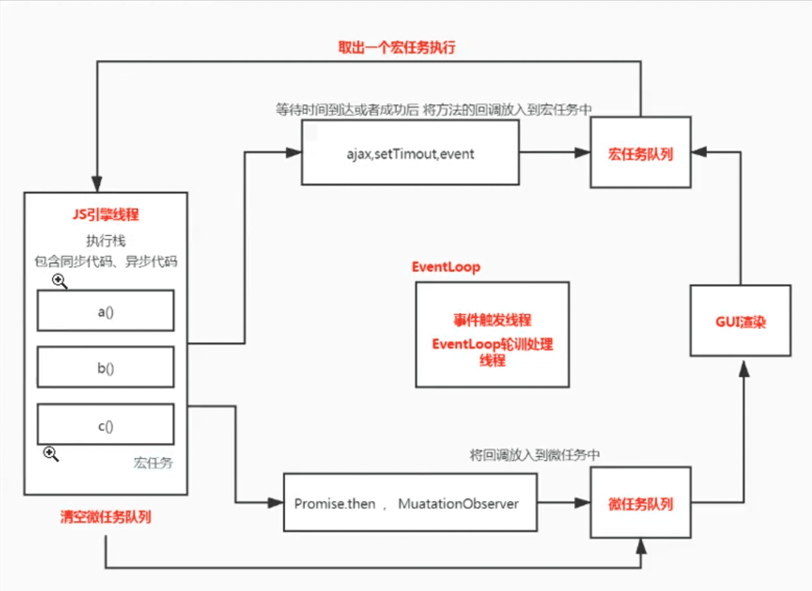

## 高阶函数

```js
/*
 * 高阶函数 两个特点满足其中一个即可
 * 1.如果一个函数的参数中有函数，那么当前这个函数就是高阶函数(回调)
 * 2.如果一个函数返回了一个函数，那么当前这个函数就是高阶函数
 *
 * 通过函数取学习我们的设计模式 promise
 * 参数值是函数  返回值是函数 满足一个即可
 * 通过函数取学习我们的设计模式 promise，参数值是函数 返回值是函数 满足一个即可
 * 写代码时我们不破话原有逻辑而增加一些功能， 就有了 对函数进行保证(装饰) 切片编程(把核心抽离出来) 包装上自己的内容 AOP
 * */

//核心业务代码 希望在调用say方法之前做一些事情，拓展一些功能
function say(a, b, c, d) {
  console.log('说话', a, b, c, d);
}

//拓展方法
//当前实例都可以调用所属类原型上的方法
//this指向  谁调用this就指向谁 拓展运算符  实现after函数

Function.prototype.before = function (callback) {
  // 高阶函数
  //this -> say 谁调用了 before
  //箭头函数的特点 没有this  没有arguments 没有prototype 不能new
  //剩余运算符 可以把所有参数组成一个数组列表
  return (...args) => {
    // console.log(args) [1,2,3,4]
    callback();
    this(...args); //apply 将参数展开一次传入
  };
};
let newSay = say.before(() => {
  console.log('说话前');
});
newSay(1, 2, 3, 4);
```

## 函数科里化

```js
// 函数科里化 - 比如 判断一个元素的类型、数组、对象
/*
 * 1.typeof 不能区分对象和数组
 * 2.constructor 可以判断这个实例是通过谁构造出来的 无法区分到底属于谁
 * 3.instanceof 可以区分实例
 * 4.Object.prototype.toString.call([]) 区分具体的类型 不能区分实例
 * */
function isType(content, typing) {
  return Object.prototype.toString.call(content) === `[object ${typing}]`;
}

function typeOf(value) {
  const objToStr = Object.prototype.toString
  return objToStr.call(value).slice(8,-1).toLowerCase()
}

console.log(isType('123', 'String')); //true
console.log(isType(123, 'Number')); //true

// 什么叫函数科里化呢? 就是细化函数的功能 ，把一个函数的范围变小 让其变得具体一点
// 内置参数 isNumber  isString
function isType(typing) {
  // 私有化，这个函数可以拿到上层函数的参数，这个空间不会被释放掉，这个闭包并没有在当前作用域被执行，
  // 而是在外层被调用，那这个函数的外层作用域是不会被销毁的
  return (content) => {
    //
    return Object.prototype.toString.call(content) === `[object ${typing}]`;
  };
}
const isString = isType('String');
let flag = isString('aaa');
console.log(flag);

const isType = (typing) => (value) => {
  return Object.prototype.toString.call(value) === `[object ${typing}]`;
};
let util = {};
['String', 'Number', 'Null', 'Undefined'].forEach((typing) => {
  util['is' + typing] = isType(typing);
});
console.log(util.isString(123)); //false
console.log(util.isString('123')); //true

//通用的函数科里化如何实现？ 希望可以分开传递参数
function sum(a, b, c, d, e) {
  console.log(a + b + c + d + e);
}
/**
 * 希望 sum(1)(2,3)(4)(5)
 * 创建的时候也可以先保留两个参数，返回一个被科里化后的结果  curring(sum(1,2)) | curring(sum)(1)(2) 之后传参  curring(sum(1,2))(3)(4)
 * 通过 curring(sum(1,2))
 */

const curring = (fn, arr = []) => {
  // arr 第一次传的是默认值
  // 记录调用时参数的个数 和函数个体的关系  长度指代的是函数的参数个数
  let len = fn.length;
  console.log(len, 'len');
  return (...args) => {
    // 科里化完传几个参数是不确定的，当数量=函数参数个数的时候，再让sum当前函数执行
    //保存用户传入的参数
    let concatArgs = [...arr, ...args];
    console.log(concatArgs, 'concatArgs');
    // 获取长度和值得关系 通过传递的参数 不停的判断是否达到函数执行的参数个数
    // 如果参数个数不满足调用函数的参数个数，再返回一个函数，等待参数传入
    if (concatArgs.length < len) {
      //递归
      // console.log(args,'hello')
      return curring(fn, concatArgs);
    } else {
      // console.log(args)
      return fn(...concatArgs); // 如果达到了执行个数之后 会让函数执行
    }
  };
};

let newSum = curring(sum);
newSum(1, 2)(3)(4)(5); // 15

// 应用场景
const isType = (type, content) => {
  // console.log(type, content);
  return Object.prototype.toString.call(content) === `[object ${type}]`;
};
let util = {};
['String', 'Number', 'Null', 'Undefined', 'Boolean'].forEach((item) => {
  // 相当于将函数 先调用一次
  util['is' + item] = curring(isType)(item);
});
console.log(util.isString('hello'));
console.log(util.isNumber(1));
```

## 异步并发问题，after 的实现

```js
/**
 * after 类比 lodash 的 after
 * 比如 我们希望我调用某个函数三次之后再去执行
 * 解决异步并发问题(比如同时去读取文件，完成的时间不确定) 比如同时发送多个请求，拿到所有结果之后再去渲染页面
 * 并发操作 - 两个操作互不影响
 * 核心主要依赖计数器去实现 完成--  等这些个请求完成了 执行操作
 */
const fs = require('fs');
function after(times, callback) {
  let school = {};
  return function out(key, value) {
    school[key] = value;
    if (--times === 0) {
      callback(school);
    }
  };
}
let out = after(1, (school) => {
  console.log(school, 'school');
});
fs.readFile('./a.text', 'utf-8', function (err, data) {
  // console.log(data)
  out('name', data);
});
fs.readFile('./a.text', 'utf-8', function (err, data) {
  // console.log(data)
  out('age', data);
});
//上面的after只能接受一个回调 修改 接受多个  - 发布订阅
```
## 发布订阅模式和观察者模式的区别


## 发布订阅模式

```js
/**
 * 使用发布 订阅模式 实现上面的效果 也就是等两件事都做完了再去做别的
 * 订阅 就是先将要做的事情储存好  稍后发布的时候让订阅好的事情一次执行
 *
 * 思考？ 观察者模式和发布订阅 之间有什么关系？
 */
let fs = require('fs');
// 发布和订阅没有 任何的关系 订阅的时候会找第三方托管给你，发布的时候会让第三方依次执行
let event = {
  _arr: [],
  on(fn) {
    //订阅
    this._arr.push(fn);
  },
  off() {
    // 发布
    this._arr.forEach((fn) => fn());
  },
};
let obj = {};
event.on(function () {
  //计划1  先订阅 再触发 订阅和发布之间没有关联  用来解耦操作
  console.log('数据来了');
});
event.on(function () {
  if (Object.keys(obj).length === 2) {
    console.log(obj);
  }
});
// node中异步方法  都有回调 可以热内他是一个高阶函数  并发的  同时去读取文件  读取完毕的时间不一样
fs.readFile('./name.txt', 'utf-8', (err, data) => {
  obj.name = data;
  event.off(); //发布
});
fs.readFile('./age.txt', 'utf-8', (err, data) => {
  obj.age = data;
  event.off();
});
```

## 观察者模式

```js
/**
 * 观察者模式 (基于发布订阅模式，而且观察者模式和发布订阅模式之间是有关联的) 两者没有直接关联
 * 观察者  被观察者 (被观察者需要收集所有的观察者)  把观察者放到被观察者中 小宝宝不开心->通知爸爸妈妈
 */
class Subject {
  //被观察者 小宝宝
  constructor(name) {
    this.name = name;
    this.observers = [];
    this.state = '开心';
  }
  // 注册观察者 基于发布订阅 存起来
  attach(o) {
    this.observers.push(o);
  }
  setState(newState) {
    this.state = newState;
    // 通知观察者我的状态发生了变化
    this.observers.forEach((o) => o.update(this));
  }
}

class Observer {
  //观察者 我
  constructor(name) {
    this.name = name;
  }
  update(baby) {
    // console.log(baby)
    console.log(this.name + '知道了' + baby.name + '状态' + baby.state);
  }
}
let baby = new Subject('宝宝');
let o1 = new Observer('爸爸');
let o2 = new Observer('妈妈');
//注册关系  把观察者 attach 注册进去 需要让观察者和被观察者产生管理
baby.attach(o1);
baby.attach(o2);
baby.setState('不开心'); // on emit
baby.setState('开心');
```

# EventEmitter 的实现

```js
/**
 * 事件模块 events 发布订阅 订阅(多个) 发布（触发n次）
 * 核心模块  首先看是不是核心模块
 * 第三方模块查找策略 - 默认查找 node_modules 文件，找同名的文件夹，默认找的是index.js
 * 如果当前目录下，没有 node_modules 回向上级查找，一直找到根目录，找不到报错
 */

// const EventEmitter = require('events')
const EventEmitter = require('./4.EventEmitter')
const util = require('util')
// let events = new EventEmitter()
// class Girl extends EventEmitter {}
function Girl () {

}

// 三种继承方式
// Girl.prototype.__proto__ = EventEmitter.prototype
// Girl.prototype = Object.create(EventEmitter.prototype)
// Object.setPrototypeOf(Girl.prototype, EventEmitter.prototype)

util.inherits(Girl, EventEmitter)
let girl = new Girl()

let cry = (who) => {
  console.log('cry' + who)
}

let eat = (who) => {
  console.log('eat' + who)
}

girl.once('data', cry)
girl.once('data', eat)
girl.emit('data', '我')
// 手动移除很麻烦
// girl.off('data',cry)
// girl.off('data',eat)

girl.emit('data', '我')
girl.emit('data', '我')
----------------------------- 实现 -----------
/**
 * 实现 on emit off once newListener 方法
 * 维护数据  {'女生失恋事件':[fn1,fn2]} 维护到 EventEmitter 当前实例上
 */

function EventEmitter () {
  this._events = Object.create(null)
}

// 订阅
EventEmitter.prototype.on = function (eventName, callback) {
  // 实例没有 _events 属性，先创建
  if (!this._events) this._events = Object.create(null)
  // 如果用户绑定的不是newListener 让newListener的回调函数执行
  if(eventName !== 'newListener'){
    if(this._events['newListener']){
      this._events['newListener'].forEach(fn=>fn(eventName))
    }
  }
  // 如果不存在这个事件，就绑定一个数组
  if (this._events[eventName]) {
    this._events[eventName].push(callback)
  } else {
    // 如果存在，将事件push进去
    this._events[eventName] = [callback] //  {newListener:[fn1]}
  }
}

EventEmitter.prototype.emit = function (eventName, ...args) {
  // 一次触发对应的事件
  if (this._events[eventName]) {
    this._events[eventName].forEach(fn => {
      fn.call(this, ...args)
    })
  }
}

EventEmitter.prototype.off = function (eventName, callback) {
  if (this._events[eventName]) {
    this._events[eventName] = this._events[eventName].filter(fn => {
      // 既不能函数相等 也不能 这个函数的l 和 callback 是一样的
      return fn !== callback && fn.l !== callback
    })
  }
}

// 和vue的click.once很类似
EventEmitter.prototype.once = function (eventName, callback) {
  // 执行一次 之后删掉这个函数 先绑定，再删除
  let one = (...args) => {
    // 删除掉这个函数
    callback.call(this, ...args)
    this.off(eventName, one)
  }
  // 我们之间删 绑定的是 one 函数，删除的是eat，增加属性使之产生关联
  one.l = callback
  // 切片编程 先绑定一个once函数，等待emit触发完后执行one函数 ，执行原有的逻辑，执行后删除once函数
  this.on(eventName, one)  // 执行完后在删除掉
}
module.exports = EventEmitter
```

# Promise

## 什么是 Promise

什么是 Promise？ 解决了哪些问题？(还是基于回调的方式) - 文档 promise A+ 规范 核心 三个状态

- 回调地狱 (错误捕获不好处理错误)
- 多个请求的并发问题 (all)

1. executor - 在 new Promise 的时候，是需要传递一个执行器函数,这个函数会默认立即执行，重要
2. 每个 promise 有三个状态 默认 promise 的状态是 等待态 pending fulfilled 成功态 rejected 失败态
3. 默认创建一个 Promise 是等待态,默认提供两个函数 resolve 让 Promise 变为成功态， reject 让 Promise 变为失败态
4. 每个 Promise 实例都具备一个 then 方法，then 方法中需要传递两个参数，分别是成功对应的回调和失败对应的回调函数
5. 如何让 promise 变成失败态 a.异常抛出就走失败逻辑/是失败态 b. reject('xxx')
6. 如果多次调用成功或者失败,默认会采取第一次调用的结果 如果状态变化后就不能再修改状态

## 三种状态

````js
- pending 在过程中
- resolved
- rejected

画图表示转换关系，以及转换不可逆
pending-> resolved success
pending -> rejected fail

```js
// 刚定义时，状态默认为 pending
const p1 = new Promise((resolve, reject) => {});

// 执行 resolve() 后，状态变成 resolved
const p2 = new Promise((resolve, reject) => {
  setTimeout(() => {
    resolve();
  });
});

// 执行 reject() 后，状态变成 rejected
const p3 = new Promise((resolve, reject) => {
  console.log('p3');
  setTimeout(() => {
    reject();
  });
});
console.log('p3', p3);
// p3 p3 Promise {<pending>}
````

```js
// 直接返回一个 resolved 状态
Promise.resolve(100);
// 直接返回一个 rejected 状态
Promise.reject('some error');
```

## 代码实现

```js
const ENUM = {
  PENDING: 'pending',
  FULFILLED: 'fulfilled',
  REJECTED: 'rejected',
};

/**
 * 处理 x 方法的返回结果的状态，判断x到底是 普通值 还是 promise，x的值决定了promise2的成功还是失败
 * @param {*} promise2
 * @param {*} x
 * @param {*} resolve
 * @param {*} reject
 * @returns  返还的新的 promise x是then中的返回值
 */
function resolvePromise(promise2, x, resolve, reject) {
  // 看看 这个 promise2 是成功还是失败
  // 如果x是常量 正常走 如果是promise 我们判断状态 成功 resolve 失败 reject 所以说x决定了当前promise的结果

  // 判断 可能你的promise要和别人的promise进行混用
  // 可能不同的promise库之间会进行调用，需要兼容性操作
  // 如果 promise2和x是同一个类型 或者引用值 就该让 promise2 变成失败态
  if (promise2 === x) {
    // x如果和promise2是同一个人 x永远不能成功或者失败,所以就卡住了，直接报错
    console.log('xxx');
    // return reject('123')
    return reject(
      new TypeError(`Chaining cycle detected for promise #<Promise>]`)
    );
  }
  //----  我们需要判断x的状态 判断x 是不是promise---
  // ？ 如何判断一个值是不是  promise 呢？ 先判断他是不是对象或者函数
  // 我们原生的 promise 是一个对象  别人实现的promise可能是一个函数

  if ((typeof x === 'object' && x !== null) || typeof x === 'function') {
    // 如果是一个promise,我们取一下他的then方法 但是 有可能会抛出异常
    // 因为使用 defineProperty 定义的，需要条件处理,看类型错误demo
    // 防止一个promise 既调成功又调失败
    // 为了考虑别人的promise不健壮 我们需要自己去调整判断 如果调用失败不能成功 调用成功不能失败 不能多次调用成功或者失败
    let called;
    try {
      let then = x.then;
      if (typeof then === 'function') {
        //  判断then是不是一个函数 如果then不是一个函数 说明不是 promise 可能是个对象，比如 x={then:'123'}
        //  只能认准他是一个promise了
        then.call(
          x,
          (y) => {
            if (called) return;
            called = true;
            // 如果我们的y还是一个promise的话 继续解析
            resolvePromise(promise2, y, resolve, reject);
          },
          (e) => {
            if (called) return;
            called = true;
            reject(e);
          }
        );
        //  为什么不用这种写法呢  是因为会再次取then方法   x.then(()=>{},()=>{}) 可能会报错
      } else {
        // x = {then: '12'} 普通值
        resolve(x);
      }
    } catch (e) {
      if (called) return;
      called = true;
      reject(e);
    }
  } else {
    resolve(x); // 肯定不是promise 直接成功
  }
}

class Promise {
  // constructor 等价于 我们以前写的那种函数 function Promise
  constructor(executor) {
    //executor 默认传入 一开始就执行 默认是 pending
    this.state = ENUM.PENDING;
    // 如果是等待状态 可以更改状态
    this.value = undefined;
    this.reason = undefined;

    this.onResolvedCallbacks = []; //存储成功的的所有的回调 只有pending的时候才存储
    this.onRejectedCallbacks = []; //存储失败的的所有的回调
    const resolve = (value) => {
      // 考虑传递进来的值还是 promise，直到解析出来的值是一个普通值
      if (value instanceof Promise) {
        return value.then(resolve, reject);
      }
      // 只有状态是 pending 才能改变状态
      if (this.state === ENUM.PENDING) {
        this.value = value;
        this.state = ENUM.FULFILLED;
        this.onResolvedCallbacks.forEach((fn) => fn());
      }
    };
    const reject = (reason) => {
      if (this.state === ENUM.PENDING) {
        this.reason = reason;
        this.state = ENUM.REJECTED;
        this.onRejectedCallbacks.forEach((fn) => fn());
      }
    };
    // 我们的 try catch 只能捕获同步的异常 我们在then中加了定时器，里面的异常就捕获不到了，单独捕获
    try {
      executor(resolve, reject);
    } catch (e) {
      // 标识当前有异常  那就使当前的异常作为失败的原因
      reject(e);
    }
  }

  // 只要x是一个普通值，就会让下一个promise变成成功态，调用p2的resolve将值传递下去
  // x 有可能是一个promise
  then(onFulfilled, onRejected) {
    // 默认看一下状态  调用对应的函数
    // console.log(onFulfilled, onRejected)
    // 可选参数的处理,如果then的data没有写返回值，给一个默认函数，默认向下传递，我们返回一个默认值 (val) => val
    onFulfilled =
      typeof onFulfilled === 'function' ? onFulfilled : (val) => val;
    onRejected =
      typeof onRejected === 'function'
        ? onRejected
        : (err) => {
            throw err;
          };
    // 我们要拿到成功的或者失败的返回结果 看看这个结果是什么类型？
    let promise2;
    promise2 = new Promise((resolve, reject) => {
      if (this.state === ENUM.FULFILLED) {
        setTimeout(() => {
          try {
            //调用当前then方法的结果，来判断当前这个promise2是成功还是失败
            let x = onFulfilled(this.value);
            // 解析x值    x 是普通 还是 promise 只要x是一个普通值 就会让下一个promise变成成功态
            // 如何将data向下传递？ 我们要传递给下一个then的data 就是调用resolve方法
            // 如果 是一个promise呢
            // 关键是我 promise的时候 promise2还没产生呢 我们希望new结束之后把
            // promise2传递给我们的处理函数 加一个 定时器
            resolvePromise(promise2, x, resolve, reject);
          } catch (e) {
            reject(e);
          }
        }, 0);
      }
      if (this.state === ENUM.REJECTED) {
        setTimeout(() => {
          try {
            let x = onRejected(this.reason);
            resolvePromise(promise2, x, resolve, reject);
          } catch (e) {
            // console.log(e)
            reject(e);
          }
        }, 0);
      }
      if (this.state === ENUM.PENDING) {
        // console.log('pending state')
        // 等会成功的时候 再让他执行 分别将成功和失败的回调存起来
        this.onResolvedCallbacks.push(() => {
          setTimeout(() => {
            try {
              let x = onFulfilled(this.value);
              resolvePromise(promise2, x, resolve, reject);
            } catch (e) {
              // console.log(e)
              reject(e);
            }
          }, 0);
        });
        this.onRejectedCallbacks.push(() => {
          setTimeout(() => {
            try {
              let x = onRejected(this.reason);
              resolvePromise(promise2, x, resolve, reject);
            } catch (e) {
              console.log(e);
              reject(e);
            }
          }, 0);
        });
      }
    });
    return promise2;
  }

  // promise中的catch指代的就是then中没有成功回调的一个别名而已
  catch(callback) {
    //就是一个成功的then
    return this.then(null, callback);
  }

  static resolve(value) {
    return new Promise((resolve, reject) => {
      resolve(value);
    });
  }
  static reject(err) {
    return new Promise((resolve, reject) => {
      reject(err);
    });
  }
}
/**
 * 静态方法
 * 测试脚本也是去测试dfd上面的对象的 resolve和reject方法，如果通过了，说明这个promise可用
 * @returns
 */
Promise.deferred = function () {
  let dfd = {};
  dfd.promise = new Promise((resolve, reject) => {
    dfd.resolve = resolve;
    dfd.reject = reject;
  });
  return dfd;
};

module.exports = Promise;
```

## 链式调用 - 传值穿透

```js
/**
  promise的链式调用的实现 靠的不是this 靠的是返回一个promise
  promise必须返回一个全新的promise,这样可以解决promise的状态问题
  否则可能出现promise刚开始成功，又变成了失败态
 */

let Promise = require('./promise');
let promise = new Promise((resolve, reject) => {
  resolve('hello');
});

let promise2 = promise.then((data) => {
  // 如何将data向下传递？ 我们要传递给下一个then的data 就是调用p2的resolve方法
  // 返回一个普通值
  // return data
  // 返回一个promise

  // return promise2  // 报错就好了 对应 promise2 =x的判断
  return new Promise((resolve, reject) => {
    //返回去的y又是一个promise 继续解析
    resolve(
      new Promise((resolve, reject) => {
        setTimeout(() => {
          resolve('hello 12312');
        }, 1000);
      })
    );
  });
});
promise2.then(
  (data) => {
    console.log(data, 'zl');
  },
  (err) => {
    console.log(err, 'err');
  }
);
// 穿透 不写我们默认把值传递下去 return data
promise2
  .then(null)
  .then()
  .then()
  .then((data) => {
    console.log(data);
  });
//
// Object.defineProperty(x, 'then', {
//   get () {
//     // 有抛出异常的逻辑
//     throw new Error()
//   }
// })
```

## 类型错误

```js
const Promise = require('./promise');
let promise = new Promise((resolve, reject) => {
  resolve();
});
// 我们的 Promise2和x是同一个值，要去判断，这个操作不可能发生，抛出一个类型错误，死循环了
let promise2 = promise.then(() => {
  return promise2;
});
promise2.then(
  () => {},
  (err) => {
    console.log(err);
  }
);
// Object.defineProperty(x, 'then', {
//   get() {
//     // 某种条件不满足会抛出错误
//     throw new Error('xxx');
//   },
// });
```

## then 和 catch 返回值问题

```js
const fs = require('fs');
function read(filePath) {
  return new Promise((resolve, reject) => {
    // fs.readFile(filePath, 'utf8', (err, data) => {
    //   if (err) return reject(err)
    //   resolve(data)
    // })

    resolve(1); //返回成功的情况
    // reject() // then的第二个参数返回100 走下一个then的正确
  });
}

/*
 * promise的链式调用 (如果是一个promise 就不是普通值) 

 * 成功的回调和失败的回调都可以返回一个结果
 * 1. 如果返回的是一个promise ，那么会让这个promise执行，并且采用他的状态，将成功或者失败的结果传递给外层下一个then中
 * 2. 如果返回的是一个普通值，会把这个值作为外层的下一次then的成功的回调中
 * 3. 如何让一个promise变成失败态？抛出一个错误或者返回一个reject态的promise
 *
 * 如果then方法中的成功或者失败 执行的时候发生错误 会走下一个then中的失败回调
 * 如果then方法返回了一个失败的promise 会走外层then的失败回调 其他都走成功
 * */

read('./name.txt')
  .then((data) => {
    // return 100
    // throw new Error('i am error')
    return new Promise((resolve, reject) => {
      reject('err');
    });
  })
  .catch((err) => {
    // catch就是一个语法糖，和下面的then正常写法效果一样
    return 100;
  })
  // .then(
  //   (data) => {
  //     console.log(data, 'data');
  //   },
  //   (err) => {
  //     return 100;
  //   }
  // )
  .then(
    (data) => {
      console.log(data, '我是失败的回调中返回的值');
      throw new Error('抛出异常 , 我希望这个then走到下一次then的失败');
    },
    (err) => {
      console.log(err);
    }
  )
  .then(null, (err) => {
    console.log(err, '下一次then的失败123123');
    throw new Error('我返回错误了，catch去接受');
    // return 100
  })
  .catch((err) => {
    // catch 就是 then 的别名，没有成功的then 只要上面没有捕获错误就会执行catch，
    // 如果第二个参数捕获了错误，就不会走到catch中了
    console.log(err, 'catch');
    //  catch返回了默认值 undefined的 又回到了第二种情况 走到下一个then中
  })
  .then((data) => {
    console.log(data, '最后一个then');
  });
```

## 产生一个延迟对象，减少嵌套

```js
// 返回值是promise，递归处理
let Promise = require('./promise');
// Q.deferred 可以帮我们 产生一个延迟对象
function read() {
  const dfd = Promise.deferred(); // promise为了解决嵌套问题
  fs.readFile('./na1me.txt', 'utf-8', (err, data) => {
    if (err) {
      dfd.reject(err);
    }
    dfd.resolve(data);
  });
  return dfd.promise;
}

// promise 中的 catch 指代的就是 then没有成功回调的一个别名而已
// read().then(null, (err) => {
//   console.log(err, 'tet')
// })
read().catch((err) => {
  console.log(err, '捕捉错误');
});
```

## resolve 中还是传递 promise

```js
let Promise = require('./promise');

let p = new Promise((resolve, reject) => {
  resolve(
    new Promise((resolve, reject) => {
      setTimeout(() => {
        resolve('hello');
      }, 0);
    })
  );
});
p.then((data) => {
  console.log(data);
});
```

## Promise.all

```js
/**
 * 类的静态方法
 * Promise.all 表示等待所有的promise全部成功后，才执行回调，如果有一个promise失败了，则失败
 * 1. 我们可以将 node 中的api 转换成 promise的写法 比如 fs 的promise  node的回调参数有两个 err data
 * 2. Promise.all 返回一个promise 只要有一个失败了 那就走catch 有可能返回一个promise 也有可能不是
 */
const fs = require('fs');
// promisify 把 异步的 node中的api 转换成promise的方法 只针对node
// let { promisify } = require('util');

// 高阶函数 接受一个fn 返回一个函数 函数返回一个 promise
function promisify(fn) {
  return function (...args) {
    return new Promise((resolve, reject) => {
      fn(...args, (err, data) => {
        if (err) return reject(err);
        resolve(data);
      });
    });
  };
}
let read = promisify(fs.readFile);
read('./name.txt', 'utf-8').then((data) => {
  console.log(data);
});
// 让我们的promise里面的每一个都依次执行 把结果和我们的索引做上一个映射关系
function isPromise(value) {
  if (
    (typeof value === 'object' && typeof value !== null) ||
    typeof value === 'function'
  ) {
    return typeof value.then === 'function';
  }
  return false;
}

Promise.all = function (promises) {
  //  如果是个值 存起来就好  如果是个 promise 执行
  return new Promise((resolve, reject) => {
    const arr = [];
    let i = 0;
    const processData = (index, data) => {
      arr[index] = data;
      // 需要等待所有的promise都成功之后，再去掉resolve
      // 异步并发 定时器 每次走的时候
      if (++i === promises.length) {
        //成功
        resolve(arr);
      }
    };
    for (let i = 0; i < promises.length; i++) {
      let current = promises[i];
      //  判断是不是 promise
      if (isPromise(current)) {
        current.then((data) => {
          //  如果有任何一个promise失败了，我们直接让这个promise变成失败态
          processData(i, data);
        }, reject);
      } else {
        //  注意 Promise.all 要保证顺序 我们不能简单的push 将每一个promise的结果对应起来
        processData(i, current);
      }
    }
  });
};

Promise.all([1, 2, read('./name.txt', 'utf8'), read('./age.txt', 'utf8')]).then(
  (data) => {
    console.log(data, 111);
  },
  (err) => {
    console.log(err, 'err');
  }
);
```

## Promise.resolve/Promise.reject

```js
// 1. Promise.resolve 会等待里面的promise执行成功
// 2. Promise.reject 不会等待里面的promise执行完毕
// resolve的等待效果是如何实现的呢？因为是一个promise，调用resolve会进行递归操作，直到解析出一个普通值
Promise.resolve = function (value) {
  return new Promise((resolve, reject) => {
    resolve(value); // resolve里面放一个promise会等待这个promise执行完
  });
};
// Promise.reject 不会等待里面的promise执行完毕，直接将promise传递给错误的结果
Promise.reject = function (reason) {
  return new Promise((resolve, reject) => {
    reject(reason); // reject 并不会解析 promise值
  });
};
Promise.resolve(
  new Promise((resolve, reject) => {
    setTimeout(() => {
      resolve(1000);
    }, 1000);
  })
).then(
  (data) => {
    console.log(data, 'data');
  },
  (err) => {
    console.log(err, 'err');
  }
);
```

## Promise.prototype.finally

```js
// 无论如何都会执行 还可以跟then 有点类似于catch，其实就是等价的一个then方法
Promise.prototype.finally = function (callback) {
  return this.then(
    (value) => {
      // 我们希望是2s后执行的 等待finally执行完毕后，将上一个成功的结果向下传递
      // callback可能是promise也可能不是
      return Promise.resolve(callback()).then(() => value);
    },
    (err) => {
      return Promise.resolve(callback()).then(() => {
        throw err;
      });
    }
  );
};
Promise.resolve(100)
  .finally(() => {
    return new Promise((resolve, reject) => {
      // 默认会等待当前finally方法的结束
      setTimeout(() => {
        resolve('hello'); // 我这个地方 resolve 这个hello 其实没啥用
      }, 2000);
    });
  })
  .then(
    (data) => {
      console.log(data, 'data');
    },
    (fail) => {
      console.log(fail, 'fail');
    }
  )
  .catch((err) => {
    console.log(err, 'catch');
  });
```

## 如何取消或者中断 promise

```js
//1. 原promise的状态跟新对象保持一致,当新对象保持“pending”状态时，原Promise链将会中止执行。

// Promise.resolve().then(() => {
//   console.log('1')
//   return new Promise(() => {})
// }).then(() => {
// //  后续的函数不会执行
//   console.log('不会执行')
// }).catch(err => {
//   console.log(err, 'err')
// })

//2. Promise.race竞速方法  利用这一特性，也能达到后续的Promise不再执行
// let p1 = new Promise((resolve, reject) => {
//   resolve('ok')
// })
//
// let p2 = new Promise((resolve, reject) => {
//   setTimeout(() => resolve('20'), 2000)
// })
//
// Promise.race([p1, p2]).then((result) => {
//   console.log(result)
// }).catch(err => {
//   console.log(err)
// })

//3. 当Promise链中抛出一个错误时，错误信息沿着链路向后传递，直至被捕获
Promise.resolve()
  .then(() => {
    console.log('test');
    throw new Error('i am is err');
  })
  .then(
    () => {
      console.log('1');
    },
    () => {
      console.log('then中提前捕获错误，不会走catch了，继续走then');
      return { name: 'zl' }; // 什么都不返回的话就是 undefined
    }
  )
  .then((res) => {
    console.log(res, 'then中捕获错误之后，是否还走then?');
    throw new Error('then中抛出错误，后续catch捕获异常');
  })
  .catch((err) => {
    console.log(err, '输出错误 继续走catch');
  })
  .then(() => {
    console.log('很奇怪吧，catch之后 我还能走then，你想到了吗？');
  });
```

## Promise.race

1. Promise.race 就是默认等到最先得到的 promise 的状态

```js
// 如何让一个promise变成失败态，而不调用这个promise的失败
let p1 = new Promise((resolve, reject) => {
  setTimeout(() => {
    resolve('hello')
  }, 1000)
})
let p2 = new Promise((resolve, reject) => {
  setTimeout(() => {
    reject('hello')
  }, 1900)
})
function isPromise (value) {
  if ((typeof value === 'object' && typeof value !== null) || typeof value === 'function') {
    return typeof value.then === 'function'
  }
  return false
}
Promise.race = function (promises) {
  return new Promise((resolve, reject) => {
    // 谁返回的结果最快就用谁的
    for (let i = 0; i < promises.length; i++) {
      const current = promises[i]
      if (isPromise(current)) { // 采用第一个调用resolve或者reject的结果，注意：promise是都执行了的
        current.then(resolve, reject)
        // current.then(data => {
        //   resolve(data)
        // }, err => {
        //   reject(err)
        // })
      } else {
        resolve(current)
      }
    }
  })
}
2. 应用场景

// 1. 比如说有很多接口  我们要使用返回最快的那个接口 我们就可以使用
// 2. 超时处理
// 这里并不是让p3变成失败态，而是做一个超时处理，超过2s后 不再采用p的成功结果了
// 中断一个 promise 那我是不是让他变成一个失败态
// 具体 2s之后然他超时了，但是3s后的promise还是会执行
let p4 = new Promise((resolve, reject) => {
  setTimeout(() => {
    resolve('3s后 我执行了');
  }, 1000);
});
function wrap(promise) {
  let abort;
  let p = new Promise((resolve, reject) => {
    abort = reject;
  });
  // race方法 来在内部构建了一个promise  将这个promise和传递进来的promise组成了一个race,如果用户调用了 p3的abort方法，相当于
  // 让p3失败了 = promise.race失败了
  let newPromise = Promise.race([p, promise]);
  newPromise.abort = abort;
  return newPromise;
}
let p3 = wrap(p4);
p3.then(
  (data) => {
    console.log('success', data);
  },
  (err) => {
    console.log('err', err);
  }
);
setTimeout(() => {
  // 我们希望调用 abort 的时候将他变为失败态
  p3.abort('2s超时啦');
}, 2000);
```

## 生成器 generator

1. 概念

```js
//generator函数  生成器函数
function* gen() {
  yield 1;
  yield 2;
  //  碰到 return 这个函数参才会结束
}
// 生成的是迭代器对象 -> next -> { value: 1, done: false }
// value 就是当前迭代出来的结果 done标识当前函数是否执行完成
let it = gen();
// 生成器函数和普通函数的区别在于 生成器函数具有暂停的效果 碰到yield就会暂停
console.log(it.next()); // { value: 1, done: false }
console.log(it.next()); // { value: 2, done: false }
console.log(it.next()); //{ value: undefined, done: true }
```

2. 返回值问题

```js
function* gen() {
  let r1 = yield 1;
  console.log(r1);
  let r2 = yield 2;
  console.log(r2);
  return r2;
}
let it = gen();
console.log(it.next(1)); // 第一次传递的值是无效的 因为执行gen前面没有发现yield
console.log(it.next(100)); // 当调用next方法时候传递的参数，会给上次yield赋值
console.log(it.next(200));
// 1. 每次调用next 碰到yield就暂停
// 2. 碰到 return 函数就执行完毕
// 3. 当前调用next时候传递的参数永远给的是上一次yield的返回值
```

3. 应用场景，执行过程

```js
function* read() {
  // 感觉写代码是同步的写 但是执行还是异步嵌套的执行
  const content = yield fs.readFile('./name.txt', 'utf8');
  const age = yield fs.readFile(`./${content}`, 'utf8');
  yield 123;
  return age;
}
// 执行过程 但是如果我们这样一直 往下写不是 回调地狱了嘛 co的实现
let result = read();
let { value, done } = result.next();
value.then((data) => {
  let { value, done } = result.next(data); //data 传递给 content
  value.then((res) => {
    const { value, done } = result.next(res); // 把10传递给 age 碰到return 代码执行完毕
    console.log(value, done);
  });
});
```

## co 的实现过程

```js
function* read() {
  // 感觉写代码是同步的写 但是执行还是异步嵌套的执行
  const content = yield fs.readFile('./name.txt', 'utf8');
  const age = yield fs.readFile(`./${content}`, 'utf8');
  return age;
}
// co的实现
function co(it) {
  return new Promise((resolve, reject) => {
    //  如果是异步 而且是重复性的 不能使用循环 因为循环是同步的
    //  异步重复性工作 迭代 上一次输出下一次的输入 -> 回调 我们自己实现一个
    function next(data) {
      let { value, done } = it.next(data);
      // value有可能是promise也有可能是别的类型 我们 统一转成 Promise 使用 Promise.resolve
      if (!done) {
        Promise.resolve(value).then((data) => {
          next(data);
        }, reject);
      } else {
        resolve(value); // 将最终的结果返回给 当前co的promise
      }
    }

    next();
  });
}
co(read()).then((data) => {
  console.log(data, 'data');
});
```

## async+ await = generator + co

```js
// 用 async + await 模拟 Promise.all
let fn1 = () => {
  return new Promise((resolve, reject) => {
    setTimeout(() => {
      resolve('1');
    }, 1000);
  });
};
let fn2 = () => {
  return new Promise((resolve, reject) => {
    setTimeout(() => {
      resolve('2');
    }, 2000);
  });
};
let fn3 = () => {
  return new Promise((resolve, reject) => {
    setTimeout(() => {
      resolve('3');
    }, 3000);
  });
};
async function asyncAll(promises) {
  const arr = [];
  // forEach是同步的，不具备等待效果
  for (const promise of promises) {
    // 会阻塞for循环 但是我们的promise是一起执行的 所以还是以最长时间为主
    // 第一个成功了 把第一个放进去  第二个成功了 把第二个放进去 这三个一起开的定时器 最长时间3s
    arr.push(await promise); // 走一个 等一个
  }
  return arr;
}

async function readAll() {
  console.log('start time');
  let r = await asyncAll([fn1(), fn2(), fn3()]);
  console.log('end time');
  return r;
}

readAll().then((res) => {
  console.log(res, 'result');
});
```

## then 和 catch 对状态的改变

状态变化会触发 then catch

- pending 不会触发任何 then catch 回调
- 状态变为 resolved 会触发后续的 then 回调
- 状态变为 rejected 会触发后续的 catch 回调

- then 正常返回 resolved 里面有 报错返回 rejected
- catch 正常返回 resolved 里面有报错返回 rejected

---

then catch 会继续返回 Promise ，**此时可能会发生状态变化！！！**

```js
// then() 一般正常返回 resolved 状态的 promise
Promise.resolve().then(() => {
  return 100;
});

// then() 里抛出错误，会返回 rejected 状态的 promise
Promise.resolve().then(() => {
  throw new Error('err');
});

// catch() 不抛出错误，会返回 resolved 状态的 promise
Promise.reject().catch(() => {
  console.error('catch some error');
});

// catch() 抛出错误，会返回 rejected 状态的 promise
Promise.reject().catch(() => {
  console.error('catch some error');
  throw new Error('err');
});
```

看一个综合的例子，即那几个面试题

```js
// 第一题
Promise.resolve()
  .then(() => {
    console.log(1);
  })
  .catch(() => {
    console.log(2);
  })
  .then(() => {
    console.log(3);
  });

// 第二题  虽然是catch返回的结果 但是 状态是resolved的 console.log(3)还是会打印
Promise.resolve()
  .then(() => {
    // 返回 rejected 状态的 promise
    console.log(1);
    throw new Error('erro1');
  })
  .catch(() => {
    // 返回 resolved 状态的 promise
    console.log(2);
  })
  .then(() => {
    console.log(3);
  });

Promise.resolve()
  .then(() => {
    // 返回 rejected 状态的 promise
    console.log(1);
    throw new Error('erro1');
  })
  .catch(() => {
    // 返回 resolved 状态的 promise
    console.log(2);
  })
  .catch(() => {
    //注意 这里是catch 所以不会呗执行
    console.log(3);
  });
```

# async/await
## async/await是什么？
async 函数，就是 Generator 函数的语法糖，它建⽴在Promises上，并且与所有现有的基于Promise的API兼容
callback hell

- 语法介绍
- 和 Promise 的关系
- 异步本质
- for...of

- async 直接返回，是什么
- async 直接返回 promise
- await 后面不加 promise
- 等等，需要找出一个规律

## async/await相⽐于Promise的优势？
* 代码读起来更加同步，Promise虽然摆脱了回调地狱，但是then的链式调⽤也会带来额外的阅读负担 
* Promise传递中间值⾮常麻烦，⽽async/await⼏乎是同步的写法，⾮常优雅 
* 错误处理友好，async/await可以⽤成熟的try/catch，Promise的错误捕获⾮常冗余 
* 调试友好，Promise的调试很差，由于没有代码块，你不能在⼀个返回表达式的箭头函数中设置断点，如果你在⼀ 个.then代码块中使⽤调试器的步进(step-over)功能，调试器并不会进⼊后续的.then代码块，因为调试器只能跟踪 同步代码的『每⼀步』。

## 语法介绍

用同步的方式，编写异步。

```js
function loadImg(src) {
  const promise = new Promise((resolve, reject) => {
    const img = document.createElement('img');
    img.onload = () => {
      resolve(img);
    };
    img.onerror = () => {
      reject(new Error(`图片加载失败 ${src}`));
    };
    img.src = src;
  });
  return promise;
}

async function loadImg1() {
  const src1 = 'http://www.imooc.com/static/img/index/logo_new.png';
  const img1 = await loadImg(src1);
  return img1;
}

async function loadImg2() {
  const src2 = 'https://avatars3.githubusercontent.com/u/9583120';
  const img2 = await loadImg(src2);
  return img2;
}

(async function () {
  // 注意：await 必须放在 async 函数中，否则会报错
  try {
    // 加载第一张图片
    const img1 = await loadImg1();
    console.log(img1);
    // 加载第二张图片
    const img2 = await loadImg2();
    console.log(img2);
  } catch (ex) {
    console.error(ex);
  }
})();
```

## 和 Promise 的关系

- async 函数返回结果都是 Promise 对象（如果函数内没返回 Promise ，
  则自动封装一下，比如我们直接返回 100）
- await 相当于 promise 的 then 我们使用 try catch 捕获异常 想想 await 和 then 后面的代码执行 微任务

```js
async function fn2() {
  return new Promise(() => {});
}
console.log(fn2());

async function fn1() {
  return 100;
}
console.log(fn1()); // 相当于 Promise.resolve(100)
```

- await 后面跟 Promise 对象：会阻断后续代码，等待状态变为 resolved ，才获取结果并继续执行
- await 后续跟非 Promise 对象：会直接返回

```js
(async function () {
  const p1 = new Promise(() => {});
  await p1;
  console.log('p1'); // 不会执行
})()(async function () {
  const p2 = Promise.resolve(100);
  const res = await p2; //  await 相当于 promise 的 then
  console.log(res); // 100
})()(async function () {
  const res = await 100; // await Promise.resolve(100)
  console.log(res); // 100
})()(async function () {
  const p3 = Promise.reject('some err');
  const res = await p3; //await相当于 then  p3返回 rejected 走catch不会走then
  console.log(res); // 不会执行
})();
```

- try...catch 捕获 rejected 状态 相当于 promise.catch

```js
(async function () {
  const p4 = Promise.reject('some err'); //rejected 状态
  try {
    const res = await p4;  // 不会走到这里
    console.log(res);
  } catch (ex) {
    console.error(ex，11);
  }
})();
```

总结来看：

- async 封装 Promise
- await 处理 Promise 成功
- try...catch 处理 Promise 失败

## 异步本质

await 是语法糖 是同步写法，但本质还是异步调用。

```js
async function async1() {
  console.log('async1 start'); //2
  await async2(); // 先去执行 async2 然后再去执行 await 这个操作

  //下面三行都是异步回调 callback 的内容 -- 微任务
  // 相当于 类似于event loop  setTimeout(function(){console.log()}) 或者 Promise.resolve().then()  同步代码执行完了 再去找他执行
  console.log('async1 end'); //5
  // 关键在这一步，它相当于放在 callback 中，最后执行   相当于下面两个
  await async3();
  //下面一行是异步回调的内容
  console.log('async3 end'); //7
}

async function async2() {
  console.log('async2'); //3
}
async function async3() {
  console.log('async3'); //6
}

console.log('script start'); //1
async1();
console.log('script end'); //4
```

即，只要遇到了 `await` ，后面的代码都相当于放在 callback 里。等待执行，类似于 setTimeout(cb1)

## for...of 异步遍历 for in forEach 都是同步遍历

```js
// 定时算乘法
function multi(num) {
  return new Promise((resolve) => {
    setTimeout(() => {
      resolve(num * num);
    }, 1000);
  });
}

// // 使用 forEach ，是 1s 之后打印出所有结果，即 3 个值是一起被计算出来的
// 因为是同步循环 不会等待任何东西 一遍一遍网下执行 瞬间会把这三个遍历结束，一瞬间拿 multi函数取计算 一瞬间执行三遍
// function test1 () {
//     const nums = [1, 2, 3];
//     nums.forEach(async x => {
//         const res = await multi(x);
//         console.log(res);
//     })
// }
// test1();

// 使用 for...of ，可以让计算挨个串行执行
async function test2() {
  const nums = [1, 2, 3];
  for (let x of nums) {
    // 在 for...of 循环体的内部，遇到 await 会挨个串行计算
    const res = await multi(x);
    console.log(res);
  }
}
test2();
```

# 进程和线程

## 概念

1. 进程 - cpu 分配资源的最小单位是 进程 同一时间内，单个 cpu 只能运行一个进程（时间片轮转算法）
2. 线程 - cpu 调度的最小单位是线程 一个进程里包含着多个线程

## 浏览器的进程(多进程)

1. 每一个页卡都是一个进程 - 保证每个页卡互补影响
2. 浏览器也有一个主进程(用户界面 前进后退 console)
3. 渲染进程 -- 每个页卡里面 都有一个渲染进程 浏览器内核
4. 网络进程 -- 处理请求
5. Gpu 进程 3D 绘制
6. 第三方插件进程 每个插件都是一个进程

## 渲染进程(包含着多个线程)-js 中的主线程是单线程的

1. GUI 渲染线程(渲染页面的)
2. js 引擎线程 他和页面渲染是互斥的
3. 事件触发线程、独立的线程 - eventLoop
4. 事件 click setTimeout ajax 会单独的去开一个线程

# 宏任务和微任务

## 介绍



- 宏任务：宿主提供的异步方法 ,包括 setTimeout 、setInterval 、DOM 事件 click、 AJAX 、UI rendering、I/O、script
- 微任务：语言标准提供的 ,Promise（对于前端来说）Async Await 包括 promise.then 回调，MutationObserver(可以监控 dom 的变化，等待 dom 内容变化之后才回去执行)，process.nextTick，Object.observe
- Vue.nextTick -> 混合型任务，有可能是宏任务，也有可能是微任务
- 放置时机
  - 宏任务放置时机: 当 ajax 成功、定时器执行成功的时候、点击按钮的时候，将对应的回调放入宏任务队列中
  - 微任务放置时机: 只要调用 promise、MutationObserver，就直接将回调放入微任务队列中
- 微任务比宏任务执行的更早
- 误区： 很多时候有个误区，认为微任务快于宏任务，其实是错误的。因为宏任务中包括了 script ，浏览器会先
  执⾏⼀个宏任务，接下来有异步代码的话就先执⾏微任务。

* 所以正确的⼀次 Event loop 顺序是这样的 js 执行的时候会产生一个宏任务，就是个名字而已

1.  执⾏同步代码，这属于宏任务
2.  执⾏栈为空，查询是否有微任务需要执⾏
3.  如果有，执⾏清空所有微任务
4.  清空完毕，看页面是否需要渲染 GUI 渲染，渲染完后后看宏任务队列中有没有东西，如果有，会取出一个宏任务放入 js 引擎线程中，执行再次创建宏任务微任务
5.  然后开始下⼀轮 Event loop，执⾏宏任务中的异步代码

- ui 渲染的时机，是在下一个宏任务执行之前

```js
<script>
  document.body.style.background = 'blue';
  console.log(1)
  // 在 setTimeout 执行前，会触发一次渲染
  // setTimeout(() => {
  //     document.body.style.background = 'red';
  // }, 0);
  Promise.resolve().then(()=>{
    console.log(2)
    document.body.style.background = 'red';
  })
  console.log(3)
</script>
// 1 3 2 红色，只会渲染一次
```

## 宏任务和微任务直接触发的区别

```js
//  点击按钮，代码执行结束，先取出一个宏任务 执行 把里面的微任务也清空 再取出一个宏任务 执行 再把里面的微任务清空
//  一个一个函数来取 每次执行完 会先处理当前定义的微任务
const btn = document.getElementById('button');
btn.addEventListener('click', () => {
  console.log('listener1');
  Promise.resolve().then(() => {
    console.log('micro task');
  });
});
btn.addEventListener('click', () => {
  console.log('listener2');
  Promise.resolve().then(() => {
    console.log('micro task2');
  });
});
// listener1 -> micro task ->listener2->micro task2
btn.click(); // click1() click2()
// 如果直接调用 ->listener1 listener2 micro task micro task2
```

## 宏任务嵌套微任务

```js
//  如果宏任务中套了微任务 肯定是先执行完当前宏任务中的微任务再去下一个任务任务
//  1. 代码从上到下执行
//  2. s1先放进去，放进去又执行了一个微任务，且要把当前自己的微任务清空掉，再取下一个宏任务
Promise.resolve().then(() => {
  console.log('p1');
  setTimeout(() => {
    console.log('s2');
  }, 0);
});
setTimeout(() => {
  console.log('s1');
  Promise.resolve().then(() => {
    console.log('p2');
  });
}, 0);
// p1 s1 p2 s2
console.log(1);
async function async() {
  console.log(2);
  await console.log(3); // Promise.resolve(console.log(3)).then(res=>console.log(4))
  console.log(4);
}
setTimeout(() => {
  console.log(5);
});
const promise = new Promise((resolve) => {
  console.log(6);
  resolve(7);
});
promise.then((res) => {
  console.log(res);
});
async();
console.log(8);
// 1 6 2 3 8 7 4 5
```

通过上述的 Event loop 顺序可知，如果宏任务中的异步代码有⼤量的计算并且需要操作 DOM 的话，为
了更快的 界⾯响应，我们可以把操作 DOM 放⼊微任务中。

```js
默认先执行 script脚本中的代码 就是一个宏任务
-> 清空微任务(将所有的微任务都执行完)
-> 是否需要渲染页面
-> (渲染完页面看宏任务队列中是否有东西可以执行)取出一个宏任务执行，放入js引擎线程中去执行(执行的时候又会创建宏任务和微任务)
-> 执行完毕后会再次清空微任务
console.log(100);
// 宏任务
setTimeout(() => {
  console.log(200);
});
// 微任务
new Promise((resolve) => {
  console.log('Promise');
  resolve();
}).then(() => {
  console.log(300); // then是异步 不同类型的异步和出场顺序没有关系
});
console.log(400);
// 100 Promise 400 300 200
```

## event loop 和 DOM 渲染

为什么微任务要早于宏任务？
再次回顾 event loop 的过程 注意我们 js 的执行和 dom 渲染用的是一个线程 js 执行的时候得留一些时机供 Dom 渲染

- 每一次 call stack 结束，都会触发 DOM 渲染（不一定非得渲染，就是给一次 DOM 渲染的机会！！！）
- 然后再进行 event loop

每次 call stack 清空(也就是每次轮询结束)，即同步任务执行完 (如果微任务队列中有，先执行当前的微任务，再去做 dom 渲染)

都是 dom 重新渲染的机会，dom 结构如有改变，则重新渲染
然后再去触发下一次的 eventloop

```js
const $p1 = $('<p>一段文字</p>');
const $p2 = $('<p>一段文字</p>');
const $p3 = $('<p>一段文字</p>');
$('#container').append($p1).append($p2).append($p3);

console.log('length', $('#container').children().length);
alert('本次 call stack 结束，DOM 结构已更新，但尚未触发渲染');
// （alert 会阻断 js 执行，也会阻断 DOM 渲染，便于查看效果）
// 到此，即本次 call stack 结束后（同步任务都执行完了），浏览器会自动触发渲染，不用代码干预

// 另外，按照 event loop 触发 DOM 渲染时机，setTimeout 时 alert ，就能看到 DOM 渲染后的结果了
setTimeout(function () {
  alert('setTimeout 是在下一次 Call Stack ，就能看到 DOM 渲染出来的结果了');
});
```

## 宏任务和微任务的区别

- 宏任务：DOM 渲染后再触发 setTimeout 想想执行栈清空后 先做 dom 渲染 然后再触发轮询机制 调用 cb
- 微任务：DOM 渲染前会触发 所以说微任务的执行时机早？为什么呢？
  执行 promise 等待时机，将微任务加到 微任务队列中 不会经过 webApis 因为 promise 是 es 规范的，不是 w3c 规范的
  和宏任务队列是分开的

```js
// 修改 DOM
const $p1 = $('<p>一段文字</p>');
const $p2 = $('<p>一段文字</p>');
const $p3 = $('<p>一段文字</p>');
$('#container').append($p1).append($p2).append($p3);

// // 微任务：渲染之前执行
// Promise.resolve().then(() => {
//     const length = $('#container').children().length
//     alert(`micro task ${length}`) // dom还没渲染
// })

// 宏任务：渲染之后执行（DOM 结构已更新）
setTimeout(() => {
  const length = $('#container').children().length;
  alert(`macro task ${length}`); //dom渲染结束
});
```

根本区别？ 微任务-ES6 语法规定的 宏任务-浏览器规定的 存放的地方就不一样

再深入思考一下：为何两者会有以上区别，一个在渲染前，一个在渲染后？

- 微任务：ES 语法标准之内，JS 引擎来统一处理。
  即，不用浏览器有任何参与，即可一次性处理完，更快更及时。

- 宏任务：ES 语法没有，JS 引擎不处理，浏览器（或 nodejs）干预处理。

1. call Stack 清空，即同步任务执行完（执行栈内的代码，执行完弹栈清空）

2. 执行当前的微任务队列的任务

3. 尝试 DOM 渲染（如果 DOM 结构有改变则重新渲染）

4. 触发 Event Loop，执行宏任务队列的任务

5. 每执行一个宏任务会回到步骤 2，检查执行微任务，依次轮询。

```js
setTimeout(() => {
  console.log('timeout1');
  Promise.resolve().then(() => {
    console.log('promise1');
  });
  Promise.resolve().then(() => {
    console.log('promise2');
  });
}, 100);

setTimeout(() => {
  console.log('timeout2');
  Promise.resolve().then(() => {
    console.log('promise3');
  });
}, 200);
// 先将两个setTimeout塞到宏任务队列中
// 当第一个setTimeout1时间到了执行的时候，首先打印timeout1，然后在微任务队列中塞入promise1和promise2
// 当第一个setTimeout1执行完毕后，会去微任务队列检查发现有两个promise，会把两个promise按顺序执行完
// 尝试DOM渲染
// 执行下一个宏任务，两个promise执行完毕后会微任务队列中没有任务了，会去宏任务中执行下一个任务 setTimeout2
// 当setTimeout2 执行的时候，先打印一个timeout2，然后又在微任务队列中塞了一个promise3
// 当setTimeout2执行完毕后会去微任务队列检查，发现有一个promise3，会将promise3执行
// 会依次打印 timeout1 promise1 promise2 timeout2 promise3
```

```js
// 浏览器和node中解析的方式不太一样，在浏览器中await后面跟一个promise，那就直接then
// node中不同，虽然放的是一个promise，会再进行一次包装，node中await的结果会再包装
async function async1() {
    console.log('async1 start');
    await async2();
    console.log('async1 end');
    // 等价于下面写法
    // async2.then(=>{
    //   console.log('async1 end');
    // })
    // 在node中会进行一次包装 then 了两次
    // async2()
    // .then(resolve)
    // .then(() => {
    //   console.log('async1 end');
    // });
    // new Promise((resolve) => resolve(async2())).then(() => {
    //   console.log('async1 end');
    // });
}
async function async2() {
    console.log('async2');
}
console.log('script start');
setTimeout(function (){
    console.log('setTimeout');
}, 0)
async1();
new Promise(function (resolve) {
    console.log('promise1');
    resolve();
    console.log("???"); // 这一句是我自己加的，目的考察大家是否知道同步代码和微任务，迷惑大家resolve()后面是否还会执行
}).then(function() {
    console.log('promise2');
})
console.log('script end');

1. 从上到下，先是2个函数定义,再打印一个script start
2. 看到setTimeout，里面回调函数放入宏任务队列等待执行
3. 接着执行async1()，打印 async1 start，看到await async2()，执行后打印async2，await后面的语句相当于Promise的then回调函数，所以是微任务，console.log('async1 end')放入微任务队列
4. 执行new Promise，new Promise里面传的函数是同步代码，打印promise1，执行resolve()，后续触发的then回调是微任务，放入微任务队列，然后执行同步代码打印 ???
5. 打印script end，同步代码执行完了
6. 检查微任务队列，依次打印async1 end和promise2（这里指的是chrome/73+浏览器，后面会说不同）
7. 尝试DOM渲染（如果DOM结构有变化）
8. 检查宏任务队列，打印setTimeout
9. 检查微任务队列为空，尝试DOM渲染，检查宏任务队列为空，执行结束

浏览器差异的问题造成的顺序问题？
1. chrome/73 之前的版本，await后面的代码，都是等微任务执行完才执行后面的部分，相当于放在微任务的末尾。
2. chrome/73+后的版本，如果await一个常量或者async函数或者普通函数，都会把后面紧接着的代码正常添加到微任务队列。

// 为什么这里有返回undefined之后才会打印setTimeout，因为前面是同步代码和微任务执行完了，JS引擎工作结束，开始返回值。后面打印的setTimeout是浏览器处理的。

https://liuchenyang0515.blog.csdn.net/article/details/106628678#%E4%B8%BA%E4%BB%80%E4%B9%88%E5%BE%AE%E4%BB%BB%E5%8A%A1%E6%89%A7%E8%A1%8C%E6%97%B6%E6%9C%BA%E6%AF%94%E5%AE%8F%E4%BB%BB%E5%8A%A1%E6%97%A9%EF%BC%9F
```

## 执行时机问题

```js
// 点击按钮，代码执行结束，先取出一个宏任务 执行 把里面的微任务也清空 
// 再取出一个宏任务 执行 再把里面的微任务清空
//  一个一个函数来取 每次执行完 会先处理当前定义的微任务
const btn = document.getElementById('button');
btn.addEventListener('click', () => {
  console.log('listener1');
  Promise.resolve().then(() => {
    console.log('micro task');
  });
});
btn.addEventListener('click', () => {
  console.log('listener2');
  Promise.resolve().then(() => {
    console.log('micro task2');
  });
});

// 如果 使用  btn.click()直接调用
// 直接触发 两个click都执行了 两个函数立即执行了，不涉及到一个个去取值了，直接执行

Promise.resolve().then((data) => {
  console.log('p2');
  setTimeout(() => {
    console.log('time2');
  });
});
setTimeout(() => {
  console.log('time1');
  Promise.resolve().then((data) => {
    console.log('p1');
  });
}, 0);
// time1先放入，执行 console.log('time1')，放了一个微任务
// 当宏任务执行完毕后 会先清空微任务，微任务执行完后，会执行宏任务（只拿出一个来执行）
// 执行完后会再去清空微任务，无线循环


<!-- 当我们触发点击时，会先执行点击事件，然后再去跳转 -->
<a id="link" href="http:www.baidu.com">xxx</a>
<script>
  let link = document.getElementById('link');
  link.addEventListener('click', (e) => {
    // 会等待微任务执行完毕之后再跳转
    Promise.resolve().then(() => {
      e.preventDefault();
    });
    // 如果换成定时器，会跳转
    // setTimeout(() => {
    //   e.preventDefault();
    // }, 0);
  });
</script>
```
