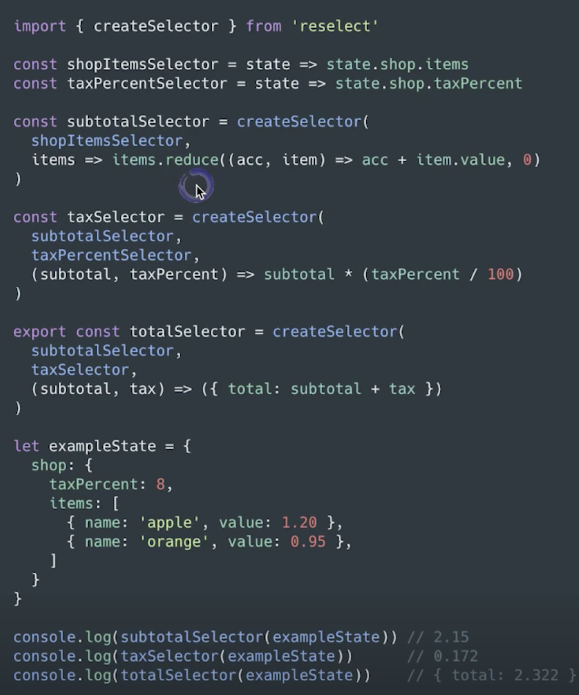
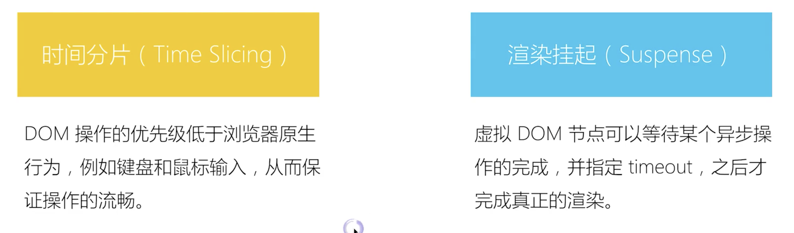

# 函数组件

# context - 组件跨层级通信

1. 传递一些公共信息的时候 统一的主题 语言 使用 props 太繁琐了
2. 在⼀个典型的 React 应⽤中，数据是通过 props 属性⾃上⽽
   下（由⽗及⼦）进⾏传递的，但这种做法对于某些类型的属
   性⽽⾔是极其繁琐的（例如：地区偏好，UI 主题），这些属
   性是应⽤程序中许多组件都需要的。Context 提供了⼀种在
   组件之间共享此类值的⽅式，⽽不必显式地通过组件树的逐
   层传递 props。
3. React 中使⽤ Context 实现祖代组件向后代组件跨层级传值。
   Vue 中的 provide & inject 来源于 Context。

## React.createContext

创建⼀个 Context 对象。当 React 渲染⼀个订阅了这个
Context 对象的组件，这个组件会从组件树中离⾃身最近的
那个匹配的 Provider 中读取到当前的 context 值。

## Context.Provider

- Provider 接收⼀个 value 属性，传递给消费组件，允许消费组件订阅 context 的变化。⼀个 Provider 可以和多个消费组件有对应关系。多个 Provider 也可以嵌套使⽤，⾥层的会覆盖外层的数据
- 当 Provider 的 value 值发⽣变化时，它内部的所有消费组件都会重新渲染。Provider 及其内部 consumer 组件都不受制于 shouldComponentUpdate 函数，因此当 consumer 组件在其祖先组件退出更新的情况下也能更新。

## Class.contextType

挂载在 class 上的 contextType 属性会被重赋值为⼀个由 React.createContext() 创建的 Context 对象。这能让你
使⽤ this.context 来消费最近 Context 上的那个值。你可以在任何⽣命周期中访问到它，包括 render 函数中

**只通过该 API 订阅单⼀ context**

## Context.Consumer

这⾥，React 组件也可以订阅到 context 变更。这能让你在函数式组件中完成订阅 context。
这个函数接收当前的 context 值，返回⼀个 React 节点。传递给函数的 value 值等同于往上组件树离这个 context 最近
的 Provider 提供的 value 值。如果没有对应的 Provider，value 参数等同于传递给 createContext() 的 defaultValue。

## 注意事项

```js
/**
因为 context 会使⽤参考标识（reference identity）来决定
何时进⾏渲染，这⾥可能会有⼀些陷阱，当 provider 的⽗组
件进⾏重渲染时，可能会在 consumers 组件中触发意外的渲
染。举个例⼦，当每⼀次 Provider 重渲染时，以下的代码会
重渲染所有下⾯的 consumers 组件，因为 value 属性总是被赋值为新的对象
**/
class App extends React.Component {
  render() {
    return (
      <Provider value={{ something: 'something' }}>
        <Toolbar />
      </Provider>
    );
  }
}
// 为了防⽌这种情况，将 value 状态提升到⽗节点的 state⾥：
class App extends React.Component {
  constructor(props) {
    super(props);
    this.state = {
      value: { something: 'something' },
    };
  }
  render() {
    return (
      <Provider value={this.state.value}>
        <Toolbar />
      </Provider>
    );
  }
}
```

## demo

```js
// 创建 Context 填入默认值（任何一个 js 变量）
const ThemeContext = React.createContext('light');

// 底层组件 - 函数是组件
function ThemeLink(props) {
  // const theme = this.context // 会报错。函数式组件没有实例，即没有 this

  // 函数式组件可以使用 Consumer
  return (
    <ThemeContext.Consumer>
      {(value) => <p>link's theme is {value}</p>}
    </ThemeContext.Consumer>
  );
}

// 底层组件 - class 组件
class ThemedButton extends React.Component {
  // 指定 contextType 读取当前的 theme context。
  // static contextType = ThemeContext // 也可以用 ThemedButton.contextType = ThemeContext
  render() {
    const theme = this.context; // React 会往上找到最近的 theme Provider，然后使用它的值。
    return (
      <div>
        <p>button's theme is {theme}</p>
      </div>
    );
  }
}
ThemedButton.contextType = ThemeContext; // 指定 contextType 读取当前的 theme context。

// 中间的组件再也不必指明往下传递 theme 了。
function Toolbar(props) {
  return (
    <div>
      <ThemedButton />
      <ThemeLink />
    </div>
  );
}
class App extends React.Component {
  constructor(props) {
    super(props);
    this.state = {
      theme: 'light',
    };
  }
  render() {
    return (
      <ThemeContext.Provider value={this.state.theme}>
        <Toolbar />
        <hr />
        <button onClick={this.changeTheme}>change theme</button>
      </ThemeContext.Provider>
    );
  }
  changeTheme = () => {
    this.setState({
      theme: this.state.theme === 'light' ? 'dark' : 'light',
    });
  };
}
```

# 非受控组件

```js
class App extends React.Component {
  constructor(props) {
    super(props);
    this.state = {
      name: 'zl',
      flag: true,
    };
    this.nameInputRef = React.createRef(); // 创建 ref
    this.fileInputRef = React.createRef();
  }
  render() {
    // // input defaultValue
    // return <div>
    //     {/* 使用 defaultValue 而不是 value ，使用 ref */}
    //     <input defaultValue={this.state.name} ref={this.nameInputRef}/>
    //     {/* state 并不会随着改变 */}
    //     <span>state.name: {this.state.name}</span>
    //     <br/>
    //     <button onClick={this.alertName}>alert name</button>
    // </div>

    // // checkbox defaultChecked
    // return <div>
    //     <input
    //         type="checkbox"
    //         defaultChecked={this.state.flag}
    //     />
    // </div>

    // file
    return (
      <div>
        <input type="file" ref={this.fileInputRef} />
        <button onClick={this.alertFile}>alert file</button>
      </div>
    );
  }
  alertName = () => {
    const elem = this.nameInputRef.current; // 通过 ref 获取 DOM 节点
    alert(elem.value); // 不是 this.state.name
  };
  alertFile = () => {
    const elem = this.fileInputRef.current; // 通过 ref 获取 DOM 节点
    alert(elem.files[0].name);
  };
}
```

# 异步加载组件

```js
const ContextDemo = React.lazy(() => import('./ContextDemo'));
<React.Suspense fallback={<div>Loading...</div>}>
  <ContextDemo />
</React.Suspense>;
```

# Portals

使用场景

1.  overflow: hidden
2.  父组件 z-index 值太小
3.  fixed 需要放在 body 第一层级 不一样的是 我们这个扔出去的组件 vnode 任然是在原来的组件下面的 我们在组件上触发的事件 仍然可以在这个父组件上去监听 只要在一颗 vnode 树上
4.  可以将虚拟 dom 映射到任何真实 dom 节点 解决了漂浮层的问题 dialog tooltip

```js
//父组件
 <PortalsDemo>Modal 内容</PortalsDemo>
//子组件 PortalsDemo
  render() {
      // // 正常渲染
      // return <div className="modal">
      //     {this.props.children} {/* vue slot */}
      // </div>

      // 使用 Portals 渲染到 body 上。
      // fixed 元素要放在 body 上，有更好的浏览器兼容性。
      return ReactDOM.createPortal(
          <div className="modal">{this.props.children}</div>,
          document.body // DOM 节点  document.getElementById('app')
      )
  }
  //节点补充  <div className='d3-node' ref={node=>(this.d3Node = node)}>
```

# 性能优化

## 常见的组件优化技术
核心 - 只渲染需要渲染的，只计算需要计算的
对 react 更加重要

1. SCU - shouldComponentUpdate

   - 有什么用？
     这个东西 背后逻辑 默认值返回 true 可选可操作 为什么要加 为什么官方不做呢 给你定制的权利呢

      react 中 只要父组件有更新 子组件会无条件更新 因为 react 一些默认的问题导致了一些性能问题 所以我们就需要去优化

   - 注意： 一定要每次都用嘛 不一定啊 性能优化 我们是需要的时候才需要用哦

   - 去深度比较 两个对象的值 react 能不能帮我们实现一个深的比较呢？不行的

   - 原因
     有可能会写错呀，有可能外部直接取修改了 state 的值，而我们一定要使用不可变值，造成的问题.比如你先 push 这个 state 就变了
     这个时候前后的 state 就一致了呀 scu 的时候两个值就相等了 不能比较了
     一旦帮我们做了,而我们的写法不规范 遵循不可变值 就会出现 bug
     可以先不用 有性能问题的时候我们在考虑使用

```js
// 为了演示 SCU ，故意写的错误用法
// this.state.list.push({
//     id: `id-${Date.now()}`,
//     title
// })
// this.setState({
//     list: this.state.list
// })
// 浅比较

```

减少请求频率、图片压缩、React.memo、React.useMemo

SCU 跟 immutable 强相关，一定要好好理解 react 的 immutable，否则很可能理解不了为什么不能直接去修改 state，然后再去 setState，以及 redux 的 reducer 要返回一个新的对象。

```js
class Input extends React.Component {
  constructor(props) {
    super(props);
    this.state = {
      title: '',
    };
  }
  render() {
    return (
      <div>
        <input value={this.state.title} onChange={this.onTitleChange} />
        <button onClick={this.onSubmit}>提交</button>
      </div>
    );
  }
  onTitleChange = (e) => {
    this.setState({
      title: e.target.value,
    });
  };
  onSubmit = () => {
    const { submitTitle } = this.props;
    submitTitle(this.state.title);

    this.setState({
      title: '',
    });
  };
}
class List extends React.Component {
  constructor(props) {
    super(props);
  }
  render() {
    const { list } = this.props;

    return (
      <ul>
        {list.map((item, index) => {
          return (
            <li key={item.id}>
              <span>{item.title}</span>
            </li>
          );
        })}
      </ul>
    );
  }

  // 增加 shouldComponentUpdate
  shouldComponentUpdate(nextProps, nextState) {
    // _.isEqual 做对象或者数组的深度比较（一次性递归到底）,性能不好，不建议深度比较，可以用浅层比较
    if (_.isEqual(nextProps.list, this.props.list)) {
      // 相等，则不重复渲染
      return false;
    }
    return true; // 不相等，则渲染
  }
}
class TodoListDemo extends React.Component {
  constructor(props) {
    super(props);
    this.state = {
      list: [
        {
          id: 'id-1',
          title: '标题1',
        },
        {
          id: 'id-2',
          title: '标题2',
        },
        {
          id: 'id-3',
          title: '标题3',
        },
      ],
    };
  }
  render() {
    return (
      <div>
        <Input submitTitle={this.onSubmitTitle} />
        <List list={this.state.list} />
      </div>
    );
  }
  onSubmitTitle = (title) => {
    // 正确的用法
    this.setState({
      list: this.state.list.concat({
        id: `id-${Date.now()}`,
        title,
      }),
    });

    // // 为了演示 SCU ，故意写的错误用法
    // this.state.list.push({
    //     id: `id-${Date.now()}`,
    //     title
    // })
    // this.setState({
    //     list: this.state.list
    // })
  };
}
export default TodoListDemo;
```

2. PureComponent 和 memo

纯组件 备忘录
PureComponent 实现了浅比较 只比较第一层属性 配合不可变值 不然有问题 ，主要是性能优化 要求我们设计组件结构的时候尽量扁平一点
React v16.6.0 之后的版本，可以使用一个新功能 React.memo 来完美实现让函数式的组件也有了
PureComponent 的功能
memo 如果是函数组件 我们就用 memo


3. 不可变值 immutable.js
4. react-router 配置懒加载 我们是 Suspense 和 lazy

# 高阶组件 HOC

## 定义理解

为了提⾼组件复⽤率，可测试性，就要保证组件功能单⼀性；但是若要满⾜复杂需求就要扩展功能单⼀的组件，在 React ⾥就有了这个概念 -- ⾼阶组件是参数为组件，返回值为新组件的函数。 复⽤组件逻辑的⼀种⾼级技巧,HOC ⾃身不是 React API 的⼀部分，它是⼀种基于 React 的组合特性⽽形成的设计模式。

1. 不要在 render ⽅法中使⽤ HOC
   React 的 diff 算法（称为协调）使⽤组件标识来确定它是应该更
   新现有⼦树还是将其丢弃并挂载新⼦树。 如果从 render 返回
   的组件与前⼀个渲染中的组件相同（===），则 React 通过将
   ⼦树与新⼦树进⾏区分来递归更新⼦树。 如果它们不相等，则
   完全卸载前⼀个⼦树。

```js
  render() {
    // 每次调⽤ render 函数都会创建⼀个新的
    EnhancedComponent;
    // EnhancedComponent1 !== EnhancedComponent2
    const EnhancedComponent = enhance(MyComponent);
    // 这将导致⼦树每次渲染都会进⾏卸载，和重新挂载的操作！
    return <EnhancedComponent />;
  }
  这不仅仅是性能问题 - 重新挂载组件会导致该组件及其所有⼦组件的状态丢失。
```

```js
// 高阶组件
const withMouse = (Component) => {
  class withMouseComponent extends React.Component {
    constructor(props) {
      super(props);
      this.state = { x: 0, y: 0 };
    }

    handleMouseMove = (event) => {
      this.setState({
        x: event.clientX,
        y: event.clientY,
      });
    };
    render() {
      return (
        <div style={{ height: '500px' }} onMouseMove={this.handleMouseMove}>
          {/* 1. 透传所有 props 2. 增加 mouse 属性 */}
          <Component {...this.props} mouse={this.state} />
        </div>
      );
    }
  }
  return withMouseComponent;
};
const App = (props) => {
  const a = props.a;
  const { x, y } = props.mouse; // 接收 mouse 属性
  return (
    <div style={{ height: '500px' }}>
      <h1>
        The mouse position is ({x}, {y})
      </h1>
      <p>{a}</p>
    </div>
  );
};
export default withMouse(App); // 返回高阶函数
```

## 装饰器写法

⾼阶组件本身是对装饰器模式的应⽤ @babel/plugin-proposal-decorators

```js
// !装饰器只能⽤在class上
// 执⾏顺序从下往上
@foo2
@foo
@foo
class Child extends Component {
  render() {
    return <div> Child {this.props.name}</div>;
  }
}
// const Foo = foo2(foo(foo(Child)));
export default class HocPage extends Component {
  render() {
    return (
      <div>
        {' '}
        <h3>HocPage</h3>
        {/* <Foo name="msg" /> */} <Child />
      </div>
    );
  }
}
```

4. react 组件粒度越细，优化的空间越大
   因为我们的组件细了以后 很多组价都能变成纯组件 dom 节点就能当成一个整体来看待 当这些 dom 节点对应的组件状态没有变得时候，这些细的组件就没有必要参加到虚拟 dom 的 diff 当中 尽可能拆分成比较小的组件

5. 注重可重构的代码
6. 使用工具定位性能问题
7. 自动化按需加载

- 切换到某个页面的时候，才回去加载他
- 使用 webpack 的 import
- 使用 react-loadable 库实现 react 异步加载 现在用 react.lazy

8. 使用 reselect 避免重复计算
   主要用于 redux 数据源的一些计算，创建自动缓存数据的流程
   因为我们 state 中存的状态都是最原始的状态 能够计算的我们都是通过计算 一般都是我们 ui 需要更新的时候采取计算 我们的一些操作都可能使我们的页面刷新 ，如果这个时候我们每次都重复计算一个过程是没必要的 相比 vue computed 是缓存的 而实际上 我购物车的状态没有发生改变 计算的结果是可以缓存的



9. 异步渲染 下一代 react hooks
   时间分片

- 虚拟 dom 的 diff 操作可以分片进行
  

# Render Props

```js
class Mouse extends React.Component {
  constructor(props) {
    super(props);
    this.state = { x: 0, y: 0 };
  }
  handleMouseMove = (event) => {
    this.setState({
      x: event.clientX,
      y: event.clientY,
    });
  };
  render() {
    return (
      <div style={{ height: '500px' }} onMouseMove={this.handleMouseMove}>
        {/* 将当前 state 作为 props ，传递给 render （render 是一个函数组件） */}
        {this.props.render(this.state)}
      </div>
    );
  }
}
Mouse.propTypes = {
  render: PropTypes.func.isRequired, // 必须接收一个 render 属性，而且是函数
};
const App = (props) => (
  <div style={{ height: '500px' }}>
    <p>{props.a}</p>
    <Mouse
      render={
        /* render 是一个函数组件 */
        ({ x, y }) => (
          <h1>
            The mouse position is ({x}, {y})
          </h1>
        )
      }
    />
  </div>
);
/**
 * 即，定义了 Mouse 组件，只有获取 x y 的能力。
 * 至于 Mouse 组件如何渲染，App 说了算，通过 render prop 的方式告诉 Mouse 。
 */
export default App;
```

# 基于路由实现菜单导航 router

1. 菜单导航只是改变 url 状态
2. 根据当前 url 显示菜单的当前状态

3. navLink activeClassName 根据当前的 url 和 to 指向的 url 做一个匹配 exact 精确匹配
4. 当你的 url 发生改变的时候 组件想要重新 render 让我们的组件绑定到 router 这个 store 上 和 redux 结合使用的时候

# 使用 react 实现拖放

1. 如何使用 react 的鼠标事件系统
2. 如何判断拖放开始和拖放结束
3. 如何实现拖放元素的位置移动
4. 拖放状态如何在组价中维护

5. react-beautiful-dnd 一个拖放库

# dva

dva 是一种特定的 react, redux 实践方式，对 redux API 做了深度的定制和封装，可以减少 redux 的模板代码。而 rekit 则是通过自动生成代码骨架来避免 redux 的繁琐模板代码。如需了解更多可以参考 dva 的官网：https://dvajs.com/

# 优化点小总结、key值的作用

1. 只传递需要的 props 不要随便 <Component {...props} />
2. ⽆状态组件
3. 少在 render 中绑定事件
4. redux + reselect
5. data 扁平化
   每当 store 发⽣改变的时候，connect 就会触发重新计算，为了减少重复的不必要计算，减少⼤型项⽬的
   性能开⽀，需要对 selector 函数做缓存。推荐使⽤ reactjs/reselect, 缓存的部分实现代码如下
6. ⻓列表 react-virtualized
   只维护上下三屏的 dom 节点，模拟滚动，比如有 10000 个 dom
   如果有 10000 个， 只渲染 20 个，⿏标滚动的时候，新节点替换⽼节点、 等滚动到这块的时候，再生成
   只渲染可⻅的，

   vue -- vue-virtual-scroller
   https://github.com/Akryum/vue-virtual-scroller

7. 渲染时加 key
   比如 相同类型的子元素 我们需要使用唯一的 key 去标识他，如果少了 key，其实在内部工作的时候，可能就不会去做 dom节点交换这样的动作，会做一些性能开销更大的，直接把一个节点属性发生变化，使得跟另外一个位置的节点完全一样，另一个节点做同样的事情，不仅用来消除 warning，更是用来提升性能


   Keys 是 React 用于追踪哪些列表中元素被修改、被添加或者被移除的辅助标识。
    在开发过程中，我们需要保证某个元素的 key 在其同级元素中具有唯一性。在 React Diff 算法中 React 会借助元素的 Key 值来判断该元素是新近创建的还是被移动而来的元素，从而减少不必要的元素重渲染。此外，React 还需要借助 Key 值来判断元素与本地状态的关联关系，因此我们绝不可忽视转换函数中 Key 的重要性。

    key 就是给每个节点一个唯一的标识，key是给每一个vnode的唯一id,可以依靠key,更准确, 更快的拿到oldVnode中对应的vnode节点。
如果不加 key ，在更新的时候 vue 会去比较所有的项，然后把全部的元素进行替换，造成性能的降低。


8. 自定义事件 dom 事件及时销毁
9. 合理使用异步组件
10. 减少 bind this 次数，尽量使用类属性的方式
11. 合理使用 scu 和 memo
12. 合理使用 immutable.js
13. webpack 层面的优化
14. ssr

```js
import { List } from "react-virtualized";
<div className="list">
 {this.list.map(this.renderRow.bind(this))}
</div>

// 改为
const listHeight = 600;
const rowHeight = 50;
const rowWidth = 800;

  <div className="list">
    <List
      width={rowWidth}
      height={listHeight}
      rowHeight={rowHeight}
      rowRenderer={this.renderRow.bind(this)}
      rowCount={this.list.length}
    />
  </div>

  renderRow({ index, key, style }) {
    return (
      <div key={key} style={style} className="row">
        <div className="image">
          
        </div>
        <div className="content">
          <div>{this.list[index].name}</div> <div>{this.list[index].text}</div>
        </div>
      </div>
    );
  }
```

# 骨架屏

页面还没有 load 出来的时候，先根据 dom 节点 显示骨架 这样来提升交互体验
vue-skeleton-webpack-plugin
https://github.com/lavas-project/vue-skeleton-webpack-plugin

# antd-design 理解

⽤ Form.create()的⽅式实现：

1. getFieldDecorator： ⽤于和表单进⾏双向绑定
2. getFieldsValue：获取⼀组输⼊控件的值，如不传⼊参数，则获取全部组件的值
3. getFieldValue： 获取⼀个输⼊控件的值
4. validateFields：校验并获取⼀组输⼊域的值与 Error，若
5. fieldNames 参数为空，则校验全部组件

```js
我们的理解 NormalLoginForm 从包装完的父组件，已经拿到了一些传进来属性  form
class NormalLoginForm extends React.Component {
  handleSubmit = e => {
    e.preventDefault();
    // validateFields哪来的？
    // 全局校验怎么实现的
    this.props.form.validateFields((err, values) => {
      if (!err) {
        console.log("Received values of form: ", values);
      }
    });
  };
  render() {
    //  getFieldDecorator哪来的?
    // 做什么的？ 装饰器工厂，字段装饰器能够生成一个装饰器
    // 设置字段名称、校验规则、增强input使他可以校验   getFieldDecorator要对input进行事件监听呀 再去校验啊 和 vue不同 一把抓了 一般交给老爹或者爷爷 自己很单一
    const { getFieldDecorator } = this.props.form;
    return (
      <Form onSubmit={this.handleSubmit} className="login-form">
        <Form.Item>
          {getFieldDecorator("userName", {
            rules: [{ required: true, message: "Please input your username!" }]
          })(
            <Input
              prefix={<Icon type="user" style={{ color: "rgba(0,0,0,.25)" }} />}
              placeholder="Username"
            />
          )}
        </Form.Item>
        <Form.Item>
          <Button
            type="primary"
            htmlType="submit"
            className="login-form-button"
          >
            Log in
          </Button>
        </Form.Item>
      </Form>
    );
  }
}
// 设置了表单名字 经过包装以后，我们表单拥有了额外能力：全局校验、输入控件包装器 我们传很多不同的类型进去
const WrappedNormalLoginForm = Form.create({ name: "normal_login" })(
  NormalLoginForm
);
export default WrappedNormalLoginForm;
```

表单组件设计思路

1. 表单组件要求实现 数据收集 检验 提交 可通过高阶组价拓展
2. 高阶组件给表单组件 传递一个 input 组件包装函数 接管其输入事件 并统一管理表单数据
3. 高阶组件给表单传递一个 校验函数 使其具备 数据校验功能

```js
// 创建高阶组件
function kFormCreate(Comp) {
  return class extends Component {
    constructor(props) {
      super(props);

      this.options = {}; //表单配置项
      this.state = {
        //   usernameMessage: 'lalalala'
      }; // 表单值
    }
    // 全局校验
    validateFields = (cb) => {
      //   console.log(this.state);
      const ret = Object.keys(this.options).every((field) =>
        this.validateField(field)
      );
      // 将校验结果传出去，并传递数据
      cb(ret, this.state);
    };

    // 单项校验
    validateField = (field) => {
      // 校验规则
      const { rules } = this.options[field];
      // 校验: ret如果是false校验失败
      const ret = !rules.some((rule) => {
        if (rule.required) {
          // 获取校验项的值
          if (!this.state[field]) {
            // 必填项失败
            // 设置错误信息
            this.setState({
              [field + 'Message']: rule.message,
            });
            return true;
          }
        }

        return false;
      });

      // 若校验成功,清理错误信息
      if (ret) {
        this.setState({
          [field + 'Message']: '',
        });
      }

      return ret;
    };

    // 变更处理
    handleChange = (e) => {
      const { name, value } = e.target;
      this.setState(
        {
          [name]: value,
        },
        () => {
          this.validateField(name);
        }
      );
    };
    // 包装我们输入框
    getFieldDec = (field, option) => {
      this.options[field] = option;

      // 返回一个装饰器(高阶组件)
      return (InputComp) => {
        return (
          <div>
            // 克隆一份 在原来的基础上添加一份属性
            {React.cloneElement(InputComp, {
              name: field, // 控件name
              value: this.state[field] || '',
              onChange: this.handleChange, // 输入值变化监听回调
            })}
            {/* 校验错误信息 */}
            {this.state[field + 'Message'] && (
              <p style={{ color: 'red' }}>{this.state[field + 'Message']}</p>
            )}
          </div>
        );
      };
    };
    render() {
      return (
        <Comp
          {...this.props}
          getFieldDec={this.getFieldDec}
          validateFields={this.validateFields}
        />
      );
    }
  };
}
@kFormCreate
class KFormTest extends Component {
  onLogin = () => {
    // 校验
    this.props.validateFields((isValid, data) => {
      if (isValid) {
        console.log('登录！！！！');
      } else {
        alert('校验失败');
      }
    });
  };

  render() {
    const { getFieldDec } = this.props;
    return (
      <div>
        {/* 接收两个参数返回一个装饰器 */}
        {getFieldDec('username', {
          rules: [{ required: true, message: '请输入用户名' }],
        })(<Input type="text" />)}

        {getFieldDec('password', {
          rules: [{ required: true, message: '请输入密码' }],
        })(<Input type="password" />)}
        <Button onClick={this.onLogin}>登录</Button>
      </div>
    );
  }
}
export default KFormTest;
```

2. 弹窗类
   弹窗类组件的要求弹窗内容在 A 处声明，却在 B 处展示。react 中相当于弹窗内容看起来被 render 到一个组件里面去 实际改变的是网页上另一处的 dom 结构 显然不合逻辑 但是通过框架特定 api 创建组件实例 并制定挂载目标 还是可以完成的

```js
// 常见用法如下：Dialog在当前组件声明，但是却在body中另一个div中显示 <div class="foo"> <div> ... </div> { needDialog ? <Dialog> <header>Any Header</header> <section>Any content</section> </Dialog> : null } </div>
```

具体实现 传送门，react v16 之后出现的 portal 可以实现内容传送功能。

3. 树形组件

```js
class TreeNode extends Component {
  constructor(props) {
    super(props);
    this.state = {
      open: false,
    };
  }
  //   判断是否有子元素
  get isFolder() {
    return this.props.model.children && this.props.model.children.length;
  }
  //   切换打开状态
  toggle = () => {
    if (this.isFolder) {
      this.setState({
        open: !this.state.open,
      });
    }
  };
  render() {
    return (
      <ul>
        <li>
          {/* 内容显示 */}
          <div onClick={this.toggle}>
            {/* 标题 */}
            {this.props.model.title}
            {/* 有可能显示＋-号 */}
            {this.isFolder ? <span>{this.state.open ? '-' : '+'}</span> : null}
          </div>
          {/* 可能存在子树 */}
          {this.isFolder ? (
            <div style={{ display: this.state.open ? 'block' : 'none' }}>
              {this.props.model.children.map((model) => (
                <TreeNode model={model} key={model.title} />
              ))}
            </div>
          ) : null}
        </li>
      </ul>
    );
  }
}

export default class Tree extends Component {
  treeData = {
    title: 'zzz',
    children: [
      {
        title: 'zl',
      },
      {
        title: 'JS',
        children: [
          {
            title: 'ES6',
          },
          {
            title: '动效',
          },
        ],
      },
      {
        title: 'Web全栈',
        children: [
          {
            title: 'Vue',
            expand: true,
            children: [
              {
                title: '组件化',
              },
              {
                title: '源码',
              },
              {
                title: 'docker部署',
              },
            ],
          },
          {
            title: 'React',
            children: [
              {
                title: 'JSX',
              },
              {
                title: '虚拟DOM',
              },
            ],
          },
          {
            title: 'Node',
          },
        ],
      },
    ],
  };
  render() {
    return (
      <div>
        <TreeNode model={this.treeData} />
      </div>
    );
  }
}
```

## 组件化设计的思考

[组件化](https://blog.bookcell.org/2020/03/22/the-10-react-component-best-practice/)
