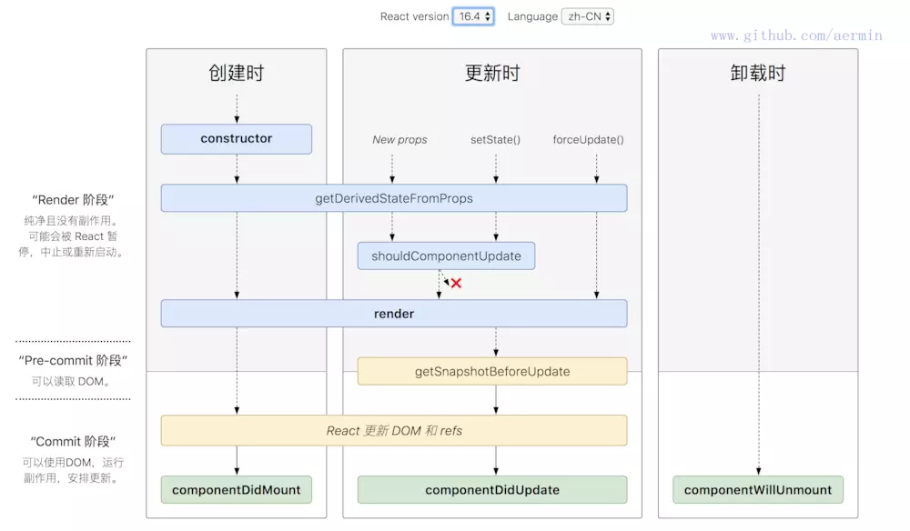

# React 基础

1.  React 不是一个完整的 MVC,MVVM 框架
2.  React 和 web components 不冲突
3.  轻
4.  组件化的开发思路 封装起来具有独立功能的控件 用组件的方式重新去思考 ui 的构成 将 ui 上每一个功能相对独立的模块定义成组件
    小的组件通过任意组合或嵌套的方式 最终构成一个大的组件 完成整体 ui 的构建 意味着高度可重用的
    适用性 在复杂场景下还要求高性能
    重用组件库 组件组合

所谓的“高效”，是因为 React 独创了 Virtual DOM 机制。Virtual DOM 是一个存在于内存中的 JavaScript 对象，它与 DOM 是一一对应的关系，也就是说只要有 Virtual DOM，我们就能渲染出 DOM。
当界面发生变化时，得益于高效的 DOM Diff 算法，我们能够知道 Virtual DOM 的变化，从而高效的改动 DOM，避免了重新绘制 DOM。
当然，React 并不是前端开发的全部。从之前的描述也能看出，它专注于 UI 部分，对应到 MVC 结构中就是 View 层。要想实现完整的 MVC 架构，还需要 Model 和 Controller 的结构。在前端开发时，我们可以采用 Flux 和 Redux 架构，它们并非框架(Library)，而是和 MVC 一样都是一种架构设计(Architecture)。
如果不从事前端开发，就不用深入的掌握 Flux 和 Redux 架构，但理解这一套体系结构对于后面理解 React Native 非常重要。

React 负责逻辑控制，数据 -> VDOM
ReactDom 渲染实际 DOM，VDOM -> DOM，如果换到移动端，就用别的库来渲染
React 使用 JSX 来描述 UI
babel-loader 可以转换 jsx -> html -vNode, React.createElement
jsx 基本上也是 vNode 基本结构和我们以前用 js 对象模拟 dom 结构是一个意思

# State Action 概念

1. State
   State 表示 Model 的状态数据，通常表现为一个 javascript 对象（当然它可以是任何值）；操作的时候每次都要当作不可变数（immutable data）来对待，保证每次都是全新对象，没有引用关系，这样才能保证 State 的独立性，便于测试和追踪变化。
2. Action
   Action 是一个普通 javascript 对象，它是改变 State 的唯一途径。无论是从 UI 事件、网络回调，还是 WebSocket 等数据源所获得的数据，最终都会通过 dispatch 函数调用一个 action，从而改变对应的数据。action 必须带有 type 属性指明具体的行为，其它字段可以自定义，如果要发起一个 action 需要使用 dispatch 函数；需要注意的是 dispatch 是在组件 connect Models 以后，通过 props 传入的。
3. dispatch
   dispatching function 是一个用于触发 action 的函数，action 是改变 State 的唯一途径，但是它只描述了一个行为，而 dispatch 可以看作是触发这个行为的方式，而 Reducer 则是描述如何改变数据的。

4. Reducer（也称为 reducing function）函数接受两个参数：之前已经累积运算的结果和当前要被累积的值，返回的是一个新的累积结果。该函数把一个集合归并成一个单值

   Reducer 的概念来自于是函数式编程，很多语言中都有 reduce API。如在 javascript 中

   ```
   [{ x: 1 }, { y: 2 }, { z: 3 }].reduce(function (prev, next) {
       console.log(prev, next);
       return Object.assign(prev, next);
   });
   // {x: 1} {y: 2}
   // {x: 1, y: 2} {z: 3}
   // {x: 1, y: 2, z: 3}
   ```

   Effect 被称为副作用，在我们的应用中，最常见的就是异步操作。它来自于函数编程的概念，之所以叫副作用是因为它使得我们的函数变得不纯，同样的输入不一定获得同样的输出。
   dva 为了控制副作用的操作，底层引入了 redux-sagas 做异步流程控制，由于采用了 generator 的相关概念，所以将异步转成同步写法，从而将 effects 转为纯函数


# JSX 概念

JSX 是一种 看起来很像xml的JavaScript 的语法扩展，其格式比较像模版语言，但事实上完全是在 JavaScript 内部实现的。
是一种语法糖 

为甚需要jsx？

  * 开发效率：使用jsx编写模板简单快速
  * 执行效率：jsx编译为JavaScript代码后进行了优化，执行更快
  * 类型安全：在编译过程中就能发现错误

原理：babel-loader 会预编译jsx为React.createElement(....)
与vue的不同： 
 * react中的vnode+jsx一开始就有，vue则是演进过程中出现的
 * jsx本来就是js拓展，转义过程直接的多，vue把template编译成render函数的过程需要复杂的编译器转换字符串为ast-js函数字符串-js函数-引入到代码里面

联想？响应化的实现为什么需要一个watcher？一个组件一个watcher 为什么

我们每个组件在创建的时候，会创建一个render watcher 渲染watcher 这个 render watcher和组件就是一对一的关系 主要是和我们的更新函数挂钩 更新函数会直接传入到watcher中 将来 任何一个值得变化会导致 watcher会入队 render函数执行的时候会访问这个组件里面所有的依赖 data中的所有值都会被访问到 意味着我哪些值得变化会调用我当前的 watcher 所以说为什么需要vnode diff算法呢 就是因为一个组件中那么多的值 我怎么知道哪个改变了呢 我怎么知道哪一个变了呢 我们watcher管理这这个组件 所以只能在组件的级别 做一个diff 通过diff得出变化的点  从而做出更新


JSX 可以很好地描述 UI，能够有效提高开发效率

- 变量 表达式 (函数也是合法表达式,jsx 是 js 对象，也是合法表达式)
- class style (属性：静态值用双引号，动态值用花括号；class、for 等要特殊处理。)
- 子元素和组件
  组件的两种形式
  - class 组件(拥有状态和生命周期，继承于 Component，实现 render 方法)
  - function 组件(函数组件通常无状态，仅关注内容展示，返回渲染结果即可。)

```
    // React类负责逻辑控制，比如修改数据 -> vdom
    // ReactDOM类负责渲染，vdom -> dom
    // babel-loader可以转换jsx -> vdom,
    // <h1>React真帅</h1> => React.createElement('h1', 'React真帅')
    // 变量使用, 只要是合法js表达式
    const name = "React真帅";
    const user = { firstName: "tom", lastName: "jerry" };
    function formatName(user) {
      return user.firstName + " " + user.lastName;
    }
    const greet = <p>hello,jerry</p>;

    // 由于条件语句或者循环语句不是合法表达式
    // const title = name ? <h1>{name}</h1> : null;
    // 数组会作为一组子元素对待
    // 处理循环的方式
    const arr = [1, 2, 3].map(num => <li key={num}>{num}</li>);
    return (
      <div>
        {/* 条件语句 */}
        {name ? <h1>{name}</h1> : null}
        {/* 函数也是合法表达式 */}
        <p>{formatName(user)}</p>
        {/* jsx本身也是合法表达式 */}
        {greet}
        {/* 数组处理 */}
        {/* 显示列表 */}
        <ul>{arr}</ul>
        {/* 属性使用: 静态值用双引号，动态值用花括号 */}
        {/* class、for关键字要特殊处理 */}
        
        {/* <label htmlFor=""></label> */}
      </div>
    );
```

# React 事件 和 Dom 事件的区别

react 事件机制

1. React 为什么要用合成事件

   React 并不是将 click 事件直接绑定在 dom 上面，而是采用事件冒泡的形式冒泡到 document 上面，然后 React 将事件封装给正式的函数处理运行和处理

   - 合成事件的监听器是统一注册在 document 上的，且仅有冒泡阶段。所以原生事件的监听器响应总是比合成事件的监听器早
   - 阻止原生事件的冒泡后，会阻止合成事件的监听器执行

   如果 DOM 上绑定了过多的事件处理函数，整个页面响应以及内存占用可能都会受到影响。React 为了避免这类 DOM 事件滥用，同时屏蔽底层不同浏览器之间的事件系统差异，实现了一个中间层——SyntheticEvent。

   1. 当用户在为 onClick 添加函数时，React 并没有将 Click 事件绑定在 DOM 上面。
   2. 而是在 document 处监听所有支持的事件，当事件发生并冒泡至 document 处时，React 将事件内容封装交给中间层 SyntheticEvent（负责所有事件合成）
   3. 所以当事件触发的时候，对使用统一的分发函数 dispatchEvent 将指定函数执行。

2) 事件机制：注册和分发的过程。这里面至少要说出事件注册都是在元素的最顶层 document 节点上。
   原生绑定快于合成事件绑定，不要将原生事件（addEventListener）和 React 合成事件一起混合使用，这两个机制是不一样的。

# React 事件

```
class EventDemo extends React.Component {
    constructor(props) {
        super(props)
        this.state = {
            name: 'zhangsan',
            list: [
                {
                    id: 'id-1',
                    title: '标题1'
                },
                {
                    id: 'id-2',
                    title: '标题2'
                },
                {
                    id: 'id-3',
                    title: '标题3'
                }
            ]
        }
        // 修改方法的 this 指向
        this.clickHandler1 = this.clickHandler1.bind(this)
    }
    render() {
        // // this - 使用 bind
        // return <p onClick={this.clickHandler1}>
        //     {this.state.name}
        // </p>

        // // this - 使用静态方法
        // return <p onClick={this.clickHandler2}>
        //     clickHandler2 {this.state.name}
        // </p>

        // // event
        // return <a href="https://imooc.com/" onClick={this.clickHandler3}>
        //     click me
        // </a>

        // 传递参数 - 用 bind(this, a, b)
        return <ul>{this.state.list.map((item, index) => {
            return <li key={item.id} onClick={this.clickHandler4.bind(this, item.id, item.title)}>
                index {index}; title {item.title}
            </li>
        })}</ul>
    }
    clickHandler1() {
        // console.log('this....', this) // this 默认是 undefined
        this.setState({
            name: 'lisi'
        })
    }
    // 静态方法，this 指向当前实例
    clickHandler2 = () => {
        this.setState({
            name: 'lisi'
        })
    }
    // 获取 event
    clickHandler3 = (event) => {
        event.preventDefault() // 阻止默认行为
        event.stopPropagation() // 阻止冒泡
        console.log('target', event.target) // 指向当前元素，即当前元素触发
        console.log('current target', event.currentTarget) // 指向当前元素，假象！！！

        // 注意，event 其实是 React 封装的。可以看 __proto__.constructor 是 SyntheticEvent 组合事件
        console.log('event', event) // 不是原生的 Event ，原生的 MouseEvent
        console.log('event.__proto__.constructor', event.__proto__.constructor)

        // 原生 event 如下。其 __proto__.constructor 是 MouseEvent
        console.log('nativeEvent', event.nativeEvent)
        console.log('nativeEvent target', event.nativeEvent.target)  // 指向当前元素，即当前元素触发
        console.log('nativeEvent current target', event.nativeEvent.currentTarget) // 指向 document ！！！

        // 1. event 是 SyntheticEvent ，模拟出来 DOM 事件所有能力
        // 2. event.nativeEvent 是原生事件对象
        // 3. 所有的事件，都被挂载到 document 上
        // 4. 和 DOM 事件不一样，和 Vue 事件也不一样
    }
    // 传递参数
    clickHandler4(id, title, event) {
        console.log(id, title)
        console.log('event', event) // 最后追加一个参数，即可接收 event
    }
}
export default EventDemo
```

# 组件动态

```
  shouldComponentUpdate(nextProps, nextState) {
      if (nextProps.text !== this.props.text
          || nextProps.length !== this.props.length) {
          return true // 可以渲染
      }
      return false // 不重复渲染
  }

  // React 默认：父组件有更新，子组件则无条件也更新！！！
  // 性能优化对于 React 更加重要！
  // SCU 一定要每次都用吗？—— 需要的时候才优化
```

# state 不可变值

我们的回调函数是在值全部更新结束之后调用

```
    // count 初始值为 0
    this.setState({ count: this.state.count + 1 })
    console.log('1', this.state.count) // 0
    this.setState({ count: this.state.count + 1 })
    console.log('2', this.state.count) // 0
    setTimeout(() => {
        this.setState({ count: this.state.count + 1 })
        console.log('3', this.state.count) // 2
    })
    setTimeout(() => {
        this.setState({ count: this.state.count + 1 })
        console.log('4', this.state.count) // 3
    })
```

1. state 要在构造函数中定义
2. 不要直接修改 state ，使用不可变值

```
const list5Copy = this.state.list5.slice()
list5Copy.splice(2, 0, 'a') // 中间插入/删除
this.setState({
    list1: this.state.list1.concat(100), // 追加
    list2: [...this.state.list2, 100], // 追加
    list3: this.state.list3.slice(0, 3), // 截取
    list4: this.state.list4.filter(item => item > 100), // 筛选
    list5: list5Copy // 其他操作
})
// 注意，不能直接对 this.state.list 进行 push pop splice 等，这样违反不可变值

this.setState({
  obj1: Object.assign({}, this.state.obj1, { a: 100 }),
  obj2: { ...this.state.obj2, a: 100 }
});

```

3. setState 可能是异步更新（有可能是同步更新）

```
    // setTimeout 中 setState 是同步的
    setTimeout(() => {
        this.setState({
            count: this.state.count + 1
        })
        console.log('count in setTimeout', this.state.count)
    }, 0)
    // 自己定义的 DOM 事件，setState 是同步的。再 componentDidMount 中

    bodyClickHandler = () => {
      this.setState({
          count: this.state.count + 1
      })
      console.log('count in body event', this.state.count)
    }
    componentDidMount() {
      // 自己定义的 DOM 事件，setState 是同步的
      document.body.addEventListener('click', this.bodyClickHandler)
    }
    componentWillUnmount() {
      // 及时销毁自定义 DOM 事件
      document.body.removeEventListener('click', this.bodyClickHandler)
      // clearTimeout
    }
```

4. state 异步更新的话，更新前会被合并(setState 是批量执行的，因此对同一个状态执行多次只起一次作用，多个状态更新可以放在同一个
   setState 中进行)
   setState 通常是异步的，因此如果要获取到最新状态值有以下三种方式

- 传递函数给 setState 方法
- 使用定时器

```
setTimeout(() => { console.log(this.state.counter); }, 0);
```

- 原生事件中修改状态

```
componentDidMount(){
    document.body.addEventListener('click', this.changeValue, false)
}
changeValue = () => {
   this.setState({counter: this.state.counter+1})
   console.log(this.state.counter)
}
```

```
  // 传入对象，会被合并（类似 Object.assign ）。执行结果只一次 +1
    this.setState({
        count: this.state.count + 1
    })
    this.setState({
        count: this.state.count + 1
    })
    this.setState({
        count: this.state.count + 1
    })

    // 传入函数，不会被合并。执行结果是 +3
    this.setState((prevState, props) => {
        return {
            count: prevState.count + 1
        }
    })
    this.setState((prevState, props) => {
        return {
            count: prevState.count + 1
        }
    })
    this.setState((prevState, props) => {
        return {
            count: prevState.count + 1
        }
    })
    // text counter
    this.setState(
      (nextState) => {
        console.log(nextState.counter);
        return { counter: nextState.counter + 1 };
      },
      () => {
        console.log(this.state.counter);
      }
    );
    console.log(this.state.counter);
    this.setState(
      (nextState) => {
        console.log(nextState.counter);
        return { counter: nextState.counter + 1 };
      },
      () => {
        console.log(this.state.counter);
      }
    );
    console.log(this.state.counter);
    this.setState(
      (nextState) => {
        console.log(nextState.counter);
        return { counter: nextState.counter + 1 };
      },
      () => {
        console.log(this.state.counter);
      }
    );
    console.log(this.state.counter);
  }
  // 0 0 0 0 1 2 3 3 3
```

# 函数组件的状态管理

```
function ClockFunc() {
  // useState创建一个状态和修改该状态的函数
  const [date, setDate] = useState(new Date());
  // useEffect编写副作用代码
  useEffect(() => {
    // 启动定时器是我们的副作用代码
    const timerID = setInterval(() => {
      setDate(new Date());
    }, 1000);
    // 返回清理函数
    return () => clearInterval(timerID);
  }, []);
  // 参数2传递空数组使我们参数1函数仅执行一次
  return <div>{date.toLocaleTimeString()}</div>;
}

```

# 组件通信

1. Props 属性传递可用于父子组件相互通信
2. 如果父组件传递的是函数，则可以把子组件信息传入父组件，这个常称为状态提升，StateMgt.js

```
// StateMgt <Clock change={this.onChange}/>
// Clock
    this.timerId = setInterval(() => {
      // 通过setState更新状态
      this.setState(
        {
          date: new Date()
        },
        () => {
          // 每次状态更新就通知父组件
          this.props.change(this.state.date);
        }
      );
    }, 1000);
```

# 跨层级组价通信

context

# Redux

- Redux 本身是一个很轻的库，解决 component -> action -> reducer -> state 的单向数据流转问题。
  按我理解，他有两个非常突出的特点是：

  1. predictable，可预测性
  2. 可扩展性
     可预测性是由于他大量使用 pure function 和 plain object 等概念(reducer 和 action creator 是 pure function，state 和 action 是 plain object)，并且 state 是 immutable 的。这对于项目的稳定性会是非常好的保证。
     可扩展性则让我们可以通过 middleware 定制 action 的处理，通过 reducer enhancer 扩展 reducer 等等。从而有了丰富的社区扩展和支持，比如异步处理、Form、router 同步、redux/undo、性能问题(selector)、工具支持。

2. 库的选择

   但是那么多的社区扩展，我们应该如何选才能组成我们的最佳实践? 以异步处理为例。(这也是我觉得最重要的一个问题)
   用地比较多的通用解决方案有这些：

   - redux-thunk
   - redux-promise
   - redux-saga
     redux-thunk 是支持函数形式的 action，这样在 action 里就可以 dispatch 其他的 action 了。这是最简单应该也是用地最广的方案吧，对于简单项目应该是够的。
     redux-promise 和上面的类似，支持 promise 形式的 action，这样 action 里就可以通过看似同步的方式来组织代码。
     但 thunk 和 promise 都有的问题是，他们改变了 action 的含义，使得 action 变得不那么纯粹了。
     然后出现的 redux-saga 让我眼前一亮，具体不多说了，可以看他的文档。总之给我的感觉是优雅而强大，通过他可以把所有的业务逻辑都放到 saga 里，这样可以让 reducer, action 和 component 都很纯粹，干他们原本需要干的事情。
     所以在异步处理这一环节，我们选择了 redux-saga。
     最终通过一系列的选择，我们形成了基于 redux 的最佳实践。

# React V16.3 之前的生命周期

[React v16.3 新生命周期浅谈](https://blog.csdn.net/c_kite/article/details/80303341)

- 第一个是组件初始化(initialization)阶段

也就是以下代码中类的构造方法( constructor() ),Lifecycle 类继承了 react Component 这个基类，也就继承这个 react 的
基类，才能有 render(),生命周期等方法可以使用，这也说明为什么 函数组件不能使用这些方法 的原因。
super(props) 用来调用基类的构造方法( constructor() ), 也将父组件的 props 注入给子组件，功子组件读取(组件
中 props 只读不可变，state 可变)。 而 constructor() 用来做一些组件的初始化工作，如定义 this.state 的初始内
容。

- 第二个是组件的挂载(Mounting)阶段
  此阶段分为 componentWillMount，render，componentDidMount 三个时期。 1. componentWillMount:
  在组件挂载到 DOM 前调用，且只会被调用一次，在这边调用 this.setState 不会引起组件重新渲染，也可以把写在这
  边的内容提前到 constructor()中，所以项目中很少用。 2. render:
  根据组件的 props 和 state（无两者的重传递和重赋值，论值是否有变化，都可以引起组件重新 render） ，return
  一个 React 元素（描述组件，即 UI），不负责组件实际渲染工作，之后由 React 自身根据此元素去渲染出页面
  DOM。render 是纯函数（Pure function：函数的返回结果只依赖于它的参数；函数执行过程里面没有副作用），
  不能在里面执行 this.setState，会有改变组件状态的副作用。 3. componentDidMount:
  组件挂载到 DOM 后调用，且只会被调用一次

- 第三个是组件的更新(update)阶段

在讲述此阶段前需要先明确下 react 组件更新机制。setState 引起的 state 更新或父组件重新 render 引起的 props 更
新，更新后的 state 和 props 相对之前无论是否有变化，都将引起子组件的重新 render

- 造成组件更新有两类（三种）情况：

  1. 父组件重新 render
     1. 父组件重新 render 引起子组件重新 render 的情况有两种
     - 直接使用,每当父组件重新 render 导致的重传 props，子组件将直接跟着重新渲染，无论 props 是否有变化。可通
       过 shouldComponentUpdate 方法优化
     - 在 componentWillReceiveProps 方法中，将 props 转换成自己的 state
       ```
         componentWillReceiveProps(nextProps) {
           //父组件重传props时就会调用这个方法
           this.setState({ someThings: nextProps.someThings });
         }
       ```
       根据官网的描述,在该函数(componentWillReceiveProps)中调用 this.setState() 将不会引起第二次渲染,
       是因为 componentWillReceiveProps 中判断 props 是否变化了，若变化了，this.setState 将引起 state 变化，从而引
       起 render，此时就没必要再做第二次因重传 props 引起的 render 了，不然重复做一样的渲染了。
  2. 组件本身调用 setState，无论 state 有没有变化。可通过 shouldComponentUpdate 方法优化。
     ```
         shouldComponentUpdate(nextStates) {
         // 应该使用这个方法，否则无论state是否有变化都将会导致组件 重新渲染
         if (nextStates.someThings === this.state.someThings) {
         return false;
         }
         }
     ```

- 此阶段分为 componentWillReceiveProps，shouldComponentUpdate，componentWillUpdate，render，componentDidUpdate

  - componentWillReceiveProps(nextProps)
    此方法只调用于 props 引起的组件更新过程中，参数 nextProps 是父组件传给当前组件的新 props。但父组件 render
    方法的调用不能保证重传给当前组件的 props 是有变化的，所以在此方法中根据 nextProps 和 this.props 来查明重传
    的 props 是否改变，以及如果改变了要执行啥，比如根据新的 props 调用 this.setState 出发当前组件的重新 render

  - shouldComponentUpdate(nextProps, nextState)
    此方法通过比较 nextProps，nextState 及当前组件的 this.props，this.state，返回 true 时当前组件将继续执行更新
    过程，返回 false 则当前组件更新停止，以此可用来减少组件的不必要渲染，优化组件性能。
    ps：这边也可以看出，就算 componentWillReceiveProps()中执行了 this.setState，更新了 state，但在 render 前
    （如 shouldComponentUpdate，componentWillUpdate），this.state 依然指向更新前的 state，不然 nextState
    及当前组件的 this.state 的对比就一直是 true 了。

  - componentWillUpdate(nextProps, nextState)
    此方法在调用 render 方法前执行，在这边可执行一些组件更新发生前的工作，一般较少用。

  - render
    render 方法在上文讲过，这边只是重新调用。

  - componentDidUpdate(prevProps, prevState)
    此方法在组件更新后被调用，可以操作组件更新的 DOM，prevProps 和 prevState 这两个参数指的是组件更新前的
    props 和 state

- 卸载阶段
  componentWillUnmount
  此方法在组件被卸载前调用，可以在这里执行一些清理工作，比如清楚组件中使用的定时器，清楚
  componentDidMount 中手动创建的 DOM 元素等，以避免引起内存泄漏。

# React v16.3 之后的组件生命周期函数

[生命周期](https://zhuanlan.zhihu.com/p/38030418)

变更缘由
原来（React v16.0 前）的生命周期在 React v16 推出的 Fiber 之后就不合适了，因为如果要开启 async rendering， 在 render 函数之前的所有函数，都有可能被执行多次。

原来（React v16.0 前）的生命周期有哪些是在 render 前执行的呢？
componentWillMount
componentWillReceiveProps
shouldComponentUpdate
componentWillUpdate

如果开发者开了 async rendering，而且又在以上这些 render 前执行的生命周期方法做 AJAX 请求的话，那 AJAX 将被
无谓地多次调用。。。明显不是我们期望的结果。而且在 componentWillMount 里发起 AJAX，不管多快得到结果
也赶不上首次 render，而且 componentWillMount 在服务器端渲染也会被调用到（当然，也许这是预期的结
果），这样的 IO 操作放在 componentDidMount 里更合适。

禁止不能用比劝导开发者不要这样用的效果更好，所以除了 shouldComponentUpdate，其他在 render 函数之前的
所有函数（componentWillMount，componentWillReceiveProps，componentWillUpdate）都被
getDerivedStateFromProps 替代。

也就是用一个静态函数 getDerivedStateFromProps 来取代被 deprecate 的几个生命周期函数，就是强制开发者在
render 之前只做无副作用的操作，而且能做的操作局限在根据 props 和 state 决定新的 state

React v16.0 刚推出的时候，是增加了一个 componentDidCatch 生命周期函数，这只是一个增量式修改，完全不影
响原有生命周期函数；但是，到了 React v16.3，大改动来了，引入了两个新的生命周期函数。

新引入了两个新的生命周期函数： getDerivedStateFromProps ， getSnapshotBeforeUpdate

- getDerivedStateFromProps

static getDerivedStateFromProps(props, state) 在组件创建时和更新时的 render 方法之前调用，它应该返回
一个对象来更新状态，或者返回 null 来不更新任何内容。

getDerivedStateFromProps 本来（React v16.3 中）是只在创建和更新（由父组件引发部分），也就是不是由父
组件引发，那么 getDerivedStateFromProps 也不会被调用，如自身 setState 引发或者 forceUpdate 引发。



这样的话理解起来有点乱，在 React v16.4 中改正了这一点，让 getDerivedStateFromProps 无论是 Mounting 还是
Updating，也无论是因为什么引起的 Updating，全部都会被调用，具体可看 React v16.4 的生命周期图。

- getSnapshotBeforeUpdate

getSnapshotBeforeUpdate() 被调用于 render 之后，可以读取但无法使用 DOM 的时候。它使您的组件可以在可
能更改之前从 DOM 捕获一些信息（例如滚动位置）。此生命周期返回的任何值都将作为参数传递给
componentDidUpdate（）。

```
class ScrollingList extends React.Component {
  constructor(props) {
    super(props);
    this.listRef = React.createRef();
  }
  getSnapshotBeforeUpdate(prevProps, prevState) {
    //我们是否要添加新的 items 到列表? // 捕捉滚动位置，以便我们可以稍后调整滚动.
    if (prevProps.list.length < this.props.list.length) {
      const list = this.listRef.current;
      return list.scrollHeight - list.scrollTop;
    }
    return null;
  }
  componentDidUpdate(prevProps, prevState, snapshot) {
    //如果我们有snapshot值, 我们已经添加了 新的items.
    // 调整滚动以至于这些新的items 不会将旧items推出视图。
    // (这边的snapshot是 getSnapshotBeforeUpdate方法的返回值)
    if (snapshot !== null) {
      const list = this.listRef.current;
      list.scrollTop = list.scrollHeight - snapshot;
    }
  }
  render() {
    return <div ref={this.listRef}>{/* ...contents... */}</div>;
  }
}

```

# react 组件化开发

1. 组件跨层级同喜 context

React 使用 Context 实现祖代组件向后代组件跨层级传值，vue 中 provider & inject 来源于 Context
Context 模式下有两个角色 Provider(外层提供数据的组件)、Consumer(内层获取数据的组件)
使用: 创建 Context => 获取 Provider 和 Consumer => Provider 提供值 => Consumer 消费值
[context](https://reactjs.org/docs/context.html)

2. 高阶组件
3. 组件复合 Composition
   复合组件给以你足够的敏捷去定义组件的外观和行为，如果组件有公共的非 ui 的逻辑，将他们抽取为 js 模块导入使用而不是继承他们

```
import React, { Component } from "react";
import {
  createPortal,
  unmountComponentAtNode,
  unstable_renderSubtreeIntoContainer
} from "react-dom";

export class Dialog2 extends React.Component {
  // render一个null，目的什么内容都不渲染
  render() {
    return null;
  }

  componentDidMount() {
    // 首次挂载时候创建宿主div
    const doc = window.document;
    this.node = doc.createElement("div");
    doc.body.appendChild(this.node);

    this.createPortal(this.props);
  }

  componentDidUpdate() {
    this.createPortal(this.props);
  }

  componentWillUnmount() {
    // 清理节点
    unmountComponentAtNode(this.node);
    //   清理宿主div
    window.document.body.removeChild(this.node);
  }

  createPortal(props) {
    unstable_renderSubtreeIntoContainer(
      this, //当前组件
       <div className="dialog">
        {/* 具名插槽的实现 */}
        <div>{props.children.def}</div>
        <div>{props.children.footer}</div>
      </div>, // 塞进传送门的JSX
      this.node // 传送门另一端的DOM node
    );
  }
}

export default class Dialog extends Component {
  constructor(props) {
    super(props);

    this.node = document.createElement("div");
    document.body.appendChild(this.node);
  }

  render() {
    // 将createPortal参数1声明的jsx挂载到node上   这里的props.children 就代表了标签内部内容
    // children 就是合法的表达式
    return createPortal(<div>{this.props.children}</div>, this.node);
  }

  // 清理div
  componentWillUnmount() {
    document.body.removeChild(this.node);
  }
}
```

# 高阶应用

如果 props.children 是 jsx，此时它是不能修改的
范例：实现 RadioGroup 和 Radio 组件，可通过 RadioGroup 设置 Radio 的 name

```
// Dialog定义组件外观和行为
function Dialog(props) {
  // 这里props.children代表了标签内部内容
  //   children是什么？合法js表达式
  //   console.log(props.children);
  // 备选消息
  const messages = {
    foo: { title: 'foo', content: 'foo~' },
    bar: { title: 'bar', content: 'bar~' },
  };
  // 执行函数获得要显示的内容
  const { def, footer } = props.children(messages[props.msg]);

  return (
    <div style={{ border: '1px solid blue' }}>
      {def}
      <div>{footer}</div>
    </div>
  );
}
function RadioGroup(props) {
  console.log(props);  // name  children
  return (
    <div>
      {/* 这个地方是个静态方法  我们需要先把需要的数据穿进去  radio vnode的实例 */}
      {React.Children.map(props.children, (radio) => {
        // 要修改虚拟dom 只能克隆它
        // 参数1是克隆对象
        // 参数2是设置的属性
        return React.cloneElement(radio, { name: props.name });
      })}
    </div>
  );
}
function Radio({ children, ...abc }) {
  return (
    <label>
      <input type="radio" {...abc} />
      {children}
    </label>
  );
}
export default function Composition() {
  return (
    <div>
      <Dialog msg="foo">
        {({ title, content }) => ({
          def: (
            <>
              <h1>{title}</h1>
              <p>{content}</p>
            </>
          ),
          footer: <button onClick={() => alert('react真好')}>确定</button>,
        })}
      </Dialog>
      {/* 这个地方我想把  name mvvm 传递给我的子组件 这个时候是不能改的*/}
      <RadioGroup name="mvvm">
        <Radio value="vue">vue</Radio>
        <Radio value="react">react</Radio>
        <Radio value="ng">angular</Radio>
      </RadioGroup>

      {/* <div>
          <input type="radio" name="mvvm"/>vue
          <input type="radio" name="mvvm"/>react
          <input type="radio" name="mvvm"/>angular
      </div> */}
    </div>
  );
}

```

4. Hooks Api

特点
无须修改组件结构的情况下复用状态逻辑
可使组件中相互关联的部分拆分成更小的函数，复杂组件将变得更容易理解
更简洁易懂

- Effect Hook 副作用钩子
  useEffect 给函数组件增加了执行副作用操作的能力。
  副作用（Side Effect）是指一个 function 做了和本身运算返回值无关的事，比如：修改了全局变量、修改了传入的
  参数、甚至是 console.log()，所以 ajax 操作，修改 dom 都是算作副作用。
  清除工作：有一些副作用是需要清除的，清除工作非常重要的，可以防止引起内存泄露

- useReducer
  useReducer 是 useState 的可选项，常用于组件有复杂状态逻辑时，类似于 redux 中 reducer 概念。

- useContext
  useContext 用于在快速在函数组件中导入上下文。

- 自定义 hook
  [](https://zh-hans.reactjs.org/docs/hooks-custom.html)

```
import React, { useState, useEffect, useReducer, useContext } from 'react';

// 仅展示水果列表
function FruitList({ fruits, onSetFruit }) {
  return (
    <ul>
      {fruits.map((f) => (
        <li key={f} onClick={() => onSetFruit(f)}>
          {f}
        </li>
      ))}
    </ul>
  );
}
// 声明输入组件
function FruitAdd(props) {
  // 使用useContext获取上下文
  const { dispatch } = useContext(Context);

  // 输入内容状态及设置内容状态的方法
  const [pname, setPname] = useState('');
  // 键盘事件处理
  const onAddFruit = (e) => {
    if (e.key === 'Enter') {
      //   props.onAddFruit(pname);
      dispatch({ type: 'add', payload: pname });
      setPname('');
    }
  };
  return (
    <div>
      <input
        type="text"
        value={pname}
        onChange={(e) => setPname(e.target.value)}
        onKeyDown={onAddFruit}
      />
    </div>
  );
}

// 添加fruit状态维护fruitReducer
// 理解为vuex里面mutations
function fruitReducer(state, action) {
  console.log(action);

  switch (action.type) {
    case 'init':
      return action.payload;
    case 'add':
      return [...state, action.payload];
    default:
      return state;
  }
}

// 创建上下文
const Context = React.createContext();

export default function HooksTest() {
  // useState(initialState)，接收初始状态，返回一个由状态和其更新函数组成的数组
  const [fruit, setFruit] = useState('');
  //   const [fruits, setFruits] = useState([]);

  // 参数1是reducer
  // 参数2是初始值
  const [fruits, dispatch] = useReducer(fruitReducer, []);

  // 异步获取水果列表
  useEffect(() => {
    console.log('useEffect');
    setTimeout(() => {
      dispatch({ type: 'init', payload: ['香蕉', '西瓜'] });
      //   setFruits(["香蕉", "西瓜"]);
    }, 1000);
  }, []); // 依赖为空表示只执行一次

  useEffect(() => {
    document.title = fruit;
    // ajax
  }, [fruit]);

  useEffect(() => {
    const timer = setInterval(() => {
      console.log('msg');
    }, 1000);

    return function () {
      clearInterval(timer);
    };
  }, []);

  return (
    <Context.Provider value={{ fruits, dispatch }}>
      {/* 提供上下文的值 */}
      <div>
        <FruitAdd />
        <p>{fruit === '' ? '请选择喜爱的水果：' : `您的选择是：${fruit}`}</p>
        {/* 列表 */}
        <FruitList fruits={fruits} onSetFruit={setFruit} />
      </div>
    </Context.Provider>
  );
}

```
