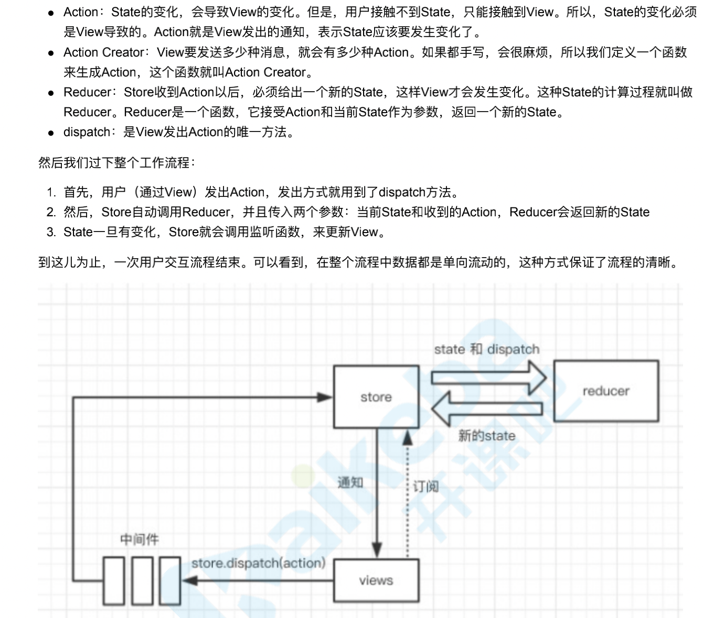

# React 基础

1.  React 不是一个完整的 MVC,MVVM 框架
2.  React 和 web components 不冲突
3.  轻
4.  组件化的开发思路

    - 组件化的概念 -> 可组合、可重用、可维护
      将一个复杂的页面分割成若干个独立组件，每个组件包含自己的逻辑和样式，再讲这些组件组合成一个复杂的页面，这样既减少了逻辑复杂度，又实现了代码的复用

    封装起来具有独立功能的控件 用组件的方式重新去思考 ui 的构成 将 ui 上每一个功能相对独立的模块定义成组件
    小的组件通过任意组合或嵌套的方式，最终构成一个大的组件，完成整体 ui 的构建，意味着高度可重用的
    适用性 在复杂场景下还要求高性能
    重用组件库 组件组合

    所谓的“高效”，是因为 React 独创了 Virtual DOM 机制。Virtual DOM 是一个存在于内存中的 JavaScript 对象，它与 DOM 是一一对应的关系，也就是说只要有 Virtual DOM，我们就能渲染出 DOM。
    当界面发生变化时，得益于高效的 DOM Diff 算法，我们能够知道 Virtual DOM 的变化，从而高效的改动 DOM，避免了重新绘制 DOM。
    当然，React 并不是前端开发的全部。从之前的描述也能看出，它专注于 UI 部分，对应到 MVC 结构中就是 View 层。要想实现完整的 MVC 架构，还需要 Model 和 Controller 的结构。在前端开发时，我们可以采用 Flux 和 Redux 架构，它们并非框架(Library)，而是和 MVC 一样都是一种架构设计(Architecture)。
    如果不从事前端开发，就不用深入的掌握 Flux 和 Redux 架构，但理解这一套体系结构对于后面理解 React Native 非常重要。

# 纯函数的概念

- 返回一个值，没有副作用(不会偷偷修改其他值)
- 理解:不可变值
- 如 arr1 = arr.slice() 比如输入 输出一个数组 返回一个函数 不像 push pop 返回修改后的数组长度

# react 组件的生命周期

- 单组件的生命周期
- 父子组件的生命周期
- 注意 scu 的位置

# 渲染列表，为什么要用 key

- 和 vue 一样，必须使用 key，且不能是 index 和 random
- diff 算法中通过 tag 和 key 来判断，是否是 sameNode
- 减少渲染次数(比如我们的 samenode 中不需要重新创建，只需要移动位置就好了)，提升渲染性能

## 为什么列表要加 key 属性，以及为什么用 index 是不好的
React 使用列表的 key 来进行对比，如果不指定，就默认为 index 下标。
那么，为什么 不指定 key / 用 index 下标 是不好的呢？
```js
const users = [{ username: "bob" }, { username: "sue" }];
users.map((u, i) => <div key={i}>{u.username}</div>);
// 它会渲染出这个 DOM 树：
<div key="1">bob</div>
<div key="2">sue</div>
// 然后用户做了某个操作，users 被 unshift 另一个对象，变成：
const users = [
  { username: "new-guy" },
  { username: "bob" },
  { username: "sue" },
];
// DOM 树就会变成这样，注意 key 的变化：
<div key="1">new-guy</div>
<div key="2">bob</div>
<div key="3">sue</div>
// DOM 树的前后对比是这样的：
<div key="1">bob</div>   |  <div key="1">new-guy</div>
<div key="2">sue</div>   |  <div key="2">bob</div>
                         |  <div key="3">sue</div>
// 我们人类看得出来前后的变化只是在开头加了一个 new-guy 而已。
// 但是由于 React 使用 key 值来识别变化，所以 React 认为的变化是：
bob -> new-guy
sue -> bob
添加 sue
非常消耗性能 ?
但是如果我们一开始就给它指定一个合适的 key，比如用 name：
users.map((u, i) => <div key={u.username}>{u.username}</div>);
React 认为的变化就变成：
                         |  <div key="new-guy">new-guy</div>
<div key="bob">bob</div>   |  <div key="bob">bob</div>
<div key="sue">sue</div>   |  <div key="sue">sue</div>
这样只需要做一个 unshift 操作，性能节省 ?
```
# react和vue横向对比
[diff图解](https://juejin.cn/post/6844904134647234568)
1. Vdom有什么存在的必要？

 * react和vue的dom区别？
   0.1： 早期 innerHtml，$(xx).html,dom全量重写，性能灾难
 * 原则就是: 少操作dom
  1. 响应式：vue1.0，精确追踪数据，变化后最小化操作dom，数据量大了之后(比如watcher过多)，响应式数据过多，造成浏览器卡顿
  2. react15之前 - vdom，没有追踪的概念，每次变化生成新的数据，新老diff，计算出最小操作的dom，数据量大了之后，diff的过程是同步的，经常大于16ms，偶尔卡顿 -> 这个是被动计算的，不同于前面主动追踪的

 * 上面两都有瓶颈
  vue2: 响应式(可以理解为主动追踪)+vdom，看起来是冲突的，这个时候就要以组件为单位(主动追踪和被动diff是如何配合的)，控制颗粒度，响应式走到组件级别，组件内部vdom

 * react16: fiber+hooks
   函数组件主推，函数组件有了内部状态，比class优秀很多
   fiber重点理解
    时间切片：启发？
    1. 前端架构的更迭，本质上是数据结构和计算机逐渐深入的发展
    两个大件 
    * vdom变成了链表
    (树形结构天生比较适合描述我们的vdom，fiber结构的整体依然是一棵树，只不过微观的联系变成了链表
    树是需要递归的，是很难被中断的，如果组件很大，时间就很长，超过16.6ms就会卡
    )
    ```js
    以前的vdom {type,children,props}
    现在的vdom {type,child,return,slibing,props} 
    当前节点我们只知道，第一个子节点是谁，以及右边挨着的兄弟节点，以及父节点是谁
    遍历的方式
    先走子节点，没有子节点，走兄弟节点，如果兄弟节点有子节点，再走子节点，没有兄弟节点和子节点，返回走父节点,这样完整的一个单向遍历的过程
    从以前的递归，变成了单向的一个过程，单向就可以中断掉了，比如diff到这个div上，浏览器新的任务来了，
    把主线程还给浏览器，浏览器进行了一桢动画，(可能用了1ms,还有15.5ms可以让你继续diff)，按照一套逻辑可以把整颗树走完。问题也算解决了
    <!-- https://github.com/yisar/fre --> react的mini实现
    ```
    * 利用浏览器渲染的间隔时间
    2. 16.6ms 一桢 任何占用主进程超过这个时间，都可能会卡顿
       这种任务，我们基本都可以用fiber这个理念来解决，比如md5的计算

vue3
   整体架构和vue2类似，多了一个东西 
   1. composition api 和hooks长的一样(函数式组织数据的方式)
   2. proxy取代defineProperty，利用浏览器新特性
   3. vdom的静态标记 - 静态标签，diff忽略
   block - 任何对dom结构产生影响的标签v-if v-for，内部都是一个block
   无论嵌套多少层，动态节点都是再一个数组里维护，diff的时候不用递归

性能优化
   1. 减小计算量
   2. 空间换时间 - 比如用hash来提升下查询数据的时间
   3. 缓存 
   4. 时间切片，fiber 
   5. react的默认更新机制
   react团队认为给你自由，Component手动挡，定制型更强   

# State Action 概念

1. State
   State 表示 Model 的状态数据，通常表现为一个 javascript 对象（当然它可以是任何值）；操作的时候每次都要当作不可变数（immutable data）来对待，保证每次都是全新对象，没有引用关系，这样才能保证 State 的独立性，便于测试和追踪变化。
2. Action
   Action 是一个普通 javascript 对象，它是改变 State 的唯一途径。无论是从 UI 事件、网络回调，还是 WebSocket 等数据源所获得的数据，最终都会通过 dispatch 函数调用一个 action，从而改变对应的数据。action 必须带有 type 属性指明具体的行为，其它字段可以自定义，如果要发起一个 action 需要使用 dispatch 函数；需要注意的是 dispatch 是在组件 connect Models 以后，通过 props 传入的。
3. dispatch
   dispatching function 是一个用于触发 action 的函数，action 是改变 State 的唯一途径，但是它只描述了一个行为，而 dispatch 可以看作是触发这个行为的方式，而 Reducer 则是描述如何改变数据的。

4. Reducer（也称为 reducing function）函数接受两个参数：之前已经累积运算的结果和当前要被累积的值，返回的是一个新的累积结果。该函数把一个集合归并成一个单值

   Reducer 的概念来自于是函数式编程，很多语言中都有 reduce API。如在 javascript 中

   ```js
   [{ x: 1 }, { y: 2 }, { z: 3 }].reduce(function (prev, next) {
     console.log(prev, next);
     return Object.assign(prev, next);
   });
   // {x: 1} {y: 2}
   // {x: 1, y: 2} {z: 3}
   // {x: 1, y: 2, z: 3}
   ```

   Effect 被称为副作用，在我们的应用中，最常见的就是异步操作。它来自于函数编程的概念，之所以叫副作用是因为它使得我们的函数变得不纯，同样的输入不一定获得同样的输出。
   dva 为了控制副作用的操作，底层引入了 redux-sagas 做异步流程控制，由于采用了 generator 的相关概念，所以将异步转成同步写法，从而将 effects 转为纯函数

## 更新元素渲染

- React 元素都是不可逆的，当元素被创建之后，是无法改变其内容和属性的，一个元素就好像是动画里的一桢，他代表应用动画在某一时间点的样式
- 更新界面唯一的办法就是创建一个新的元素，然后将其传入 ReactDom.render 方法

## React 只会更新必要的部分

- React Dom 首先会比较元素内容先后的不同，而在渲染过程中只会更改改变了的部分
- 即便我们每秒都创建了一个描述整个 UI 树的新元素，也只会更新渲染文本节点中发生变化的内容

## 状态

1. 组件的数据来源有两个地方 分别是属性对象和状态对象
2. 属性是父组件传递过来的(默认属性和属性校验)
3. 状态是自己内部的，改变状态的唯一方式就是 setState
4. 属性和状态的变化都会影响视图更新 重新调用一个 render 方法，得到新的虚拟 dom，进行 dom 更新

- 不要直接修改 state 构造函数是唯一可以给 this.state 赋值的地方
- state 更新可能是异步的

  1. 出于性能考虑，react 可能会把多个 setState 调用合并成一个调用
  2. 因为 this.props 和 this.state 可能会异步更新，不能依赖他们的值来更新下一个状态
     组件并不会立刻渲染，而是先把更新存起来，等事件处理函数执行完了之后，才会批量更新
  3. 可以让 setState 接受一个函数而不是一个对象，这个函数用上个 state 作为第一个参数

- state 的更新可能会被合并
  当我们调用 setState 的时候，React 会把提供的对象合并到当前的 state

  - 在事件处理函数中，或者生命周期函数中 批量更新
  - 在其他地方都是直接同步更新，比如定时器中 同步更新(宏任务了 和 react 没关系了)

- 数据流是向下流动的
- 事件处理
  - 传入函数作为事件处理函数，不能是字符串
  - 不能通过返回 false 的方式阻止默认行为

# React 事件 和 Dom 事件的区别

react 事件机制

思考？

- 1.  如何绑定事件
- 2.  如何实现组件更新
- 3.  如何实现组件异步更新

1. React 为什么要用合成事件

   React 并不是将 click 事件直接绑定在 dom 上面，而是采用事件冒泡的形式冒泡到 document 上面，然后 React 将事件封装给正式的函数处理运行和处理

   - 合成事件的监听器是统一注册在 document 上的，且仅有冒泡阶段。所以原生事件的监听器响应总是比合成事件的监听器早
   - 阻止原生事件的冒泡后，会阻止合成事件的监听器执行

   如果 DOM 上绑定了过多的事件处理函数，整个页面响应以及内存占用可能都会受到影响。React 为了避免这类 DOM 事件滥用，同时屏蔽底层不同浏览器之间的事件系统差异，实现了一个中间层——SyntheticEvent。

   1. 当用户在为 onClick 添加函数时，React 并没有将 Click 事件绑定在 DOM 上面。
   2. 而是在 document 处监听所有支持的事件，当事件发生并冒泡至 document 处时，React 将事件内容封装交给中间层 SyntheticEvent（负责所有事件合成）
   3. 所以当事件触发的时候，对使用统一的分发函数 dispatchEvent 将指定函数执行。

2. 事件机制：注册和分发的过程。这里面至少要说出事件注册都是在元素的最顶层 document 节点上。
   原生绑定快于合成事件绑定，不要将原生事件（addEventListener）和 React 合成事件一起混合使用，这两个机制是不一样的。

# React 事件

```js
 /**
   * 合成事件
   * 1. 我们的事件对象是一个临时对象 用完就销毁掉了 实现一个共享对象的效果，节约内存 方便回收
   * 2. 为了批量更新  updateQueue
   * event 不是dom原生的 是经过react封装的 事件委托->document 在react17 绑定到根节点了
   */

class EventDemo extends React.Component {
  constructor(props) {
    super(props);
    this.state = {
      name: 'zhangsan',
      list: [
        {
          id: 'id-1',
          title: '标题1',
        },
        {
          id: 'id-2',
          title: '标题2',
        },
        {
          id: 'id-3',
          title: '标题3',
        },
      ],
    };
    // 修改方法的 this 指向
    this.clickHandler1 = this.clickHandler1.bind(this);
  }
  render() {
    return (
      <ul>
        {this.state.list.map((item, index) => {
          return (
            <li
              key={item.id}
              onClick={this.clickHandler4.bind(this, item.id, item.title)}
            >
              index {index}; title {item.title}
            </li>
          );
        })}
      </ul>
    );
  }
  clickHandler1() {
    // console.log('this....', this) // this 默认是 undefined
    this.setState({
      name: 'lisi',
    });
  }
  // 静态方法，this 指向当前实例
  clickHandler2 = () => {
    this.setState({
      name: 'lisi',
    });
  };
  // 获取 event
  clickHandler3 = (event) => {
    event.preventDefault(); // 阻止默认行为
    event.stopPropagation(); // 阻止冒泡
    console.log('target', event.target); // 指向当前元素，即当前元素触发
    console.log('current target', event.currentTarget); // 指向当前元素，假象！！！

    // 注意，event 其实是 React 封装的。可以看 __proto__.constructor 是 SyntheticEvent 组合事件
    console.log('event', event); // 不是原生的 Event ，原生的 MouseEvent
    console.log('event.__proto__.constructor', event.__proto__.constructor);

    // 原生 event 如下。其 __proto__.constructor 是 MouseEvent
    console.log('nativeEvent', event.nativeEvent);
    console.log('nativeEvent target', event.nativeEvent.target); // 指向当前元素，即当前元素触发
    console.log('nativeEvent current target', event.nativeEvent.currentTarget); // 指向 document ！！！

    // 1. event 是 SyntheticEvent ，模拟出来 DOM 事件所有能力
    // 2. event.nativeEvent 是原生事件对象
    // 3. 所有的事件，都被挂载到 document 上
    // 4. 和 DOM 事件不一样，和 Vue 事件也不一样
  };
  // 传递参数
  clickHandler4(id, title, event) {
    console.log(id, title);
    console.log('event', event); // 最后追加一个参数，即可接收 event
  }
}
export default EventDemo;
```

# 组件动态

```js
  shouldComponentUpdate(nextProps, nextState) {
      if (nextProps.text !== this.props.text
          || nextProps.length !== this.props.length) {
          return true // 可以渲染
      }
      return false // 不重复渲染
  }

  // React 默认机制：父组件有更新，子组件则无条件也更新！！！
  // 性能优化对于 React 更加重要！
  // SCU 一定要每次都用吗？—— 需要的时候才优化
```

# 更新器

```js
class Updater {
  constructor() {
    this.state = { number: 0, name: 'zl' };
    this.queues = [];
  }

  setState(newState) {
    this.queues.push(newState);
  }

  // react会帮我们包装一层事件 当调用完事件的时候，再去调用flush
  flush() {
    this.queues.forEach((update) => {
      if (typeof update === 'function') {
        // 将上次的状态传入
        this.state = { ...this.state, ...update(this.state) };
      } else {
        this.state = { ...this.state, ...update };
      }
    });
  }
}

let updater = new Updater();

updater.setState({ number: 1 });
updater.setState({ number: 2 });
updater.setState({ number: 3 });
updater.setState((prevState) => ({ number: prevState.number + 1 }));
updater.flush();
console.log(updater.state); //{ number: 4 }
```

# state 不可变值

我们的回调函数是在值全部更新结束之后调用

```js
// count 初始值为 0
this.setState({ count: this.state.count + 1 });
console.log('1', this.state.count); // 0
this.setState({ count: this.state.count + 1 });
console.log('2', this.state.count); // 0
setTimeout(() => {
  this.setState({ count: this.state.count + 1 });
  console.log('3', this.state.count); // 2
});
setTimeout(() => {
  this.setState({ count: this.state.count + 1 });
  console.log('4', this.state.count); // 3
});
```

1. state 要在构造函数中定义
2. 不要直接修改 state ，使用不可变值

```js
const list5Copy = this.state.list5.slice();
list5Copy.splice(2, 0, 'a'); // 中间插入/删除
this.setState({
  list1: this.state.list1.concat(100), // 追加
  list2: [...this.state.list2, 100], // 追加
  list3: this.state.list3.slice(0, 3), // 截取
  list4: this.state.list4.filter((item) => item > 100), // 筛选
  list5: list5Copy, // 其他操作
});
// 注意，不能直接对 this.state.list 进行 push pop splice 等，这样违反不可变值

this.setState({
  obj1: Object.assign({}, this.state.obj1, { a: 100 }),
  obj2: { ...this.state.obj2, a: 100 },
});
```

3. setState 可能是异步更新（有可能是同步更新）

```js
  // setTimeout 中 setState 是同步的
  setTimeout(() => {
      this.setState({
          count: this.state.count + 1
      })
      console.log('count in setTimeout', this.state.count)
  }, 0)
  // 自己定义的 DOM 事件，setState 是同步的。再 componentDidMount 中

  bodyClickHandler = () => {
    this.setState({
        count: this.state.count + 1
    })
    console.log('count in body event', this.state.count)
  }
  componentDidMount() {
    // 自己定义的 DOM 事件，setState 是同步的
    document.body.addEventListener('click', this.bodyClickHandler)
  }
  componentWillUnmount() {
    // 及时销毁自定义 DOM 事件
    document.body.removeEventListener('click', this.bodyClickHandler)
    // clearTimeout
  }
```

4. state 异步更新的话，更新前会被合并(setState 是批量执行的，因此对同一个状态执行多次只起一次作用，多个状态更新可以放在同一个 setState 中进行,setState 通常是异步的，因此如果要获取到最新状态值有以下三种方式

- 传递函数给 setState 方法
- 使用定时器

```js
setTimeout(() => {
  console.log(this.state.counter);
}, 0);
```

- 原生事件中修改状态

```js
componentDidMount(){
    document.body.addEventListener('click', this.changeValue, false)
}
changeValue = () => {
   this.setState({counter: this.state.counter+1})
   console.log(this.state.counter)
}
```

```js
// 传入对象，会被合并（类似 Object.assign ）。执行结果只一次 +1
  this.setState({
      count: this.state.count + 1
  })
  this.setState({
      count: this.state.count + 1
  })
  this.setState({
      count: this.state.count + 1
  })

  // 传入函数，不会被合并。执行结果是 +3 会把每一次的结果传递下去
  this.setState((prevState, props) => {
      return {
          count: prevState.count + 1
      }
  })
  this.setState((prevState, props) => {
      return {
          count: prevState.count + 1
      }
  })
  this.setState((prevState, props) => {
      return {
          count: prevState.count + 1
      }
  })
  // text counter
  this.setState(
    (nextState) => {
      console.log(nextState.counter);
      return { counter: nextState.counter + 1 };
    },
    () => {
      console.log(this.state.counter);
    }
  );
  console.log(this.state.counter);
  this.setState(
    (nextState) => {
      console.log(nextState.counter);
      return { counter: nextState.counter + 1 };
    },
    () => {
      console.log(this.state.counter);
    }
  );
  console.log(this.state.counter);
  this.setState(
    (nextState) => {
      console.log(nextState.counter);
      return { counter: nextState.counter + 1 };
    },
    () => {
      console.log(this.state.counter);
    }
  );
  console.log(this.state.counter);
}
// 0 0 0 0 1 2 3 3 3
```

# 函数组件的状态管理

```js
function ClockFunc() {
  // useState创建一个状态和修改该状态的函数
  const [date, setDate] = useState(new Date());
  // useEffect编写副作用代码
  useEffect(() => {
    // 启动定时器是我们的副作用代码
    const timerID = setInterval(() => {
      setDate(new Date());
    }, 1000);
    // 返回清理函数
    return () => clearInterval(timerID);
  }, []);
  // 参数2传递空数组使我们参数1函数仅执行一次
  return <div>{date.toLocaleTimeString()}</div>;
}
```

# 更新原因总结

在 React 中，如果是由 React 引发的事件处理（⽐如通过 onClick 引发的事件处理），调⽤ setState 不会
同步更新 this.state，除此之外的 setState 调⽤会同步执⾏ this.state。所谓“除此之外”，指的是绕过
React 通过 addEventListener 直接添加的事件处理函数，还有通过 setTimeout/setInterval 产⽣的异步调
⽤。

原因：在 React 的 setState 函数实现中，会根据⼀个变量 isBatchingUpdates 判断是直接更新 this.state 还
是放到队列中回头再说，⽽ isBatchingUpdates 默认是 false，也就表示 setState 会同步更新 this.state，
但是，有⼀个函数 batchedUpdates，这个函数会把 isBatchingUpdates 修改为 true，⽽当 React 在
调⽤事件处理函数之前就会调⽤这个 batchedUpdates，造成的后果，就是由 React 控制的事件处理过
程 setState 不会同步更新 this.state

# 组件通信

1. Props 属性传递可用于父子组件相互通信
2. 如果父组件传递的是函数，则可以把子组件信息传入父组件，这个常称为状态提升，StateMgt.js
乐观更新：
达到了一个共享数据和代码简易的平衡，随着场景的复杂，比如很远的组件要调用一个列表的刷新，比如创建，此时状态提升就不用了，需要全局状态管理


```js
// StateMgt
<Clock change={this.onChange} />;
// Clock
this.timerId = setInterval(() => {
  // 通过setState更新状态
  this.setState(
    {
      date: new Date(),
    },
    () => {
      // 每次状态更新就通知父组件
      this.props.change(this.state.date);
    }
  );
}, 1000);
```

# 跨层级组价通信

context

# Redux

## 核心概念
### 单向数据流概述
* dispatch(action)
* reducer->newReducer
* subscribe 触发通知

* Store：保存数据的地⽅，你可以把它看成⼀个容器，整个应⽤只能有⼀个Store。

- Redux 本身是一个很轻的库，解决 component -> action -> reducer -> state 的单向数据流转问题。
  按我理解，他有两个非常突出的特点是：

  1. predictable，可预测性
  2. 可扩展性
     可预测性是由于他大量使用 pure function 和 plain object 等概念(reducer 和 action creator 是 pure function，state 和 action 是 plain object)，并且 state 是 immutable 的。这对于项目的稳定性会是非常好的保证。
     可扩展性则让我们可以通过 middleware 定制 action 的处理，通过 reducer enhancer 扩展 reducer 等等。从而有了丰富的社区扩展和支持，比如异步处理、Form、router 同步、redux/undo、性能问题(selector)、工具支持。

2. 库的选择

   但是那么多的社区扩展，我们应该如何选才能组成我们的最佳实践? 以异步处理为例。(这也是我觉得最重要的一个问题)
   用地比较多的通用解决方案有这些：

   - redux-thunk
   - redux-promise
   - redux-saga
     redux-thunk 是支持函数形式的 action，这样在 action 里就可以 dispatch 其他的 action 了。这是最简单应该也是用地最广的方案吧，对于简单项目应该是够的。
     redux-promise 和上面的类似，支持 promise 形式的 action，这样 action 里就可以通过看似同步的方式来组织代码。
     但 thunk 和 promise 都有的问题是，他们改变了 action 的含义，使得 action 变得不那么纯粹了。
     然后出现的 redux-saga 让我眼前一亮，具体不多说了，可以看他的文档。总之给我的感觉是优雅而强大，通过他可以把所有的业务逻辑都放到 saga 里，这样可以让 reducer, action 和 component 都很纯粹，干他们原本需要干的事情。
     所以在异步处理这一环节，我们选择了 redux-saga。
     最终通过一系列的选择，我们形成了基于 redux 的最佳实践。

## 区别？
### redux-thunk
```js
优点：
体积⼩: redux-thunk的实现⽅式很简单,只有不到20⾏代码 
使⽤简单: redux-thunk没有引⼊像redux-saga或者redux-observable额外的范式,上⼿简单 

redux-thunk缺陷: 样板代码过多: 与redux本身⼀样,通常⼀个请求需要⼤量的代码,⽽且很多都是重复性质的 耦合严重: 异步操作与redux的action偶合在⼀起,不⽅便管理 功能孱弱: 有⼀些实际开发中常⽤的功能需要⾃⼰进⾏封装
```

### redux-saga
```js
redux-saga优点:

 1. 异步解耦: 异步操作被被转移到单独 saga.js 中，不再是掺杂在 action.js 或 component.js 中 
 2. action摆脱thunk function: dispatch 的参数依然是⼀个纯粹的 action (FSA)，⽽不是充满 “⿊魔法” thunk function 
 3. 异常处理: 受益于 generator function 的 saga 实现，代码异常/请求失败 都可以直接通过 try/catch 语法直接捕获处理
 4. 功能强⼤: redux-saga提供了⼤量的Saga 辅助函数和Effect,创建器供开发者使⽤,开发者⽆须封装或者简单封装即 可使⽤ 
 5. 灵活: redux-saga可以将多个Saga可以串⾏/并⾏组合起来,形成⼀个⾮常实⽤的异步flow 易测试，提供了各种case的测试⽅案，包括mock task，分⽀覆盖等等

redux-saga缺陷: 
1. 额外的学习成本: redux-saga不仅在使⽤难以理解的 generator function,⽽且有数⼗个API,学习成本远超redux-thunk,最重要的是你的额外学习成本是只服务于这个库的,与redux-observable不同,redux-observable虽然也有额外 学习成本但是背后是rxjs和⼀整套思想 
2. 体积庞⼤: 体积略⼤,代码近2000⾏，min版25KB左右 
3. 功能过剩: 实际上并发控制等功能很难⽤到,但是我们依然需要引⼊这些代码 
4. ts⽀持不友好: yield⽆法返回TS类型

```
### 
```js
redux-observable优点: 
1. 功能最强: 由于背靠rxjs这个强⼤的响应式编程的库,借助rxjs的操作符,你可以⼏乎做任何你能想到的异步处理 
2. 背靠rxjs: 由于有rxjs的加持,如果你已经学习了rxjs,redux-observable的学习成本并不⾼,⽽且随着rxjs的升级redux- observable也会变得更强⼤ 

redux-observable缺陷: 
1. 学习成本奇⾼: 如果你不会rxjs,则需要额外学习两个复杂的库 
2. 社区⼀般: redux-observable的下载量只有redux-saga的1/5,社区也不够活跃,在复杂异步流中间件这个层⾯redux- saga仍处于领导地位
```
# React V16.3 之前的生命周期

[React v16.3 新生命周期浅谈](https://blog.csdn.net/c_kite/article/details/80303341)
[为什么一定要在 componentDidMount 里面调用？](https://blog.csdn.net/ky1in93/article/details/81362442?utm_medium=distribute.pc_relevant_t0.none-task-blog-BlogCommendFromMachineLearnPai2-1.nonecase&depth_1-utm_source=distribute.pc_relevant_t0.none-task-blog-BlogCommendFromMachineLearnPai2-1.nonecase)

- 第一个是组件初始化(initialization)阶段

  1. 也就是以下代码中类的构造方法( constructor() ),Lifecycle 类继承了 react Component 这个基类，也就继承这个 react 的基类，才能有 render(),生命周期等方法可以使用，这也说明为什么 函数组件不能使用这些方法 的原因。

  2. super(props) 用来调用基类的构造方法( constructor() ), 也将父组件的 props 注入给子组件，功子组件读取(组件中 props 只读不可变，state 可变)。 而 constructor() 用来做一些组件的初始化工作，如定义 this.state 的初始内容。

- 第二个是组件的挂载(Mounting)阶段

  此阶段分为 componentWillMount，render，componentDidMount 三个时期。

  1. componentWillMount:
     在组件挂载到 DOM 前调用，且只会被调用一次，在这边调用 this.setState 不会引起组件重新渲染，也可以把写在这边的内容提前到 constructor()中，所以项目中很少用。

  2. render:
     根据组件的 props 和 state（无两者的重传递和重赋值，论值是否有变化，都可以引起组件重新 render，return
     一个 React 元素（描述组件，即 UI），不负责组件实际渲染工作，之后由 React 自身根据此元素去渲染出页面
     DOM。render 是纯函数（Pure function：函数的返回结果只依赖于它的参数；函数执行过程里面没有副作用），
     不能在里面执行 this.setState，会有改变组件状态的副作用。

  3. componentDidMount:
     组件挂载到 DOM 后调用，且只会被调用一次

- 第三个是组件的更新(update)阶段

  在讲述此阶段前需要先明确下 **react 组件更新机制**。**setState 引起的 state 更新或父组件重新 render 引起的 props 更新，更新后的 state 和 props 相对之前无论是否有变化，都将引起子组件的重新 render**

  - 造成组件更新有两类（三种）情况：

    1. 父组件重新 render 引起子组件重新 render 的情况有两种

    - 直接使用,每当父组件重新 render 导致的重传 props，子组件将直接跟着重新渲染，无论 props 是否有变化。可通过 shouldComponentUpdate 方法优化
    - 在 componentWillReceiveProps 方法中，将 props 转换成自己的 state
      ```
        componentWillReceiveProps(nextProps) {
          //父组件重传props时就会调用这个方法
          this.setState({ someThings: nextProps.someThings });
        }
      ```
      根据官网的描述,在该函数(componentWillReceiveProps)中调用 this.setState() 将不会引起第二次渲染,
      是因为 componentWillReceiveProps 中判断 props 是否变化了，若变化了，this.setState 将引起 state 变化，从而引起 render，此时就没必要再做第二次因重传 props 引起的 render 了，不然重复做一样的渲染了。

    2. 组件本身调用 setState，无论 state 有没有变化。可通过 shouldComponentUpdate 方法优化。

    ```
      shouldComponentUpdate(nextStates) {
        // 应该使用这个方法，否则无论state是否有变化都将会导致组件 重新渲染
        if (nextStates.someThings === this.state.someThings) {
        return false;
        }
      }
    ```

- 此阶段分为 componentWillReceiveProps，shouldComponentUpdate，componentWillUpdate，render，componentDidUpdate

  - componentWillReceiveProps(nextProps)
    此方法只调用于 props 引起的组件更新过程中，参数 nextProps 是父组件传给当前组件的新 props。但父组件 render
    方法的调用不能保证重传给当前组件的 props 是有变化的，所以在此方法中根据 nextProps 和 this.props 来查明重传
    的 props 是否改变，以及如果改变了要执行啥，比如根据新的 props 调用 this.setState 出发当前组件的重新 render

  - shouldComponentUpdate(nextProps, nextState)
    此方法通过比较 nextProps，nextState 及当前组件的 this.props，this.state，返回 true 时当前组件将继续执行更新
    过程，返回 false 则当前组件更新停止，以此可用来减少组件的不必要渲染，优化组件性能。
    ps：这边也可以看出，就算 componentWillReceiveProps()中执行了 this.setState，更新了 state，但在 render 前
    （如 shouldComponentUpdate，componentWillUpdate），this.state 依然指向更新前的 state，不然 nextState
    及当前组件的 this.state 的对比就一直是 true 了。

  - componentWillUpdate(nextProps, nextState)
    此方法在调用 render 方法前执行，在这边可执行一些组件更新发生前的工作，一般较少用。

  - render
    render 方法在上文讲过，这边只是重新调用。

  - componentDidUpdate(prevProps, prevState)
    此方法在组件更新后被调用，可以操作组件更新的 DOM，prevProps 和 prevState 这两个参数指的是组件更新前的
    props 和 state

- 卸载阶段
  componentWillUnmount
  此方法在组件被卸载前调用，可以在这里执行一些清理工作，比如清楚组件中使用的定时器，清楚
  componentDidMount 中手动创建的 DOM 元素等，以避免引起内存泄漏。

# React v16.3 之后的组件生命周期函数

[生命周期](https://zhuanlan.zhihu.com/p/38030418)

变更缘由
原来（React v16.0 前）的生命周期在 React v16 推出的 Fiber 之后就不合适了，因为如果要开启 async rendering， 在 render 函数之前的所有函数，都有可能被执行多次。componentWillReceiveProps 中 setState
也可能会死循环(因为 fiber 组件的挂载和更新是可以打断和暂停的 will可能会执行多次，不合理)

原来（React v16.0 前）的生命周期有哪些是在 render 前执行的呢？
componentWillMount
componentWillReceiveProps
shouldComponentUpdate
componentWillUpdate

如果开发者开了 async rendering，而且又在以上这些 render 前执行的生命周期方法做 AJAX 请求的话，那 AJAX 将被
无谓地多次调用。。。明显不是我们期望的结果。而且在 componentWillMount 里发起 AJAX，不管多快得到结果
也赶不上首次 render，而且 componentWillMount 在服务器端渲染也会被调用到（当然，也许这是预期的结
果），这样的 IO 操作放在 componentDidMount 里更合适。

禁止不能用比劝导开发者不要这样用的效果更好，所以除了 shouldComponentUpdate，其他在 render 函数之前的
所有函数（componentWillMount，componentWillReceiveProps，componentWillUpdate）都被
getDerivedStateFromProps 替代。

也就是用一个静态函数 getDerivedStateFromProps 来取代被 deprecate 的几个生命周期函数，就是强制开发者在
render 之前只做无副作用的操作，而且能做的操作局限在根据 props 和 state 决定新的 state

React v16.0 刚推出的时候，是增加了一个 componentDidCatch 生命周期函数，这只是一个增量式修改，完全不影
响原有生命周期函数；但是，到了 React v16.3，大改动来了，引入了两个新的生命周期函数。

新引入了两个新的生命周期函数： getDerivedStateFromProps ， getSnapshotBeforeUpdate

- getDerivedStateFromProps

static getDerivedStateFromProps(props, state) 在组件创建时和更新时的 render 方法之前调用，它应该返回
一个对象来更新状态，或者返回 null 来不更新任何内容。

getDerivedStateFromProps 本来（React v16.3 中）是只在创建和更新（由父组件引发部分），也就是不是由父
组件引发，那么 getDerivedStateFromProps 也不会被调用，如自身 setState 引发或者 forceUpdate 引发。


这样的话理解起来有点乱，在 React v16.4 中改正了这一点，让 getDerivedStateFromProps 无论是 Mounting 还是
Updating，也无论是因为什么引起的 Updating，全部都会被调用，具体可看 React v16.4 的生命周期图。

- getSnapshotBeforeUpdate

getSnapshotBeforeUpdate() 被调用于 render 之后，可以读取但无法使用 DOM 的时候。它使您的组件可以在可
能更改之前从 DOM 捕获一些信息（例如滚动位置）。此生命周期返回的任何值都将作为参数传递给
componentDidUpdate（）。

```js
class ScrollingList extends React.Component {
  constructor(props) {
    super(props);
    this.listRef = React.createRef();
  }
  getSnapshotBeforeUpdate(prevProps, prevState) {
    //我们是否要添加新的 items 到列表? // 捕捉滚动位置，以便我们可以稍后调整滚动.
    if (prevProps.list.length < this.props.list.length) {
      const list = this.listRef.current;
      return list.scrollHeight - list.scrollTop;
    }
    return null;
  }
  componentDidUpdate(prevProps, prevState, snapshot) {
    //如果我们有snapshot值, 我们已经添加了 新的items.
    // 调整滚动以至于这些新的items 不会将旧items推出视图。
    // (这边的snapshot是 getSnapshotBeforeUpdate方法的返回值)
    if (snapshot !== null) {
      const list = this.listRef.current;
      list.scrollTop = list.scrollHeight - snapshot;
    }
  }
  render() {
    return <div ref={this.listRef}>{/* ...contents... */}</div>;
  }
}
```

# react 组件化开发

1. 组件跨层级同喜 context

React 使用 Context 实现祖代组件向后代组件跨层级传值，vue 中 provider & inject 来源于 Context
Context 模式下有两个角色 Provider(外层提供数据的组件)、Consumer(内层获取数据的组件)
使用: 创建 Context => 获取 Provider 和 Consumer => Provider 提供值 => Consumer 消费值
[context](https://reactjs.org/docs/context.html)

2. 高阶组件
3. 组件复合 Composition
   复合组件给以你足够的敏捷去定义组件的外观和行为，如果组件有公共的非 ui 的逻辑，将他们抽取为 js 模块导入使用而不是继承他们

```js
import React, { Component } from 'react';
import {
  createPortal,
  unmountComponentAtNode,
  unstable_renderSubtreeIntoContainer,
} from 'react-dom';

export class Dialog2 extends React.Component {
  // render一个null，目的什么内容都不渲染
  render() {
    return null;
  }

  componentDidMount() {
    // 首次挂载时候创建宿主div
    const doc = window.document;
    this.node = doc.createElement('div');
    doc.body.appendChild(this.node);

    this.createPortal(this.props);
  }

  componentDidUpdate() {
    this.createPortal(this.props);
  }

  componentWillUnmount() {
    // 清理节点
    unmountComponentAtNode(this.node);
    //   清理宿主div
    window.document.body.removeChild(this.node);
  }

  createPortal(props) {
    unstable_renderSubtreeIntoContainer(
      this, //当前组件
      <div className="dialog">
        {/* 具名插槽的实现 */}
        <div>{props.children.def}</div>
        <div>{props.children.footer}</div>
      </div>, // 塞进传送门的JSX
      this.node // 传送门另一端的DOM node
    );
  }
}

export default class Dialog extends Component {
  constructor(props) {
    super(props);

    this.node = document.createElement('div');
    document.body.appendChild(this.node);
  }

  render() {
    // 将createPortal参数1声明的jsx挂载到node上   这里的props.children 就代表了标签内部内容
    // children 就是合法的表达式
    return createPortal(<div>{this.props.children}</div>, this.node);
  }

  // 清理div
  componentWillUnmount() {
    document.body.removeChild(this.node);
  }
}
```

# 高阶应用

如果 props.children 是 jsx，此时它是不能修改的
范例：实现 RadioGroup 和 Radio 组件，可通过 RadioGroup 设置 Radio 的 name

```js
// Dialog定义组件外观和行为
function Dialog(props) {
  // 这里props.children代表了标签内部内容
  //   children是什么？合法js表达式
  //   console.log(props.children);
  // 备选消息
  const messages = {
    foo: { title: 'foo', content: 'foo~' },
    bar: { title: 'bar', content: 'bar~' },
  };
  // 执行函数获得要显示的内容
  const { def, footer } = props.children(messages[props.msg]);

  return (
    <div style={{ border: '1px solid blue' }}>
      {def}
      <div>{footer}</div>
    </div>
  );
}
function RadioGroup(props) {
  console.log(props); // name  children
  return (
    <div>
      {/* 这个地方是个静态方法  我们需要先把需要的数据穿进去  radio vNode的实例 */}
      {React.Children.map(props.children, (radio) => {
        // 要修改虚拟dom 只能克隆它
        // 参数1是克隆对象
        // 参数2是设置的属性
        return React.cloneElement(radio, { name: props.name });
      })}
    </div>
  );
}
function Radio({ children, ...abc }) {
  return (
    <label>
      <input type="radio" {...abc} />
      {children}
    </label>
  );
}
export default function Composition() {
  return (
    <div>
      <Dialog msg="foo">
        {({ title, content }) => ({
          def: (
            <>
              <h1>{title}</h1>
              <p>{content}</p>
            </>
          ),
          footer: <button onClick={() => alert('react真好')}>确定</button>,
        })}
      </Dialog>
      {/* 这个地方我想把  name mvvm 传递给我的子组件 这个时候是不能改的*/}
      <RadioGroup name="mvvm">
        <Radio value="vue">vue</Radio>
        <Radio value="react">react</Radio>
        <Radio value="ng">angular</Radio>
      </RadioGroup>

      {/* <div>
          <input type="radio" name="mvvm"/>vue
          <input type="radio" name="mvvm"/>react
          <input type="radio" name="mvvm"/>angular
      </div> */}
    </div>
  );
}
```

4. Hooks Api

特点
无须修改组件结构的情况下复用状态逻辑
可使组件中相互关联的部分拆分成更小的函数，复杂组件将变得更容易理解
更简洁易懂

- Effect Hook 副作用钩子
  useEffect 给函数组件增加了执行副作用操作的能力。
  副作用（Side Effect）是指一个 function 做了和本身运算返回值无关的事，比如：修改了全局变量、修改了传入的
  参数、甚至是 console.log()，所以 ajax 操作，修改 dom 都是算作副作用。
  清除工作：有一些副作用是需要清除的，清除工作非常重要的，可以防止引起内存泄露

- useReducer
  useReducer 是 useState 的可选项，常用于组件有复杂状态逻辑时，类似于 redux 中 reducer 概念。

- useContext
  useContext 用于在快速在函数组件中导入上下文。

- 自定义 hook
  [](https://zh-hans.reactjs.org/docs/hooks-custom.html)

```js
import React, { useState, useEffect, useReducer, useContext } from 'react';

// 仅展示水果列表
function FruitList({ fruits, onSetFruit }) {
  return (
    <ul>
      {fruits.map((f) => (
        <li key={f} onClick={() => onSetFruit(f)}>
          {f}
        </li>
      ))}
    </ul>
  );
}
// 声明输入组件
function FruitAdd(props) {
  // 使用useContext获取上下文
  const { dispatch } = useContext(Context);

  // 输入内容状态及设置内容状态的方法
  const [pname, setPname] = useState('');
  // 键盘事件处理
  const onAddFruit = (e) => {
    if (e.key === 'Enter') {
      //   props.onAddFruit(pname);
      dispatch({ type: 'add', payload: pname });
      setPname('');
    }
  };
  return (
    <div>
      <input
        type="text"
        value={pname}
        onChange={(e) => setPname(e.target.value)}
        onKeyDown={onAddFruit}
      />
    </div>
  );
}

// 添加fruit状态维护fruitReducer
// 理解为vuex里面mutations
function fruitReducer(state, action) {
  console.log(action);

  switch (action.type) {
    case 'init':
      return action.payload;
    case 'add':
      return [...state, action.payload];
    default:
      return state;
  }
}

// 创建上下文
const Context = React.createContext();

export default function HooksTest() {
  // useState(initialState)，接收初始状态，返回一个由状态和其更新函数组成的数组
  const [fruit, setFruit] = useState('');
  //   const [fruits, setFruits] = useState([]);

  // 参数1是reducer
  // 参数2是初始值
  const [fruits, dispatch] = useReducer(fruitReducer, []);

  // 异步获取水果列表
  useEffect(() => {
    console.log('useEffect');
    setTimeout(() => {
      dispatch({ type: 'init', payload: ['香蕉', '西瓜'] });
      //   setFruits(["香蕉", "西瓜"]);
    }, 1000);
  }, []); // 依赖为空表示只执行一次

  useEffect(() => {
    document.title = fruit;
    // ajax
  }, [fruit]);

  useEffect(() => {
    const timer = setInterval(() => {
      console.log('msg');
    }, 1000);

    return function () {
      clearInterval(timer);
    };
  }, []);

  return (
    <Context.Provider value={{ fruits, dispatch }}>
      {/* 提供上下文的值 */}
      <div>
        <FruitAdd />
        <p>{fruit === '' ? '请选择喜爱的水果：' : `您的选择是：${fruit}`}</p>
        {/* 列表 */}
        <FruitList fruits={fruits} onSetFruit={setFruit} />
      </div>
    </Context.Provider>
  );
}
```
