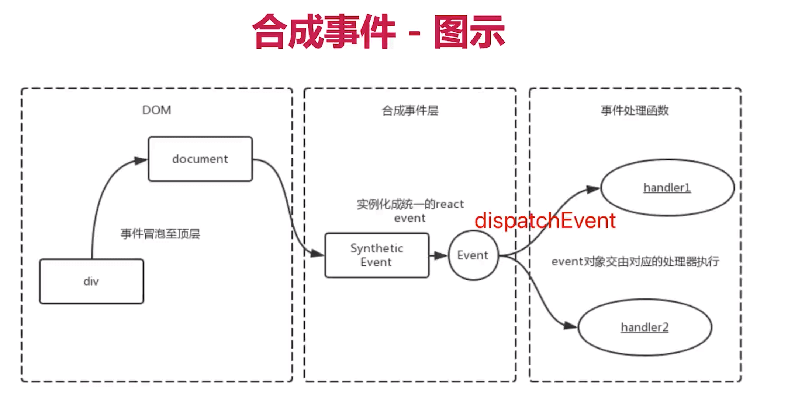

# 合成事件
react 合成事件：定义在JSX组件上的事件。

## 设计目的
设计目的：
  - 避免 DOM 事件滥用
  - 屏蔽底层不同浏览器之间的事件系统差异
如果 React 事件绑定在了真实 DOM 节点上，一个节点同事有多个事件时，页面的响应和内存的占用会受到很大的影响。因此 SyntheticEvent 作为中间层出现了。事件没有在目标对象上绑定，而是在 document 上监听所支持的所有事件，当事件发生并冒泡至 document 时，React 将事件内容封装并叫由真正的处理函数运行。

合成事件理解：  
当用户在为 onClick 添加函数时，React 并没有将 Click 事件绑定在 DOM 上面。而是在 document 处监听所有支持的事件，当事件发生并冒泡至 document 处时，React 将事件内容封装交给中间层 SyntheticEvent（负责所有事件合成），所以当事件触发的时候，对使用统一的分发函数 dispatchEvent 将指定函数执行。

## 例子
观察如下代码中的几个现象，建议动手实践收获更多。  
1. @1 原生事件的监听器响应总是比合成事件的监听器早  
2. 放开 @2 处注释  
3. 放开 @3 处注释  
4. 放开 @4 处注释  
```js
class App extends React.Component {
    componentDidMount(){
        const target = document.getElementById('test')
        target.addEventListener('click', (e)=>{
            /* @1 首先DOM事件监听器被执行，然后事件继续冒泡至document，合成事件监听器再被执行。 */
            // e.stopPropagation() //@2 由于DOM事件被阻止冒泡了，无法到达document，所以合成事件不会被触发，控制台输出就变成了：document
            console.log('test dom')
        })
        // document 绑定事件最后
        document.addEventListener('click', (e)=>{
            console.log('document binding directly')
        })
    }
    handleClick = (e)=>{
        // e.stopPropagation(); //@3 只能阻止合成事件
        // e.nativeEvent.stopImmediatePropagation(); //@4 只能阻止dom上的原生事件
        console.log('inside')
    }
    handleClickDiv = (e)=>{
        console.log('outside')
    }
    render(){
        return (
            <div className="app" id='test' onClick={this.handleClickDiv}>
                <div className="child" id='child' onClick={this.handleClick}>click me</div>
            </div>
        )
    }
}
```

## 流程图


