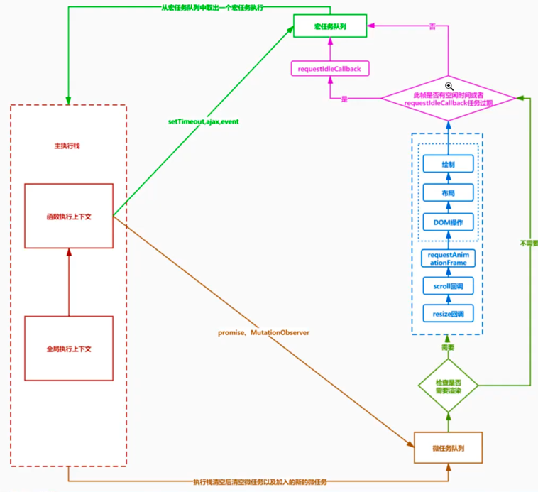

# Hooks 学习总结

[源码简单实现](https://github.com/zhangli20080808/react-summary/tree/master/src/components/hooks)

### 解决的问题

1. 将组件间相互关联的部分拆分成更小的函数
2. hook 使我们在无须修改组件结构的情况下复用状态逻辑
3. 优点
   1. 类组件要保存实例 函数组件用完直接销毁 性能好
   2. 高阶组件复用性差 比如复用 10 个逻辑要套 10 层
   3. 生命周期管理起来比较麻烦

```js
1. 只能在最外层调用hook 顺序执行 不要再循环 条件或者子函数中调用 或者不确定的return语句之前 顺序很重要
2. 错位 由于顺序不确定 导致函数错乱的问题
3. 无论是 render 还是 re-render hooks调用顺序必须一致
4. 如果 hooks出现在循环 判断里 则无法保证顺序一致 严重依赖调用顺序
* 函数组件  纯函数 用完即销毁 无论组件初始化 还是组件更新 都会重新执行一次这个函数，获取新的组件
* 类组件  是有实例的(不管组件更新多少次)都不销毁
hooks 原理  https://github.com/brickspert/blog/issues/26
```

# useState

1.  useState 就是一个 hook
2.  通过在函数组件内调用他来给函数组件添加一些内部的状态，react 会在重复渲染时保留这个 state
3.  useState 返回一对值，当前状态和一个让你更新他的函数，类似于 this.setState,但是他不会把新的
    state 和旧的 state 进行合并
4.  useState 的唯一参数就是初始 state

    在初始渲染期间，返回的状态 与 传入的第一个参数值相同
    setState 函数用于更新 state，他接受一个新的 state 并将组件的一次渲染加入队列

## 函数式更新

如果新的状态需要老的状态计算,就可以通过函数来更新 比如 点击 false 切换

```js
/**
 * 每次组件渲染都是独立的闭包 ，就是说每次渲染 用的变量都不是同一个
 * 每一次渲染都有他自己的 props 和 state 每一次渲染都有他自己的事件处理函数
 * 我们的组件函数每次渲染都会被调用 但是每一次调用中number值都是常量 并且他被赋予了当前渲染中的状态值
 * 在单次渲染的范围内 props和stat始终保持不变
 * alert 会捕捉我点击按钮时候的状态
 */

function Count() {
  let [num, setNum] = useState({ num: 0 });
  let numberRef = useRef(num); //  useRef 后续自定义实现
  function updateNumber() {
    setNum((state) => ({ num: state.num + 1 }));
    numberRef.current = { num: num.num + 1 };
  }

  function lazyFunc() {
    // 延迟2s更新
    setTimeout(() => {
      // 如果新的状态 需要使用先前的状态计算出来
      setNum((state) => ({ num: state.num + 2 }));
    }, 2000);
  }

  return (
    <div>
      <div>{num.num}</div>
      <div>ref: {numberRef.current.num}</div>
      <button onClick={lazyFunc}>lazyFunc</button>
      <button onClick={updateNumber}>+</button>
    </div>
  );
}
```

## 惰性初始 state

initialState 之会在组件初始渲染的时候被调用 后续渲染会被忽略,跟类组件的 setState 不同、这里的状态不会自动合并,更新的时候要传入完整的值

```js
function count1() {
  let [state, setNum] = useState(() => {
    console.log('初始状态');
    return { num: 0, name: 'zl' };
  });
  return (
    <div>
      <div>
        {state.num}:{state.name}
      </div>
      <button onClick={() => setNum({ ...state, num: state.num + 1 })}>
        lazyFunc
      </button>
    </div>
  );
}
```

## 性能优化

1. react 使用 Object.is 比较算法  
   调用 State Hook 的更新函数并传入当前的 state 时候，react 将跳过子组件的渲染以及 effect 的执行,比如传入老值，不会更新

```js
function count5() {
  let [state, setState] = useState({ num: 0, name: 'zl' });
  return (
    <div>
      <div>
        {state.num}:{state.name}
      </div>
      <button onClick={() => setState({ ...state, num: state.num + 1 })}>
        lazyFunc
      </button>
      {/*setState的时候 如果发现来的state和新的state一样 就不会去更新了*/}
      <button onClick={() => setState(state)}>lazyFunc</button>
    </div>
  );
}
```

2. 减少渲染次数

- 使用 useCallback ,将内敛函数和依赖项数组传入 useCallback，会返回 memoized 版本，该回调函数只在某个依赖项发生改变时才会更新
- 把创建函数和依赖项传入 useMemo ,也只会在某个依赖项发生变更时才更新，这种优化有利于避免在每次渲染时都进行高开销的计算

```js
function Child(props) {
  console.log('child render');
  return (
    <div>
      <button onClick={props.addClick}>{props.data.num}</button>
    </div>
  );
}
// memo 让函数拥有了记忆的功能 只有当前组件发生变更的时候才会刷新 否则不刷新
Child = memo(Child);
let lastFlag;
let lastData;
function Demo7() {
  let [num, setNum] = useState(0);
  let [name, setName] = useState('zl');

  // 如果这样每次都会重新创建一个 addClick 重新生成一个变量 每次 addClick 都不一样
  // deps 表示此函数依赖的变量 如果变量变了 会重新生成函数
  const addClick = useCallback(() => setNum(num + 1), [num]);
  // console.log(lastFlag === addClick, 'flag')
  lastFlag = addClick;
  // 每一次执行的时候 都会生成一个 data 所以永远是false  使用 useMemo 这样我们的data就缓存下来了
  const data = useMemo(() => ({ num }), [num]);
  console.log(lastData === data, 'data', lastData, data);
  lastData = data;
  return (
    <div>
      <input
        type="text"
        value={name}
        onChange={(e) => setName(e.target.value)}
      />
      <Child addClick={addClick} data={data} />
    </div>
  );
}
```

## useReducer 实现 useState

```js
let memoizedState;

function useReducer(reducer, initialArg, init) {
  let initialState = void 0; // // void 跟上任意表达式返回的都是 undefined

  if (typeof init !== 'undefined') {
    initialState = init(initialArg);
  } else {
    initialState = initialArg;
  }

  function dispatch(action) {
    memoizedState = reducer(memoizedState, action);
    render();
  }

  memoizedState = memoizedState || initialState;

  return [memoizedState, dispatch];
}

function useState(initialState) {
  // reducer 为null 就是始终让 initialState 作为初始状态
  return useReducer((oldState = null, newState) => newState, initialState);
}

function StateDemo() {
  // useReducer 三个参数 reducer initialArg init  如果init存在 将 initialArg 传入返回新的值
  // init 函数返回的结果 才是我们 useReducer 的 state  ->{number:0}

  const [number, setNumber] = useState(0);

  return (
    <div>
      <p>useReducer实现useState</p>
      <p>{number}</p>
      <button onClick={() => setNumber(number + 1)}>+</button>
    </div>
  );
}
```

# useCallback/useMemo

```js
let lastCallback;
let lastCallbackDependencies;

function useCallback(callback, dependencies) {
  if (lastCallbackDependencies) {
    //看看新的依赖数组是不是每一项都跟老的依赖数组中的每一项都相同
    let changed = !dependencies.every((item, index) => {
      return item == lastCallbackDependencies[index];
    });
    if (changed) {
      lastCallback = callback;
      lastCallbackDependencies = dependencies;
    }
  } else {
    //没有渲染过
    lastCallback = callback;
    lastCallbackDependencies = dependencies;
  }
  return lastCallback;
}

let lastMemo;
let lastMemoDependencies;

function useMemo(callback, dependencies) {
  if (lastMemoDependencies) {
    //看看新的依赖数组是不是每一项都跟老的依赖数组中的每一项都相同
    let changed = !dependencies.every((item, index) => {
      return item == lastMemoDependencies[index];
    });
    if (changed) {
      lastMemo = callback();
      lastMemoDependencies = dependencies;
    }
  } else {
    //没有渲染过
    lastMemo = callback();
    lastMemoDependencies = dependencies;
  }
  return lastMemo;
}

function Child({ data, addClick }) {
  console.log('Child render');
  return <button onClick={addClick}>{data.number}</button>;
}

//把函数组件传给memo方法,返回一个新组件,改造后每次渲染前会判断一下属性变了没有,如果属性不变不渲染,变了才
Child = memo(Child);

function App() {
  let [number, setNumber] = useState(0);
  let [name, setName] = useState('zhufeng');
  let addClick = useCallback(() => setNumber(number + 1), [number]); //每次也是新的
  let data = useMemo(() => ({ number }), [number]); //data 每次都是新的
  return (
    <div>
      <input value={name} onChange={(event) => setName(event.target.value)} />
      <Child data={data} addClick={addClick} />
    </div>
  );
}
```

# useEffect

```js
/*
 * 在函数组价主体内(这里指react渲染阶段)，改变dom，添加订阅事件，设置定时器，记录日志
 * 以及包含其他副作用的操作都是不允许的,因为这可能会产生莫名的bug破坏ui的一致性
 *
 * 使用 useEffect 完成副作用操作 赋值给 useEffect 的函数会在组件渲染到屏幕之后执行
 * 你可以把 effect 看作是react从纯函数世界通往命令式世界的逃生通过
 *
 * useEffect 就是一个effect hooks 给函数增加了副作用的能力 跟类组件的 componentDidMount
 * componentDidUpdate componentWillMount 相同的用途，只不过合并成了一个API
 *
 * 当组件初次渲染完成之后 或者组件更新的时候 执行
 *
 * 1. 会在每次 render 的时候必定执行一次。
 * 2. 如果返回了函数，那么在下一次 render 之前或组件 unmount 之前必定会运行一次返回函数的代码。
 * 3. 如果指定了依赖数组，且不为空，则当数组里的每个元素发生变化时，都会重新运行一次。
 * 4. 如果数组为空，则只在第一次 render 时执行一次，如果有返回值，则同 2
 * 5. 如果在 useEffect 中更新了 state，且没有指定依赖数组，或 state 存在于依赖数组中，就会造成死循环
 *
 * 纯函数
 * 1. 相同的参数返回相同的额结果
 * 2. 不能修改作用域外的变量
 * */

/**
 * 1. FuncEffectDemo2 render
 * 2. 开启定时器
 *
 * 3. FuncEffectDemo2 render
 * 4. 销毁定时器
 * 5. 开启定时器
 *
 * 6. FuncEffectDemo2 render
 * 7. 销毁定时器
 * 8.  开启定时器
 */

function EffectDemo2() {
  console.log('FuncEffectDemo2 render');
  let [state, setState] = useState({ number: 0 });
  // useEffect 会在组件挂载后执行  没有给第二个参数 没次渲染都会执行调用 同时 会返回一个清理函数 当组件将要卸载的时候 执行清理函数
  // render 添加 useEffect 函数
  // re-render 替换 useEffect 函数  内部的函数也会重新定义
  useEffect(() => {
    console.log('开启定时器');
    let timer = setInterval(() => {
      setState((x) => ({ number: x.number + 2 }));
    }, 1000);
    return () => {
      // 每次渲染的时候 如果有清理函数 都会先执行 只有render之后才知道有哪些销毁函数
      console.log('销毁定时器');
      clearInterval(timer);
    };
  }, []);
  return (
    <div>
      {state.number}
      <button onClick={() => setState({ number: state.number + 1 })}>+</button>
    </div>
  );
}
```

## 自定义实现 useEffect、useState

```js
import React from 'react';
import { render } from '../../index';

// StateDemo 多次渲染 组件执行的时候 我们的状态需要保留  ——> memoizedState
let memoizedStates = [];
let index = 0;

function useState(initialState) {
  memoizedStates[index] = memoizedStates[index] || initialState;
  let currentIndex = index;

  function setState(newState) {
    memoizedStates[currentIndex] =
      typeof newState === 'function'
        ? newState(memoizedStates[index])
        : newState;
    // 每次渲染的时候清0  不然会累加
    index = 0;
    render();
  }

  // 返回 memoizedStates[index]的结果 index + 1
  return [memoizedStates[index++], setState];
}

// 依赖项 上次是number1 这次也是number1 不执行  多次渲染的时候保持一个变量

function useEffect(cb, dependencies) {
  if (memoizedStates[index]) {
    let { destroy, lastDependencies } = memoizedStates[index];
    // lastDependencies 如果存在 拿到每一个依赖 第一次 -> true
    // 如果这次有 要去遍历现在的每一项和上次的每一项 数组依赖的值 是否相等 都一样 返回true
    const changed = lastDependencies
      ? !dependencies.every((item, index) => item === lastDependencies[index])
      : true;
    if (changed) {
      // 如果依赖改变
      if (destroy) destroy();
      const cacheState = { lastDependencies: dependencies };
      memoizedStates[index++] = cacheState;
      // 用宏任务实现 保证 callback 是在本次页面渲染结束之后执行的
      setTimeout(() => {
        cacheState.destroy = cb();
      });
    } else {
      index++;
    }
  } else {
    const cacheState = { lastDependencies: dependencies };
    memoizedStates[index++] = cacheState; // 直接赋值
    setTimeout(() => {
      cacheState.destroy = cb();
    });
  }
}

function StateDemo() {
  // useState2 就是一个hooks 第一个值是当前的状态 第二个值是改变状态的函数

  /*
   * 第一轮  memoizedStates=['计数器',0]  重置了index
   * 第二轮  memoizedStates=['计数器',1]
   * */
  const [name, setName] = useState('计数器');
  //  多个state
  const [number, setNumber] = useState(0);

  // 但是存在多个 useEffect 就失败了
  useEffect(() => {
    console.log('useEffect1');
  }, [name]);
  useEffect(() => {
    console.log('useEffect2');
  }, [number]);

  return (
    <div>
      <p>UseStateDemo</p>
      <p>{number}</p>
      <p>{name}</p>
      <button onClick={() => setName('计数器' + Date.now())}>改name</button>
      <button onClick={() => setNumber(number + 1)}>+</button>
    </div>
  );
}

export default StateDemo;
```

# useReducer

useState 的替代方案 ，接受一个 形如 (state,action)=>newState 的 reducer,并返回当前 state 以及配套的 dispatch 方法

1. 区别 useReducer 是 useState 的内部实现 -> useState 是靠 useReducer 实现的
2. 使用场景 改变状态的逻辑比较复杂的时候 或者 下一个状态依赖前一个状态的时候可以使用 useReducer

```js
import React from 'react';
import { render } from '../../index';

// StateDemo 多次渲染 组件执行的时候 我们的状态需要保留  ——> memoizedState
let initialArg = 0;
const INCREASE = 'INCREASE';
const DECREASE = 'DECREASE';

function reducer(state, action) {
  switch (action.type) {
    case INCREASE:
      return { number: state.number + 1 };
    case DECREASE:
      return { number: state.number - 1 };
    default:
      return state;
  }
}

function init(initialArg) {
  return { number: initialArg };
}

/*
 * useState的替代方案 ，接受一个 形如 (state,action)=>newState 的 reducer,并返回当前state以及配套的dispatch方法
 * 1. 区别  useReducer 是 useState 的内部实现 ->  useState是靠useReducer实现的
 * 2. 使用场景  改变状态的逻辑比较复杂的时候 或者 下一个状态依赖前一个状态的时候可以使用 useReducer
 * */

// 自定义实现 useReducer
let memoizedState;

/**
 *
 * @param reducer 处理函数，状态变更函数 接受一个老的状态返回一个新的状态
 * @param initialArg 初始值
 * @param init 初始化函数 函数返回的结果 才是我们 useReducer 的 state  ->{number:0}  如果init存在 将 initialArg 传入返回新的值
 * @returns {(*|dispatch)[]}
 */

function useReducer(reducer, initialArg, init) {
  let initialState = void 0; // void 跟上任意表达式返回的都是 undefined

  if (typeof init !== 'undefined') {
    initialState = init(initialArg);
  } else {
    initialState = initialArg;
  }

  function dispatch(action) {
    memoizedState = reducer(memoizedState, action);
    render();
  }
  memoizedState = memoizedState || initialState;

  return [memoizedState, dispatch];
}

function StateDemo() {
  // useReducer 三个参数 reducer initialArg init  如果init存在 将 initialArg 传入返回新的值
  // init 函数返回的结果 才是我们 useReducer 的 state  ->{number:0}
  let [state, dispatch] = useReducer(reducer, initialArg, init);
  // useEffect 会在组件挂载后执行

  return (
    <div>
      <p>UseReducerDemo</p>
      {state.number}
      <button onClick={() => dispatch({ type: INCREASE })}>+</button>
      <button onClick={() => dispatch({ type: DECREASE })}>-</button>
    </div>
  );
}

export default StateDemo;
```

# useContext

```js
import React, { useContext, useReducer } from 'react';
import ReactDOM from 'react-dom';
/**
 * 1. 接受一个 context 的值(React.createContext()的返回值)，并返回该context的当前值
 * 2. 当前context值由上层组件中距离当前组件最近的<MyContent.Provider>的value props决定
 * 3. 当组件上层最近的 <MyContent.Provider> 更新的，会触发hook重渲染，并使用最新传递给 MyContent.Provider的 context 的value值
 * 4. useContext(MyContent)相当于类组件中的 static contentType = MyContent 或者 <MyContent.Provider>
 * 5. useContext(MyContent) 只是让我们能够读取context的值以及订阅context值得变化 仍然需要在上层组件中使用 MyContent.Provider
 *    来为下层组件提供 context
 */

let AppContext = React.createContext();
//AppContext Provider

function useContext(context) {
  return context._currentValue; // 外部如果传入 context react内部会将值赋给_currentValue
}
function Counter() {
  let { state, setState } = useContext(AppContext);
  return (
    <div>
      <p>{state.number}</p>
      <button onClick={() => setState({ number: state.number + 1 })}>+</button>
    </div>
  );
}
function App() {
  let [state, setState] = useState({ number: 0 });
  return (
    <AppContext.Provider value={{ state, setState }}>
      <div>
        <div>
          <Counter />
        </div>
      </div>
    </AppContext.Provider>
  );
}
function render() {
  ReactDOM.render(<App />, document.getElementById('root'));
}
render();

// 升级 createContext
export function createContext() {
  let context = { _currentValue: null };

  function Provider(props) {
    context._currentValue = props.value;
    return props.children;
  }

  function Consumer(props) {
    return props.children(context._currentValue);
  }

  context.Provider = Provider;
  context.Consumer = Consumer;
  return context;
}
```

# 链表结构实现 useState

```js
/*
* 链表理解
* 这个对象有两部分 一部分放他的值 另一部分放一个引用地址 指向下一个对象
  let thirdHook = {
    state: null,
    next: secondHook
  }
  let secondHook = {
    state: null,
    next: thirdHook
  }
  let firstHook = {
    state: null,
    next: secondHook
  }
* */

let firstWorkInProcessHook = { memoizedState: null, next: null };
let workInProcessHook = firstWorkInProcessHook;

function useState(initialState) {
  // 第一次 useState的时候 我们创建一个新的节点 两部分 initialState 和 next next此时为null
  let currentHook = workInProcessHook.next
    ? workInProcessHook.next
    : { memoizedState: initialState, next: null };

  function setState(newState) {
    currentHook.memoizedState = newState;
    workInProcessHook = firstWorkInProcessHook;
    render();
  }

  if (workInProcessHook.next) {
    // 不是第一次的时候 把值取出来 向后移动一位
    workInProcessHook = workInProcessHook.next;
  } else {
    // 第一次的时候 也就是我们的最初的那个节点 firstWorkInProcessHook 我们吧next指向currentHook Link起来了
    workInProcessHook.next = currentHook;
    // 接着让我们的指针向后移一位  每次的currentHook都是不一样的 注意
    workInProcessHook = currentHook;
    // 当我们重新渲染的时候 我们需要让 workInProcessHook 重新回到第一位firstWorkInProcessHook
  }
  return [currentHook.memoizedState, setState];
}

// 依赖项 上次是number1 这次也是number1 不执行  多次渲染的时候保持一个变量
// 我们将 state和effect的依赖项都放入 memoizedStates 中
function StateDemo() {
  // useState2 就是一个hooks 第一个值是当前的状态 第二个值是改变状态的函数
  const [name, setName] = useState('计数器');
  //  多个state
  const [number, setNumber] = useState(0);
  return (
    <div>
      <p>链表结构实现useState</p>
      <p>
        {name}: {number}
      </p>
      <button onClick={() => setName('计数器' + Date.now())}>改name</button>
      <button onClick={() => setNumber(number + 1)}>+</button>
    </div>
  );
}

export default StateDemo;
```

# useRef

## useRef

- useRef -- 如果和获取最新的值
- useRef 会返回一个可变的 ref 对象 {current}
- ref 对象在组件的整个生命周期内保持不变
-

```js
import React, { useEffect } from 'react';
import { render } from '../../index';

/**
 * useRef -- 如果和获取最新的值
 * useRef 会返回一个可变的ref对象 {current}
 * ref对象在组件的整个生命周期内保持不变
 *
 * 注意区分 React.createRef 和 useRef
 * 为什么需要转发? React.forwardRef() 因为函数组件没有实例 不能使用ref
 * forwardRef
 * 1. 将ref从父组件转发到子组件中的dom元素上
 * 2. 子组件接受props和ref作为参数
 */
let memoizedStates = [];
let index = 0;

function useState(initialState) {
  memoizedStates[index] = memoizedStates[index] || initialState;
  let currentIndex = index;

  function setState(newState) {
    memoizedStates[currentIndex] =
      typeof newState === 'function'
        ? newState(memoizedStates[index])
        : newState;
    // 每次渲染的时候清0  不然会累加
    index = 0;
    render();
  }

  // 返回 memoizedStates[index]的结果 index + 1
  return [memoizedStates[index++], setState];
}

function useRef(current) {
  memoizedStates[index] = memoizedStates[index] || { current };
  return memoizedStates[index++];
}

function forwardRef(Comp) {
  return class extends React.Component {
    render() {
      console.log(this, 'this');
      // ref 属性很特殊 是一个内部保护的变量
      return Comp(this.props, this.props.ref2);
    }
  };
}

/**
 * 经过之后会拿到两个参数
 * @param props
 * @param ref
 */
function FuncChild(props, ref) {
  return <input ref={ref} />;
}

const ForwardFuncChild = forwardRef(FuncChild);

function Index() {
  const [num, setNum] = useState(0);
  let numberRef = useRef(); //  useRef 后续自定义实现
  let funChildRef = useRef();

  function updateNumber() {
    setNum(num + 1);
  }

  function lazyFunc() {
    setTimeout(() => {
      alert(numberRef.current);
    }, 2000);
  }

  // 在每次渲染结束之后，这个时候 num 值是最新的
  useEffect(() => {
    numberRef.current = num;
  });

  return (
    <div>
      <ForwardFuncChild ref2={funChildRef} />
      <div>{num}</div>
      <div>ref: {numberRef.current}</div>
      <button onClick={lazyFunc}>lazyFunc</button>
      <button onClick={updateNumber}>+</button>
      <button onClick={() => funChildRef.current.focus()}>获取焦点</button>
    </div>
  );
}

export default Index;
```

## forwardRef

```js
 ref和forwardRef结合使用
 1. 通过forwardRef可以将ref转发到子组件
 2. 子组件拿到父组件中创建的ref，绑定到自己的某一个元素中

 现在通过ref和forwardRef，可以在父组件中随意改变元素。
 但是我们可能只希望父组件只能对子组件进行有限操作，也就是限制父组件的自由度。
 1. 直接暴露给父组件带来的问题是某些情况的不可控
 2. 父组件可以拿到DOM后进行任意的操作
 3. 我们只是希望父组件可以操作的focus，其他并不希望它随意操作其他方法

 可以只暴露特定的操作 useImperativeHandle
 to -> useImperativeHandle
```

### useImperativeHandle

```js
import React, { useRef, forwardRef, useImperativeHandle } from 'react';

/**
 * 可以让我们在使用ref时自定义暴露给父组件的实例值
 * 大多数情况下，应当避免使用ref这样的命令代码，useImperativeHandle 应当和 forwardRef 一起使用
 * 通过useImperativeHandle的Hook, 将父组件传入的ref和useImperativeHandle第二个参数返回的对象绑定到了一起
 * 所以在父组件中, 调用inputRef.current时, 实际上是返回的对象
 *
 * 简单使用总结
 * 1. 作用: 减少暴露给父组件获取的DOM元素属性, 只暴露给父组件需要用到的DOM方法
 * 2. 参数1: 父组件传递的ref属性
 * 3. 参数2: 返回一个对象, 以供给父组件中通过ref.current调用该对象中的方法
 * @type {React.ForwardRefExoticComponent<React.PropsWithoutRef<{}> & React.RefAttributes<unknown>>}
 */

// function useImperativeHandle(ref,factory){
//   ref.current = factory()
// }

const JMInput = forwardRef((props, ref) => {
  const inputRef = useRef();
  // 作用: 减少父组件获取的DOM元素属性,只暴露给父组件需要用到的DOM方法
  // 参数1: 父组件传递的ref属性
  // 参数2: 返回一个对象,父组件通过ref.current调用对象中方法
  useImperativeHandle(ref, () => ({
    focus: () => {
      inputRef.current.focus();
    },
  }));
  return <input type="text" ref={inputRef} />;
});

export default function ImperativeHandleDemo() {
  // useImperativeHandle 主要作用:用于减少父组件中通过forward+useRef获取子组件DOM元素暴露的属性过多
  // 为什么使用: 因为使用forward+useRef获取子函数式组件DOM时,获取到的dom属性暴露的太多了
  // 解决: 使用uesImperativeHandle解决,在子函数式组件中定义父组件需要进行DOM操作,减少获取DOM暴露的属性过多
  const inputRef = useRef();
  return (
    <div>
      <button onClick={() => inputRef.current.focus()}>聚焦</button>
      <JMInput ref={inputRef} />
    </div>
  );
}
```

# useLayoutEffect

```js
import React from 'react';
import { render } from '../../index';

/**
 * useLayoutEffect
 * 使用场景呢？
 * 签名函数和 useEffect，但是会在所有dom变更之后同步调用 useEffect
 * useEffect 不会阻塞浏览器渲染， useLayoutEffect会
 * useEffect 会在浏览器渲染之后执行 useLayoutEffect则是在 dom 更新完成之后，浏览器绘制之前执行
 *
 * 事件循环
 * 1. 从宏任务队列中取出一个宏任务执行
 * 2. 检查微任务队列，执行并清空微任务队列，如果在微任务的执行中加入了新的微任务，则会继续执行新的微任务
 * 3. 进入更新渲染阶段 判断是否需要渲染,要根据屏幕 刷新率、页面性能、页面是否在后台运行共同决定，通常来说这个渲染间隔是固定的，一般是60桢/s
 * 4. 如果确定要更新，则进入下面阶段，否则本轮循环结束
 *   5. e. 如果窗口大小发生了变化，则执行监听resize事件
 *   6. d. 如果页面发生了滚动，执行scroll事件
 *   7. f. 执行桢动画回调，也就是  requestAnimationFrame 的回调
 *   8. g.  重新渲染用户界面
 * 9. 判断是否宏任务微任务队列为空则判断是否执行 requestAnimationFrame 的回调函数
 */
let memoizedStates = [];
let index = 0;

function useLayoutEffect(cb, dependencies) {
  if (memoizedStates[index]) {
    let { destroy, lastDependencies } = memoizedStates[index];
    // lastDependencies 如果存在 拿到每一个依赖 第一次 -> true
    // 如果这次有 要去遍历现在的每一项和上次的每一项 数组依赖的值 是否相等 都一样 返回true
    const changed = lastDependencies
      ? !dependencies.every((item, index) => item === lastDependencies[index])
      : true;
    if (changed) {
      // 如果依赖改变
      if (destroy) destroy();
      const cacheState = { lastDependencies: dependencies };
      memoizedStates[index++] = cacheState;
      // 用宏任务实现 保证 callback 是在本次页面渲染结束之后执行的
      Promise.resolve().then(() => {
        cacheState.destroy = cb();
      });
    } else {
      index++;
    }
  } else {
    const cacheState = { lastDependencies: dependencies };
    memoizedStates[index++] = cacheState; // 直接赋值
    queueMicrotask(() => {
      cacheState.destroy = cb();
    });
  }
}

function Animate() {
  let divRef = React.createRef();
  let style = {
    width: '100px',
    height: '100px',
    background: 'red',
  };
  useLayoutEffect(() => {
    divRef.current.style.transform = 'translate(500px)';
    divRef.current.style.transition = 'all 0.5';
  });

  return <div style={style} ref={divRef} />;
}

export default Animate;
```


# 自定义 hook

1.  有时候我们想要在组件之间重用一些逻辑 并不是状态 状态在每个 hook 中都是独立的
2.  可以让我们在不增加组件的情况下达到同样的目的
3.  hook 是一种复用状态逻辑的方式，不复用 state 本身
4.  事实上 hook 的每次调用都有一个完全独立的 state
5.  自定义 hook 更像是一种约定，而不是一种功能。注意 如果函数以 use 开头，并且调用了其他的 hook，则
    统一称为一个 hook


# Hooks 原理

1. 将函数组件状态保存在外部作用域，类似链表的实现原理，由于有严格的顺序关系，所以函数组件中 useState 这些
   api 不能出现条件、循环语句中

```js
function FunctionalComponent() {
    const [state1, setState1] = useState(1)
    const [state2, setState2] = useState(2)
    const [state3, setState3] = useState(3)
}

hook1 => Fiber.memoizedState
state1 === hook1.memoizedState
hook1.next=>hook2
state2 === hook2.memoizedState
hook2.next=>hook3
state3 === hook2.memoizedState
```

2. Fibter

1. 为什么需要 fiber
1. 任务分解的意义
1. 增量渲染（把渲染任务拆分成块，匀到多帧）
1. 更新时能够暂停，终止，复用渲染任务
1. 给不同类型的更新赋予优先级
1. 并发方面新的基础能力
1. 更流畅
