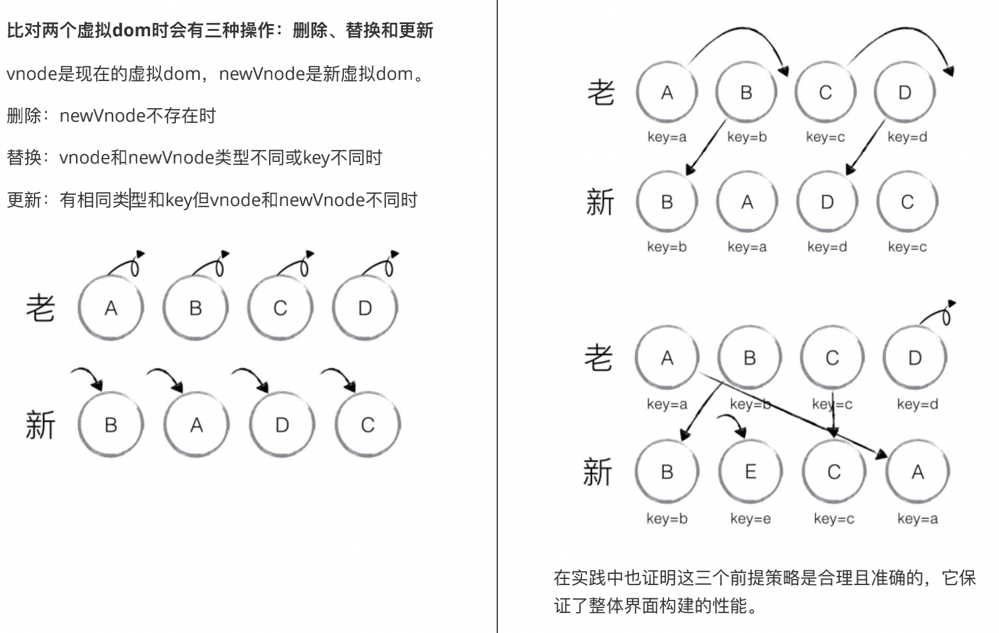
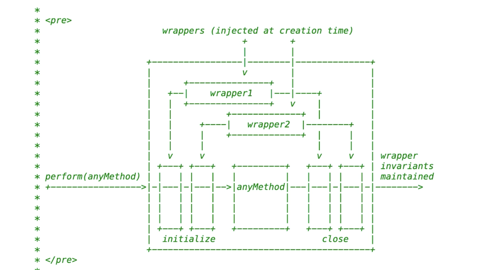
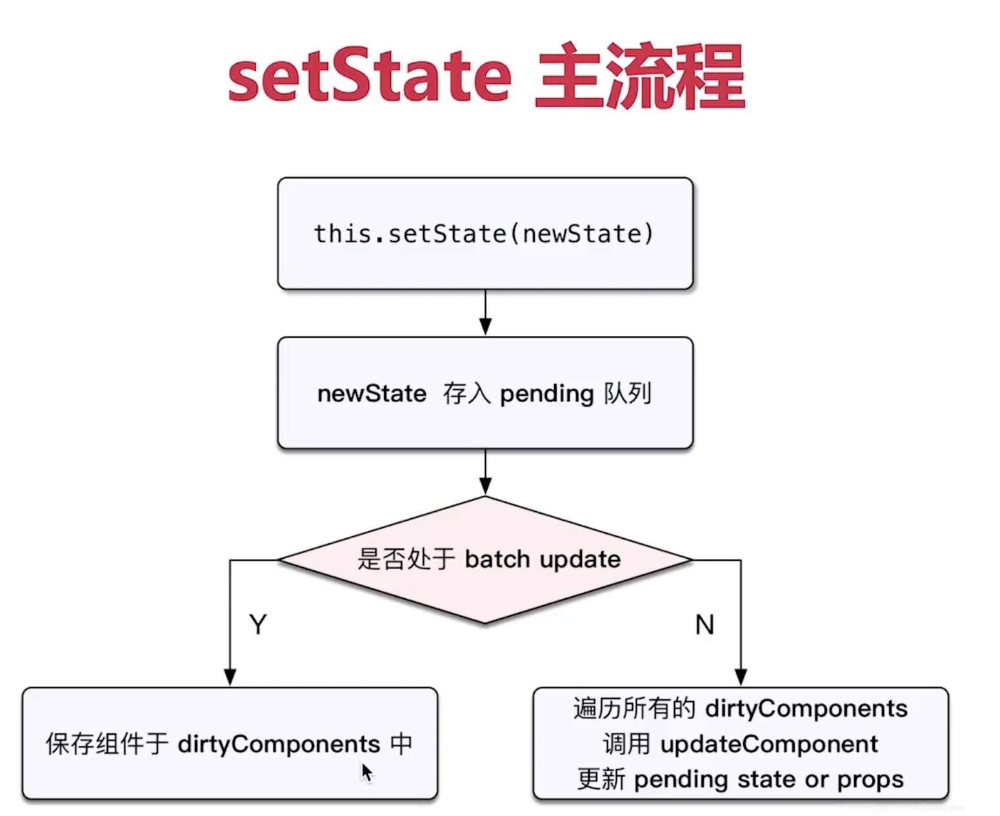
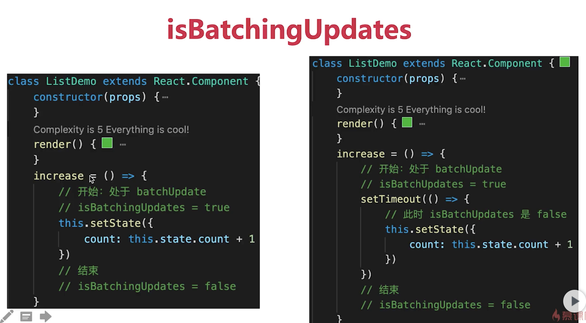
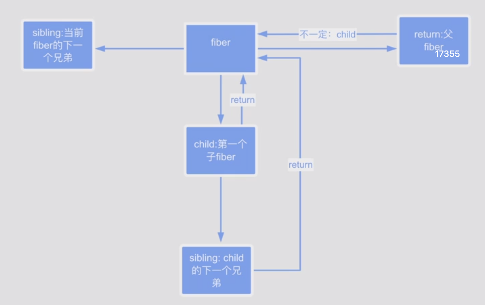

# react 原理解析

[react 原理解析](https://yuchengkai.cn/react/)

# 什么是虚拟 dom？说一下 diff 算法

1. what

⽤ JavaScript 对象表示 DOM 信息和结构，当状态变更的时候，重新渲染这个 JavaScript 的对象结构。这个
JavaScript 对象称为 virtual dom。

虚拟 DOM（Virtual DOM）是对 DOM 的 JS 抽象表示，它们是 JS 对象，能够描述 DOM 结构和关系。应用
的各种状态变化会作用于虚拟 DOM，最终映射到 DOM 上。

2. why？

DOM 操作很慢，轻微的操作都可能导致⻚⾯重新排
版，⾮常耗性能。相对于 DOM 对象，js 对象处理起来更快，
⽽且更简单。通过 diff 算法对⽐新旧 vdom 之间的差异，可以
批量的、最⼩化的执⾏ dom 操作，从⽽提⾼性能。

3. where？

react 中⽤ JSX 语法描述视图，通过 babel-loader 转译
后它们变为 React.createElement(...)形式，该函数将⽣成
vdom 来描述真实 dom。将来如果状态变化，vdom 将作出相
应变化，再通过 diff 算法对⽐新⽼ vdom 区别从⽽做出最终
dom 操作。

<!--  -->

# 虚拟 DOM 原理剖析

1. diff 策略

同级比较，Web UI 中 DOM 节点跨层级的移动操作特别少，可以忽略不计。

2. 拥有相同类的两个组件将会生成相似的树形结构，拥有不同类的两个组件将会生成不同的树形结构。
   例如：div->p, CompA->CompB

3. 对于同一层级的一组子节点，通过唯一的 key 进行区分。

element diff

差异类型：

1. 替换原来的节点，例如把 div 换成了 p，Comp1 换成 Comp2
2. 移动、删除、新增子节点， 例如 ul 中的多个子节点 li 中出现了顺序互换。
3. 修改了节点的属性，例如节点类名发生了变化。
4. 对于文本节点，文本内容可能会改变。

5. 重排（reorder）操作：INSERT_MARKUP（插入）、MOVE_EXISTING（移动）和 REMOVE_NODE（删除）。

6. INSERT_MARKUP，新的 component 类型不在老集合里， 即是全新的节点，需要对新节点执行插入操作。

7. MOVE_EXISTING，在老集合有新 component 类型，且 element 是可更新的类型，

generateComponentChildren 已调用 receiveComponent，这种情况下 prevChild=nextChild，就需要做移动操作，可以复用以前的 DOM 节点。

8. REMOVE_NODE，老 component 类型，在新集合里也有，但对应的 element 不同则不能直接复用和更新，
   需要执行删除操作，或者老 component 不在新集合里的，也需要执行删除操作。



# JSX 概念

JSX 是一种 看起来很像 xml 的 JavaScript 的语法扩展，其格式比较像模版语言，但事实上完全是在 JavaScript 内部实现的。
是一种语法糖

1. 为什么需要 jsx？

- 开发效率：使用 jsx 编写模板简单快速
- 执行效率：jsx 编译为 JavaScript 代码后进行了优化，执行更快
- 类型安全：在编译过程中就能发现错误

2. 原理

- babel-loader 会预编译 jsx 为 React.createElement('div',{id:'app'},ch1,ch2,ch3)
- 相当于 h 函数 子元素传递参数和 h 函数有点不同->vNode 真正在浏览器跑的时候就是 createElement 在浏览器运行的时候，才会执行 createElement 得到 vNode

3. 与 vue 的不同：

- react 中的 vNode+jsx 一开始就有，vue 则是演进过程中出现的
- jsx 本来就是 js 拓展，转义过程直接的多，vue 把 template 编译成 render 函数的过程需要复杂的编译器，转换字符串为 ast-js 函数字符串-js 函数-引入到代码里面

联想？响应化的实现为什么需要一个 watcher？一个组件一个 watcher 为什么

我们每个组件在创建的时候，会创建一个 render watcher 渲染 watcher 这个 render watcher 和组件就是一对一的关系 主要是和我们的更新函数挂钩 更新函数会直接传入到 watcher 中 将来 任何一个值得变化会导致 watcher 会入队 render 函数执行的时候会访问这个组件里面所有的依赖 data 中的所有值都会被访问到 意味着我哪些值得变化会调用我当前的 watcher 所以说为什么需要 vNode diff 算法呢 就是因为一个组件中那么多的值 我怎么知道哪个改变了呢 我怎么知道哪一个变了呢 我们 watcher 管理这这个组件 所以只能在组件的级别 做一个 diff 通过 diff 得出变化的点 从而做出更新

- React 负责逻辑控制，数据 -> vDom
- React 使用 JSX 来描述 UI
- babel-loader 可以转换 jsx -> html -vNode,也就是 react 元素，一个普通 js 对象，描述了我们在界面上想看到的 dom 元素的样式, 会编译成 React.createElement(此时呢还是静态) 在浏览器执行
- jsx 基本上也是 vNode, 基本结构和我们以前用 js 对象模拟 dom 结构是一个意思 打包的时候会，编译成 React.createElement React.createElement 执行的结果才是虚拟 dom，不能说 jsx 就是 react 元素
- React 元素 = 虚拟 dom 也就是一个普通 jsx 对象，描述了 dom 真实的样子
- 把 react 元素给了 ReactDom.render, 在浏览器执行的时候，会将 vNode 转化的 Dom，并插入到 root 容器中去，如果换到移动端，可能用别的库来渲染

```js
let element1 = React.createElement('h1', 'null', 'hello') //普通的js对象
{
  type: 'h1'
  key: null,
  ref:null,
  props:{
    children: 'hello'
  },
}
// React.Dom
let element = (
  <h1 className="title" style={{ color: 'red' }}>
    <span>hello</span>
    world
  </h1>
);
----编译后----;
// 参数1  标签的类型 div span h1
// 参数2  属性的js对象
// 参数3... 往后面的都是子元素 儿子们
// React.createElement 的返回值 element 就是一个虚拟dom vNode
let element = React.createElement(
  'h1',
  {
    className: 'title',
    style: {
      color: 'red',
    },
  },
  React.createElement('span', null, 'hello'),
  'world'
);
 {
    type: 'h1',
    key: null,
    ref: null,
    props: {
      children: [{
        key: null,
        props: { children: 'hello' },
        ref: null,
        type: 'span'
      }, 'world'],
      className: 'title',
      style: { color: 'red' }
    },
    // 内置属性
    '_owner': null,
    '_store': {}
  }
```

# 核心 api

createElement、Component、render 三个 api

1. webpack+babel 编译时，替换 JSX 为 React.createElement(type,props,...children)
2. 所有 React.createElement()执⾏结束后得到⼀个 JS 对象即 vdom，它能够完整描述 dom 结构
3. ReactDOM.render(vdom, container)可以将 vdom 转换为 dom 并追加到 container 中
4. 实际上，转换过程需要经过⼀个 diff 过程，⽐对出实际更新补丁操作 dom

## createElement

创建 kreact：实现 createElement 并返回 vdom

```js
import initVNode from './kdom';
import { isFunc } from './util';

/**
 * 什么时候用对象 什么时候用类
 * 单例 对象就够了 需要很多对象的时候用类
 * 定义更新队列 所有组件共用一个 updateQueue
 */
export const updateQueue = {
  updaters: [], // 更新器数组
  // 是否处于批量更新模式 默认 非批量更新 粗暴比如点击事件之前设置为true结束设置为false 手动指定 源码 自动指定
  isBatchingUpdate: false,
  add(updater) {
    // 增加一个更细器
    this.updaters.push(updater);
  },
  batchUpdate() {
    // 强制批量更新组件更新
    this.updaters.forEach((update) => update.updateComponent());
    this.isBatchingUpdate = false;
  },
};

// 更新器会有多个 不断去创建实例

class Updater {
  constructor(classInstance) {
    this.classInstance = classInstance; // 类组件的实例
    this.pendingStates = []; //等待更新的状态
  }

  addState(partialState) {
    // 先将这个分状态添加到 pendingStates 数组中去
    this.pendingStates.push(partialState);
    // 如果当前处于批量更新模式，也就是异步更新模式 把当前实例放到 updateQueue 里
    // 如果是非批量更新 也就是同步更新 则调用 updateComponent 直接更新
    updateQueue.isBatchingUpdate
      ? updateQueue.add(this)
      : this.updateComponent();
  }

  updateComponent() {
    let { classInstance, pendingStates } = this;
    if (pendingStates.length > 0) {
      // 拿到组件的老状态和数组中的新状态数组进行合并
      classInstance.state = this.getState();
      // 让组件强制更新
      classInstance.forceUpdate();
    }
  }

  /**
   * 根据老状态和等待生效的新状态，得到最后新状态
   * @returns { state } 获取最新state
   */
  getState() {
    let { classInstance, pendingStates } = this;
    let state = classInstance.state; // 组件XXX.state
    // 需要更新   拿到组件的老状态和数组中的新状态数组进行合并
    if (pendingStates.length > 0) {
      pendingStates.forEach((newState) => {
        if (isFunc(newState)) {
          // 如果势函数
          newState = newState(state);
        }
        state = { ...state, ...newState }; // 新状态覆盖老状态
      });
      pendingStates.length = 0; //清空
    }
    return state;
  }
}

/**
 * 注意节点类型
    ⽂本节点
    HTML标签节点
    function组件
    class组件
    fragment
    其他如portal等节点
1. createElement被调⽤时会传⼊标签类型type，标签属性props及若⼲⼦元素children
2. index.js中从未使⽤React类或者其任何接⼝，为何需要导⼊它？
3. JSX编译后实际调⽤React.createElement⽅法，所以只要出现JSX的⽂件中都需要导⼊React

 * @param type 元素的类型 可能是一个字符串(原生组件)，也可能是函数
 * @param config 配置的对象,一般来说是属性对象
 * @param children 第一个儿子
 * @returns {{vType: number, type, props}} 虚拟dom，也就是我们的react元素
 */
export function createElement(type, config, children) {
  // console.log( children) // 虚拟dom的创建是由内向外的
  if (config) {
    delete config._owner;
    delete config._store;
  }
  // 返回虚拟DOM
  if (arguments.length > 3) {
    children = Array.prototype.slice.call(arguments, 2);
  }
  // children 可能是数组(多于一个儿子) 也有可能是字符串、数子 或者 null 也可能是个react元素
  let props = { ...config };
  props.children = children;
  // 能够区分组件类型：  因为后续的dom操作要根据类型去做
  // vType: 1-原生标签；2-函数组件；3-类组件
  let vType;
  if (typeof type === 'function') {
    // class组件
    if (type.isReactComponent) {
      vType = 3;
    } else {
      // 函数组件
      vType = 2;
    }
  } else if (typeof type === 'string') {
    //原始标签
    vType = 1;
  }

  return {
    vType,
    type,
    props,
  };
}

// 每个类组件都会实现自己的render方法 约定 实例化的时候去调用生成vnode
class Component {
  //标识符 区分class和函数组件
  static isReactComponent = true;

  constructor(props) {
    this.props = props;
    this.state = {};
    //  我们为每一个组件实例 配一个 updater实例
    this.updater = new Updater(this);
  }

  /**
   * 同步更新逻辑
   * @param partialState
   */
  setState(partialState) {
    // this.state = { ...this.state, ...partialState }
    // let renderVNode = this.render() // 重新调用render方法得到虚拟dom
    // updateClassInstance(this, renderVNode)

    // 我们的组件不再直接负责更新了
    this.updater.addState(partialState);
  }

  forceUpdate() {
    let renderVNode = this.render();
    updateClassComponent(this, renderVNode);
  }
}

function updateClassComponent(classInstance, renderVNode) {
  // 机械替换 后续换成diff
  let oldDom = classInstance.dom;
  let newDom = initVNode(renderVNode); // 真实dom
  oldDom.parentNode.replaceChild(newDom, oldDom);
  classInstance.dom = newDom;
}
```

## ReactDOM.render

创建 kreact-dom：实现 render，能够将 kvdom 返回的 dom 追加至 container

```js
// ReactDOM.render(element, container[, callback])
import initVNode from './kdom';
/**
 * vnode->node
 * 虚拟Dom转换为真实Dom,并插入到容器里
 * @param vNode 虚拟dom
 * @param container 插入的容器
 */
function render(vNode, container) {
  // container.innerHTML = `<pre>${JSON.stringify(vNode, null, 2)}</pre>`
  const dom = initVNode(vNode);
  dom && container.appendChild(dom);
}

export default { render };
```

## 创建 kvdom：实现 initVNode，能够将 vdom 转换为 dom

```js
/**
 * 把虚拟dom变成真实dom
 * @param vnode null 数字 字符串 react元素 不能是数组
 * @returns {Text|any}
 */
import ReactDom from './kreact-dom';
import { addEvent } from './event';

export default function initVNode(vnode) {
  if (!vnode) {
    return '';
  }
  // 如果textContent是一个字符串或者数字的话，创建一个文本的节点返回
  if (typeof vnode === 'string' || typeof vnode === 'number') {
    return document.createTextNode(vnode);
  }
  // 负责就是要给react元素
  let { vType } = vnode;
  if (!vType) {
    //文本节点
    return document.createTextNode(vnode);
  }
  // vType: 1-原生标签；2-函数组件；3-类组件
  if (vType === 1) {
    //原生标签
    return createNativeElement(vnode);
  } else if (vType === 2) {
    //函数组件
    return createFuncComp(vnode);
  } else {
    //类组件
    return createClassComp(vnode);
  }
}

function createNativeElement(vnode) {
  const { type, props } = vnode;
  //'div'  {id:'demo',children:[],key,ref，style: { color: 'red' }}
  const node = document.createElement(type); // span div
  updateProps(node, props); // 更新属性 把虚拟Dom上的属性设置到真实Dom上
  // 处理子节点 如果子节点就是一个单节点 并且是字符串或者数字
  if (
    typeof props.children === 'string' ||
    typeof props.children === 'number'
  ) {
    node.textContent = props.children; // node.textContent = 'hello'
    // 说明是一个单 react 元素
  } else if (typeof props.children === 'object' && props.children.type) {
    ReactDom.render(props.children, node);
    // 如果儿子是一个数组，说明有多个节点
  } else if (typeof Array.isArray(props.children)) {
    reconcileChildren(props.children, node);
  } else {
    // 如果出现其他的以为情况 null 就是空串
    node.textContent = props.children ? props.children.toString() : '';
  }
  return node;
}

/**
 * 把虚拟Dom对象中的属性设置到真实Dom元素上
 * @param node dom元素
 * @param props 属性对象
 */
function updateProps(node, props) {
  const { key, children, ...rest } = props;
  Object.keys(rest).forEach((item) => {
    // 需特殊处理的htmlFor，className,style
    if (item === 'className') {
      node.setAttribute('class', rest[item]);
    } else if (item === 'htmlFor') {
      node.setAttribute('for', rest[item]);
    } else if (item === 'style') {
      const styleObj = rest[item];
      Object.keys(styleObj).forEach((cur) => {
        node.style[cur] = styleObj[cur]; // node.style.color = 'red'
      });
      // 点击事件 onClick
    } else if (item.startsWith('on')) {
      // node.onclick = onclick函数
      // node[item.toLocaleLowerCase()] = props[item]
      addEvent(node, item.toLocaleLowerCase(), rest[item]);
    } else {
      node.setAttribute(item, rest[item]);
    }
  });
}

/**
 * 把子节点从虚拟dom全部转成真实Dom并且插入到父节点去
 * @param children 子节点的虚拟Dom数组
 * @param parentNode 父节点的真实Dom
 */
function reconcileChildren(children, parentNode) {
  //递归子元素Node
  children.forEach((childrenVNode) => {
    ReactDom.render(childrenVNode, parentNode);
  });
}

/**
 * 函数组件的渲染过程
 * @param vnode
 * @returns {string|Text|any|string}
 * 1. 定义一个React元素，也就是虚拟dom，他的type 是函数 比如 Welcome
 * 2. render方法会执行这个 Welcome 函数，并传入props对象，返回虚拟dom
 * 3. 把返回的虚拟dom转成真实dom，插入到页面中去
 * function Welcome(props) { return <h1>{hello, props.name}</h1> }
 * vnode {type: Welcome ,props: { name :'zl'}}
 * newVNode { type: 'h1', props :{ children: { hello,zl }} }
 */
function createFuncComp(vnode) {
  const { type, props } = vnode;
  // function   此处type是一个函数 newVNode 可能是一个原生虚拟dom，也可能是一个组件虚拟dom
  const newVNode = type(props);
  return initVNode(newVNode);
}

/**
 *
 * @param
 * @returns {string|Text|any|Text|string}
 * 1. vnode 我们的vnode也可能是一个 类(组件)
 * 2. 在定义组件元素的时候，会把jsx所有的属性封装成一个props传递给组件
 * 3. 组件的名称一定要首字母大写 react是通过首字母来区分是原生还是自定义组件
 * 4. 先定义，再使用
 * 5. 组件要返回只能返回一个react根元素
 *
 * 类组件是如何渲染的？
 * 1. 定义一个类组件元素
 * 2. render
 *    1> 先创建类组件的实例，new XXX(props) this.props = props
 *    2> 调动实例的render方法(想想我们平常写的render方法和return)得到一个react元素
 *    3> 把返回的虚拟dom转成真实dom，插入到页面中去
 */
function createClassComp(vnode) {
  const { type, props } = vnode;
  // class xxx  此处type是一个class
  const comp = new type(props); // new Welcome({name:'zl'})
  //vNode 如何得到？ 调用组件自身的 render方法
  const newVNode = comp.render();
  //一定要记住 要转化成真实节点 让类组件实例上挂载一个dom，指向类组件的真实dom ->  组件更新的时候会用到
  const dom = initVNode(newVNode);
  comp.dom = dom;
  return dom;
}
```

## 合成事件

```js
/**
 * 合成事件
 * 1. 我们的事件对象是一个临时对象 用完就销毁掉了 实现一个共享对象的效果，节约内存 方便回收
 * 2. 为了批量更新  updateQueue
 * event 不是dom原生的 是经过react封装的 事件委托->document 在react17 绑定到根节点了
 */
handleClick = (event) => {
// event.persist() // persist 把这个event持久化  事件执行后不销毁
setTimeout(() => {
    console.log(event)
}, 1000)
// updateQueue.isBatchingUpdate = true
this.setState({ number: this.state.number + 1 })
console.log(this.state.number) // 0
this.setState({ number: this.state.number + 1 })
console.log(this.state.number)  // 0
setTimeout(() => {
    this.setState({ number: this.state.number + 1 })
    console.log(this.state.number)  // 2
    this.setState({ number: this.state.number + 1 })
    console.log(this.state.number)  // 3
})
// updateQueue.batchUpdate()
}
-----------------------------------------------------------------
import { updateQueue } from './kreact';

/**
 * 给哪个dom元素绑定哪种类型的事件
 * 1. 给dom增加一个store属性，值是一个空对象
 * 2. 向document上绑定响应的事件，实现 dispatchEvent(合成事件，自己的事件冒泡)
 * @param dom 给哪个dom元素绑定事件 button 真实dom元素
 * @param eventType 事件类型 onClick
 * @param listener 事件处理函数 fn
 */
export function addEvent(dom, eventType, listener) {
  // 给dom增加一个store属性，值是一个空对象
  let store = dom.store || (dom.store = {});
  store[eventType] = listener; // store.onclick = handleClick
  if (!document[eventType]) {
    // 有可能会覆盖用户的赋值操作 也有可能会被用户赋值覆盖掉
    document[eventType] = dispatchEvent; // document.onclick = dispatchEvent
  }
}

let syntheticEvents = {};

/**
 * 为什么需要合成事件 作用是什么
 * 1. 可以实现批量更新
 * 2. 可以实现事件对象的缓存和回收
 * @param event
 */
function dispatchEvent(event) {
  // event是原生事件DOM对象
  let { target, type } = event; // type-> click target-> 事件源 button
  let eventType = `on${type}`; // onclick
  // 异步更新
  updateQueue.isBatchingUpdate = true;
  let syntheticEvent = createSyntheticEvent(event);

  while (target) {
    let { store } = target;
    // 调用事件 store存储过了
    let listener = store && store[eventType];
    // 包装事件 绑定了事件我们再去执行 不然点击没有绑定的区域会有问题
    // 自己实现事件冒泡
    listener && listener.call(target, syntheticEvent);
    target = target.parentNode;
  }
  for (const key in syntheticEvent) {
    syntheticEvents[key] = null;
  }
  updateQueue.batchUpdate();
}

function createSyntheticEvent(nativeEvent) {
  for (const key in nativeEvent) {
    syntheticEvents[key] = nativeEvent[key];
  }
  return syntheticEvents;
}
```

## ref

1. refs 提供了一种方式，允许我们访问 dom 节点或者在 render 方法中创建的 react 元素
2. 在 react 渲染声明周期时，表单上的 value 值将会覆盖 dom 节点中的值，在非受控组件中，我们希望 react 能赋予组件一个初始值，但是不去控制后续的更新，在这种情况下，可以指定一个 defaultValue，而不是 value

- ref 的值是一个字符串
-

# setState 原理

1. setState 批量行为：React 会合并多次 setState 操作为一次执行

```js
getState() {
    // 实例， 待更新状态  pendingStates要更新的状态
    let {instance, pendingStates} = this
    // 从组件实例中拿出现有之前的 state和props
    let {state, props} = instance
    if (pendingStates.length) {
        state = {...state}
        // setState({foo:'bla', bar:'lala'})
        // setState({foo:'dfdf', bar:'dfdfdf'})
        // setState((ns)=>({foo:ns.foo+'dfdf', bar:'dfdfdf'}))
        pendingStates.forEach(nextState => {
            // 如果是数组则做替换
            let isReplace = _.isArr(nextState)
            if (isReplace) {
                nextState = nextState[0]
            }
            // 如果传递的是函数
            if (_.isFn(nextState)) {
                nextState = nextState.call(instance, state, props)
            }
            // replace state 替换操作
            if (isReplace) {
                state = {...nextState}
            } else {
                state = {...state, ...nextState}
            }
        })
        pendingStates.length = 0
    }
    return state
}
```

2. 异步：setState 调用后，会调用其 updater.addState，最终调用 updateQueue.add 将任务添加到队列等待系统批量更新 batchUpdate

# react 事务的理解



```js
// 先执行一个开始的逻辑，再执行这个函数体，然后再执行结束的逻辑，这个步骤，所以说
// react在底层执行函数的时候，都是按照这个机制去执行的，结合我们的 batchUpdate 思考
class Transaction {
  // 对一个方法进行多次改造 在方法之前之后增加一些逻辑
  perform(anyMethod, wrappers) {
    wrappers.forEach((wrapper) => wrapper.initialize());
    anyMethod();
    wrappers.forEach((wrapper) => wrapper.close());
  }
}
let transaction = new Transaction();
let oldFunc = () => {
  console.log('原有的方法');
};
// 当然也可以增加数组 增加好几层条件 wrapper1 wrapper2
transaction.perform(oldFunc, [
  {
    initialize() {
      console.log('初始化');
    },
    close() {
      console.log('关闭');
    },
  },
  {
    initialize() {
      console.log('初始化');
    },
    close() {
      console.log('关闭');
    },
  },
]);
```

# 组件渲染和更新过程

- props、state
- 执行 render -> 返回 vnode
- 执行 patch 函数 patch(container,vnode)
- setState(newState) -> dirtyComponent(可能有子组件)
- 遍历所有的 dirtyComponent render 生成一个新的 newVnode,再执行更新 patch(vnode,newVnode)

# batchUpdate 机制 - isBatchingUpdate




react 内部的机制，在函数开始执行的时候，设置 isBatchingUpdate 为 true，结束会置为 false，这个设置不是在函数中的，你可以理解人认为是在函数中，同步更新的时候看图，执行定时器的时候已经是 false 了。异步更新的时候，会去 更新 DC 中的所有组件，重新更新和渲染

1.  同步还是异步呢？

- setState 无所谓异步还是同步
- 主要是看是否能命中 batchUpdate 机制，依据就是判断 isBatchingUpdate

2.  哪些能命中 batchUpdate 机制呢？

- 生命周期(和调用他的函数)
- react 中注册的事件，和它调用的函数
- react 可以管理的入口 - 比如生命周期，onClick,onChange 事件等都可以命中

3.  哪些不能命中 batchUpdate 机制呢？

- setTimeout、setInterval(和它调用的函数)
- 自定义 dom 事件(和它调用的函数)
- react 管不到的入口

# fiber

## Element

```js
// 具体来说，React渲染函数的执行，会产生一个树状结构：`createElement` 后形成一个VirtualDOM节点
class ReactElement {
    type : SomeComponent
    props : {
        children
    }
}
// Element可以看做“数据”的描述，也就是元数据。 Element可以看做是虚拟DOM，代表了真实的DOM结构。因为每次渲染函数调用都生成一个新的Element，因此在Element之上还需要一个封装。
class FiberNode {
    type : SomeComponent
    props : ...

    update(...)
}
// 思考？为什么 更新方法不能放在 元数据中呢？很简单，比如人可以喝水，但是喝水这个动作不应该放在人里面，因为人可以做很多事情
// 设计？
// 1.描述数据的class，去维护所有数据的完整性，真正去做事情的时候，不会去维护数据的场景中去做，
// 而是会创建一个场景，比如  FiberNode 在具体的某一个场景下去更新组件
// 2.组件要更新，并不是简单的更新，涉及到算法，比如fiber，下一代更新算法

// FiberNode 是可以更新自己的
// 同一个渲染函数的两次执行，究竟产生哪些DOM操作，需要由DOM-DIFF模块确定
// 具体来说，对于某个给定的组件：
function SomeComponent(...) {
    return <div>...</div>
}
// 当组件`SomeComponent`触发更新的时候，`react` 会这样处理：
... Fiber Context {

    let vDOMOld  // 上一次调用SomeComponent产生的virtualDOM
    ……
    update() {
        const vdomNext = SomeComponent(...)
        const updates = domDiff(vDOMOld, vDOMNext)
        vDOMOld = vDOMNext
        apply(updates)
    }
}
// React更新产生虚拟DOM节点，然后通过diff算法比较两个DOM节点的差异，决定更新步骤，最后再向DOM应用这些更新。
// 在上面的程序中，箭头函数的返回值会被React记录下来，下次更新会尝试使用这个值继续比较。
// 这里有一个要求，domDiff算法的效率必须足够高，因为所有的更新都依赖它。
```

## DOM-DIFF 细节

1. 对于类型相同的节点 - 只需要替换属性即可，React 遇到这种情况，会帮用户替换掉属性。 innerHtml
2. 不同类型的节点 - React 会直接替换
3. 子节点的处理

```jsx
// React会只insert第三个li。
<ul>
  <li>first</li>
  <li>second</li>
</ul>
// 到
<ul>
  <li>first</li>
  <li>second</li>
  <li>third</li>
</ul>
// 但是对于下面这种乱序的情况，React会逐一替换：
<ul>
  <li>Duke</li>
  <li>Villanova</li>
</ul>

<ul>
  <li>Connecticut</li>
  <li>Duke</li>
  <li>Villanova</li>
</ul>
// 这是因为DOM-DIFF会用简单的算法，顺序比较，而不是用动态规划。在比较一个列表的时候，用最短编辑距离（动态规划）后，仍然有昂贵的DOM操作（插入、删除）等。而动态规划算法的复杂度有O(n^2)。
// 为了解决比较慢的问题，React引入了key来解决：
<ul>
  <li key="2015">Duke</li>
  <li key="2016">Villanova</li>
</ul>
//  到
<ul>
  <li key="2014">Connecticut</li>
  <li key="2015">Duke</li>
  <li key="2016">Villanova</li>
</ul>
上面程序中，React会用key来进行比较，上面程序会考虑到key相同的情况，认为key相同的是同一个节点。 因此2014会是一个插入的节点。
```

## 伪代码

```js
function* domDIFF(vDOM1, vDOM2) {
  if (!vDOM1) {
    yield new InsertUpdate(vDOM1, vDOM2);
    return;
  }
  if (vDOM1.type === vDOM2.type) {
    if (vDOM1.key === vDOM2.key) {
      yield new AttributeUpdate(vDOM1, vDOM2); // 属性的update
      yield* domDIFFArray(vDOM1.children, vDOM2.children);
    } else {
      yield new ReplaceUpdate(vDOM1, vDOM2);
    }
    return;
  } else {
    yield new ReplaceUpdate(vDOM1, vDOM2);
  }
}
function toMap(arr) {
  const map = new Map();
  arr.forEach((item) => {
    if (item.key) map.set(item.key, item);
  });
  return map;
}
function* domDiffArray(arr1, arr2) {
  if (!arr1 || !arr2) {
    yield new ReplaceUpdate(vDOM1, vDOM2);
    return;
  }
  const m1 = toMap(arr1);
  const m2 = toMap(arr2);
  // 需要删除的VDOM
  const deletes = arr1.filter((item, i) => {
    return item.key ? !m2.has(item.key) : i >= arr2.length;
  });

  for (let item of deletes) {
    yield new ReplaceUpdate(item, null);
  }
  // 需要Replace的VDOM
  for (let i = 0; i < arr1.length; i++) {
    const a = arr1[i];
    if (a.key) {
      if (m2.has(a.key)) {
        yield* domDIFF(a, m2.get(a.key));
      }
    } else {
      if (i < arr2.length) {
        yield* domDIFF(a, arr2[i]);
      }
    }
  }
  // 需要Insert的VDOM
  for (let i = 0; i < arr2.length; i++) {
    const b = arr2[i];

    if (b.key) {
      if (!m1.has(b.key)) {
        yield new InsertUpdate(i, b);
      }
    } else {
      if (i >= arr1.length) {
        yield new InsertUpdate(i, arr[2]);
      }
    }
  }
}

class InsertUpdate {
  constructor(pos, to) {
    this.pos = pos;
    this.to = to;
  }
}
class ReplaceUpdate {
  constructor(from, to) {
    this.form = from;
    this.to = to;
  }
}
```

React Fiber 是⼀种基于浏览器的单线程调度算法.
reconcilation 协调算法 - 比如第二次更新，我们不可能再次执行 render，需要 diff，虚拟 dom 的核心呢，就是要复用节点。比如当前页面已经有了，下次局部某个地方更新的时候，在原来节点的基础上进行操作，这就是协调做的事情。
如何做到的呢？主要通过 diff
React 16 之前,reconcilation(协调) 算法实际上是递归，想要中断递归是很困难的，React 16 开始使⽤了循环来代替之前 的递归.

### 概念

Fiber ：⼀种将 recocilation （递归 diff），拆分成⽆数个⼩任务的算法；它随时能够停⽌，恢复。停⽌恢复的时机 取决于当前的⼀帧（16ms）内，还有没有⾜够的时间允许计算。

### 基础结构映射

```jsx
const jsx = (
  <div className='box border'>
    <h1>omg</h1>
    <h2>ooo</h2>
    <FunctionComponent name='函数组件' />
    <ClassComponent name='class组件' />
  </div>
);
const jsxfiberNode = {
  child: {
    stateNode: 'div.box.border',
    tag: 5, // 原生标签 HostComponent
    child: {
      // 第一个子节点，此处是h1,之前传统的子节点都是存储在数组中
      // 如果后面还有节点，就通过 sibling
      stateNode: 'h1',
      tag: 5,
      sibling: {
        stateNode: 'h2',
        tag: 5,
        // 还有兄弟 函数组件
        sibling: {
          stateNode: null, // 函数组件本身没有dom节点
          tag: 0,
          sibling: {
            stateNode: 'ClassComponent', // 指向类组件的实力
            tag: 1,
            sibling: null, // 没有兄弟节点啦
            return: {
              // 父节点
              stateNode: 'div.box.border',
              tag: 5,
            },
          },
        },
      },
    },
  },
};
function createFiber(vnode, returnFiber) {
  const fiber = {
    type: vnode.type,
    key: vnode.key, // 常规key值
    props: vnode.props,
    stateNode: null, // 原生标签，指dom节点，类组件的时候，指向实例
    child: null, // 第一个子 fiber，也就是第一个子节点
    sibling: null, // 下一个兄弟fiber
    return: null, // 父fiber
    flags: null, // 标记是什么类型的,比如后续 插入，末尾移动等，标记
    alternate: null, // 老节点
    deletions: null, // 要删除子节点，null或者[]
    index: null, // 当前层级下的下标，从0开始，即 在当前层级下是第几个子节点，记录位置。主要是为了，比如上次更新在某个位置，下次更新在什么地方，位置有没有发生变化，需不需要移动，都是根据index来判断

    memoizedProps: {}, // 更新到组件上的值,
  };
  return fiber;
}
```



### fiber(并发渲染) 出现的原因

把整个任务拆分成一个个小任务，全部放在浏览器空闲的时候执行(绘制页面，响应用户操作)，这样就不会阻塞高优先级任务了，在 16 以前都是一把梭，同步的比较和更新 dom 一起，中间不能打断，任务多，会卡 ，iber 把比较同步差异和同步 dom 的操作做了拆分，变成一个可中断的任务

[参考](https://segmentfault.com/a/1190000039081912)
[参考](https://segmentfault.com/a/1190000020737069)

1. 为什么需要 fiber (大型项目-组件树-递归)
   对于⼤型项⽬，组件树会很⼤，这个时候递归遍历的
   成本就会很⾼，会造成主线程被持续占⽤，结果就是
   主线程上的布局、动画等周期性任务就⽆法⽴即得到
   处理，造成视觉上的卡顿，影响⽤户体验。
1. 任务分解的意义- 解决上⾯的问题

1. 增量渲染（把渲染任务拆分成块，匀到多帧）
1. 更新时能够暂停(有优先级更高的 )，终止，复用渲染任务
1. 给不同类型的更新赋予优先级
1. 并发方面新的基础能力
1. 更流畅

### 对 Time Slice 的，时间分片的理解

时间分⽚

- React 在渲染（render）的时候，不会阻塞现在的线程
- 如果你的设备⾜够快，你会感觉渲染是同步的
- 如果你设备⾮常慢，你会感觉还算是灵敏的
- 虽然是异步渲染，但是你将会看到完整的渲染，⽽不是⼀个组件⼀⾏⾏的渲染出来
- 同样书写组件的⽅式

也就是说，这是 React 背后在做的事情，对于我们开发者来说，是透明的，具体是什么样的效果呢
时间分⽚正是基于可随时打断、重启的 Fiber 架构,可打断当前任务,优先处理紧急且重要的任务,保证⻚⾯的流畅运⾏.

### 更新的两个阶段

- 上述的 patch 被拆分为两个阶段
- recocilation 阶段- 执行 diff 算法，纯 js 计算
- commit 阶段 - 将 diff 结果渲染 DOM

1. fiber 出现的原因？可能有性能问题？

- js 是单线程，且和 dom 渲染公用一个线程
- 当组件足够复杂，组件更新时，计算和渲染压力大
- 同时再有 DOM 操作需求，比如动画、拖拽，将卡顿

2. 解决方案就是 fiber

- 将 recocilation 阶段进行任务拆分(commit 无法拆分)
- DOM 需要渲染时，则暂停，空闲时恢复
- 什么时候知道 dom 需要渲染呢？ -> 依靠这个 api，window.requestIdleCallback，当浏览器需要渲染的时候，我们将 recocilation 暂停，都是可以控制的
