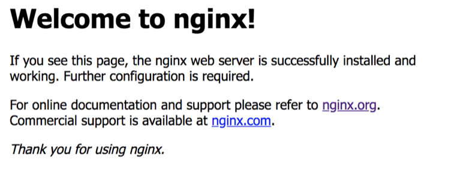
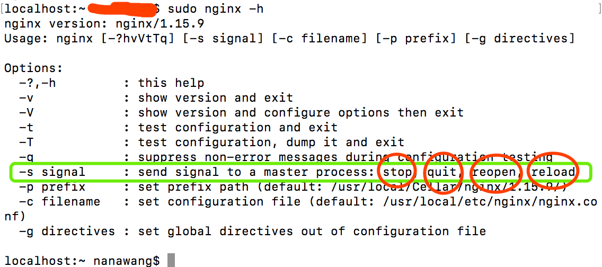
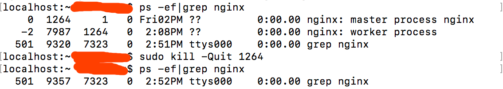

# nginx 安装和启动
nginx 是一款是由俄罗斯的程序设计师 Igor Sysoev 所开发高性能的 web 服务器和反向代理服务器，也是一个 IMAP/POP3/SMTP 代理服务器。

## 特点
  - 轻量：同样是 web 服务器，nginx 比 apache 占用更少的内存和资源，配置和启动也更简洁。
  - 高性能：nginx 处理请求是异步非阻塞，apache 则是阻塞，在高并发下 nginx 能保持低资源低消耗⾼性能。


## 常用功能（场景）
  - 代理服务
    - 正向代理：代理对象是客户端，在客户端配置，比如 vpn 翻墙
    - 反向代理：代理对象是服务端，在服务端配置，比如接口转发
  - 静态资源web服务
  - 负载均衡
  - Gzip 压缩配置
  - 适配pc和移动端
  - 配置https
  - 缓存服务（proxy_cache）

## 安装和启动
> 我的操作系统：macOS Mojave 10.14，直接用 brew 安装

1、安装
```
brew install nginx
```
nginx 配置文件位置：/usr/local/etc/nginx/nginx.conf  
nginx 程序安装的目录位置：/usr/local/Cellar/nginx

2、启动  
终端直接运行：nginx，浏览器输入 localhost 如果看下提示，说明已经启动成功了。



***注意：如果 nginx.conf 配置文件默认端口号小于 1024，那么启动时需要 root 权限，即用 sudo nginx。***  

3、重启、停止  
终端运行：sudo nginx -h  



sudo nginx -s reload　　　// 修改配置后重启生效  
（也可以用程序安装路径 sudo /usr/local/Cellar/nginx/1.17.1/bin/nginx -s reload）  
sudo nginx -s stop　　　　// 快速停止nginx  
sudo nginx -s quit　　　　// 完整有序的停止nginx/优雅关闭（先服务完已打开的连接）  
其他命令：  
　sudo nginx -s reopen　　// 重新打开日志文件  
　sudo nginx -v　　　　　// 查看版本号  
　sudo nginx -V　　　　　// 查看版本号和配置项信息  
　sudo nginx -t　　　　　// 检查配置文件的正确性    

4、其他停止 nginx 服务方法  
ps -ef|grep nginx　　　　　// 查看 nginx 进程
sudo kill -QUIT [进程号]　　// 从容停止  
sudo kill -TERM [进程号]　　// 快速停止  
sudo pkill -9 nginx　　　　// 强制停止  


