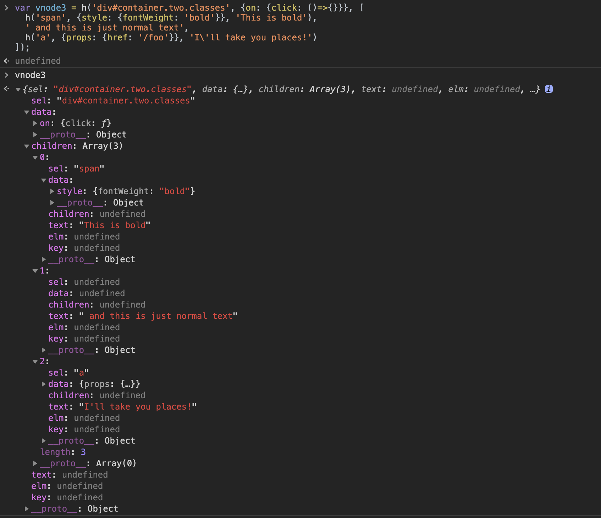
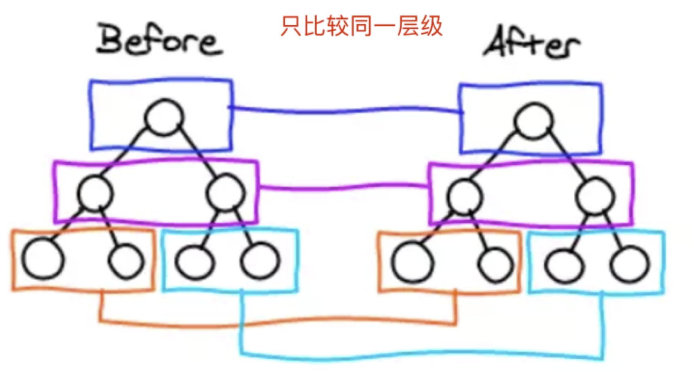
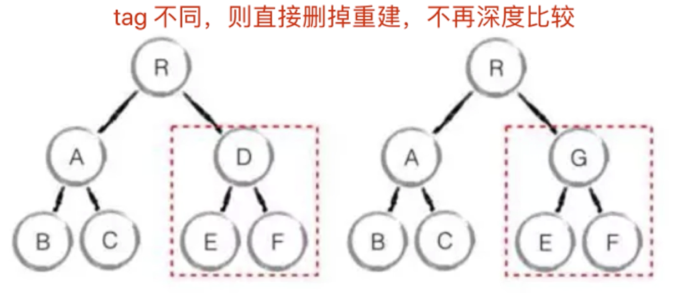
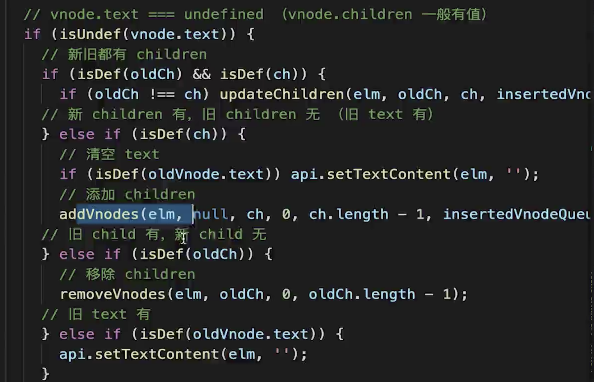
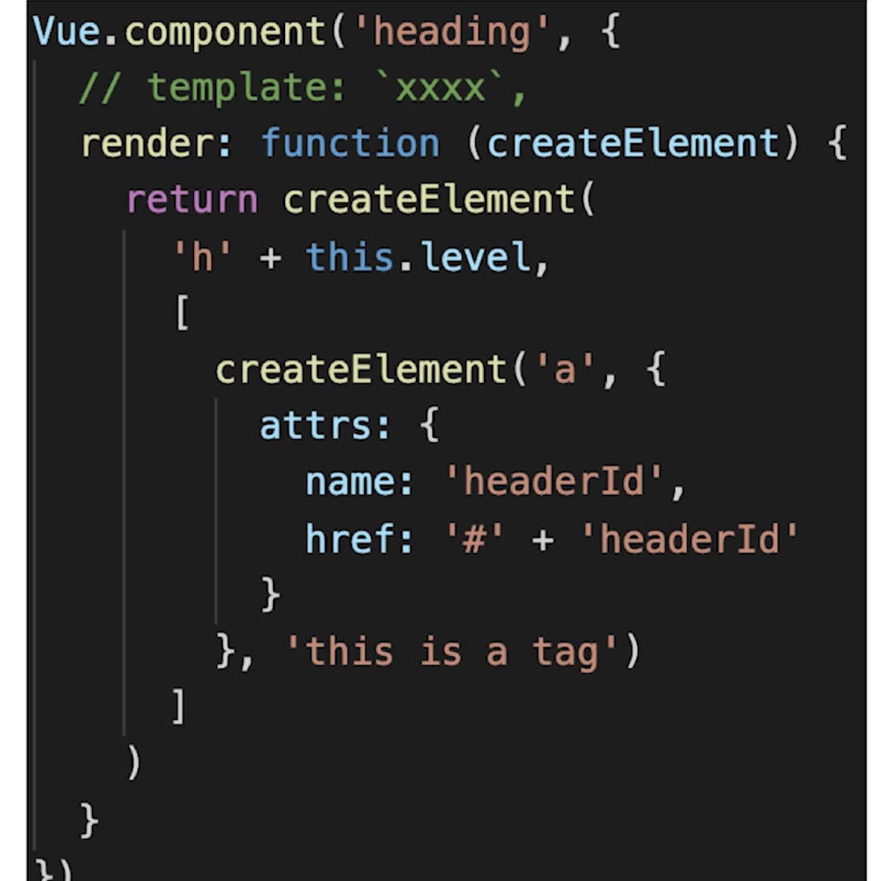
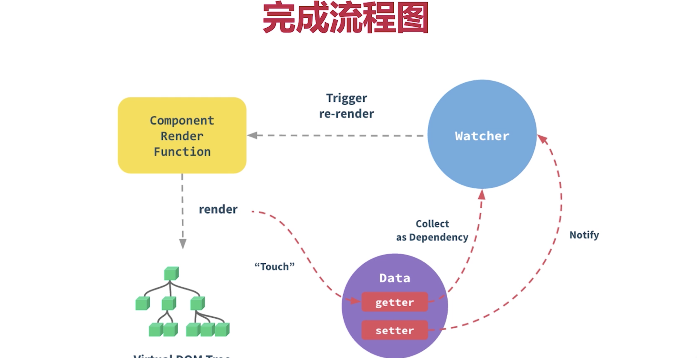
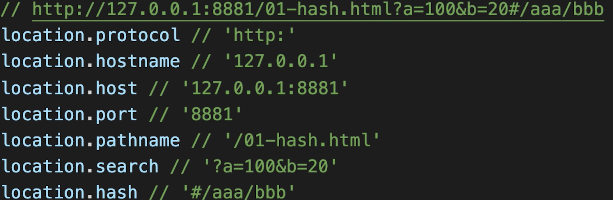

# 你在这个项目里面，都做了些什么事情？

ssr、组件库、工程化建设、移动混合方案、性能优化方案

这个项目主体是一个 vue 项目，但是因为是 pc 端，为了 seo，我特意做了 ssr。然后这个项目有一套我和同事一起做的专门的组件库。在移动端，我们为了搭配 app，也做了移动混合方案。像在首页，因为数据巨大，我们采用了一些优化方案。利用本地缓存数据，对小图标进行了 base64 转码。

# 对于 react 和 vue 两者的区别理解

问题就不在于是用 Vue 还是 React 了，而在于项目的设计、架构、以及项目管理和监督。例如是否保证严格的代码审查，是否保证每次开发时设计的可扩展性，等等。
Vue 和 React 的差别，就是两种对于前端框架的理解方式不懂。一个认为应该用 template 加指令的形式，把模板和 js 代码分离，给用户定好规则（如 data watch computed 等）。另一个认为应该用 jsx 的形式，把模板作为 js 代码的一部分，剩下的用户自己去搞定。就这样。

- 相同点

1.  都支持组件化
2.  都是数据驱动视图
3.  都是 vnode 去操作 dom

- 不同点

1. react 使用 jsx 拥抱 js、vue 使用模板拥抱 html
2. react 是函数式编程(每次修改都是通过 setState xxx 可以理解成传入 state 返回 jsx/视图) vue 是声明式编程(data 声明好，修改 data 的值，去监听，每一步操作都是声明式操作 data.a =100)
3. react 需要自力更生(给你提供 stateState 的能力)，vue 比较友好(v-for,用着是简单，但是最后肯定不是那么简单的)

# 组件化基础

1. 很久以前就有组件化，对于传统组件，只是静态渲染，更新还得依赖于 dom 操作，和传统的组件化相比，本质创新的区别就是数据驱动视图
2. 数据驱动视图 Vue MVVM
3. 数据驱动视图 React setState
   我们不再操作 dom，我们需要改界面 只要去修改其中的数据就好了，react vue 框架本身根据数据帮助我们重新渲染视图，这个和我们传统组件有本质的区别，这样让我们做 react vue 开发的时候 更关注于数据 业务逻辑，而不是操作 dom，复杂度大大降低

   vue mvvm 的理解 view 视图 model 模型数据 data ViewModel 视图模型 当我们 model 修改的时候 就立刻能执行到 view 的渲染 ，而 view 中的点击事件什么的发生改变 监听的 时候 我们都能改变 model 的数据 -->> 核心概念 数据驱动视图 mvc 的 m 是 model ，并不一定是数据库。有些程序不需要数据库，它可以用 mvc 模式来开发。
   m->model v->view vm ->viewModel
   MVVM 三要素

4. 数据响应式
   监听数据变化并在视图中更新 Object.defineProperty() proxy
5. 模板引擎  
   提供描述视图的模版语法 插值：{{}} 指令：v-bind，v-on，v-model，v-for，v-if
6. 渲染
   如何将模板转换为 html 模板 => vdom => dom

# 监听 data 变化的的核心

1. Object.defineProperty, 组件 data 的数据一旦发生变化，立即触发视图的更新
2. 实现数据驱动视图的第一步

# Vue 响应式

1. 核心 Object.defineProperty 方法会直接在一个对象上定义一个新属性，或者修改一个对象的现有属性，并返回此对象

```js
const data = {};
let name = 'zhangli';
Object.defineProperty(data, 'name', {
  get: function () {
    console.log('get');
    return name;
  },
  set: function (val) {
    console.log('set');
    name = val;
  },
});

console.log(data.name);
data.name = 'zl';
```

2. 如何实现响应式
   问题思考？

- 监听对象 监听数组
  无法监听原生数组，需要特殊处理 Object.create 创建新的对象副本，将一些原型的方法复制过去 避免污染全局变量
- 复杂对象 深度监听

```js
// 深度监听data变化?
//触发视图更新
function updateView() {
  console.log('触发视图更新');
}
//监听数组变化  原型
const oldArrayProperty = Array.prototype;
// 创建新对象 原型指向 oldArrayProperty 再拓展新的方法不会影响 Array原型
const arrProp = Object.create(oldArrayProperty);
// 重新定数组原型
['push', 'pop', 'shift', 'unshift'].forEach((methodName) => {
  arrProp[methodName] = function () {
    updateView();
    oldArrayProperty[methodName].call(this, ...arguments);
  };
});
// 重新定义属性监听起来  target我们的数据  key  value
function defineReactive(target, key, value) {
  // 深度监听
  observer(value);
  Object.defineProperty(target, key, {
    get: function () {
      return value;
    },
    set: function (newVal) {
      if (newVal !== value) {
        // 深度监听
        observer(value);
        // 设置新值
        // value一直在闭包中，此处设置完之后，再get时也是获取最新的值
        value = newVal;
      }
      //触发视图更新
      updateView();
    },
  });
}
// 监听对象属性
function observer(target) {
  if (typeof target !== 'object' || target === null) {
    // 不是对象或者数组
    return target;
  }
  // 对数组做处理
  if (Array.isArray(target)) {
    target.__proto__ = arrProp;
  }

  // 重新定义各个属性 (for in 也可以遍历数组)
  for (let key in target) {
    defineReactive(target, key, target[key]);
  }
}
// 准备数据
const data = {
  name: 'zhangli',
  age: 20,
  info: {
    address: 'beijing', //需要深度监听
  },
  num: [1, 2, 3],
};
observer(data);
// 测试
// data.name = 'zl12113';
// data.age = 21;
// data.info.address = 'gansu';
// console.log(data.info.address); //深度监听 只触发了两次视图更新
// data.age = { num: 222 }; //如果不深度监听，我们这个num就不能作为key深度监听了
// data.age.num = 33
// data.s = 'sss' //新增属性，不会触发视图更新  因为我们的响应化在初始化的时候就结束了  所以有 Vue.set
// delete data.name //删除属性 监听不到  所以有 Vue.delete
// console.log('age', data.age);
data.num.push(4);
```

3. Object.defineProperty 有什么缺点？

- 深度监听需要递归到底，一次性计算量大 如果数据很大很可能会卡死
- 无法监听新增属性 删除属性 (Vue.set Vue.delete) 使用的时候要注意 3.0 可能会被移除
- 无法监听原生数组，需要特殊处理
- 一个属性一个属性设置，比较繁琐，每次只能设置一个属性 proxy 可以为我的整个对象都添加上代理 方便很多

4. 我们使用 Proxy 但 Proxy 有兼容性问题，不能使用 polyfill

# 3.0 对比

首先抛出 Vue2 的代码模式下存在的几个问题。

随着功能的增长，复杂组件的代码变得越来越难以维护。尤其发生你去新接手别人的代码时。根本原因是 Vue 的现有 API 通过「选项」组织代码，但是在大部分情况下，通过逻辑考虑来组织代码更有意义。
缺少一种比较「干净」的在多个组件之间提取和复用逻辑的机制。
类型推断不够友好。

react 逻辑复用机制 mixin -> HOC & render-props -> Hook 增加组件嵌套啊、props 来源不明确

1. Hook 和 Mixin & HOC 对比

- 渲染上下文中公开的属性的来源不清楚。例如，当使用多个 mixin 读取组件的模板时，可能很难确定从哪个 mixin 注入了特定的属性。
- 命名空间冲突。Mixins 可能会在属性和方法名称上发生冲突，而 HOC 可能会在预期的 prop 名称上发生冲突。
- 性能问题，HOC 和无渲染组件需要额外的有状态组件实例，这会降低性能。
  而 「Hook」模式带来的好处则是：

2. React Hook 和 Vue Hook 对比

- 不要在循环，条件或嵌套函数中调用 Hook
- 确保总是在你的 React 函数的最顶层调用他们。
- 遵守这条规则，你就能确保 Hook 在每一次渲染中都按照同样的顺序被调用。这让 React 能够在多次的 useState 和 useEffect 调用之间保持 hook 状态的正确。

而 Vue 带来的不同在于：

1. 与 React Hooks 相同级别的逻辑组合功能，但有一些重要的区别。与 React Hook 不同，setup 函数仅被调用一次，这在性能上比较占优。
2. 对调用顺序没什么要求，每次渲染中不会反复调用 Hook 函数，产生的的 GC 压力较小。

3. 不必考虑几乎总是需要 useCallback 的问题，以防止传递函数 prop 给子组件的引用变化，导致无必要的重新渲染。
4. React Hook 有臭名昭著的闭包陷阱问题（甚至成了一道热门面试题，omg），如果用户忘记传递正确的依赖项数组，useEffect 和 useMemo 可能会捕获过时的变量，这不受此问题的影响。Vue 的自动依赖关系跟踪确保观察者和计算值始终正确无效。
5. 不得不提一句，React Hook 里的「依赖」是需要你去手动声明的，而且官方提供了一个 eslint 插件，这个插件虽然大部分时候挺有用的，但是有时候也特别烦人，需要你手动加一行丑陋的注释去关闭它。
   暴露给模板的属性具有明确的来源，因为它们是从 Hook 函数返回的值。
   Hook 函数返回的值可以任意命名，因此不会发生名称空间冲突。
   没有创建仅用于逻辑重用的不必要的组件实例。

6. 原理
   在 Vue 中，之所以 setup 函数只执行一次，后续对于数据的更新也可以驱动视图更新，归根结底在于它的「响应式机制」，比如我们定义了这样一个响应式的属性：

```
<template>
  <div>
    <span>{{count}}</span>
    <button @click="add"> +1 </button>
  </div>
</template>

export default {
    setup() {
        const count = ref(0)
        const add = () => count.value++
        return { count, add }
    }
}
```

这里虽然只执行了一次 setup 但是 count 在原理上是个 「响应式对象」，对于其上 value 属性的改动，

是会触发「由 template 编译而成的 render 函数」 的重新执行的。

如果需要在 count 发生变化的时候做某件事，我们只需要引入 effect 函数

```
<template>
  <div>
    <span>{{count}}</span>
    <button @click="add"> +1 </button>
  </div>
</template>

export default {
    setup() {
        const count = ref(0)

        const add = () => count.value++

        effect(function log(){
            console.log('count changed!', count.value)
        })
        return { count, add }
    }
}
```

这个 log 函数只会产生一次，这个函数在读取 count.value 的时候会收集它作为依赖，那么下次 count.value 更新后，自然而然的就能触发 log 函数重新执行了。

实际上 Vue3 的 Hook 只需要一个「初始化」的过程，也就是 setup，命名很准确。它的关键字就是「只执行一次」。

同样的逻辑在 React 中，则是这样的写法：

```
export default function Counter() {
    const [count, setCount] = useState(0)

    const add = () => setCount(prev => prev + 1)

    // 下文讲解用
    const [count2, setCount2] = useState(0)

    return (
      <div>
        <span>{count}</span>
        <button onClick={add}> +1 </button>
      </div>
    )
}
```

它是一个函数，而父组件引入它是通过 <Counter /> 这种方式引入的，实际上它会被编译成 React.createElement(Counter) 这样的函数执行，也就是说每次渲染，这个函数都会被完整的执行一次。

而 useState 返回的 count 和 setCount 则会被保存在组件对应的 Fiber 节点上，每个 React 函数每次执行 Hook 的顺序必须是相同的，举例来说。这个例子里的 useState 在初次执行的时候，由于执行了两次 useState，会在 Fiber 上保存一个 { value, setValue } -> { value2, setValue2 } 这样的链表结构。

而下一次渲染又会执行 count 的 useState、 count2 的 useState，那么 React 如何从 Fiber 节点上找出上次渲染保留下来的值呢？当然是只能按顺序找啦。

第一次执行的 useState 就拿到第一个 { value, setValue }，第二个执行的就拿到第二个 { value2, setValue2 }，

这也就是为什么 React 严格限制 Hook 的执行顺序和禁止条件调用。

假如第一次渲染执行两次 useState，而第二次渲染时第一个 useState 被 if 条件判断给取消掉了，那么第二个 count2 的 useState 就会拿到链表中第一条的值，完全混乱了。

如果在 React 中，要监听 count 的变化做某些事的话，会用到 useEffect 的话，那么下次 render

之后会把前后两次 render 中拿到的 useEffect 的第二个参数 deps 依赖值进行一个逐项的浅对比（对前后每一项依次调用 Object.is），比如

```
export default function Counter() {
    const [count, setCount] = useState(0)

    const add = () => setCount(prev => prev + 1)

    useEffect(() => {
      console.log('count updated!', count)
    }, [count])

    return (
      <div>
        <span>{count}</span>
        <button onClick={add}> +1 </button>
      </div>
    )
}
```

那么，当 React 在渲染后发现 count 发生了变化，会执行 useEffect 中的回调函数。（细心的你可以观察出来，每次渲染都会重新产生一个函数引用，也就是 useEffect 的第一个参数）。

是的，React 还是不可避免的引入了 依赖 这个概念，但是这个 依赖 是需要我们去手动书写的，实时上 React 社区所讨论的「心智负担」也基本上是由于这个 依赖 所引起的……

由于每次渲染都会不断的执行，这当中所不断产生的闭包和性能也会稍逊于 Vue3。那么它的关键字是「每次渲染都重新执行」。

关于抄袭 React Hook
Vue 2.0 引入 vdom 的主要原因是 vdom 把渲染过程抽象化了，从而使得组件的抽象能力也得到提升，并且可以适配 DOM 以外的渲染目标

1. 提取共用的自定义 Hook（在写 React 购物车组件的时候，我提取了 3 个以上可以全局复用的 Hook）。
2. 基于「逻辑功能」去组织代码，而不是 state 放在一块，method 放在一块，这样和用 Vue2 没什么本质上的区别（很多很多新人在用 React Hook 的时候犯这样的错误，包括我自己）。

# 虚拟 DOM

vnode 是 react 和 vue 的基石 diff 算法是 vnode 的核心关键
dom 操作比较耗性能,操作 dom 浏览器要不停的渲染新的树，浏览器本身处理 dom 是有性能瓶颈的 vue 和 react 是数据驱动视图 如何有效控制 dom 操作？

解决方案

- 预计算 dom 的各种操作 吧最后一次的结果渲染出来(减少 dom 渲染次数)
- 有了一定的复杂度，想减少计算次数比较困难
- 能不能把计算，更多的转移为 js 计算？因为 js 执行速度很快 由于 dom 的这个操作属于预处理操作，并没有真的是操作 dom，所以叫做虚拟 dom，最后再计算完后才真正的将 dom 操作提交，将 dom 操作的变化反映到 dom 书上
- vnode 用 js 模拟 dom 结构，计算出最小的变更，操作 dom

通过 snabbdom 学习 vnode vue 也是参考这个库实现 vnode 和 diff

[snabbdom](https://github.com/snabbdom/snabbdom)

```
<div id="div1" class="container">
  <p>vdom</p>
  <ul style="font-size:20">
    <li>a</li>
  </ul>
</div>
// 这个地方的名字 也是有可能不同的  但是呢 结构基本是一直的 tag-sel  props-有可能是 data children为空的时候
text可以写个值
{
  tag: 'div',
  props:{
    className:'container',
    id:'div1'
  },
  children:[
    {
      tag:'p',
      children:'vdom'
    },
    {
      tag:'ul',
      props:{
        style:'font-size:20px'
      },
      children:[
        {
          tag:'li',
          children:'a'
        }
      ]
    }
  ]
}
```

2.  核心逻辑 价值
    尽量将所有的计算放在 js 中，进行一些对比计算之后，找出最需要更新的 dom 操作才去更新，不需要更新的不会更新
    学习 -> snabbdom 进行 vdom 的学习

- h 函数如何去生成一个 vnode 的结构
- patch 函数可以初次渲染
- 接着 patch 函数 可以进行一个 dom 的更新

```
const snabbdom = window.snabbdom

// 定义 patch
const patch = snabbdom.init([
    snabbdom_class,
    snabbdom_props,
    snabbdom_style,
    snabbdom_eventlisteners
])

// 定义 h
const h = snabbdom.h

const container = document.getElementById('container')

// 生成 vnode   h函数  参数 1.tag 2.数据（props之类的） 3. 子元素集合
const vnode = h('ul#list', {}, [
    h('li.item', {}, 'Item 1'),
    h('li.item', {}, 'Item 2')
])

//讲我们的 vnode真正渲染到我们的 container节点上 打补丁嘛 初次渲染
patch(container, vnode)

document.getElementById('btn-change').addEventListener('click', () => {
    // 生成 newVnode
    const newVnode = h('ul#list', {}, [
        h('li.item', {}, 'Item 1'),
        h('li.item', {}, 'Item B'),
        h('li.item', {}, 'Item 3')
    ])
    //再次渲染 新旧vdom进行对比 dom更新 用新的vnode给老的vnode做一个更新
    patch(vnode, newVnode)
    patch(newVnode, null) //销毁掉
})
```

3. 总结

- 用 js 模拟 dom 结构 vnode
- 新旧 vnode 进行对比，得出最小的更新范围，最后更新 dom
- 只有这样才能在数据驱动视图的时候，有效控制 dom 操作

```
  const snabbdom = window.snabbdom
  // 定义关键函数 patch
  const patch = snabbdom.init([
      snabbdom_class,
      snabbdom_props,
      snabbdom_style,
      snabbdom_eventlisteners
  ])

  // 定义关键函数 h
  const h = snabbdom.h

  // 原始数据
  const data = [
      {
          name: '张三',
          age: '20',
          address: '北京'
      },
      {
          name: '李四',
          age: '21',
          address: '上海'
      },
      {
          name: '王五',
          age: '22',
          address: '广州'
      }
  ]
  // 把表头也放在 data 中
  data.unshift({
      name: '姓名',
      age: '年龄',
      address: '地址'
  })

  const container = document.getElementById('container')

  // 渲染函数
  let vnode
  function render(data) {
      const newVnode = h('table', {}, data.map(item => {
          const tds = []
          for (let i in item) {
              if (item.hasOwnProperty(i)) {
                  tds.push(h('td', {}, item[i] + ''))
              }
          }
          return h('tr', {}, tds)
      }))

      if (vnode) {
          // re-render
          patch(vnode, newVnode)
      } else {
          // 初次渲染
          patch(container, newVnode)
      }

      // 存储当前的 vnode 结果
      vnode = newVnode
  }

  // 初次渲染
  render(data)


  const btnChange = document.getElementById('btn-change')
  btnChange.addEventListener('click', () => {
      data[1].age = 30
      data[2].address = '深圳'
      // re-render
      render(data)
  })
```

# 官网 demo

```
var snabbdom = require('snabbdom');
var patch = snabbdom.init([ // Init patch function with chosen modules
  require('snabbdom/modules/class').default, // makes it easy to toggle classes
  require('snabbdom/modules/props').default, // for setting properties on DOM elements
  require('snabbdom/modules/style').default, // handles styling on elements with support for animations
  require('snabbdom/modules/eventlisteners').default, // attaches event listeners
]);
var h = require('snabbdom/h').default; // helper function for creating vnodes

var container = document.getElementById('container');

var vnode = h('div#container.two.classes', {on: {click: someFn}}, [
  h('span', {style: {fontWeight: 'bold'}}, 'This is bold'),
  ' and this is just normal text',
  h('a', {props: {href: '/foo'}}, 'I\'ll take you places!')
]);
// Patch into empty DOM element – this modifies the DOM as a side effect
patch(container, vnode);

var newVnode = h('div#container.two.classes', {on: {click: anotherEventHandler}}, [
  h('span', {style: {fontWeight: 'normal', fontStyle: 'italic'}}, 'This is now italic type'),
  ' and this is still just normal text',
  h('a', {props: {href: '/bar'}}, 'I\'ll take you places!')
]);
// Second `patch` invocation
patch(vnode, newVnode); // Snabbdom efficiently updates the old view to the new state
patch(newVnode, null)
```



# diff 算法概述

1. diff 算法是 vnode 中最核心
2. diff 算法能在日常使用 vue react 中体现出来 比如 key

- 首先要了解 diff 算法并不是 react 独有的 diff 对比的意思 是一个很广泛的概念 如 linux diff 我们经常使用的 git diff
- 两个 js 对象之间也可做 diff jiff(一个对比库)
- 两棵树做 diff 如这里的 vnode diff

* 两棵树作对比

  - 第一，遍历树 A ，复杂度是 O(n)
  - 第二，遍历树 B，复杂度是 O(n)
  - 第三，对树的节点进行排序。这是可没说是同级别的，严格的树 diff ，是各个级别的都要移动排序，所以复杂度是 O(n)
    三者嵌套起来，就会 O(n^3)

  (只在同一层级对比，而且根据 key 来判断，这样只遍历一遍即可。例如，开始遍历树 A ，遍历过程中就把树 B 的同层级节点进行对比了，待树 A 遍历完了，树 B 也就遍历完了，一遍完事儿。所以是 O(n))

- 树 diff 的时间复杂度 o(n^3) n^3 的算法是不可用的 1000 个节点 要计算 1 亿
  优化时间复杂度到 o(n)
  如何实践呢？

- 只比较同一层级 不跨级比较

  

- tag 不相同 则直接删掉重建，不再深度比较(就是把这个节点删掉，重新根据 vnode 创建一个新的节点（包括该节点的所有子节点)
- tag 和 key 都相同，则认为两者都相同，不再深度比较(同 key 同 tag ，即 sameNode ，则不会向下继续比较 —— 这是 diff 算法的一个理论指导,并不是实现 比如 snabbdom ，它就会去深入对比，即便 tag 和 key 都相同)
  如果问到具体实现方式，可以参考 snabbdom 的方式来说。如果问到 diff 算法的时间复杂度，三条优化。

//核心比较代码 key 和 sel 都相等
function sameVnode(vnode1, vnode2) {
return vnode1.key === vnode2.key && vnode1.sel === vnode2.sel;
}




总结

1. patchVnode(oldVnode,newVnode)
2. addVnodes removeVnodes
3. updateChildren setTextContent key 的重要性

vnode 的核心概念很重要 h 函数 vnode patch diff key
vnode 存在的价值更重要 数据驱动视图 控制 dom 操作的性能和效果采用的

# 模板编译前置知识点

前置知识

- js 的 with 语法

* 改变{}内自由变量的查找规则，当做 obj 属性来查找
* 如果找不到匹配的 obj 属性，就会报错
* with 要谨慎使用 因为他打破了作用域规则，易读性变差

```
with(obj){console.log(a)}
```

1. 模板是我们 vue 开发中最常用的部分，我们可以了解其相关联性原理
2. 它不是 html，有指令，有差值，js 表达式，到底是什么 html 是标签语言只有 js 才能实现循环 判断 因此 模板一定是转换为某种 js 代码，即模板编译(html 是标签语言，只有 js 才能实现判断循环(图灵完备))
3. 一般我们会通过 组件渲染和更新过程 理解

我们使用 vue-template-compile
[参考](https://zhuanlan.zhihu.com/p/114239056)

```
const compiler = require('vue-template-compiler')

// 插值
// const template = `<p>{{message}}</p>`
// with(this){return createElement('p',[createTextVNode(toString(message))])}
// h -> vnode  this->vm实例 用了with 里面自由变量的查找都会变成this
// function(){with(this){return createElement('p',[createTextVNode(toString(message))])}}执行这个函数体
// _c 就是 h函数 createElement -> vnode

// // 表达式
// const template = `<p>{{flag ? message : 'no message found'}}</p>`
// // with(this){return _c('p',[_v(_s(flag ? message : 'no message found'))])}

// // 属性和动态属性
// const template = `
//     <div id="div1" class="container">
//         
//     </div>
// ` 这个地方是  staticClass 以前我们是classname 这个没有关系 只要完成名字的识别闭环就行了
// with(this){return _c('div',
//      {staticClass:"container",attrs:{"id":"div1"}},
//      [
//          _c('img',{attrs:{"src":imgUrl}})])}

// // 条件
// const template = `
//     <div>
//         <p v-if="flag === 'a'">A</p>
//         <p v-else>B</p>
//     </div>
// `
// with(this){return _c('div',[(flag === 'a')?_c('p',[_v("A")]):_c('p',[_v("B")])])}

// 循环
// const template = `
//     <ul>
//         <li v-for="item in list" :key="item.id">{{item.title}}</li>
//     </ul>
// `  // _l -> renderList
// with(this){return _c('ul',_l((list),function(item){return _c('li',{key:item.id},[_v(_s(item.title))])}),0)}

// 事件
// const template = `
//     <button @click="clickHandler">submit</button>
// `
// with(this){return _c('button',{on:{"click":clickHandler}},[_v("submit")])}

// v-model
const template = `<input type="text" v-model="name">`
// 主要看 input 事件
// with(this){return _c('input',{directives:[{name:"model",rawName:"v-model",value:(name),expression:"name"}],attrs:{"type":"text"},domProps:{"value":(name)},on:{"input":function($event){if($event.target.composing)return;name=$event.target.value}}})}

// render 函数
// 返回 vnode
// patch

// 编译
const res = compiler.compile(template)
console.log(res.render)

// ---------------分割线--------------

// // 从 vue 源码中找到缩写函数的含义
// function installRenderHelpers (target) {
//     target._o = markOnce;
//     target._n = toNumber;
//     target._s = toString;
//     target._l = renderList;
//     target._t = renderSlot;
//     target._q = looseEqual;
//     target._i = looseIndexOf;
//     target._m = renderStatic;
//     target._f = resolveFilter;
//     target._k = checkKeyCodes;
//     target._b = bindObjectProps;
//     target._v = createTextVNode;
//     target._e = createEmptyVNode;
//     target._u = resolveScopedSlots;
//     target._g = bindObjectListeners;
//     target._d = bindDynamicKeys;
//     target._p = prependModifier;
// }

```

- vue template complier 将模板编译为 render 函数

- 执行 render 函数 生成 vnode (模板本质上还是一个函数)

- 基于 vnode 再执行 patch 和 diff

- 使用 webpack vue-loader 会在开发环境下编译模板

# vue 组件可用 render 代替 template

这个 createElement 的参数和我们编译后的那个 render 函数体是一样的 h1



在有些复杂的情况下，不能用 template，可以考虑用 render
react 中一直在使用 render(没有模板)

# 组件渲染更新过程

1. 一个组件渲染到页面，修改 data 触发更新(数据驱动视图)

   - 初次渲染过程？ 是如何渲染到页面上的

   * 解析模板为 render 函数(或在开发环境中已完成，vue-loader 现在才知道这个 loader 是做什么的了吧 我们做的小 demo 会在运行时编译的)
   * 触发响应式，监听 data 属性 getter setter (这个时候 setter 还没有 但是 getter 已经有了) 我们在后面会用到 执行 render 函数会触发 getter

   ```
   <p>{{ message }}</p>;
    export default {
      data() {
        return {
          messag: 'zhangli', // 会触发get
          city: 'beijing' // 不会触发get 因为模板没用到，即和视图没关系
        };
      }
    };
   ```

   - 执行 render 函数，生成 vnode，patch(elem,vnode) // 第一次把我们的 vnode 渲染到页面节点上

   * 更新过程

     - 修改 data，触发 setter 此前在 getter 中已经被监听
     - 重新执行 render 函数(render 函数执行的时候会 touch 我们的 getter，触发的时候就会收集依赖) 生成 newVnode
     - patch(vnode,newVnode) //新的 vnode 去更新就得 vnode
       (我在模板里面触发了哪个 getter 我们就先把他观察起来 然后 一旦我们修改了 data 我们就 notify 这个 watcher
       我们修改的这个 data 是不是我们前面观察的那个 data 如果是我们前面作为依赖观察起来的 我们就重新触发 re-render 渲染 重新生成一个虚拟 dom 树，重新 patch)
       

   * 异步渲染 只有异步才能满足我们性能的要求

     回顾 \$nextTick 汇总 data 的修改，一次性更改视图 减少 dom 修改次数，提高性能(如果不是异步的 没改一次渲染一次 那不得了了)

2. 其背后原理是什么，需要掌握什么
3. 考察对流程的了解的全面程度

三大原则
总结

1. 响应式 监听 data 属性 setter getter
2. 模板编译 模板到 render 函数 再到 vnode
3. vdom patch(elem,vnode) 和 patch(vnode,newVnode)

# 前端路由原理

一个管理请求入口和页面映射关系的东西 可以实现对页面局部进行无刷新替换，让用户感觉切换到了网页一样

1. 稍微复杂一点的 SPA，都需要路由 通过 hash 的变化触发视图的更新
2. vue-router

hash H5 history(后端支持)



我们通过 hash 的变化来监听路由的变化

- hash 的变化会触发网页跳转，即浏览器的前进后退 但浏览器不会刷新
- hash 变化不会刷新页面 spa 必须的特点
- hash 永远不会提交到 server 端(自生自灭)

```
// hash变化包括
// 1. js修改 url 2.手动修改url的hash 3. 浏览器 前进后退
window.onhashchange = event => {
  console.log('old-url', event.oldURL);
  console.log('new-url', event.newURL);
};

// 页面初次加载 获取 hash
document.addEventListener('DOMContentLoaded', () => {
  console.log(location.hash);
});

// js修改url
document.getElementById('btn1').addEventListener('click', function() {
  location.hash = '#/user';
});

// 指定要事件触发时执行的函数  addEventListener补充
// true - 事件句柄在捕获阶段执行
// false- 默认。事件句柄在冒泡阶段执行
```

history pushState onpopstate 需要后台支持

```
// 页面初次加载，获取 path
document.addEventListener('DOMContentLoaded', () => {
  console.log('load', location.pathname);
});

// 打开一个新的路由
// 【注意】用 pushState 方式，浏览器不会刷新页面
document.getElementById('btn1').addEventListener('click', () => {
  const state = { name: 'page1' };
  console.log('切换路由到', 'page1');
  history.pushState(state, '', 'page1'); // 重要！！
});

// 监听浏览器前进、后退
window.onpopstate = event => {
  // 重要！！
  console.log('onpopstate', event.state, location.pathname);
};

// 需要 server 端配合，可参考
// https://router.vuejs.org/zh/guide/essentials/history-mode.html#%E5%90%8E%E7%AB%AF%E9%85%8D%E7%BD%AE%E4%BE%8B%E5%AD%90

```

总结 两者使用选择

1. to B 的系统推荐使用 hash，简单易用，对 url 规范不明感
2. to C 的系统可以考虑选择 H5 history,需要服务端支持 想想我以前做的那个 pc 网站 就是这种模式
   如果真的需要做 seo 搜索引擎优化 可以考虑
3. 能简单就简单
