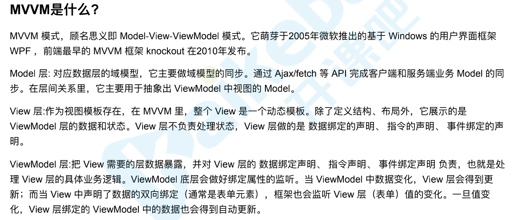
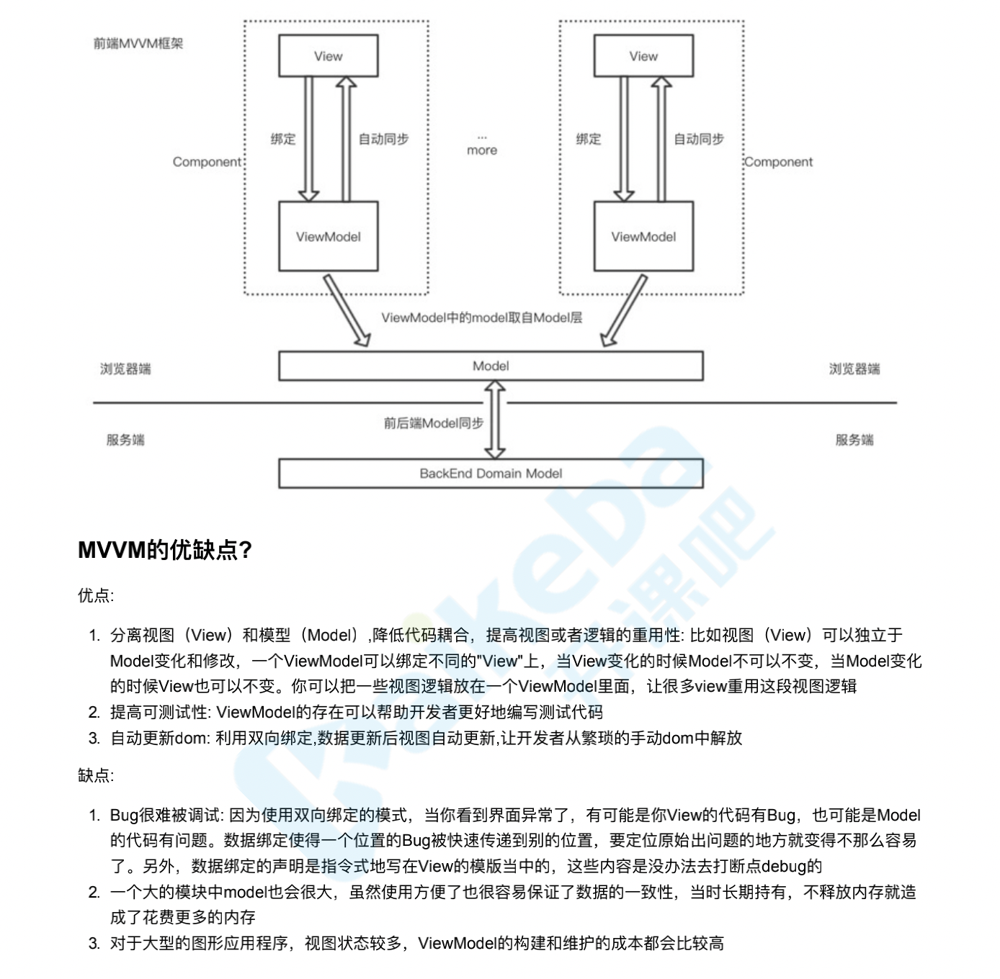
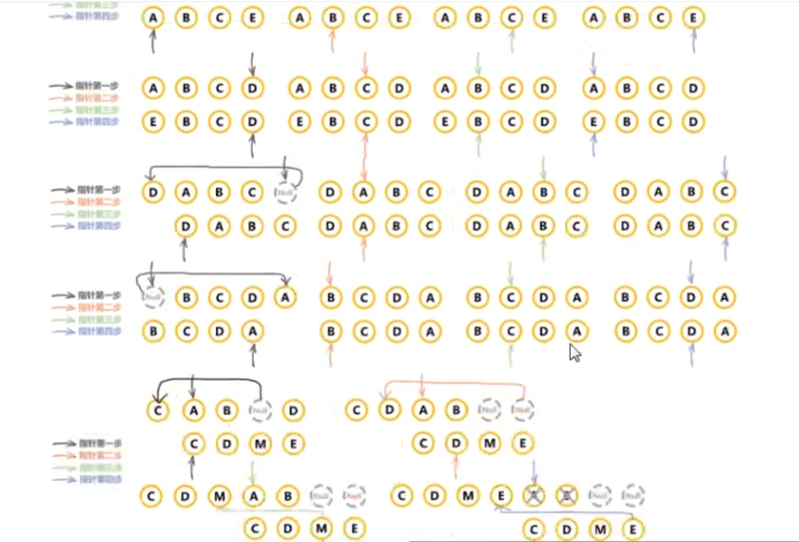
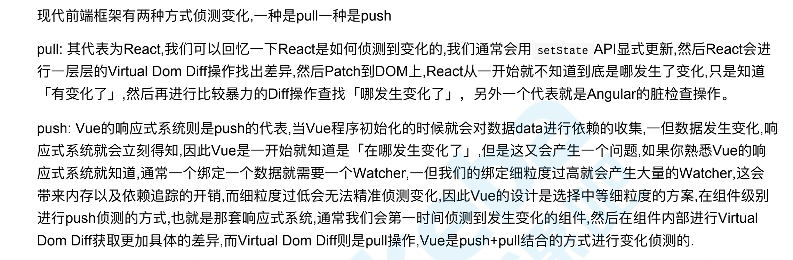
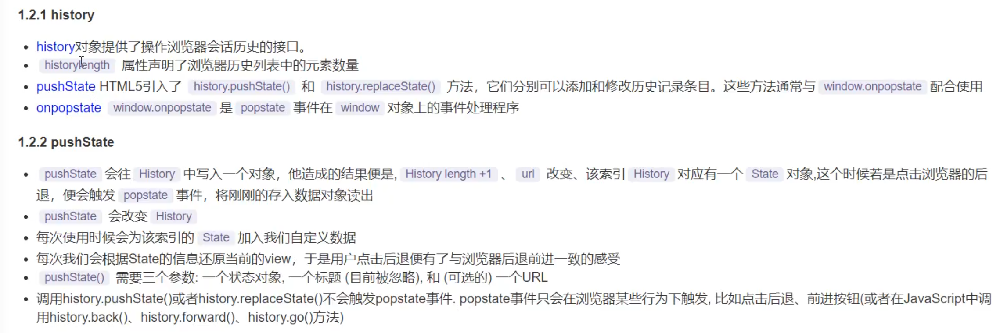

# 你在这个项目里面，都做了些什么事情？

ssr、组件库、工程化建设、移动混合方案、性能优化方案

这个项目主体是一个 vue 项目，但是因为是 pc 端，为了 seo，我特意做了 ssr。然后这个项目有一套我和同事一起做的专门的组件库。在移动端，我们为了搭配 app，也做了移动混合方案。像在首页，因为数据巨大，我们采用了一些优化方案。利用本地缓存数据，对小图标进行了 base64 转码。

# 对于 react 和 vue 两者的区别理解

问题就不在于是用 Vue 还是 React 了，而在于项目的设计、架构、以及项目管理和监督。例如是否保证严格的代码审查，是否保证每次开发时设计的可扩展性，等等。
Vue 和 React 的差别，就是两种对于前端框架的理解方式不懂。一个认为应该用 template 加指令的形式，把模板和 js 代码分离，给用户定好规则（如 data watch computed 等）。另一个认为应该用 jsx 的形式，把模板作为 js 代码的一部分，剩下的用户自己去搞定。就这样。

- 相同点

1.  都支持组件化
2.  都是数据驱动视图
3.  都是 vnode 去操作 dom

- 不同点

1. react 使用 jsx 拥抱 js、vue 使用模板拥抱 html
2. react 是函数式编程(每次修改都是通过 setState xxx 可以理解成传入 state 返回 jsx/视图) vue 是声明式编程(data 声明好，修改 data 的值，去监听，每一步操作都是声明式操作 data.a =100)
3. react 需要自力更生(给你提供 stateState 的能力)，vue 比较友好(v-for,用着是简单，但是最后肯定不是那么简单的)

# 组件化基础

## mvvm 理解

  


1. view -> 视图
2. model -> 模型数据 vue 中的 data
3. ViewModel ->

- 视图模型(比较抽象，类似于 vue 提供的一种能力，比如，事件，监听，整个 view 和 model 连接的部分，比如点击一个事件，触发一个函数,this.name 对 model 里面的数据进行了一个赋值操作，所有涉及到 model 数据修改的，都是 view-model)
- 当我们 model 修改的时候 就立刻能执行到 view 的渲染 ，而 view 中的点击事件什么的发生改变,监听的 时候,我们都能改变 model 的数据 -->> 核心概念 数据驱动视图 mvc 的 m 是 model ，并不一定是数据库。有些程序不需要数据库，它可以用 mvc 模式来开发。
  m->model v->view vm ->viewModel
  MVVM 三要素

4. 很久以前就有组件化，对于传统组件，只是静态渲染，更新还得依赖于 dom 操作，和传统的组件化相比，本质创新的区别就是数据驱动视图

- asp、php、nodejs 的组件化

2. 数据驱动视图 Vue MVVM
3. 数据驱动视图 React setState
   我们不再操作 dom，我们需要改界面，只要去修改其中的数据就好了，react vue 框架本身根据数据帮助我们重新渲染视图，这个和我们传统组件有本质的区别，这样让我们做 react vue 开发的时候，更关注于数据、业务逻辑，而不是操作 dom，复杂度大大降低

4. 数据响应式
   监听数据变化并在视图中更新 Object.defineProperty() proxy
5. 模板引擎  
   提供描述视图的模版语法 插值：{{}} 指令：v-bind，v-on，v-model，v-for，v-if
6. 渲染
   如何将模板转换为 html 模板 => vdom => dom

# 监听 data 变化的的核心

1. Object.defineProperty, 组件 data 的数据一旦发生变化，立即触发视图的更新
2. 实现数据驱动视图的第一步

# Vue 响应式

1. 核心 Object.defineProperty 方法会直接在一个对象上定义一个新属性，或者修改一个对象的现有属性，并返回此对象

```js
const data = {};
let name = 'zhangli';
Object.defineProperty(data, 'name', {
  get: function () {
    console.log('get');
    return name;
  },
  set: function (val) {
    console.log('set');
    name = val;
  },
});

console.log(data.name);
data.name = 'zl';
```

2. 如何实现响应式
   问题思考？

- 监听对象 监听数组
  无法监听原生数组，需要特殊处理 Object.create 创建新的对象副本，将一些原型的方法复制过去 避免污染全局变量
- 复杂对象 深度监听

```js
// 深度监听data变化?
//触发视图更新
function updateView() {
  console.log('触发视图更新');
}
//监听数组变化  原型
const oldArrayProperty = Array.prototype;
// 创建新对象 原型指向 oldArrayProperty 再拓展新的方法不会影响 Array原型
const arrProp = Object.create(oldArrayProperty);
// 重新定数组原型
['push', 'pop', 'shift', 'unshift'].forEach((methodName) => {
  arrProp[methodName] = function () {
    updateView();
    oldArrayProperty[methodName].call(this, ...arguments);
  };
});
// 重新定义属性监听起来  target我们的数据  key  value
function defineReactive(target, key, value) {
  // 深度监听
  observer(value);
  Object.defineProperty(target, key, {
    get: function () {
      return value;
    },
    set: function (newVal) {
      if (newVal !== value) {
        // 深度监听
        observer(value);
        // 设置新值
        // value一直在闭包中，此处设置完之后，再get时也是获取最新的值
        value = newVal;
      }
      //触发视图更新
      updateView();
    },
  });
}
// 监听对象属性
function observer(target) {
  if (typeof target !== 'object' || target === null) {
    // 不是对象或者数组
    return target;
  }
  // 对数组做处理
  if (Array.isArray(target)) {
    target.__proto__ = arrProp;
  }

  // 重新定义各个属性 (for in 也可以遍历数组)
  for (let key in target) {
    defineReactive(target, key, target[key]);
  }
}
// 准备数据
const data = {
  name: 'zhangli',
  age: 20,
  info: {
    address: 'beijing', //需要深度监听
  },
  num: [1, 2, 3],
};
observer(data);
// 测试
// data.name = 'zl12113';
// data.age = 21;
// data.info.address = 'gansu';
// console.log(data.info.address); //深度监听 只触发了两次视图更新
// data.age = { num: 222 }; //如果不深度监听，我们这个num就不能作为key深度监听了
// data.age.num = 33
// data.s = 'sss' //新增属性，不会触发视图更新  因为我们的响应化在初始化的时候就结束了  所以有 Vue.set
// delete data.name //删除属性 监听不到  所以有 Vue.delete
// console.log('age', data.age);
data.num.push(4);
```

3. Object.defineProperty 缺点？

- 深度监听需要递归到底，一次性计算量大 如果数据很大很可能会卡死
- 无法监听新增属性 删除属性 (Vue.set Vue.delete) 使用的时候要注意 3.0 可能会被移除
- 无法监听原生数组，需要特殊处理
- 一个属性一个属性设置，比较繁琐，每次只能设置一个属性 proxy 可以为我的整个对象都添加上代理 方便很多

4. 我们使用 Proxy 但 Proxy 有兼容性问题，不能使用 polyfill

- Proxy 可以直接监听对象⽽⾮属性 Proxy 可以直接监听数组的变化
- Proxy 有多达 13 种拦截⽅法,不限于 apply、ownKeys、deleteProperty、has 等等是 Object.defineProperty 不具备的 Proxy 返回的是⼀个新对象,我们可以只操作新的对象达到⽬的,⽽ Object.defineProperty 只能遍历对象属性直接修改
- Proxy 作为新标准将受到浏览器⼚商重点持续的性能优化，也就是传说中的新标准的性能红利

# 3.0 对比

首先抛出 Vue2 的代码模式下存在的几个问题。

随着功能的增长，复杂组件的代码变得越来越难以维护。尤其发生你去新接手别人的代码时。根本原因是 Vue 的现有 API 通过「选项」组织代码，但是在大部分情况下，通过逻辑考虑来组织代码更有意义。
缺少一种比较「干净」的在多个组件之间提取和复用逻辑的机制。
类型推断不够友好。

react 逻辑复用机制 mixin -> HOC & render-props -> Hook 增加组件嵌套啊、props 来源不明确

## Mixin 的缺陷

- 组件与 Mixin 之间存在隐式依赖（Mixin 经常依赖组件的特定⽅法，但在定义组件时并不知道这种依赖关系）
- 多个 Mixin 之间可能产⽣冲突（⽐如定义了相同的 state 字段）
- Mixin 倾向于增加更多状态，这降低了应⽤的可预测性（The more state in your application, the harder it is to reason about it.），导致复杂度剧增 隐式依赖导致依赖关系不透明，维护成本和理解成本迅速攀升

## HOC 相⽐ Mixin 的优势:

- HOC 通过外层组件通过 Props 影响内层组件的状态，⽽不是直接改变其 State 不存在冲突和互相⼲扰,这就降低了 耦合度
- 不同于 Mixin 的打平+合并，HOC 具有天然的层级结构（组件树结构），这⼜降低了复杂度

## HOC 的缺陷

- 扩展性限制: HOC ⽆法从外部访问⼦组件的 State 因此⽆法通过 shouldComponentUpdate 滤掉不必要的更新,React 在⽀持 ES6 Class 之后提供了 React.PureComponent 来解决这个问题

- Ref 传递问题: Ref 被隔断,后来的 React.forwardRef 来解决这个问题
- Wrapper Hell: HOC 可能出现多层包裹组件的情况,多层抽象同样增加了复杂度和理解成本
- 命名冲突: 如果⾼阶组件多次嵌套,没有使⽤命名空间的话会产⽣冲突,然后覆盖⽼属性
- 不可⻅性: HOC 相当于在原有组件外层再包装⼀个组件,你压根不知道外层的包装是啥,对于你是⿊盒
  关于抄袭 React Hook

## Render Props 优点:

上述 HOC 的缺点 Render Props 都可以解决

## Render Props 缺陷:

使⽤繁琐: HOC 使⽤只需要借助装饰器语法通常⼀⾏代码就可以进⾏复⽤,Render Props ⽆法做到如此简单
嵌套过深: Render Props 虽然摆脱了组件多层嵌套的问题,但是转化为了函数回调的嵌套

Vue 2.0 引入 vdom 的主要原因是 vdom 把渲染过程抽象化了，从而使得组件的抽象能力也得到提升，并且可以适配 DOM 以外的渲染目标

1. 提取共用的自定义 Hook（在写 React 购物车组件的时候，我提取了 3 个以上可以全局复用的 Hook）。
2. 基于「逻辑功能」去组织代码，而不是 state 放在一块，method 放在一块，这样和用 Vue2 没什么本质上的区别（很多很多新人在用 React Hook 的时候犯这样的错误，包括我自己）。

# 虚拟 DOM

vnode 是 react 和 vue 的基石 diff 算法是 vnode 的核心关键

- dom 操作比较耗性能,操作 dom 浏览器要不停的渲染新的树，浏览器本身处理 dom 是有性能瓶颈的
- vue 和 react 是数据驱动视图 如何有效控制 dom 操作？

解决方案

- 预计算 dom 的各种操作 把 最后一次的结果渲染出来(减少 dom 渲染次数)
- 有了一定的复杂度，想减少计算次数比较困难
- 能不能把计算，更多的转移为 js 计算？因为 js 执行速度很快 由于 dom 的这个操作属于预处理操作，并没有真的是操作 dom，所以叫做虚拟 dom，最后再计算完后才真正的将 dom 操作提交，将 dom 操作的变化反映到 dom 树上
- vnode 用 js 模拟 dom 结构，计算出最小的变更，操作 dom

通过 snabbdom 学习 vnode vue 也是参考这个库实现 vnode 和 diff

[snabbdom](https://github.com/snabbdom/snabbdom)

```js
<div id="div1" class="container">
  <p>vdom</p>
  <ul style="font-size:20">
    <li>a</li>
  </ul>
</div>
// 这个地方的名字 也是有可能不同的  但是呢 结构基本是一直的 tag-sel  props-有可能是 data children为空的时候
text可以写个值
{
  tag: 'div',
  props:{
    className:'container',
    id:'div1'
  },
  children:[
    {
      tag:'p',
      children:'vdom'
    },
    {
      tag:'ul',
      props:{
        style:'font-size:20px'
      },
      children:[
        {
          tag:'li',
          children:'a'
        }
      ]
    }
  ]
}
```

2.  核心逻辑 价值
    尽量将所有的计算放在 js 中，进行一些对比计算之后，找出最需要更新的 dom 操作才去更新，不需要更新的不会更新
    学习 -> snabbdom 进行 vdom 的学习

- h 函数如何去生成一个 vnode 的结构
- patch 函数可以初次渲染
- 接着 patch 函数 可以进行一个 dom 的更新

```js
const snabbdom = window.snabbdom;

// 定义 patch
const patch = snabbdom.init([
  snabbdom_class,
  snabbdom_props,
  snabbdom_style,
  snabbdom_eventlisteners,
]);

// 定义 h
const h = snabbdom.h;

const container = document.getElementById('container');

// 生成 vnode   h函数  参数 1.tag 2.数据（props之类的） 3. 子元素集合
const vnode = h('ul#list', {}, [
  h('li.item', {}, 'Item 1'),
  h('li.item', {}, 'Item 2'),
]);

//讲我们的 vnode真正渲染到我们的 container节点上 打补丁嘛 初次渲染
patch(container, vnode);

document.getElementById('btn-change').addEventListener('click', () => {
  // 生成 newVnode
  const newVnode = h('ul#list', {}, [
    h('li.item', {}, 'Item 1'),
    h('li.item', {}, 'Item B'),
    h('li.item', {}, 'Item 3'),
  ]);
  //再次渲染 新旧vdom进行对比 dom更新 用新的vnode给老的vnode做一个更新
  patch(vnode, newVnode);
  patch(newVnode, null); //销毁掉
});
```

3. 总结

- 用 js 模拟 dom 结构 vnode
- 新旧 vnode 进行对比，得出最小的更新范围，最后更新 dom
- 只有这样才能在数据驱动视图的时候，有效控制 dom 操作

```js
const snabbdom = window.snabbdom;
// 定义关键函数 patch
const patch = snabbdom.init([
  snabbdom_class,
  snabbdom_props,
  snabbdom_style,
  snabbdom_eventlisteners,
]);

// 定义关键函数 h
const h = snabbdom.h;

// 原始数据
const data = [
  {
    name: '张三',
    age: '20',
    address: '北京',
  },
  {
    name: '李四',
    age: '21',
    address: '上海',
  },
  {
    name: '王五',
    age: '22',
    address: '广州',
  },
];
// 把表头也放在 data 中
data.unshift({
  name: '姓名',
  age: '年龄',
  address: '地址',
});

const container = document.getElementById('container');

// 渲染函数
let vnode;
function render(data) {
  const newVnode = h(
    'table',
    {},
    data.map((item) => {
      const tds = [];
      for (let i in item) {
        if (item.hasOwnProperty(i)) {
          tds.push(h('td', {}, item[i] + ''));
        }
      }
      return h('tr', {}, tds);
    })
  );

  if (vnode) {
    // re-render
    patch(vnode, newVnode);
  } else {
    // 初次渲染
    patch(container, newVnode);
  }

  // 存储当前的 vnode 结果
  vnode = newVnode;
}

// 初次渲染
render(data);

const btnChange = document.getElementById('btn-change');
btnChange.addEventListener('click', () => {
  data[1].age = 30;
  data[2].address = '深圳';
  // re-render
  render(data);
});
```

# 官网 demo

```js
var snabbdom = require('snabbdom');
var patch = snabbdom.init([
  // Init patch function with chosen modules
  require('snabbdom/modules/class').default, // makes it easy to toggle classes
  require('snabbdom/modules/props').default, // for setting properties on DOM elements
  require('snabbdom/modules/style').default, // handles styling on elements with support for animations
  require('snabbdom/modules/eventlisteners').default, // attaches event listeners
]);
var h = require('snabbdom/h').default; // helper function for creating vnodes

var container = document.getElementById('container');

var vnode = h('div#container.two.classes', { on: { click: someFn } }, [
  h('span', { style: { fontWeight: 'bold' } }, 'This is bold'),
  ' and this is just normal text',
  h('a', { props: { href: '/foo' } }, "I'll take you places!"),
]);
// Patch into empty DOM element – this modifies the DOM as a side effect
patch(container, vnode);

var newVnode = h(
  'div#container.two.classes',
  { on: { click: anotherEventHandler } },
  [
    h(
      'span',
      { style: { fontWeight: 'normal', fontStyle: 'italic' } },
      'This is now italic type'
    ),
    ' and this is still just normal text',
    h('a', { props: { href: '/bar' } }, "I'll take you places!"),
  ]
);
// Second `patch` invocation
patch(vnode, newVnode); // Snabbdom efficiently updates the old view to the new state
patch(newVnode, null);

1. patch函数 参数 初次渲染  节点和vnode
2. 更新 参数 两个虚拟dom
```


# diff 算法概述

1. diff 算法是 vnode 中最核心
2. diff 算法能在日常使用 vue react 中体现出来 比如 key

- 首先要了解 diff 算法并不是 react 独有的 diff 对比的意思 是一个很广泛的概念 如 linux diff 我们经常使用的 git diff
- 两个 js 对象之间也可做 diff jiff(一个对比库)
- 两棵树做 diff 如这里的 vnode diff

* 两棵树作对比

  - 第一，遍历树 A ，复杂度是 O(n)
  - 第二，遍历树 B，复杂度是 O(n)
  - 第三，对树的节点进行排序。这是可没说是同级别的，严格的树 diff ，是各个级别的都要移动排序，所以复杂度是 O(n)
    三者嵌套起来，就会 O(n^3)

  (只在同一层级对比，而且根据 key 来判断，这样只遍历一遍即可。例如，开始遍历树 A ，遍历过程中就把树 B 的同层级节点进行对比了，待树 A 遍历完了，树 B 也就遍历完了，一遍完事儿。所以是 O(n))

- 树 diff 的时间复杂度 o(n^3) n^3 的算法是不可用的 1000 个节点 要计算 1 亿
  优化时间复杂度到 o(n)
  如何实践呢？

- 只比较同一层级 不跨级比较

  

- tag 不相同 则直接删掉重建，不再深度比较(就是把这个节点删掉，重新根据 vnode 创建一个新的节点（包括该节点的所有子节点)
- tag 和 key 都相同，则认为两者都相同，不再深度比较(同 key 同 tag ，即 sameNode ，则不会向下继续比较 —— 这是 diff 算法的一个理论指导,并不是实现 比如 snabbdom ，它就会去深入对比，即便 tag 和 key 都相同)
  如果问到具体实现方式，可以参考 snabbdom 的方式来说。如果问到 diff 算法的时间复杂度，三条优化。

```js
//核心比较代码 key 和 sel 都相等
function sameVnode(vnode1, vnode2) {
  //  undefined === undefined //  true 不再循环体中的
  return vnode1.key === vnode2.key && vnode1.sel === vnode2.sel;
}
type NonUndefined<T> = T extends undefined ? never : T;

function isUndef(s: any): boolean {
  return s === undefined;
}
function isDef<A>(s: A): s is NonUndefined<A> {
  return s !== undefined;
}

export function h(sel: any, b?: any, c?: any): VNode {
  ....
  return vnode(sel, data, children, text, undefined);
}
export function vnode(
  sel: string | undefined,
  data: any | undefined,
  children: Array<VNode | string> | undefined,
  text: string | undefined,
  elm: Element | Text | undefined
): VNode {
  const key = data === undefined ? undefined : data.key;
  // 1. elm->vnode对应的dom元素，patch的时候，当新的vnode替换老的vnode的时候，vnode肯定要对应一个dom元素，不然不知道往何处更新
  // 2. children和text是不能共存的，子元素要不是文本，要不是多个dom节点，所有组件都不拒绝这个key，循环的时候，必须有
  return { sel, data, children, text, elm, key };
}

 function emptyNodeAt(elm: Element) {
    const id = elm.id ? "#" + elm.id : "";
    const classes = elm.getAttribute("class");
    const c = classes ? "." + classes.split(" ").join(".") : "";
    return vnode(
      api.tagName(elm).toLowerCase() + id + c,
      {},
      [],
      undefined,
      elm // 将空的vnode和dom做一个绑定
    );
  }

 function patchVnode(
    oldVnode: VNode,
    vnode: VNode,
    insertedVnodeQueue: VNodeQueue
  ) {
    // 执行 prepatch hook 类似于生命周期
    const hook = vnode.data?.hook;
    hook?.prepatch?.(oldVnode, vnode);
    // 新的vnode要更新，也需要知道更新哪个dom，设置成旧的
    const elm = (vnode.elm = oldVnode.elm)!;
    // 旧的 children
    const oldCh = oldVnode.children as VNode[];
    // 新的 children
    const ch = vnode.children as VNode[];
    if (oldVnode === vnode) return;
    if (vnode.data !== undefined) {
      for (let i = 0; i < cbs.update.length; ++i)
        cbs.update[i](oldVnode, vnode);
      vnode.data.hook?.update?.(oldVnode, vnode);
    }
    // vnode.text === undefined 意味着 vnode.children !== undefined 因为互斥，children一般有值
    if (isUndef(vnode.text)) {
      // 新旧都有
      if (isDef(oldCh) && isDef(ch)) {
        if (oldCh !== ch) updateChildren(elm, oldCh, ch, insertedVnodeQueue);
      // 新的 children 有，老的 children 没有 旧的text有 不要了，先设置为空
      } else if (isDef(ch)) {
        // 清空text
        if (isDef(oldVnode.text)) api.setTextContent(elm, "");
        // 添加 children -> api.insertBefore(parentElm, createElm(ch, insertedVnodeQueu, before);
        addVnodes(elm, null, ch, 0, ch.length - 1, insertedVnodeQueue);
        // 旧的 children 有，新的没有
      } else if (isDef(oldCh)) {
        // 移除 children
        removeVnodes(elm, oldCh, 0, oldCh.length - 1);
        // 旧的text有，新的没 清空
      } else if (isDef(oldVnode.text)) {
        api.setTextContent(elm, "");
      }
      // vnode.text !== undefined （vnode.children 没有值）
    } else if (oldVnode.text !== vnode.text) {
      if (isDef(oldCh)) {
        // 移除旧 的children ，因为新的没有值
        removeVnodes(elm, oldCh, 0, oldCh.length - 1);
      }
      // 设置新的text
      api.setTextContent(elm, vnode.text!);
    }
    hook?.postpatch?.(oldVnode, vnode);
  }

  return function patch(oldVnode: VNode | Element, vnode: VNode): VNode {
    let i: number, elm: Node, parent: Node;
    const insertedVnodeQueue: VNodeQueue = [];
    // 执行pre hooks
    for (i = 0; i < cbs.pre.length; ++i) cbs.pre[i]();
    // 第一个参数不是vnode 也是我们的 Element，关联到我们的DOM元素
    if (!isVnode(oldVnode)) {
      // 创建一个新的vnode
      oldVnode = emptyNodeAt(oldVnode);
    }
    // 相同的vnode 同key 同sel
    if (sameVnode(oldVnode, vnode)) {
      patchVnode(oldVnode, vnode, insertedVnodeQueue);
      // 不同的vnode，直接删掉重建
    } else {
      elm = oldVnode.elm!;
      parent = api.parentNode(elm) as Node;
      // 重建
      createElm(vnode, insertedVnodeQueue);

      if (parent !== null) {
        api.insertBefore(parent, vnode.elm!, api.nextSibling(elm));
        removeVnodes(parent, [oldVnode], 0, 0);
      }
    }
    for (i = 0; i < insertedVnodeQueue.length; ++i) {
      insertedVnodeQueue[i].data!.hook!.insert!(insertedVnodeQueue[i]);
    }
    for (i = 0; i < cbs.post.length; ++i) cbs.post[i]();
    return vnode;
  };
}
```




总结

1. patchVnode(oldVnode,newVnode)
   https://github.com/snabbdom/snabbdom/blob/e54012e8112a54643962c08595e44d6ff570a450/src/init.ts#L63
2. addVnodes removeVnodes
3. updateChildren(key 的重要性 -> )

vnode 的核心概念很重要：h 函数 vnode patch diff key
h 函数 - https://github.com/snabbdom/snabbdom/blob/master/src/h.ts
vnode 存在的价值更重要 数据驱动视图 控制 dom 操作的性能和效果采用的

## 不使用key和使用key的一个对比
* 不使用key，全部删掉，然后插入，有key的话，直接移动。
* 如果key是随机数，没有用，再往下是新的随机数，对不上，白搭
* 如果是index，比如是从 0 1 2 3 4这样排列过来，之前的数组有了排序变化，也会出现问题vue

# 模板编译前置知识点

前置知识

## js 的 with 语法

- 改变{}内自由变量的查找规则，当做 obj 属性来查找
- 如果找不到匹配的 obj 属性，就会报错
- with 要谨慎使用 因为他打破了作用域规则，易读性变差

```js
with (obj) {
  console.log(a);
}
```

1. 模板是我们 vue 开发中最常用的部分，我们可以了解其相关联性原理
2. 模板它不是 html，有指令，有差值，js 表达式，能实现循环，判断到底是什么？
   - html 是标签语言只有。js 才能实现循环、判断。
   - 因此，模板一定是转换为某种 js 代码，即模板编译(html 是标签语言，只有 js 才能实现判断循环(图灵完备))
3. 一般我们会通过 组件渲染和更新过程理解

## vue-template-compile

[参考](https://zhuanlan.zhihu.com/p/114239056)

```js
const compiler = require('vue-template-compiler');
1.插值
const template = `<p>{{message}}</p>`;
with (this) {
  return createElement('p', [createTextVNode(toString(message))]);
}
// h -> vnode  this-> vm实例 用了with，里面自由变量的查找都会变成this，比如  _c、_v
// 相当于 执行这个函数体
function(){with(this){return createElement('p',[createTextVNode(toString(message))])}}

// _c 就是 h函数 createElement -> vnode

2.表达式
const template = `<p>{{flag ? message : 'no message found'}}</p>`
// with(this){return _c('p',[_v(_s(flag ? message : 'no message found'))])}

3.属性和动态属性
const template = `
    <div id="div1" class="container">
        
    </div>`
// 这个地方是  staticClass 以前我们是 classname 这个没有关系 只要完成名字的识别闭环就行了
with (this) {
  return _c('div', { staticClass: 'container', attrs: { id: 'div1' } }, [
    _c('img', { attrs: { src: imgUrl } }),
  ]);
}
4.条件
const template = `
    <div>
        <p v-if="flag === 'a'">A</p>
        <p v-else>B</p>
    </div>
`
// with(this){return _c('div',[(flag === 'a')?_c('p',[_v("A")]):_c('p',[_v("B")])])}

5.循环
const template = `
    <ul>
        <li v-for="item in list" :key="item.id">{{item.title}}</li>
    </ul>
`  // _l -> renderList
// with(this){return _c('ul',_l((list),function(item){return _c('li',{key:item.id},[_v(_s(item.title))])}),0)}

6.事件
const template = `
    <button @click="clickHandler">submit</button>
`
// with(this){return _c('button',{on:{"click":clickHandler}},[_v("submit")])}

// v-model
const template = `<input type="text" v-model="name">`;
// 主要看 input 事件
with (this) {
  return _c('input', {
    directives: [
      { name: 'model', rawName: 'v-model', value: name, expression: 'name' },
    ],
    attrs: { type: 'text' },
    domProps: { value: name }, // value 显示的时候,使用this.name
    on: { // 所有事件，监听在on中进行
      input: function ($event) {
        if ($event.target.composing) return;
        name = $event.target.value; // 赋值给this.name
      },
    },
  });
}
// render 函数
// 返回 vnode
// patch

// 编译
const res = compiler.compile(template);
console.log(res.render);

// ---------------分割线--------------

// // 从 vue 源码中找到缩写函数的含义
// function installRenderHelpers (target) {
//     target._o = markOnce;
//     target._n = toNumber;
//     target._s = toString;
//     target._l = renderList;
//     target._t = renderSlot;
//     target._q = looseEqual;
//     target._i = looseIndexOf;
//     target._m = renderStatic;
//     target._f = resolveFilter;
//     target._k = checkKeyCodes;
//     target._b = bindObjectProps;
//     target._v = createTextVNode;
//     target._e = createEmptyVNode;
//     target._u = resolveScopedSlots;
//     target._g = bindObjectListeners;
//     target._d = bindDynamicKeys;
//     target._p = prependModifier;
// }
```

- vue template complier 将模板编译为 render 函数

- 执行 render 函数 生成 vnode (模板本质上还是一个函数)

- 基于 vnode 再执行 patch 和 diff

- 使用 webpack vue-loader 会在开发环境下编译模板

# vue 组件可用 render 代替 template

这个 createElement 的参数和我们编译后的那个 render 函数体是一样的 h1

- 在有些复杂的情况下，不能用 template，可以考虑用 render
- react 中一直在使用 render(没有模板)

```js
Vue.component('router-link', {
  props: {
    to: String,
  },
  // 这个地方不能用 template 这种方式运行时打包的方式 根本没有编译器 只能写render
  render(h) {
    // h(tag,data,children)
    return h(
      'a',
      {
        attrs: {
          href: '#' + this.to,
        },
        class: 'router-link',
      },
      [this.$slots.default]
    );
  },
});
```

# 组件渲染更新过程

## 如何理解 vue 响应式系统？:

- 任何⼀个 Vue Component 都有⼀个与之对应的 Watcher 实例。
- Vue 的 data 上的属性会被添加 getter 和 setter 属性。
- 当 Vue Component render 函数被执⾏的时候, data 上会被 触碰(touch), 即被读, getter ⽅法会被调⽤, 此时 Vue 会去记录此 Vue component 所依赖的所有 data。(这⼀过程被称为依赖收集)
- data 被改动时（主要是⽤户操作）, 即被写, setter ⽅法会被调⽤, 此时 Vue 会去通知所有依赖于此 data 的组件去调⽤他们的 render 函数进⾏更新。

## 初次渲染过程？ 是如何渲染到页面上的

1. 一个组件渲染到页面，修改 data 触发更新(数据驱动视图)

- 解析模板为 render 函数(或在开发环境中已完成，vue-loader 现在才知道这个 loader 是做什么的了吧 我们做的小 demo 会在运行时编译的)
- 触发响应式，监听 data 属性 getter setter (这个时候 setter 还没有 但是 getter 已经有了) 我们在后面会用到 执行 render 函数会触发 getter

```js
<p>{{ message }}</p>;
export default {
  data() {
    return {
      message: 'zhangli', // 会触发get
      city: 'beijing', // 不会触发get 因为模板没用到，即和视图没关系
    };
  },
};
```

- 执行 render 函数，生成 vnode，再执行 patch(elem,vnode) // 第一次把我们的 vnode 渲染到页面节点上

## 更新过程

- 修改 data，触发 setter，此前在 getter 中已经被监听
- 重新执行 render 函数(render 函数执行的时候会 touch 我们的 getter，触发的时候就会收集依赖) 生成 newVnode
- 执行 patch(vnode,newVnode) // 算出最小差异，更新到 DOM 上
  (我在模板里面触发了哪个变量的 getter 我们就先把他观察起来 然后 一旦去修改了 data， 我们就 notify 这个 watcher，
  我们修改的这个 data 是不是我们前面观察的那个 data，如果是我们前面作为依赖观察起来的，我们就重新触发 re-render 渲染，重新生成一个虚拟 dom 树，重新 patch)


## 异步渲染，只有异步才能满足我们性能的要求

回顾 \$nextTick 汇总 data 的修改，一次性更改视图 减少 dom 修改次数，提高性能(如果不是异步的 没改一次渲染一次 那不得了了)

- 渲染和响应式的关系
- 渲染和模板编译的关系
- 渲染和 vdom 的关系

2. 其背后原理是什么，需要掌握什么
3. 考察对流程的了解的全面程度

三大原则
总结

1. 响应式 监听 data 属性 setter getter
2. 模板编译 模板到 render 函数 再到 vnode
3. vdom patch(elem,vnode) 和 patch(vnode,newVnode)

# Vue 的变化侦测原理

既然 Vue 通过数据劫持可以精准探测数据变化,为什么还需要虚拟 DOM 进⾏ diff 检测差异?
前置知识: 依赖收集、虚拟 DOM、响应式系统


# 前端路由总结

一个管理请求入口和页面映射关系的东西 可以实现对页面局部进行无刷新替换，让用户感觉切换到了网页一样

## 路由总结

1. hash 模式和 history 的区别?
   - 语法结构不同 - 以#结尾，当我们刷新页面，页面并没有变化，#前面的部分，我们一般认为是一个完整的 url，#后面的值可以理解为辅助说明(锚点，定位)，并不会改变页面的资源。history 模式，要重新请求资源
   - seo 问题 - 对 hash 模式不友好，整个站点就一个链接
   - 部署方式不同

## hash

稍微复杂一点的 SPA，都需要路由 通过 hash 的变化触发视图的更新

## BrowserRouter

1. history

实现 h5 Api 实现路由的切换 hash H5 history(后端支持)

因为，不管什么服务器，服务器需要做的都只是:将你所有前端vue中组件路由的路径，都映射到打包后的单页应用的index.html上。
<!-- https://segmentfault.com/q/1010000018960883 -->




我们通过 hash 的变化来监听路由的变化

- hash 的变化会触发网页跳转，即浏览器的前进后退 但浏览器不会刷新
- hash 变化不会刷新页面 spa 必须的特点
- hash 永远不会提交到 server 端(自生自灭)

```js
// hash变化包括
// 1. js修改 url 2.手动修改url的hash 3. 浏览器 前进后退
window.onhashchange = (event) => {
  console.log('old-url', event.oldURL);
  console.log('new-url', event.newURL);
};

// 页面初次加载 获取 hash
document.addEventListener('DOMContentLoaded', () => {
  console.log(location.hash);
});

// js修改url
document.getElementById('btn1').addEventListener('click', function () {
  location.hash = '#/user';
});

// 指定要事件触发时执行的函数  addEventListener补充
// true - 事件句柄在捕获阶段执行
// false- 默认。事件句柄在冒泡阶段执行
```

history pushState onpopstate 需要后台支持

```js
// 页面初次加载，获取 path
document.addEventListener('DOMContentLoaded', () => {
  console.log('load', location.pathname);
});

// 打开一个新的路由
// 【注意】用 pushState 方式，浏览器不会刷新页面
document.getElementById('btn1').addEventListener('click', () => {
  const state = { name: 'page1' };
  console.log('切换路由到', 'page1');
  history.pushState(state, '', 'page1'); // 重要！！
});

// 监听浏览器前进、后退
window.onpopstate = (event) => {
  // 重要！！
  console.log('onpopstate', event.state, location.pathname);
};

// 需要 server 端配合，可参考
// https://router.vuejs.org/zh/guide/essentials/history-mode.html#%E5%90%8E%E7%AB%AF%E9%85%8D%E7%BD%AE%E4%BE%8B%E5%AD%90
```

总结 两者使用选择

1. to B 的系统推荐使用 hash，简单易用，对 url 规范不明感
2. to C 的系统可以考虑选择 H5 history,需要服务端支持 想想我以前做的那个 pc 网站 就是这种模式
   如果真的需要做 seo 搜索引擎优化 可以考虑
3. 能简单就简单
