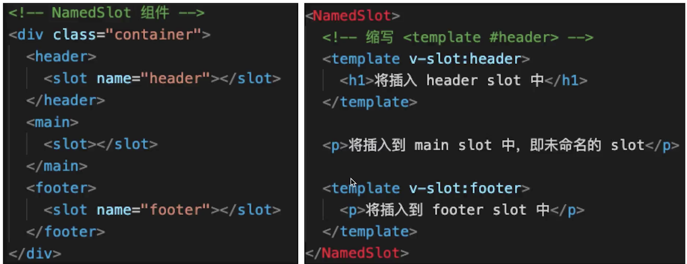

#

# 自定义 v-modal

[理解](https://blog.csdn.net/liu_jun_tao/article/details/90232658)

```vue
// 父组件
<p>{{name}}</p>
<CustomVModel v-model="name" />
// 子组件 CustomVModel
<template>
  <!-- 例如：vue 颜色选择 -->
  <input
    type="text"
    :value="text1"
    @input="$emit('change1', $event.target.value)"
  />
  <!--
    1. 上面的 input 使用了 :value 而不是 v-model
    2. 上面的 change1 和 model.event1 要对应起来
    3. text1 属性对应起来
  -->
</template>
<script>
export default {
  model: {
    prop: 'text1', // 对应 props text1
    event: 'change1',
  },
  props: {
    text1: String,
    default() {
      return '';
    },
  },
};
</script>
```

# \$nextTick

组件更新之后如果获取最新 dom
修改数据的当下，视图不会⽴刻更新，⽽是等同⼀事件循环中的所有数据变化完成之后，再统⼀进⾏视
图更新

和渲染⽆关的数据，不要放在 data 上
data 也不要嵌套过多层

1. vue 是异步渲染
2. data 改变之后，dom 不会立刻渲染
3. \$nextTick 会在 dom 渲染之后触发，以获取最新的 dom 节点

```
  methods: {
    addItem() {
        this.list.push(`${Date.now()}`)
        this.list.push(`${Date.now()}`)
        this.list.push(`${Date.now()}`)

        // 1. 异步渲染，$nextTick 待 DOM 渲染完再回调
        // 3. 页面渲染时会将 data 的修改做整合，多次 data 修改只会渲染一次
        this.$nextTick(() => {
          // 获取 DOM 元素
          const ulElem = this.$refs.ul1
          // eslint-disable-next-line
          console.log( ulElem.childNodes.length )
        })
    }
  }f
```

# slot

1. 基本使用

```
<SlotDemo :url="website.url">
  {{website.title}}
</SlotDemo>

<template>    //SlotDemo
  <a :href="url">
    <slot>
      默认内容，即父组件没设置内容时，这里显示
    </slot>
  </a>
</template>

<script>
export default {
  props: ['url'],
  data() {
    return {};
  }
};
</script>
```

2. 作用域插槽
   我们子组件中有一个 data 我们怎么把这个数据扔出来 让父组件接收到

- 在子组件 slot 中定义一个动态属性 B，对应到我们的 data 上
- 在外面的组件中我们定义一个模板 template 中 v-slot name 随意取 A A.B 要对应起来

```
父组件调用子组件的时候 给子组件传递了一个插槽 必须是template开头和结尾的 同时这个插槽要声明 我要接受的数据要放在那里
这里我们都放在 slotProps 中 还要告诉子组件模板的信息
使用场景  就是 内部的结构不确定 需要外部传递进来 子组件可以向父组件传数据 这是个特点
<ScopedSlotDemo :url="website.url">
    <template v-slot="slotProps">
        {{slotProps.slotData.title}}
    </template>
</ScopedSlotDemo>

// ScopedSlotDemo
<template>
  <a :href="url">
    <slot :slotData="website">
      {{ website.subTitle }}
      <!-- 默认值显示 subTitle ，即父组件不传内容时 -->
    </slot>
  </a>
</template>
<script>
export default {
  props: ['url'],
  data() {
    return {
      website: {
        url: 'http://wangEditor.com/',
        title: 'wangEditor',
        subTitle: '轻量级富文本编辑器'
      }
    };
  }
};
</script>

// comp3
<div><slot :foo="foo"></slot></div>
// parent
<Comp3>
  <!-- 把v-slot的值指定为作用域上下文对象 -->
  <template v-slot:default="ctx"> 来自子组件数据：{{ ctx.foo }} </template>
</Comp3>
```

3. 具名插槽
   具名插槽是可以有多个的 也可以有默认值的
   
   ```
   // comp2
   <div><slot></slot> <slot name="content"></slot></div>
   // parent
   <Comp2>
    <!-- 默认插槽用default做参数 -->
    <template v-slot:default>具名插槽</template>
    <!-- 具名插槽用插槽名做参数 -->
    <template v-slot:content>内容...</template>
   </Comp2>
   ```

# 动态 异步组件

:is = 'component name'
需要根据数据，动态渲染场景即组件类型不确定

```
// 异步组件
<component :is="NextTickName"/>
data =>  NextTickName: "NextTick",  这个NextTick和我们的组件名对应起来

const newData = {
  1: { type: 'text' },
  2: { type: 'images' },
  3: { type: 'video' }
};
<div v-for="(val,key) in newData" :key="key"><component :is={val.type}/></div>
```

to -B 一般会有比较大的组件 比如编辑器 富文本 这些在开发同步打包进来 体积会很大 最好异步加载

1. import 函数
2. 按需加载大的组件

```
<!-- 异步组件 -->
<FormDemo v-if="showFormDemo"/>
<button @click="showFormDemo = true">show form demo</button>
// 点击的时候我们引入这个组件
components: {
  FormDemo: () => import('FormDemo'),
},
```

# keep-alive

1. 频繁切换 不需要重新渲染
2. 缓存组件

```
  <keep-alive>
    <!-- tab 切换 -->
    <KeepAliveStageA v-if="state === 'A'" />
    <!-- v-show -->
    <KeepAliveStageB v-if="state === 'B'" />
    <KeepAliveStageC v-if="state === 'C'" />
  </keep-alive>
```

# mixin

1. 多个组件有相同逻辑，抽离出来
2. mixin 并不是完美的解决方案，有一些问题

- 变量来源不明确，不利于阅读
- 混入的变量有可能 命名冲突
- 一个组件引多个 mixin 的关系 mixin 可能会组件出现多对多的关系，复杂度较高

3. Vue 3 提出的 Composition API 解决这些问题

```
export default {
  data() {
    return {
      city: '北京'
    };
  },
  methods: {
    showName() {
      // eslint-disable-next-line
      console.log(this.name);
    }
  },
  mounted() {
    // eslint-disable-next-line
    console.log('mixin mounted', this.name);
  }
};

<template>
  <div>
    <p>{{ name }} {{ major }} {{ city }}</p>
    <button @click="showName">显示姓名</button>
  </div>
</template>

<script>
import myMixin from './mixin';

export default {
  mixins: [myMixin], // 可以添加多个，会自动合并起来
  data() {
    return {
      name: '双越',
      major: 'web 前端'
    };
  },
  methods: {},
  mounted() {
    // eslint-disable-next-line
    console.log('component mounted', this.name);
  }
};
</script>

```

# vuex 使用

关注 state 数据结构的设计

1. state
2. getters
3. action
4. mutation

store 是包含 state action mutations 概念的容器

用于 vue 的组件的方式
dispatch commit mapState mapGetters mapActions mapMutations

这样我们的 singer 就有值了 实现了读一个 mutations 的一个提交 相当于往 state 里面鞋了一些东西
思考？ 一般我们用传参的方式 去接受新的数据 这个地方我们用 vuex 以一种可预测的方式发生变化 集中式管理组件的所有状态

1. 设计思想
   首先 我们点击进入详情页 我们可能要把 id 图片的一些信息全部传递过去 可以使用传参的方式 也可以是用 vuex
   vuex 设计思想
   所有组件的状态和数据放到同一个内存空间去管理，我们称之为 state(状态 数据) states 上面的数据可以方便的映射到我们的组件上
   来渲染组件 当组件的一些数据发生变化 可以 dispatch 一个 action(动作，复杂业务的组合) action 可以进行一些异步操作 之后 commit 一个 mutations 这里也可
   直接 commit 一个 mutations(更改状态的函数) 他是唯一一个可以修改 state 的途径 其他任何方式去修改这个 state 都是非法的
   因为这个 state 是响应式的 所以 当这个 state 发生改变的时候 我们的组组件视图也发生了改变
   设计目的
   让 state 状态的修改可以预测 修改后呢 又可以反应到我们的组件上 实现了一个闭环
   平常
   修改组件的数据 数据的变化会直接映射到 dom 上 但 vuex 里我们是不能直接修改这个数据的 必须通过 dispatch--action commit->mutations 来修改数据 确实会让我们的修改路径变长
   我们为什么不直接修改组件的数据 而是采用这么长的步骤呢

2. 使用场景

   1.多个组件的状态数据共享 如果应用比较复杂，有些数据是共享的 这些组件如果是一些兄弟组件 或者 关联度很低的组件 这个时候我们共享数据就会比较困难 eventbus 都是很费劲的 2.路由间的复杂数据传递 我们遇到一些路由跳转场景 到传递的参数很复杂的时候 用 vuex 会是一个很好的方案 简单的数据不需要 vuex

   2.歌手详情数据处理和 Song 类的封装
   参数特别多的时候我们可以传递一个对象 对歌曲数据的抽象 歌单详情页 排行榜详情页

   3.https://segmentfault.com/a/1190000009173072 解构数组对象

# vue-router

1. 路由模式 hash h5 history http://abc.com/#/user/10 http://abc.com/user/10
2. 路由配置 动态路由 懒加载 动态路劲参数，已冒号开头 /user/:id 懒加载 我们 import 一个组件 异步加载组件

```
// 全局路由守卫
router.beforeEach((to, from, next) => {
  // 要访问/about且未登录需要去登录
  if (to.meta.auth && !window.isLogin) {
    // next('/login')
    if (window.confirm("请登录")) {
      window.isLogin = true;
      next();   // 登录成功，继续

    } else {
      next('/');// 放弃登录，回首页
    }
  } else {
    next(); // 不需登录，继续
  }
});
// 路由独享守卫
  beforeEnter(to, from, next) {
    // 路由内部知道自己需要认证
    if (!window.isLogin) {
        // ...
    } else {
        next();
    }
},
// 动态路由
// 异步获取路由
api.getRoutes().then((routes) => {
  const routeConfig = routes.map((route) => mapComponent(route));
  router.addRoutes(routeConfig);
});
// 映射关系
const compMap = { Home: () => import('./view/Home.vue') };
// 递归替换
function mapComponent(route) {
  route.component = compMap[route.component];
  if (route.children) {
    route.children = route.children.map((child) => mapComponent(child));
  }
  return route;
}

```

# 动画原理

1. 使用 animate 提供的是 @keyframes css3 这样的动画 基本没区别
   fade-enter-active fade-leave-active 显示 隐藏 的过程中一直分别生效
   同时使用过渡和动画

```
    .fade-enter,
    .fade-leave-to {
      opacity: 0;
    }
    .fade-enter-active,
    .fade-leave-active {
      transition: opacity 3s;
    }

    <transition
    name="fade"
    :duration="{enter:5000,leave:10000}"
    appear
    enter-active-class="animated swig fade-enter-active"
    leave-active-class="animated snake fade-leave-active"
    appear-active-class="animated swing"
  >
  </transition>
```

2. 列表过度
   transition-group 相当于在每一个循环出来的 list 加了一个 transition
3. 动画封装

   ```
    Vue.component('fade', {
    props: ['show'],
    template: `
    <transition >
      <slot v-if='show'></slot>
      </transition>
    `,
   });
   ```

# Object.freeze()

被冻结对象自身的所有属性都不可能以任何方式被修改
冻结数据 取消 setters

```
const obj = {
  prop: 42
};

Object.freeze(obj);

obj.prop = 33;
// Throws an error in strict mode

console.log(obj.prop);
// expected output: 42

```
