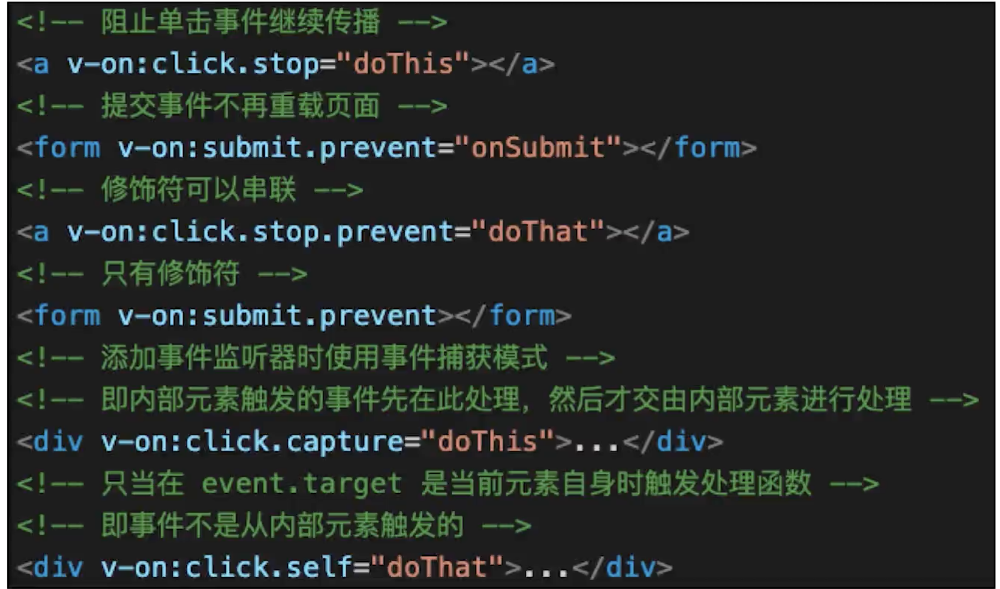
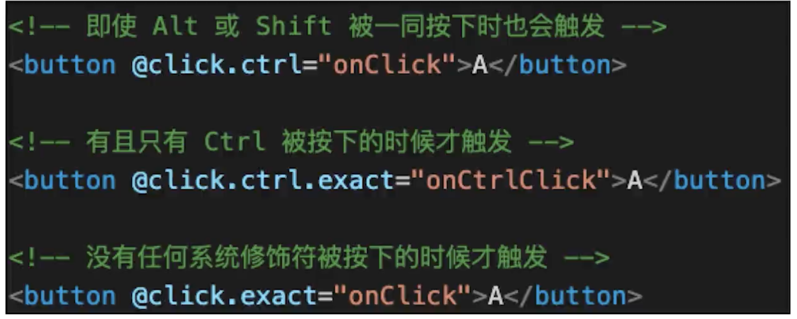
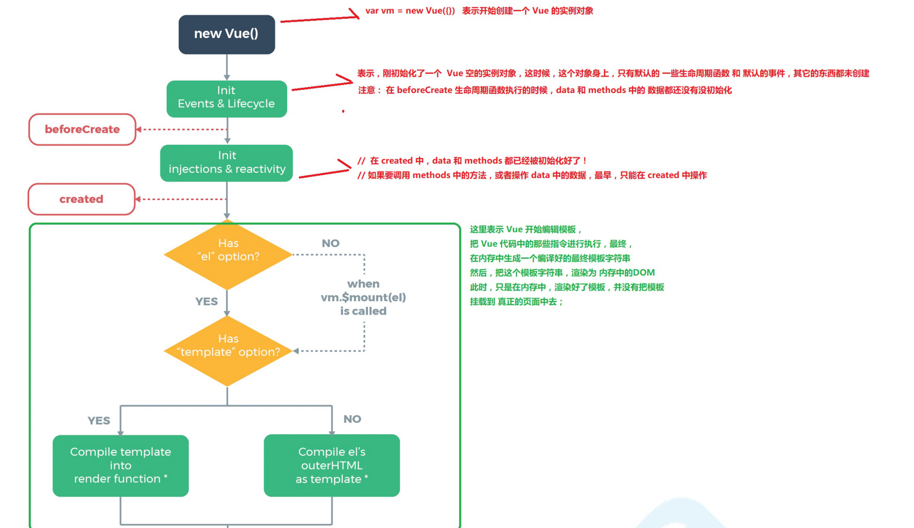
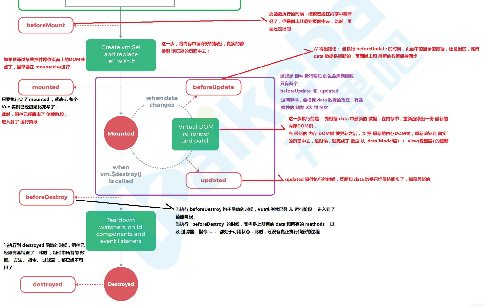
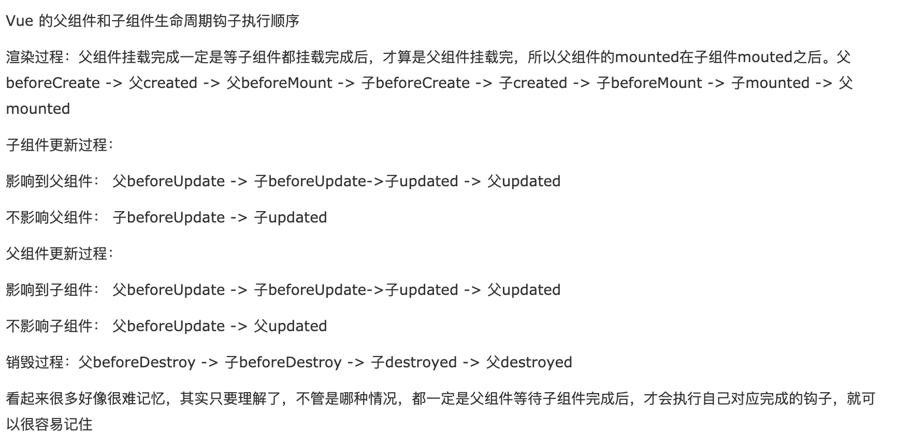

# 模板(指令、差值)

    MVVM(vue就是一个vm层) vue会监听到你data变了 会改变视图层 vue也能监听到视图层有一些事件触发 帮助你
    通过vm这一层 的一些逻辑代码  通过这些代码有改变了 M层的数据 当数据发生变化的时候，数据的变化又映射到了视图层
    一个vue项目是由很多个小组件组成的 一个组件(vue底层也会编译成一个实例)就是一个vue实例 也可理解成 一个vue项目是由
    很多vue的实例拼装成的

1. 差值(花括号)、表达式(v-text="")
2. 指令、动态属性

```js
  <p :class="{ black: isBlack, yellow: isYellow }">使用 class</p>
  <p :class="[black, yellow]">使用 class （数组）</p>
  <p :style="styleData">使用 style</p>
  <p :style="[styleData,{fontSize:'20px'}]">使用 style</p> 也可以用数组

  isBlack: true,
  isYellow: true,

  black: 'black',
  yellow: 'yellow',

  styleData: {
      fontSize: '40px', // 转换为驼峰式
      color: 'red',
      backgroundColor: '#ccc' // 转换为驼峰式
  }

  <p>文本插值 {{message}}</p>
  <p>JS 表达式 {{ flag ? 'yes' : 'no' }} （只能是表达式，不能是 js 语句）</p>

  <p :id="dynamicId">动态属性 id</p>

  <hr/>
  <p v-html="rawHtml">
      <span>有 xss 风险</span>
      <span>【注意】使用 v-html 之后，将会覆盖子元素</span>
  </p>
```

3. v-html 会有 xss 风险 会覆盖子组件

# computed 和 watch
1. 当我们要进⾏数值计算,⽽且依赖于其他数据，那么把这个数据设计为computed 
2. 如果你需要在某个数据变化时做⼀些事情，使⽤watch来观察这个数据变化

## computed

- computed 是计算属性,也就是计算值,它更多⽤于计算值的场景
- computed 具有缓存性,computed 的值在 getter 执⾏后是会缓存的，只有在它依赖的属性值改变之后，下⼀次获取 computed 的值时才会重新调⽤对应的 getter 来计算
- computed 适⽤于计算⽐较消耗性能的计算场景

1. computed 有缓存，data 不变则不会重新计算 我们的表达式先会去 data 找 到不到会去 computed 中找
   getter setter 属性都有一个 get 和一个 set 方法，当数据变化时，调用 set 方法。
   location

```js
<p>double1 {{double1}}</p>
<input v-model="double2"/>
  computed: {
      double1() {
          return this.num * 2
      },
      double2: {
          get() {
              return this.num * 2
          },
          set(val) {
              this.num = val/2
          }
      }
  }
  vm.num = 3 // 会触发改变
```
## watch
* 更多的是「观察」的作⽤,类似于某些数据的监听回调,⽤于观察 props $emit 或者本组件的值,当数据变化时来执⾏回调进⾏后续操作 
* ⽆缓存性，⻚⾯重新渲染时值不变化也会执⾏
1. watch 如何深度监听(默认是浅层监听)
2. watch 监听引用类型，拿不到 oldVal
3. 不支持缓存，数据变，直接会触发相应的操作，watch 支持异步,当一个属性发生变化时，需要执行对应的操作；一对多；
   监听数据必须是 data 中声明过或者父组件传递过来的 props 中的数据，当数据变化时，触发其他操作，函数有两个参数
   - immediate：组件加载立即触发回调函数执行，
   - deep: 深度监听，为了发现对象内部值的变化，复杂类型的数据时使用，例如数组中的对象内容的改变，注意监听数组的变动不需要这么做。注意：deep 无法监听到数组的变动和对象的新增，参考 vue 数组变异,只有以响应式的方式触发才会被监听到。

```js
  watch: {
      name(oldVal, val) {
          // 值类型，可正常拿到 oldVal 和 val
          console.log('watch name', oldVal, val)
      },
      info: {
          handler(oldVal, val) {
              // 引用类型，拿不到 oldVal 。因为指针相同，此时已经指向了新的 val
              console.log('watch info', oldVal, val)
          },
          deep: true // 深度监听
      }
  }
```

# 内存空间理解

- 内存空间: 我们将 js 的内存分为栈内存和堆内存；

  - 基本类型存放于栈内存中，包括变量以及变量的值
  - 引用类型是大小不固定的数据，但是他们的地址大小是固定的，所以把地址存在栈中而值存在堆中

- 对值的操作
  基本类型值：按值访问，操作的是他们实际保存的值

引用类型值：按引用访问，当查询时，我们需要先从栈中读取内存地址，然后再找到保存在堆内存中的值。对于引用类型的值，我们可以为其添加属性和方法，也可以改变和删除其属性的方法。

- 变量的复制

  基本类型变量的复制：从一个变量向另一个复制时，会在栈中创建一个新值，然后把值复制到为新变量分配的位置上。

- 引用类型变量的复制

  复制的是存储在栈中的指针，将指针复制到栈中为新变量分配的空间中，而这个指针副本和原指针指向存储在堆中的同一个对象，复制操作结束后，两个变量实际上将引用同一个对象，因此改变其中一个，将影响另一个

# 条件判断 渲染

- 如果切换的很频繁我们可以用 v-show
- 或者一次性显示隐藏使用 v-if 都要删除 dom 从页面上
  区别 v-show 我们通过 css 来控制，v-if 我们是通过 vue 本身的机制去判断组件是不是动态的去显示或者销毁

```js
  <p v-if="type === 'a'">A</p>
  <p v-else-if="type === 'b'">B</p>
  <p v-else>other</p>

  <p v-show="type === 'a'">A by v-show</p>
  <p v-show="type === 'b'">B by v-show</p>
```

# 循环列表

如何遍历对象？ v-for 也可以使用了
key 的重要性 -> key 不能乱写 如 random 或者 index 为什么要用 key 呢
[key 的重要性](https://github.com/Advanced-Frontend/Daily-Interview-Question/issues/1)

1. 更准确
   因为带 key 就不是就地复用了，在 sameNode 函数 a.key === b.key 对比中可以避免就地复用的情况。所以会更加准确。
   key 是给每一个 vnode 的唯一 id,可以依靠 key,更准确, 更快的拿到 oldVnode 中对应的 vnode 节点。
2. 更快
   利用 key 的唯一性生成 map 对象来获取对应节点，比遍历方式更快。(这个观点，就是我最初的那个观点。从这个角度看，map 会比遍历更快。)
   注意：v-for、v-if 是不能一起使用的 v-for 的运算优先级高于 v-if

```js
<p>遍历数组</p>
<ul>
    <li v-for="(item, index) in listArr" :key="item.id">
        {{index}} - {{item.id}} - {{item.title}}
    </li>
</ul>
Vue.set(vm.listArr,1,5)
vm.$set(vm.listArr,1,5)

<p>遍历对象</p>
<ul >
    <li v-for="(val, key, index) in listObj" :key="key">
        {{index}} - {{key}} -  {{val.title}}
    </li>
</ul>
除了改变对象的引用之外 也可以使用Vue.set,是全局的方法也是实例的方法
vm.listObj = 新对象会改变数据 当然我们也可使用Vue.set
全局方法 -- Vue.set(vm.listObj,'address','beijing')
实例方法 -- vm.$set(vm.listObj,'address','beijing')
```

# 事件 event

```js
 {{num}}
 <div @click="increment2(2,$event)">+2</div>
  methods: {
      increment1(event) {
          console.log('event', event, event.__proto__.constructor) // 是原生的 event 对象
          console.log(event.target)
          console.log(event.currentTarget) // 注意，事件是被注册到当前元素的，和 React 不一样
          this.num++
          // 1. event 是原生的
          // 2. 事件被挂载到当前元素
          // 和 DOM 事件一样
      },
      increment2(val, event) {
          console.log(event.target)
          this.num = this.num + val
      },
      loadHandler() {
          // do some thing
      }
  },
  mounted() {
      window.addEventListener('load', this.loadHandler)
  },
  beforeDestroy() {
      //【注意】用 vue 绑定的事件，组建销毁时会自动被解绑
      // 自己绑定的事件，需要自己销毁！！！
      window.removeEventListener('load', this.loadHandler)
  }
```




# 表单

```js
  <p>输入框: {{name}}</p>
    <input type="text" v-model.trim="name"/>
    <input type="text" v-model.lazy="name"/>
    <input type="text" v-model.number="age"/>

    <p>多行文本: {{desc}}</p>
    <textarea v-model="desc"></textarea>
    <!-- 注意，<textarea>{{desc}}</textarea> 是不允许的！！！ -->

    <p>复选框 {{checked}}</p>
    <input type="checkbox" v-model="checked"/>

    <p>多个复选框 {{checkedNames}}</p>
    <input type="checkbox" id="jack" value="Jack" v-model="checkedNames">
    <label for="jack">Jack</label>
    <input type="checkbox" id="john" value="John" v-model="checkedNames">
    <label for="john">John</label>
    <input type="checkbox" id="mike" value="Mike" v-model="checkedNames">
    <label for="mike">Mike</label>

    <p>单选 {{gender}}</p>
    <input type="radio" id="male" value="male" v-model="gender"/>
    <label for="male">男</label>
    <input type="radio" id="female" value="female" v-model="gender"/>
    <label for="female">女</label>

    <p>下拉列表选择 {{selected}}</p>
    <select v-model="selected">
        <option disabled value="">请选择</option>
        <option>A</option>
        <option>B</option>
        <option>C</option>
    </select>

    <p>下拉列表选择（多选） {{selectedList}}</p>
    <select v-model="selectedList" multiple>
        <option disabled value="">请选择</option>
        <option>A</option>
        <option>B</option>
        <option>C</option>
    </select>
```

# 组件通信

组件使用中的细节点？

- table 中 is 的使用解决 h5 标签上的一些小 bug 我们的 row 组件 比如在我们的 ul 下面直接写 row table 下的 tbody 中直接写 row 会有问题 为了兼容性
- 在根下面我们的 data 可以直接定义成一个对象，但是在我们的子组件中必须是一个函数 想想我们平时使用的组件
- ref 使用 <div ref='hello'> 这样我们拿到的是一个 dom this.\$refs.hello <item ref='hello'> 这样我们拿到的是一个组件的引用
- 单向数据流(隐式规定) 子组件不能去修改父组件传递过来的数据 比如传递过来的是个引用类型 你改变了其中的数据 而这些数据其他的子组件可能也再用 这样不仅影响了本身的组件 还影响了其他的组件 一定要修改的话，就 copy 一个副本出来， 设置默认值将 props 赋值过去

- 组件参数校验 和 非 props 特性
  type: String require: true default:'123' 也可以做复杂的校验 validator:function(val){return val.length>5}
  非 props 特性 子组件并没有声明我子组件要接受的内容 1.没法用 2. 会显示在 dom 的属性之中
- 给组件绑定原生事件
  一般情况是我们子组件 emit 自定义事件 我们的父组件监听这个事件 不想用两层传递 使用 click.native
- 非父子组件传值(Bus/总线/发布订阅模式)

* 兄弟组件：通过共同祖辈组件 通过共同的祖辈组件搭桥，$parent或$root。

```js
// brother1 this.$parent.$on('foo', handle)
// brother2 this.$parent.$emit('foo')
```

- 祖先和后代之间 provide/inject：能够实现祖先给后代传值

```js
// ancestor provide() { return {foo: 'foo'} }
// descendant inject: ['foo']

dispatch：后代给祖先传值
// 定义一个dispatch方法，指定要派发事件名称和数据
function dispatch(eventName, data) {
  let parent = this.$parent;
  // 只要还存在父元素就继续往上查找
  while (parent) {
    // 父元素用$emit触发
    parent.$emit(eventName, data);
    // 递归查找父元素
    parent = parent.$parent;
  }
}
// 使用，HelloWorld.vue
<h1 @click="dispatch('hello', 'hello,world')">{{ msg }}</h1>
// App.vue
his.$on('hello', this.sayHello)
```

- 借助官方的 vuex
- 发布订阅模式，在 vue 中称为总线机制 事件总线：创建一个 Bus 类负责事件派发、监听和回调管理

```js
  // Bus：事件派发、监听和回调管理
class Bus {
  constructor() {
    // eventName1:[fn1,fn2],
    // eventName2:[fn3,fn4],
    this.callbacks = {};
  }
  $on(name, fn) {
    this.callbacks[name] = this.callbacks[name] || [];
    this.callbacks[name].push(fn);
  }
  $emit(name, args) {
    if (this.callbacks[name]) {
      this.callbacks[name].forEach((cb) => cb(args));
    }
  }
}
  // main.js
  Vue.prototype.$bus = new Bus();
  // child1 this.$bus.$on('foo', handle)
  // child2 this.$bus.\$emit('foo')
  实际上 vue 已经帮我们做好了这些事情
```

```js
Vue.prototype.bus = new Vue();
Vue.component('child', {
  data: function () {
    return {
      selfContent: this.content,
    };
  },
  props: {
    content: String,
  },
  template: '<div @click="handle">{{selfContent}}</div>',
  methods: {
    handle() {
      this.bus.$emit('change', this.selfContent);
    },
  },
  mounted() {
    var _this = this;
    this.bus.$on('change', function (msg) {
      _this.selfContent = msg;
    });
  },
});
var vm = new Vue({
  el: '#app',
});
```

1. props 和\$emit 父到子 传递一个数据 子到父 触发一个事件把参数带过去 让父组件处理一些事情
2. 组件间通信 自定义事件
3. 组件生命周期 vuex

# 如何进行自定义事件进行 vue 组件通信 兄弟

```js
index.vue
<template>
    <div>
        <Input @add="addHandler"/>
        <List :list="list" @delete="deleteHandler"/>
    </div>
</template>

<script>
import Input from './Input'
import List from './List'

export default {
    components: {
        Input,
        List
    },
    data() {
        return {
            list: [
                {
                    id: 'id-1',
                    title: '标题1'
                },
                {
                    id: 'id-2',
                    title: '标题2'
                }
            ]
        }
    },
    methods: {
        addHandler(title) {
            this.list.push({
                id: `id-${Date.now()}`,
                title
            })
        },
        deleteHandler(id) {
            this.list = this.list.filter(item => item.id !== id)
        }
    },
    created() {

        console.log('index created')
    },
    mounted() {

        console.log('index mounted')
    },
    beforeUpdate() {

        console.log('index before update')
    },
    updated() {

        console.log('index updated')
    },
}
</script>
list.vue
<template>
    <div>
        <ul>
            <li v-for="item in list" :key="item.id">
                {{item.title}}

                <button @click="deleteItem(item.id)">删除</button>
            </li>
        </ul>
    </div>
</template>
<script>
import event from './event'
export default {
    // props: ['list']
    props: {
        // prop 类型和默认值
        list: {
            type: Array,
            default() {
                return []
            }
        }
    },
    data() {
        return {
        }
    },
    methods: {
        deleteItem(id) {
            this.$emit('delete', id)
        },
        addTitleHandler(title) {
            console.log('on add title', title)
        }
    },
    created() {
        console.log('list created')
    },
    mounted() {
        console.log('list mounted')
        // 绑定自定义事件
        event.$on('onAddTitle', this.addTitleHandler)
    },
    beforeUpdate() {
        console.log('list before update')
    },
    updated() {
        console.log('list updated')
    },
    beforeDestroy() {
        // 及时销毁，否则可能造成内存泄露 解绑自定义事件
        event.$off('onAddTitle', this.addTitleHandler)
    }
}
</script>
// input.vue
<template>
    <div>
        <input type="text" v-model="title"/>
        <button @click="addTitle">add</button>
    </div>
</template>

<script>
import event from './event'
我们input的点击的时候触发这个 addTitle 调用我们的自定义事件 我们兄弟组件中 绑定的自定义事件就会触发 打印输出
我们的event是什么呢 import Vue from 'vue' export default new Vue()
vue实例已经帮我们实现了这个 本身具有这个自定义事件的能力  $on $emit 不要再自己去引入event bus  或者自己写一个自定义事件
绑定自定义事件的时候 我们用了一个函数 而不是箭头函数 为了方便解绑
比如说我我们在  beforeDestroy 会做哪些事情 比如说解绑自定义事件  event.$off
export default {
    data() {
        return {
            title: ''
        }
    },
    methods: {
        addTitle() {
            // 调用父组件的事件   注意这个地方的调用 一个this 一个event
            this.$emit('add', this.title)
            // 调用自定义事件
            event.$emit('onAddTitle', this.title)
            this.title = ''
        }
    }
}
</script>
```

# 生命周期

理解 ？生命周期函数就是 vue 实例在某一个时间点会自动执行的函数。也就是从开始创建、初始化数据、编译模版、挂载 Dom -> 渲染、更新 -> 渲染、卸载 等⼀系列过程，我们称这是 Vue 的⽣命周期。

[生命周期](https://cn.vuejs.org/v2/guide/instance.html#%E7%94%9F%E5%91%BD%E5%91%A8%E6%9C%9F%E5%9B%BE%E7%A4%BA)



1. 挂载阶段
   beforeCreate -> created -> beforeMount -> mount
   新建 vue 实例,new Vue - > 初始化生命周期 & 事件 -> 初始化注入校验 ->是否指定模板选项 ->是的话我们将模板编译到 render 函数中,否的话 将 el 外的 html 作为模板编译,创建 vm.\$el 并用其替换 el mount 挂载完毕了

   - 最基础的事件初始化完成后会自动执行 beforeCreate
   - 接着处理一些外部的注入包括双向绑定的一些内容 这部分结束后初始化就基本完成了 接着自动执行 created
   - 是否有 el 选项 有无 template 没有的话会将 el 对应的 html 类似于 div#app 那个整体当成我们的模板进行渲染
   - 有了模板和数据 即将挂载的一瞬间之前的这个时间点 自动执行 beforeMount 此时页面还没渲染
   - 当 beforeMount 执行完成之后生成的最终实例的那个 dom 元素被挂载到我们的页面之上 hello 被显示在页面上之后 自动执行 mounted
   - 当数据发生改变 还未渲染之前 自动调用 beforeUpdate 重新渲染之后 update 自动执行
   - 当 vm.\$destroy 被调用的时候 在组件即将被销毁的时候 会自动调用 beforeDestroy 完全销毁后 destroyed 会执行

   生命周期注意点

   - mount 和 created 有什么区别  
     created 呢是我们把 vue 的一个实例初始化了，他只是存在于 js 内存模型中的一个变量而已，并没有开始渲染
     mount 这个使我们真正在网页上绘制完成了,可以惊醒 ajax 绑定事件 dom 操作。

2. 更新阶段
   beforeUpdate update
3. 销毁阶段

   - beforeDestroy
   - 解除绑定呀
   - 销毁子组件以及事件监听器

   destroyed
   理解我们前面的 list input index 组件
   index created -> list created -> list mounted -> index mount

   1. js 模型的创建顺序从父组件到子组件
   2. 创建 vue 实例是从外向内的
   3. 但是 渲染是由内向外的，因为只有把子组件渲染完，才能渲染父组件

   我们点击添加,触发了父组件的方法 修改了其 data 执行 before updated 开始更新 更新谁呢 子组件 list 开始更新 只有 list 更新完了之后 才算是更新完了 index updated

   
