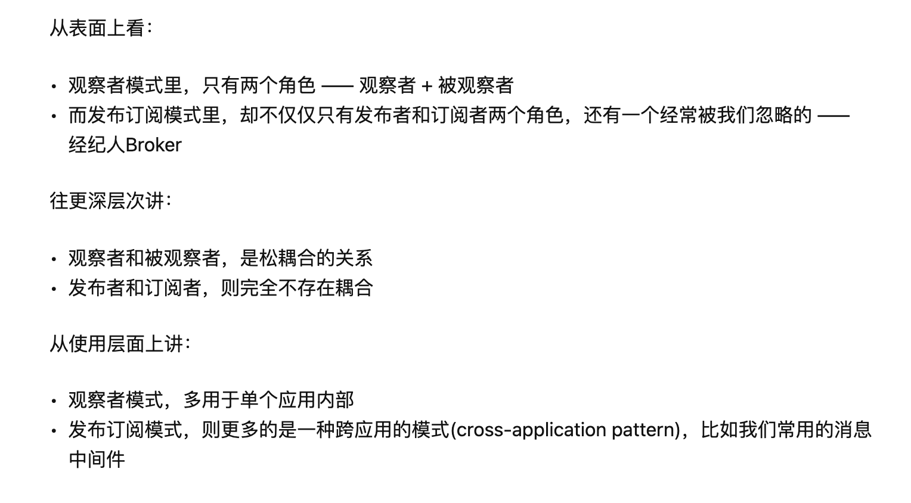

#

[参考前端面试](https://blog.csdn.net/weixin_44157964/article/details/107945951)
[面试题答案](https://juejin.cn/post/6844904147045580813)

## 为何在 v-for 中使用 key

- 必须用 key，且不能是 random 和 index
- diff 算法中通过 tag 和 key 来进行判断，是否是 sameNode
- 减少渲染次数，提升渲染性能

## 描述 Vue 组件生命周期(父子组件)

- 单组件生命周期
- 父子组件生命周期关系

## Vue 组件如何通信、组件间传值方式以及之间的区别

- 父子组件 props,this.$emit
- 自定义事件 event.$on event.$off event.$emit
- vuex

## 描述组件渲染和更新的过程

## 双向数据绑定 v-model 的实现原理

- input 元素的 value = this.name
- 绑定 input 事件 this.name = $event.target.value
- data 更新触发 re-render

## 对 mvvm 的理解

## computed 有何特点

- 缓存，data 不变不会重新计算
- 提高性能

## 为何组件 data 必须是一个函数

export default 看上去是一个对象，实质上我们的.vue 文件是一个 class，在每个地方使用这个组件的时候，
是对这个组件进行实例化，实例化的时候执行这个 data，如果 data 不是函数，每个组件的实例都一样了，就共享了

这是由于 JavaScript 的特性导致的，在 component 中，data 必须是以函数的形式存在，不可以是对象。
在组件中的 data 写出一个函数，数据以函数返回值的形式定义，这样每次复用组件的时候，都会返回一份新的 data，相当于每个组件实例都有自己私有的数据空间，他们只需要负责维护各自的数据，不会造成混乱。而单纯写成对象形式的话，就是所有的组件实例共用一个 data，这样改一个全都改了。

## ajax 请求应该放在哪个生命周期

- mount 里面，因为 js 是单线程的，ajax 异步获取数据，放在 mounted 之前没有用，只会让逻辑更加混乱

## 如何将组件所有的 props 传递给子组件

-$props,<User v-bind="$props"/>

## 多个组件有相同的逻辑，如何抽离

## keep-alive

- 缓存组件，不需要重复渲染的时候，如多个静态 tab 页面的切换

react 版 -> https://github.com/StructureBuilder/react-keep-alive

## 何时使用异步加载

- 加载大组件，编辑器，图表，路由异步加载

## 何时使用 beforeDestory

- 解绑自定义事件 event.$off
- 清楚定时器
- 解绑自定义的 dom 事件，如 window scroll 事件等

## 作用域插槽

## vuex 中 action 和 mutation 有什么区别

- action 中处理异步，mutation 不可以
- mutation 做原子操作
- action 可以整个多个 mutation

## 如何配置 vue-route 异步加载

## vue 为什么需要虚拟 dom

1. 用 js 对象来描述真实 dom，是对真实 dom 的抽象，由于直接操作 dom 性能低，但是 js 层的操作效率高，
   可以将 dom 操作转化为对象操作，最终通过 diff 算法比对差异进行 dom 更新(主要减少了对真实 dom 的操作)。
   虚拟 dom 不依赖真实平台环境从而可以实现跨平台
2. 补充 - 虚拟对象的实现就是普通对象包含 tag、data、children 等属性对真实节点的描述.本质上就是在 js
   和真实 dom 之间的一个缓存

## 监听 data 变化的核心 api

### 对响应式数据的理解

- 响应式数据 - 数据变化，让视图更新
- 数据和对象类型当值变化时，如何劫持到，对象内部通过 defineReactive,使用 Object.defineProperty
  将属性进行劫持(只会劫持已经存在的属性)，数组则是通过重写数组方法来实现。

补充回答：内部收集依赖是怎样做到的？每个属性都有自己的 dep 属性，存放他依赖的 watcher，当属性变化后会通知自己对应的 watcher 去更新，(其实每个对象类型本身也拥有一个 dep)

引出优化相关的内容

- 对象层级过深，就会性能差
- 不需要响应数据的内容不要放到 data 中
- object.freeze()可以冻结数据，冻结后的数据是不能用 Object.defineProperty 来定义的

### vue 如何检测数组变化

- 数组考虑性能原因，没有用 defineProperty 对数组每一项进行拦截，而是选择重写数组(push,shift,pop,splice,unshift,sort,reverse)等方法进行重写 - 这些方法才能改变数组原来的值
- 补充- 在 vue 中修改数组的索引和长度是无法监控到的，需要通过以上 7 种变异方法修改数组才会触发数组对应的
  watcher 进行更新。数组中如果是对象数据类型，也会进行递归劫持
- 问题？那要是想更改数组索引，更新数据怎么办？通过 Vue.$set 进行处理 => 核心内部使用的是 splice 方法

```js
// mock
    <script>
      // 1. 将数据定义成响应式
      // 2. 需要对属性增加dep，来收集他对应哪些watcher，数据改变去更新
      let state = { count: 1 };
      let active;
      function defineReactive(obj) {
        for (let key in obj) {
          let value = obj[key];
          let dep = [];
          Object.defineProperty(obj, key, {
            get() {
              if (active) {
                dep.push(active);
              }
              return value;
            },
            set(newValue) {
              value = newValue;
              dep.forEach((watcher) => watcher());
            },
          });
        }
      }
      defineReactive(state);
      const watcher = (fn) => {
        active = fn;
        fn();
        // 后续不再watcher中取值，不做依赖收集
        active = null;
      };

      watcher(() => {
        app.innerHTML = state.count;
      });
      watcher(() => {
        conso
```

## vue 中模板编译原理

1. 将 template 转换成 ast 语法树 - parseHTML (内部采用正则匹配，匹配标签，匹配属性，把当前的 html 结构转换成 ast 语法树)
2. 对静态语法做静态标记 - makeUP
3. 重新生成代码 - 模板引擎实现原理，with+new Function

## 生命周期钩子是如何实现的

1. Vue 中的生命周期就是回调函数而已，当创建组件实例的过程中会调用对应的钩子方法
2. 补充 - 内部主要是使用 callHook 方法来调用对应的方法。核心就是一个 发布订阅 模式，将钩子订阅好(内部采用数组的方式进行存储)，在对应的阶段进行发布

思考？我们 new Vue 的时候会传入很多，比如 beforeCreate 方法

## Vue.mixin 的使用场景和原理

- 作用就是抽离公共的业务逻辑，原理类似 - 对象的继承，当组件初始化时会调用
- mergeOptions 方法进行合并，采用策略模式针对不同的属性进行合并。如何混入的数据和本身组件中的数据冲突，会采用就近原则，以组件的数据为准

- 缺陷

1. 命名冲突问题
2. 数据来源问题？比如在全局下定义了一个数据，在组件中直接使用了，到底用的是谁的，不清楚

## nextTick 在哪里使用？原理是什么

1. nextTick 中的回调是在下次 dom 更新循环结束之后执行额延迟回调。在修改数据之后，立即使用这个方法，
   获得最新的 dom。原理就是异步方法，你可以理解成他就是一个 promise，不兼容会采用一些其他方法

补充 - vue 多次更新数据，会进行批处理操作。内部调用的就是 nextTick 实现了延迟更新，用户自定义的
nextTick 中的回调会被延迟到更新完成后调用，从而可以获取更新后的 dom

2. 为什么说 DOM 更新是异步的
   https://yingchenit.github.io/vue/next-tick/#nexttick%E6%B5%81%E7%A8%8B%E6%A2%B3%E7%90%86

## 描述响应式原理

- 监听 data 变化
- 更新渲染过程

## vue 中的 diff 原理 - ABCD

- vue 中的 diff 算法是平级比较，不考虑跨级比较的情况。内部采用深度递归的方式+双指针的方式进行比较

1. 先比较是不是相同节点 - 开头相同比较，同 tag 同 key
2. 相同节点比较属性，并复用老节点
3. 比较儿子节点，考虑老节点和新节点儿子的情况
4. 优化比较：头头、尾尾(从后往前 DCBA)、头尾、尾头(老的尾和新的头比较，如果一样，移动)
5. 比对查找进行复用

```js
[A,B,C,D] -> [B,C,E,Q] 我们要复用B,C,怎么知道有没有复用呢？得知道key，有key就是复用
1. 先将来的做成映射表
[A,B,C,D] -> {A:0,B:1,C:2,D:3}
[B,C,E,Q] -> 可以用B,C去找，找到对应的key，那我们就复用。再去比较对应的儿子和属性
找不到，就创建，如果多了，就删除
```

## vue.$set 的实现

为什么 vue.$set 可以触发更新，我们给对象和数组本身都增加了 dep 属性

- 当给对象新增不存在的属性,调用 defineReactive 将属性定义成响应式
- 当修改数组索引时，我们调用数组本身的 splice 方法去更新数组,这个方法已经被我们改写了。
- 最后，手动调用 属性的.dep.notify() 通知视图更新。

```js
// Vue.set(target,'a','1')
// Vue.set([],0,100)
```

## diff 算法的事件复杂度

- o(n)
- 在 o(n^3)上面做了调整，同 tag，同 key，等
- patch、patchNode、addVnodes、removeVnodes

## vue 常见性能优化

- 合理使用 v-show,v-if
- 合理使用 computed
- v-for 时加 key，以及避免和 v-if 同时使用，因为 v-for 优先级更高，每次循环都要 v-if，是对性能的一种浪费
- 自定义事件，dom 事件即时销毁
- 合理使用异步组件，keep-alive
- data 层级不要太深
- webpack 层面优化
- 通用优化，图片懒加载
- ssr

## Vue 中的 key 到底有什么⽤？

- key 是为 Vue 中的 vnode 标记的唯⼀ id,通过这个 key,我们的 diff 操作可以更准确、更快速
- diff 算法的过程中,先会进⾏新旧节点的⾸尾交叉对⽐,当⽆法匹配的时候会⽤新节点的 key 与旧节点进⾏⽐对,然后超出差异.

diff 程可以概括为：oldCh 和 newCh 各有两个头尾的变量 StartIdx 和 EndIdx，它们的 2 个变量相互⽐较，⼀共有 4 种 ⽐较⽅式。如果 4 种⽐较都没匹配，如果设置了 key，就会⽤ key 进⾏⽐较，在⽐较的过程中，变量会往中间靠， ⼀旦 StartIdx>EndIdx 表明 oldCh 和 newCh ⾄少有⼀个已经遍历完了，就会结束⽐较,这四种⽐较⽅式就是⾸、尾、 旧尾新头、旧头新尾.


## vue react 怎么检测数据变化的

#### vue

vue.js 则是采用数据劫持结合发布者-订阅者模式的方式，通过 Object.defineProperty()来劫持各个属性的 setter，getter，在数据变动时发布消息给订阅者，触发相应的监听回调

#### react

react 状态变化只能通过 setState,调用 setState 就会更新状态重新渲染 dom

#### 请说下封装 vue 组件的过程？

首先建立组件的模板，先把架子搭起来，然后考虑好组件的样式和基本逻辑结构。
准备好组件的数据输入，即分析好逻辑，确定好 props 里面的数据、类型
准备好组件的数据输出，即根据组件逻辑，做好要暴露出来的方法
封装完毕后，直接调用即可。

#### koa-body 的原理

[参考](https://zhuanlan.zhihu.com/p/54972937)

#### 介绍 pm

PM2 是 node 进程管理工具，可以利用它来简化很多 node 应用管理的繁琐任务，如性能监控、自动重启、负载均衡等，而且使用非常简单。
[参考](https://www.jianshu.com/p/3de4e8f15621)

#### master 挂了的话 pm2 怎么处理?

- 使用 pm2 方便开启 node 集群模式 - 简单来说，就是复制一些可以共享 TCP 连接的工作线程。
- 集群模块会创建一个 master 主线程，然后复制任意多份程序并启动，这叫做工作线程。
- node 多线程支持 - (https://blog.csdn.net/flytam/article/details/86608646)

#### 移动端 1px 问题

[移动端 1px 问题](https://www.jianshu.com/p/3a262758abcf)

#### webpack-dev-server 运行原理

https://blog.csdn.net/LuckyWinty/article/details/109507412

#### 前端安全

[参考](https://www.jianshu.com/p/544bb4bccd82)

#### 如何深拷贝 this

[参考](https://www.wangt.cc/2021/03/js%E9%9D%A2%E8%AF%95%E9%A2%98/)

#### redux 主要解决了哪些问题？

[redux 主要解决了哪些问题？](https://zhuanlan.zhihu.com/p/57409008)

#### 观察者模式 vs 发布订阅模式

[观察者模式 vs 发布订阅模式](https://zhuanlan.zhihu.com/p/51357583)


#### http1.1 时如何复⽤ tcp 连接

HTTP/1.0 引入了 keep-alive 长连接，HTTP/1.0 中是默认关闭的，可以通过 Connection: keep-alive; 开启 ，HTTP/1.1 默认是开启的，无论加没加 Connection: keep-alive;
[http1.1 时如何复⽤ tcp 连接](https://jishuin.proginn.com/p/763bfbd5a2d7)

#### 介绍 css3 中 position:sticky

设置了 sticky 的元素，在屏幕范围（viewport）时该元素的位置并不受到定位影响（设置是 top、left 等属性无效），当该元素的位置将要移出偏移范围时，定位又会变成 fixed，根据设置的 left、top 等属性成固定位置的效果。

[sticky](https://www.cnblogs.com/s1nker/p/4835079.html)

#### 事件委托的原理以及优缺点

原理 : 利用事件冒泡的机制
优点

- 提高 Javascript 性能,减少内存消耗
- 动态添加 DOM 元素
  缺点
- 事件委托基于冒泡 , 对于不冒泡的事件不支持
- 层级过多,冒泡过程中,可能会被某层阻止掉
- 把所有事件都用代理就可能会出现事件误判,好比把不应该触发事件的 绑上了事件.

#### React 怎么做数据的检查和变化

[React 怎么做数据的检查和变化](https://github.com/zlx362211854/daily-study/issues/82)

#### import { Button } from 'antd'，打包的时候只打包 button， 分模块加载，是怎么做到的

```js
// 通过 babel-plugin-import 配置处理。
{
  "plugins": [
    ["import", {
      "libraryName": "antd",
      "libraryDirectory": "es",
      "style": "css"
    }]
  ]
}
```

#### 使⽤ import 时，webpack 对 node_modules ⾥的依赖会做什么

- 首先说 import，他只是一个引用,在你没有用到它得时候它不会执行。
- 需要执行的时候，再到模块里面取值，webpack 则是根据你的引入方式去判断模块的类型，然后进行相关的转译，import 引入，babel 会默认把 ES6 的模块转译为 ComminJS 规范，然后把 node_modules 里面的依赖打包成 IIFE（自执行函数(function(modules){})([])）,模块会传入到数组里面，函数经过运行之后最终将模块通过 module.exports 导出

#### cookie 是什么，有什么作用？

- cookie 是以小的文本文件形式（即纯文本），完全存在于客户端；
- cookie 保存了登录的凭证，有了它，只需要在下次请求时带着 cookie 发送，就不必再重新输入用户名、密码等重新登录了
- 是设计用来在服务端和客户端进行信息传递的
  缺点

1. 每个特定域名下的 cookie 数量有限
2. 存储量太小，只有 4KB；
3. 每次 HTTP 请求都会发送到服务端，影响获取资源的效率；
4. 需要自己封装获取、设置、删除 cookie 的方法

#### fiber


