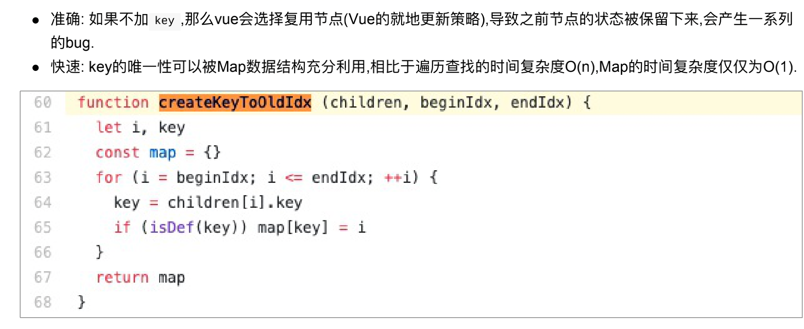

#
[参考前端面试](https://blog.csdn.net/weixin_44157964/article/details/107945951)
# 为何在 v-for 中使用 key

- 必须用 key，且不能是 random 和 index
- diff 算法中通过 tag 和 key 来进行判断，是否是 sameNode
- 减少渲染次数，提升渲染性能

# 描述 Vue 组件生命周期(父子组件)

- 单组件生命周期
- 父子组件生命周期关系

# Vue 组件如何通信

- 父子组件 props,this.$emit
- 自定义事件 event.$on event.$off event.$emit
- vuex

# 描述组件渲染和更新的过程

# 双向数据绑定 v-model 的实现原理

- input 元素的 value = this.name
- 绑定 input 事件 this.name = $event.target.value
- data 更新触发 re-render

# 对 mvvm 的理解

# computed 有何特点

- 缓存，data 不变不会重新计算
- 提高性能

# 为何组件 data 必须是一个函数

export default 看上去是一个对象，实质上我们的.vue 文件是一个 class，在每个地方使用这个组件的时候，
是对这个组件进行实例化，实例化的时候执行这个 data，如果 data 不是函数，每个组件的实例都一样了，就共享了

这是由于JavaScript的特性导致的，在component中，data必须是以函数的形式存在，不可以是对象。
在组件中的data写出一个函数，数据以函数返回值的形式定义，这样每次复用组件的时候，都会返回一份新的data，相当于每个组件实例都有自己私有的数据空间，他们只需要负责维护各自的数据，不会造成混乱。而单纯写成对象形式的话，就是所有的组件实例共用一个data，这样改一个全都改了。

# ajax 请求应该放在哪个生命周期

- mount 里面，因为 js 是单线程的，ajax 异步获取数据，放在 mounted 之前没有用，只会让逻辑更加混乱

# 如何将组件所有的 props 传递给子组件

-$props,<User v-bind="$props"/>

# 多个组件有相同的逻辑，如何抽离

# keep-alive

- 缓存组件，不需要重复渲染的时候，如多个静态 tab 页面的切换

react 版 -> https://github.com/StructureBuilder/react-keep-alive

# 何时使用异步加载

- 加载大组件，编辑器，图表，路由异步加载

# 何时使用 beforeDestory

- 解绑自定义事件 event.$off
- 清楚定时器
- 解绑自定义的 dom 事件，如 window scroll 事件等

# 作用域插槽

# vuex 中 action 和 mutation 有什么区别

- action 中处理异步，mutation 不可以
- mutation 做原子操作
- action 可以整个多个 mutation

# 如何配置 vue-route 异步加载

# 请用 vnode 描述一个 DOM 结构

# 监听 data 变化的核心 api

# vue 如何监听数组变化

# 描述响应式原理

- 监听 data 变化
- 更新渲染过程

# diff 算法的事件复杂度

- o(n)
- 在 o(n^3)上面做了调整，同 tag，同 key，等
- patch、patchNode、addVnodes、removeVnodes

# vue 常见性能优化

- 合理使用 v-show,v-if
- 合理使用 computed
- v-for 时加 key，以及避免和 v-if 同时使用，因为 v-for 优先级更高，每次循环都要 v-if，是对性能的一种浪费
- 自定义事件，dom 事件即时销毁
- 合理使用异步组件，keep-alive
- data 层级不要太深
- webpack 层面优化
- 通用优化，图片懒加载
- ssr

# Vue中的key到底有什么⽤？
* key 是为Vue中的vnode标记的唯⼀id,通过这个key,我们的diff操作可以更准确、更快速
* diff算法的过程中,先会进⾏新旧节点的⾸尾交叉对⽐,当⽆法匹配的时候会⽤新节点的 key 与旧节点进⾏⽐对,然后超出差异.

diff程可以概括为：oldCh和newCh各有两个头尾的变量StartIdx和EndIdx，它们的2个变量相互⽐较，⼀共有4种 ⽐较⽅式。如果4种⽐较都没匹配，如果设置了key，就会⽤key进⾏⽐较，在⽐较的过程中，变量会往中间靠， ⼀旦StartIdx>EndIdx表明oldCh和newCh⾄少有⼀个已经遍历完了，就会结束⽐较,这四种⽐较⽅式就是⾸、尾、 旧尾新头、旧头新尾.

# vue react 怎么检测数据变化的
## vue
vue.js 则是采用数据劫持结合发布者-订阅者模式的方式，通过Object.defineProperty()来劫持各个属性的setter，getter，在数据变动时发布消息给订阅者，触发相应的监听回调

## react
react状态变化只能通过setState,调用setState就会更新状态重新渲染dom

## 请说下封装 vue 组件的过程？
首先建立组件的模板，先把架子搭起来，然后考虑好组件的样式和基本逻辑结构。
准备好组件的数据输入，即分析好逻辑，确定好 props里面的数据、类型
准备好组件的数据输出，即根据组件逻辑，做好要暴露出来的方法
封装完毕后，直接调用即可。

## koa-body的原理
[参考](https://zhuanlan.zhihu.com/p/54972937)

## 介绍pm
PM2是node进程管理工具，可以利用它来简化很多node应用管理的繁琐任务，如性能监控、自动重启、负载均衡等，而且使用非常简单。
[参考](https://www.jianshu.com/p/3de4e8f15621)

## master挂了的话pm2怎么处理?
* 使用pm2方便开启node集群模式 - 简单来说，就是复制一些可以共享TCP连接的工作线程。
* 集群模块会创建一个master主线程，然后复制任意多份程序并启动，这叫做工作线程。
* node多线程支持 - (https://blog.csdn.net/flytam/article/details/86608646)

## 移动端1px问题 
[移动端1px问题](https://www.jianshu.com/p/3a262758abcf)

## webpack-dev-server 运行原理
https://blog.csdn.net/LuckyWinty/article/details/109507412

## 前端安全
[参考](https://www.jianshu.com/p/544bb4bccd82)

## 如何深拷贝this
[参考](https://www.wangt.cc/2021/03/js%E9%9D%A2%E8%AF%95%E9%A2%98/)

## redux主要解决了哪些问题？
[redux主要解决了哪些问题？](https://zhuanlan.zhihu.com/p/57409008)