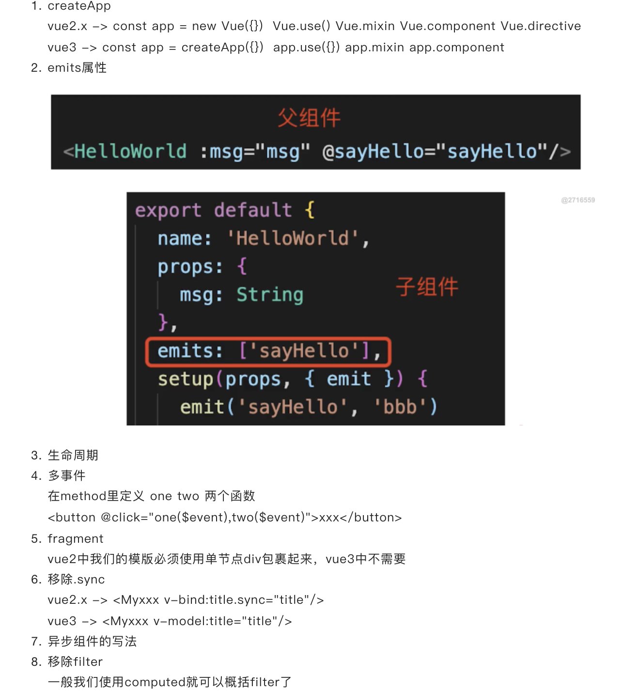
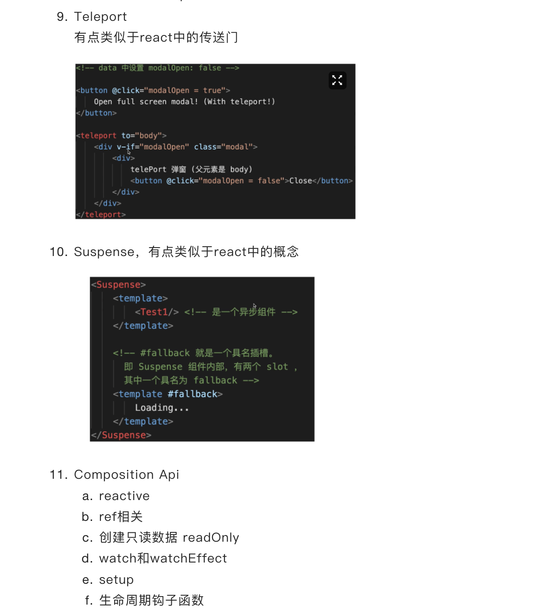

# vue3 总结

## Vue3 生命周期

1. Composition Api 生命周期
   setup -> 可以理解为 beforeCreate 和 created
   onBeforeMount、onMounted、onBeforeUpdate、onUpdated、onBeforeUnmount、onUnmount 都有对应的生命周期
2. Options Api 生命周期
   beforeDestory 改为 beforeUnmount
   Destory 改为 unmount
   其他沿用 vue 的生命周期
3. 如何理解两者
4. 前者带来了什么？更好的代码组织方式，更好的逻辑复用，更好的类型推导
5. 如何选择？不建议共用，会引起混乱，小型项目业务逻辑简单，推荐 Options Api
6. Composition Api 是一个高阶技巧，不是基础必会，为了解决业务复杂逻辑而设计的，就像 hooks 在 react 中的定位

## 与 vue2 的不同

- 只为动态数据创建观察者，减少性能依赖
- 更好的 typescript 支持
- fragment - vue2 中我们的模版必须使用单节点 div 包裹起来，vue3 中不需要
- 代理方式修改 defineProperty 和 proxy
- composition api
- suspense

## Composition Api 和 React Hooks 对比

1. 前者 setup 只会被调用一次，而后者函数会被调用多次
2. 前者无需 useMemo useCallback ,因为 setup 只调用一次
3. 前者无需考虑调用顺序，而后者需要保证 hooks 顺序一致
4. 前者 reactive + ref 比后者 useState ，更难理解

## 如何理解 ref refs toRefs

1. ref
   生成值类型的响应式数据(xxxRef)，可用于模版和 reactive，通过.value 修改值
2. refs
   针对一个响应式对象(reactive 封装的)props
   创建一个 ref，具有响应式
   两者保持引用关系
3. toRefs

## vue3 升级了哪些重要的功能

## composition Api 如何实现逻辑复用

1. 抽离逻辑到一个函数
2. 函数约定命名以 useXxx 开头
3. 在 setup 中引用 useXxx

## Vue3 比 Vue2 有什么优势

1. 性能更好
2. 体积更小
3. 更好的 ts 支持
4. 更好的代码组织
5. 更好的逻辑抽离
6. 更多新功能

## Vite是什么
* 打包工具 - 是一个web开发构建工具，由于原生的ES模块导入方式，可以实现闪电般的冷服务启动
* 优势：开发环境无须打包，启动快
* 为什么快？
 1. 开发环境使用es6 Module，无需打包 -非常快
 2. 生产环境使用rollup，并不会快很多