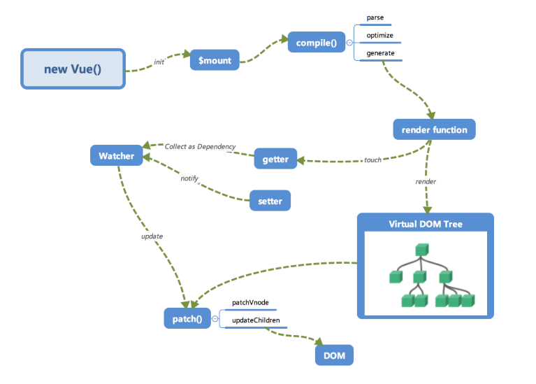
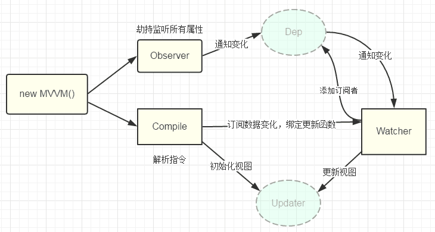
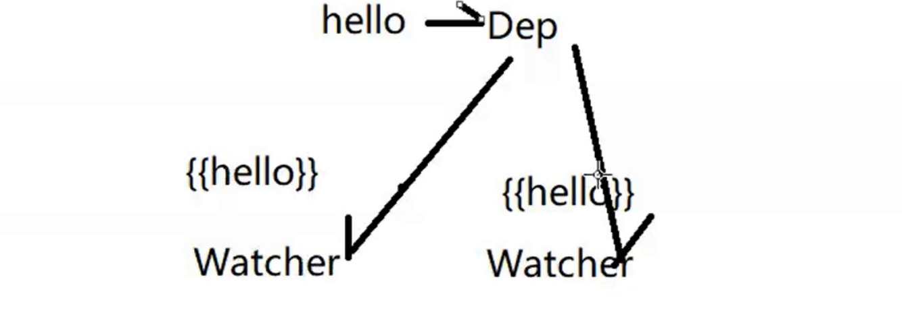
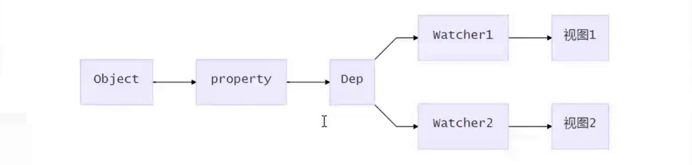

# vue 源码分析

站着牛人的肩膀上学习，岂不快哉，这里收藏了黄老师的 [vue 技术揭秘](https://ustbhuangyi.github.io/vue-analysis/)

> [黄老师](https://github.com/ustbhuangyi/)，曾任职百度、滴滴，现担任 Zoom 前端架构师，《Vue.js 权威指南》主要作者。这本书也是我的第一本 vue 书籍。

# 原理 
* 组件化
* 模板编译
* 响应式
* 渲染过程
* vdom和diff
* 前端路由

# vue 设计架构

vue2 采用的是典型的混入式架构，类似于 express 和 jquery，各部分分模块开发，再通过一个 mixin 去混入到最终暴露到全局的类上。

组件化常用技术

# 组件传值、通信

- 父组件 => 子组件
  - 属性 props
  - 引用 refs
- 子组件 => 父组件：自定义事件
- 兄弟组件：通过共同祖辈组件
  通过共同的祖辈组件搭桥，$parent或$root。
- 祖先和后代之间
  provide/inject：能够实现祖先给后代传值
- dispatch：后代给祖先传值
- 任意两个组件之间：事件总线 或 Vuex
  - 事件总线：创建一个 Bus 类负责事件派发、监听和回调管理
  - vuex：创建唯一的全局数据管理者 store，通过它管理数据并通知组件状态变更

# 插槽

# mixin 组件拓展很好的方式

将来每个组件在创建实例的过程中都会执行

```js
Vue.mixin({
  beforeCreate() {
    if (this.$options.store) {
      Vue.prototype.$store = this.$options.store;
    }
  },
});
```

- 匿名插槽
- 具名插槽
- 作用域插槽

# 表单组件实现

```js
//index.vue
<template>
<div>
  <h3>Element表单</h3>
  <hr />
  <k-form :model="model" :rules="rules" ref="loginForm">
    <k-form-item label="用户名" prop="username">
      <k-input
        v-model="model.username"
        autocomplete="off"
        placeholder="输入用户名"
      ></k-input>
    </k-form-item>
    <k-form-item label="确认密码" prop="password">
      <k-input
        type="password"
        v-model="model.password"
        autocomplete="off"
      ></k-input>
    </k-form-item>
    <k-form-item>
      <button @click="submitForm('loginForm')">提交</button>
    </k-form-item>
  </k-form>
  {{ model }}
  <Notice />
</div>
</template>

<script>
/*
*  深入理解vue组件化机制
*  掌握vue组件化常用技术
*  能够设计并实现多种类型的组件
*  通过组件化实践加深对vue原理理解

*  常用技术  组件 通信  传值

*  Form 管理数据模型 检验规则 全局校验方法
*  FormItem 显示标签label 执行校验prop 显示校验结果
*  Input 绑定数据模型 通知 FormItem 执行校验
*  思考
*  1. Input是自定义组件 ，他是如何实现数据绑定的
*  2. FormItem 怎么知道何时执行校验， 校验的数据和规则怎么得到
*  3. Form 怎么进行全局校验 用什么办法把数据模型和校验规则传递给内部组件

*  语法糖
*  v-model 如果没有呢  :value="model.username"   @input="model.username=$event"
*  但是你也可以通过设置model选项修改默认行为 model: { prop: 'checked', event: 'change' }
  // 上面这样设置会导致上级使用v-model时行为变化，相当于
  // v-model通常用于表单控件，它有默认行为，属性名和事件名均可定义
  <Input :checked="username" @change="username=$event">
  <!-- sync修饰符类似于v-model，它能用于修改传递到子组件的属性，如果像下面这样写 -->
  <Input :value.sync="username">
  <!-- 等效于下面这行，那么和v-model的区别只有事件名称的变化 -->
  <Input :value="username" @update:value="username=$event">
  <!-- 这里绑定属性名称可以随意更改，相应的属性名也会变化 -->
  <Input :foo="username" @update:foo="username=$event"> // 所以sync修饰符的控制能力都在父级，事件名称也相对固定update:xx
*  对$event的理解
*  1.不使用圆括号，event被自动当作实参传入
*  2.自定义事件组件，就是$emit 的第一个参数
*/
import KForm from './Form';
import KFormItem from './FormItem';
import KInput from './Input';

import Notice from '@/components/notice/KNotice';

export default {
components: {
  KForm,
  KFormItem,
  KInput,
  Notice,
},
data() {
  return {
    model: { username: 'tom', password: '' },
    rules: {
      username: [{ required: true, message: '请输入用户名' }],
      password: [{ required: true, message: '请输入密码' }],
    },
  };
},
methods: {
  // apple(val){
  //   this.model.username = val
  // },
  submitForm(form) {
    this.$refs[form].validate((valid) => {
      const notice = this.$create(Notice, {
        title: '社会你杨哥喊你来搬砖',
        message: valid ? '请求登录!' : '校验失败!',
        duration: 2000,
      });
      notice.show();
    });
  },
},
};
</script>

// Form.vue
<template>
  <div>
    <slot></slot>
  </div>
</template>

<script>
/*
 *  确定往下传递的东西  我们这里 使用跨层级的 provide把我自己传给子孙后代
 */
export default {
  provide() {
    return {
      form: this,
    };
  },
  props: {
    model: {
      type: Object,
      required: true,
    },
    rules: {
      type: Object,
    },
  },
  methods: {
    // validate1() {
    //   // 过滤出有 prop属性的子元素
    //   this.$children.filter((item) => item.prop).map((item) => item.validate());
    // },
    validate(cb) {
      // task promise 组成的数组
      const tasks = this.$children
        .filter((item) => item.prop)
        .map((item) => item.validate());

      // 所有任务都通过才算校验通过
      Promise.all(tasks)
        .then(() => cb(true))
        .catch(() => cb(false));
    },
  },
};
</script>

// FormItem

<template>
  <div>
    <label v-if="label">{{ label }}</label>
    <slot></slot>
    <p v-if="errorMessage">{{ errorMessage }}</p>
  </div>
</template>

<script>
/*
 *  1. 给 input 预留插槽
 *  2. 能够展示 label 和 检验信息
 *  3. 能够进行校验 校验谁？ 我们需要拿到 rules 和 input 的那个值
 *  孩子可以派发一个事件告诉她 当 input值 发生改变的时候 你要 执行校验了
 * */
import Schema from 'async-validator';
export default {
  inject: ['form'],
  props: {
    label: {
      type: String,
      default: '',
    },
    // 做校验
    prop: {
      type: String,
    },
  },
  data() {
    return {
      errorMessage: '',
    };
  },
  mounted() {
    this.$on('validate', this.validate);
  },

  methods: {
    computeds() {
      var attName = 'name';
      var p = {
        [attName]: '李四', // 引用了变量attName。相当于添加了一个属性名为name的属性
        age: 20,
      };
      console.log(p[attName]); // 李四
    },
    validate() {
      // 做校验  rules inputvaule 动态获取检验
      const value = this.form.model[this.prop];
      const rules = this.form.rules[this.prop];
      // npm i async-validator -S  键值对形式
      const desc = { [this.prop]: rules };
      const schema = new Schema(desc);
      // return的是校验结果的Promise
      return schema.validate({ [this.prop]: value }, (errors) => {
        if (errors) {
          this.errorMessage = errors[0].message;
        } else {
          this.errorMessage = '';
        }
      });
    },
  },
};
</script>

// Input.vue

<template>
  <div>
    <input :value="value" @input="onInput" v-bind="$attrs" />
    <!-- <input :value="text1" @input="onInput" v-bind="$attrs" /> -->
  </div>
</template>
<script>
/*
 * 1. 双向绑定 * @input :value 我们在外面v-model的时候 内部要干两件事
 * 2. 派发校验事件
 */
export default {
  // 组件将不会把未被注册的props呈现为普通的HTML属性
  inheritAttrs: false,
  props: {
    value: {
      type: String,
      default: '',
    },
  },
  一个组件上的 v-model 默认会利用名为 value 的 prop 和名为 input 的事件，但是像单选框、复选框等类型的输入控件可能会将 value attribute 用于不同的目的。
  // model: {
  //   prop: 'text1',
  //   event: 'input',
  // },
  // props: {
  //   text1: String,
  //   default() {
  //     return '';
  //   },
  // },
  created() {
    /*
     *  v-bind="$attrs 会让顶组件 把属性挂载到我们当前的组件上 有点像 ...  我不需要一层一层传递进去
     *
     * */
  },
  methods: {
    onInput(e) {
      // 转发input事件
      this.$emit('input', e.target.value);
      /*
       * 这个地方为什么要用  parent 派发呢 因为 formitem 哪里还是一个slot 没法监听
       * 虽然调用了 它老爹去通知  但还是他自己的派发出去的事件
       *   子组件调用方法this.$parent.$emit
       *   父组件在创建时通过this.$on去监听
       * */
      this.$parent.$emit('validate');
    },
  },
};
</script>
```

# 递归组件

```js
// item.vue
<template>
  <li>
    <div @click="toggle">
      {{ model.title }}
      <span v-if="isFolder">[{{ open ? '-' : '+' }}]</span>
    </div>
    <ul v-show="open" v-if="isFolder">
      <item
        class="item"
        v-for="model in model.children"
        :model="model"
        :key="model.title"
      ></item>
    </ul>
  </li>
</template>

<script>
export default {
  name: 'Item',
  props: {
    model: {
      type: Object,
      required: true,
    },
  },
  data() {
    return {
      open: false,
    };
  },
  computed: {
    isFolder() {
      return this.model.children && this.model.children.length;
    },
  },
  methods: {
    toggle() {
      if (this.isFolder) {
        this.open = !this.open;
      }
    },
  },
};
</script>
// index.vue
<template>
  <div>
    <ul>
      <item class="item" :model="treeData"></item>
    </ul>
  </div>
</template>

<script>
/*
 *  组件设计
 *  tree组价最适合的结构是 无序列表ul
 *  创建一个 递归组价 item 表示  tree选项
 *  如果当前 item 存在 children 则 递归渲染子树
 *  同时添加一个 标识管理当前层级 item 的展开状态
 * */
import Item from './Item';
export default {
  name: 'app',
  data() {
    return {
      treeData: {
        title: 'Web全栈架构师',
        children: [
          {
            title: 'Java架构师',
          },
          {
            title: 'JS高级',
            children: [
              {
                title: 'ES6',
              },
              {
                title: '动效',
              },
            ],
          },
          {
            title: 'Web全栈',
            children: [
              {
                title: 'Vue训练营',
                expand: true,
                children: [
                  {
                    title: '组件化',
                  },
                  {
                    title: '源码',
                  },
                  {
                    title: 'docker部署',
                  },
                ],
              },
              {
                title: 'React',
                children: [
                  {
                    title: 'JSX',
                  },
                  {
                    title: '虚拟DOM',
                  },
                ],
              },
              {
                title: 'Node',
              },
            ],
          },
        ],
      },
    };
  },
  components: { Item },
};
</script>

```

# 独立组件实例

```js
import Vue from 'vue';
/*
 *  挂载相关的一些事情
 *  我们这个地方创建的实例是 独立的  和我们app 外面挂载的那个没什么关系
 *  h就是createElement，它返回VNode
 *  我把传进来的  Component 变成一个 vnode 传递一些参数
 *
 *  vm使我们的一个实例  render完后有一个vnode 一个vnode对应一个真实dom  $el 就是真实dom
 *  new Vue 一创建 render 一执行 就会有 vnode $el 相对应 虚拟dom和实体dom是对应的
 *  真实dom是在 $mount 的时候生成的
 *
 *  思考？ Component 和 comp 有啥区别
 *  我们平时写的 template  当vue-loader把我们的.vue文件编译完成后  最终返回的东西是什么呢？
 *
 *  会把他动态编译成一个 render函数 然后导出 我们导出的不是组件 是一个组件的配置 所以你平时都在写render函数
 *  变成一个render函数来描述他 vnode会有一个模拟的结构 孩子是怎么来的呢 也是h编译出来的
 *  render(h){ return h('div',[h('p','hello')]) }
 *  watcher是还在的   watcher知道哪些数据发生变化了 只要数据发生改变 watcher 就会调用 编译器帮我们生成的那个更新函数
 *  更细函数就知道 怎么去生成全新的vnode
 *  Component: 组件配置，js对象  如何变成一个组件真正的实例呢 必须依赖vue的构造函数做这件事
 *  comp：组件实例
 *  Vue.extend(Component) => function 组件构造函数 我们将组件的配置放到里面 也能实现 一个真正的实例
 *  h(Component, { props }) 这个返回的vnode 和 vm$el 是有一个对应关系的
 * */
export default function create(Component, props) {
  // 先创建实例  我们这个地方是组件实例 不是vue 实例
  const vm = new Vue({
    //  render生成虚拟dom
    render(h) {
      return h(Component, { props });
    },
    // 不能直接挂在到body上 .$mount('body');
  }).$mount();
  // 手动挂载
  document.body.appendChild(vm.$el);
  // 销毁方法
  const comp = vm.$children[0];
  comp.remove = function() {
    document.body.removeChild(vm.$el);
    vm.$destroy();
  };
  return comp;
}

```

# vuex 实现

```js
/**
 * 1. vuex也是插件 install prototype
 * 2. 实现三个东西  state/mutations/actions/getter
 * 	思考？ mutations导致state的变更  我们如何去通知视图发生变化呢 还是要借助 vue的数据响应式 所有state的数据都是在 vue的data中
 * 3. 数据响应式
 */

let Vue;
class Store {
	constructor(options) {
		this.state = new Vue({
			data: options.state
		})
		this.mutations = options.mutations
		this.actions = options.actions

		options.getters && this.handleGetters(options.getters)
	}

	// 生命为箭头函数  保证this 永远指向 store实例 dispatch不需要
	commit = (type, args) => {
		this.mutations[type](this.state, args)
	}

	dispatch(type, args) {
		this.actions[type]({
			commit: this.commit,
			state: this.state
		}, args)
	}

	handleGetters(getters) {
		// Object.defineProperty() 方法会直接在一个对象上定义一个新属性，或者修改一个对象的现有属性，并返回此对象。
		this.getters = {}
		// 遍历 getters 所以的 key
		Object.keys(getters).forEach(key => {
			// 为 getters 定义 若干属性 这些属性是只读的  通过 defineProperty 可以约束他的只读性
			// $store.getters.score
			Object.defineProperty(this.getters, key, {
				get: () => {
					return getters[key](this.state)
				}
			})
		})
	}
}

function install(_Vue) {
	Vue = _Vue
	Vue.mixin({
		beforeCreate() {
			if (this.$options.store) {
				Vue.prototype.$store = this.$options.store
			}
		}
	})
}

export default {
	Store,
	install
}

```

# vue-router 实现

像 vue-router，vuex 他们都是作为 vue 插件，请说一下他们分别都是如何在 vue 中生效的？
通过 vue 的插件系统，用 vue.mixin 混入到全局，在每个组件的生命周期的某个阶段注入组件实例。

```js
/*
 * 实现 vue router  插件
 * 主要作用  监听url变化  一旦url发生变化  将对应的组件替换过去
 * 路由配置解析
 * 实现全局组件 router-link  router-view(把path对应的home拿出来，用render方法把他动态的渲染出来)
 * 思考？ vue-router 和 react-router 有啥区别呢
 *    vue-router和vue之间有一个强绑定关系,强依赖,只能用在vue中
 *
 *  use
 * 	安装 Vue.js 插件。如果插件是一个对象，必须提供 install 方法。
 *  如果插件是一个函数，它会被作为 install 方法。install 方法调用时，会将 Vue 作为参数传入。
 *  如何让他实现插件呢？ 实现install方法
 *  vue调用 use 方法的时候 其实调用的是 install方法 把vue自己传进去
 *  Vue.component 做了什么？
 *  在当前的组件里面 把我们传进来的配置对象 通过 extend 变成了构造函数， 然后又把这个构造函数注册到了当前组件里面的
 *  component 选项里面 由于是在根里面做的配置 所以所有子组件能都访问到
 * */
import Vue from 'vue';
import Home from "./views/Home";
import About from "./views/About";

class VueRouter {
	constructor(options) {
		this.options = options
		this.routeMap = {}
		// 路由响应式  一旦路由发生变化,凭什么让重新渲染组件呢？所以说一定是一个响应式的数据变化，才能让我们的
		// 全局组件重新 render 如何实现呢 ？ 利用vue提供的数据响应式机制
		this.app = new Vue({
			data: {
				current: '/'
			}
		})
	}
	init() {
		this.bindEvent() // 监听url变化
		this.createRouteMap(this.options) // 路由配置解析
		this.initComponent() // 实现两个组件
	}
	bindEvent() {
		// 页面加载完成的时候 走一次 hashChange  注意 this 指向
		window.addEventListener('load', this.onHashChange.bind(this))
		window.addEventListener('hashchange', this.onHashChange.bind(this))
	}
	onHashChange() {
		// current 值得变化 会使我们  initComponent创建的两个组件 刷新 重新徐然 换一套新的
		this.app.current = window.location.hash.slice(1) || '/'
	}
	createRouteMap(options) {
		// console.log(options)
		options.routes.map(item => {
			this.routeMap[item.path] = item.component
		})
	}
	initComponent() {
		// router-link  router-view 利用vue全局组件配置
		// <router-link to='/'>fff</router-link>
		Vue.component('router-link', {
			props: {
				to: String
			},
			// 这个地方不能用 template 这种方式运行时打包的方式 根本没有编译器 只能写render
			render(h) {
				// h(tag,data,children)
				return h('a', {
					attrs: {
						href: '#' + this.to
					}
				}, [this.$slots.default])
			}
		})

		Vue.component('router-view', {
			// 这个地方不能用 template 这种方式运行时打包的方式 根本没有编译器 只能写render
			// 这个地方我们使用 箭头函数保留当前this 指向这个 router 实例 正好也不需要使用组件内部的props之类
			render: h => {
				console.log(this.routeMap[this.app.current]);
				const comp = this.routeMap[this.app.current]
				return h(comp)
			}
		})
	}
}

VueRouter.install = function(Vue) {
	//  vue.mixin 常用语组件开发的拓展
	Vue.mixin({
		// 这块会和组件创建生命周期的时候一块执行  this  当前组件的实例(根组件执行一次) 在每个组件都能使用真是因为这个
		beforeCreate() {
			if (this.$options.router) {
				Vue.prototype.$router = this.$options.router
				this.$options.router.init()
			}
		}
	});
};

Vue.use(VueRouter);

export default new VueRouter({
	routes: [{
		path: '/',
		component: Home
	}, {
		path: '/about',
		component: About
	}]
})

```

# vue 简单源码



1.  初始化 init
    在 new Vue() 时会调用\_init()进行初始化，会初始化各种实例方法、全局方法、执行一些生命周期、初始化
    props、data 等状态。其中最重要的是 data 的「响应化」处理。
    初始化之后调用 $mount 挂载组件，主要执行编译和首次更新
$mount 挂载会导致一件事情发生，当我们在浏览器端，比如我们直接引入了 vuejs 这时候是携带了编译器的，
    这个编译器会做什么事情呢？ 生成一个渲染函数 把我们写的 template render function 三个过程

2.  编译
    编译模块分为三个阶段

- parse：使用正则解析 template 中的 vue 的指令(v-xxx) 变量等等 形成抽象语法树 AST(类似于一个 js 对象，可以描述我们所有的节点，特别像 vnode)
- optimize：标记一些静态节点(因为没有绑定值 像{{}} 指令等 跳过这些)，用作后面的性能优化，在 diff 的时候直接略过(比较的时候直接跳过这些静态的东西，优化策略)
- generate：把第一部生成的 AST 转化为渲染函数 render function(生成一个字符串形式的函数，这个函数如何成为一个真正的函数呢，我们通过 new Function(renderStr)的 方式 ) 这个函数最终能生成 vnode -> 变成真实 dom 就需要打补丁 通过 patch 方法 把 vnode 转化成 真实 dom

3. 更新
   生成 render 函数之后 创建组件的时候，我们有一个机会，遍历我们组件中所有的 data 也就是数据响应话的过程 这个过程我们会给 data 中的数据 都加上 getter setter 这两个函数的作用 我数据中的 data 和哪个组件是有关系的 通过 getter 来进行依赖收集 收集的东西是什么呢 就是 watcher watcher 将来是真正去做更新的 他怎么知道呢？ 我们刚才设置了 setter 当有人设置的时候 会通知所有的 watcher 去更新 执行更细函数 重新打包 patch 打补丁 会发生 diff 算法,得到真实的 dom 操作

数据修改触发 setter，然后监听器会通知进行修改，通过对比新旧 vdom 树，得到最小修改，就是 patch ，然后只
需要把这些差异修改即可

什么是打补丁？最重要的就是先做一个 diff 新旧 vdom 做一个比对 当我们发现有几个节点是新增的或者删除的，或更新的 所有的操作我们都比出来
比对出来的结果 转化成 patch 包，patch 操作，一个真正 dom 操作的过程 把比对出来的结果变成真正的 dom 操作，批量的把刚才所有的事全做了
有机的减少了对浏览器 dom 操作的次数 ，提升用户体验

4. 响应式
   vue 核心内容 初始化的时候通过 defineProperty 定义对象的 getter setter ,设置通知机制
   当编译生成的渲染函数被实际渲染的时候，会触发 getter 进行依赖收集，在数据变化的时候，触发 setter 进行更新

5. vdom

vdom 是 react 首创，vue2 开始支持，就是用 javascript 对象来描述 dom 结构，修改数据的时候 我们先修改虚拟 dom 中的数据，然后数组做
diff，最后再汇总所有的 diff，力求做最少的 dom 操作，毕竟 js 里对比很快，而真实 dom 操作太慢


注意点

1. 数据响应化 如何通过递归的方式让 data 中的数据如何变成响应式的
2. 如何管理我们的依赖？ 创建 watcher dep (watcher 对象将来是被 dep 对象管理的 一对多关系)
3. 小编译器 将我们写的一些简单的 html 代码 -> render 函数 指定到我们的 watcher 里面 再加到 dep 里面 ,然后当我们更新数据的时候会通知 watcher 去发生变化 更新视图
   编译 初始化 造 watcher 添加到 dep



- hello 和 dep 一一对应
- dep 管理这两个 watcher
- 一旦我们的 hello 发生改变 通过数据劫持 setter 函数 通知 dep 去发通知 然后 watcher 改变 页面数据也就变了

我们在增加一个 Dep 类对象，用来收集 watcher 对象 读数据的时候，会触发 getter 函数把当前的 Watcher 对象(存放在 Dep.target 中的) 收集到 Dep 类中去

写数据的时候，则会触发 setter 方法，通知 Dep 类去调用 notify 来触发所有 watcher 对象的 update 方法更新对应视图

vnode 为什么 2.0 需要 1.0 不需要呢？

思考？ vue1.0 为什么不能做大项目呢 就是因为 watcher 太多了，太大就甭了 所以在 2.0 里面做了改进 粒度变细了
一个组件对应一个 watcher 将来不管哪个属性发生变化了 我都通知这一个 watcher 去做更新，执行更新的过程中怎么知道哪一个发生变化了呢？所以不得不引入 vnode 的因素 ，根据最新的值计算出来一个 vnode 和老的作比对，得到改变后的地方(一个组件有一个 vnode 和其对应)



# 源码解读总结

1. 理顺整体流程
2. 理解数据响应式原理
3. 理解虚拟 dom
4. 理解模板编译原理

# 总体把握

0. 入口

   - commonjs -- main -> require vue.runtime.common.js
   - esm -> 现代打包方式 ES 模块，用于 webpack2+ vue.runtime.esm.js
   - umd -- 浏览器端 umd 默认包含运行时和编译器 vue.js
     runtime -- 仅包含 运行时版本 核心代码 没有模板编译器 vue.runtime.js

1. core/instance/index.js
   实现 Vue 构造函数，实现若干实例方法和属性

```js
  function Vue (options) {
    this._init(options); // 构造函数仅执行了_init
  }
  initMixin(Vue); // 实现init函数
  stateMixin(Vue); // 状态相关api $data,$props,$set,$delete,$watch
  eventsMixin(Vue); // 事件相关api $on,$once,$off,$emit
  lifecycleMixin(Vue); // 生命周期api _update,$forceUpdate,$destroy
  renderMixin(Vue);// 渲染api _render,$nextTick
```

2. src\platforms\web\entry-runtime-with-compiler.js
   扩展\$mount
   扩展默认\$mount 方法：能够编译 template 或 el 指定的模板 在浏览器中

   compile vs runtime
   带 compile 版本支持 template 选项，可以实时编译模板
   仅 runtime 不支持 template 体积小 需要借助 webpack 把 template 编译成 render 函数

3. src\platforms\web\runtime\index.js
   实现\$mount，核心就一个 mountComponent；定义一个**patch**方法 这个 patch 就是将来真正做 dom 操作的
   mountComponent

4. mountComponent
   定义更新函数，创建一个 watcher，它会执行一次更新函数，完成挂载(浏览器中 把我们传进去的 el 直接开始编译打包，把结果挂载到 el 上)

5. initMixin
   实现 vue 初始化函数\_init

```js
  initLifecycle(vm); // $parent,$root,$children,$refs 的声明
  initEvents(vm); // 处理父组件传递的事件和回调
  initRender(vm);  //和渲染相关的一些事情 vnode
  callHook(vm, 'beforeCreate');
  initInjections(vm); // 给组件注入数据呀
  initState(vm);   // 初始化props，methods，data，computed，watch
  initProvide(vm) // 提供数据注入
  callHook(vm, 'created');
```

- mountComponent core/instance/lifecycle.js

  执行挂载，获取 vdom 并转换为 dom

- render() src\core\instance\render.js

  渲染组件，获取 vdom

- update() src\core\instance\lifecycle.js

  执行更新，将传入 vdom 转换为 dom，初始化时执行的是 dom 创建操作

  总体流程
  new Vue -> init -> \$mount -> render -> update
  调用 init、初始化各种属性、调用 mountComponent 声明 updateComponent 创建 watcher render 获取虚拟 dom
  update 把 vnode 转化成正式 dom

6. stateMixin

   组件状态相关 api 如$set,$delete,\$watch 实现

7. eventsMixin

   事件相关 api 如$on,$emit,$off,$once 实现

8. lifecycleMixin

   组件声明周期 api 如\_update,$forceUpdate,$destroy 实现
   \_update 是组件更新周期的关键方法 组件触发更新函数就会调用 执行 vnode 的 diff 和 patch 等操作 从 vnode->真实 dom 打补丁
   init render !prevnode && vm.$el = vm.__patch__(vm.$el,vnode,hydrating,false)
   update vm.\$el = vm.**patch**(prevnode,vnode)

```js
 Vue.prototype._update = function (vnode, hydrating) {}
 Vue.prototype.$forceUpdate = function (vnode, hydrating) {}
 Vue.prototype.$destroy = function (vnode, hydrating) {}
```

9. renderMixin(Vue)
   实现组件渲染函数\_render, \$nextTick

```js
  Vue.prototype.$nextTick = function (fn) {
   return nextTick(fn, this)
  };

Vue.prototype.\_render = function () {
var vm = this;
// render 就是我们传入的那个 也有可能是编译器
const { render, \_parentVnode } = vm.\$options;

   if (_parentVnode) {
     vm.$scopedSlots = normalizeScopedSlots(
       _parentVnode.data.scopedSlots,
       vm.$slots,
       vm.$scopedSlots
     );
   }
   // set parent
   vnode.parent = _parentVnode;
   return vnode

```

# 初始化过程

# initLifecycle

initLifecycle src\core\instance\lifecycle.js
把组件实例里面用到的常用属性初始化，比如$parent/$root/\$children 的声明
组件创建顺序 从上到下 挂载顺序 自下而上

```js
let parent = options.parent;
vm.$parent = parent;
vm.$root = parent ? parent.$root : vm;
vm.$children = [];
vm.$refs = {};
vm._watcher = null;

```

# initEvents

核心：处理父组件传入的事件进行监听

父组件中定义的需要子组件处理的事件
<comp @someEvent='abc'></comp> 我们一般认为这个 abc 是老爹去处理 因为 abc 在老爹里面声明
比如我们 平常在一个组件 派发一个事件 这个监听者是谁呢？ 是组件他自己 但实际这个事件是声明在父组件里面的
我们编译的时候 处理父组件的时候发现了这些事件 其实真正的监听者是儿子
比如当他发现自定义事件的时候 回去做 render 函数 传 data data 中有关于 on 的设置 有肯能做 someEvent 的声明
吧 vnode 创建成组件的时候 要处理这些 on 吧 说白了 在老爹里面发现的这些监听者执行者 其实是儿子

```js
vm._events = Object.create(null);
vm._hasHookEvent = false;
var listeners = vm.$options._parentListeners; //把老爹里面的监听拿出来，给儿子去执行，事件是是派发，谁监听
if (listeners) {
updateComponentListeners(vm, listeners)
```

# initRenders

核心：主要是 slot 的初始化 和 vnode 的创建

- $slots $scopedSlots 初始化 很关心一些数据 以为这些数据就是在老爹里面拿到的
- \$createElement 函数声明
- $attrs和$listeners 响应化

```js
vm._vnode = null;
vm._staticTrees = null;
const options = $options;
const parentVnode = (vm.$vnode = options._parentVnode);
const renderContext = parentVnode && parentVnode.context;
vm.$slots = resolveSlots(options._renderChildren, renderContext);
vm.$scopedSlots = emptyObject;
// 把 createElement 函数挂载到当前组件上，编译器需要用到
vm._c = (a, b, c, d) => createElement(vm, a, b, c, d, false);
// 用户编写渲染函数使用这个 render functions. 这个 createElement 就是 render(h)
vm.$createElement = (a, b, c, d) => createElement(vm, a, b, c, d, true);


```
- initInjections
  注入数据 注入的数据是不会做响应化的 转义一下 有可能传递给别人

```
const result = resolveInject(vm.$options.inject, vm);
if (result) {
  toggleObserving(false);
  Object.keys(result).forEach((key) => {
    defineReactive(vm, key, result[key]);
  });
  toggleObserving(true);
}

```

# initState

执行各种数据状态初始化地方，包括数据响应化等等

```

vm._watchers = [];
const opts = vm.$options;
//初始化所有属性
if (opts.props) initProps(vm, opts.props);
// 初始化回调函数
if (opts.methods) initMethods(vm, opts.methods);
// 数据响应化
if (opts.data) {
  initData(vm);
} else {
  observe((vm._data = {}), true);
}
if (opts.computed) initComputed(vm, opts.computed);
if (opts.watch && opts.watch !== nativeWatch) {
  initWatch(vm, opts.watch);
}
```

# initProvide

为子组件提供数据

# src/core/index.js initGlobalAPI

主要初始化全局 api -- initGlobalAPI(Vue)
设置 Vue 全局 API 如 set/delete/nextTick

```

import { set, del } from '../observer/index'
export function initGlobalAPI (Vue: GlobalAPI) {
Vue.set = set
Vue.delete = del
Vue.nextTick = nextTick

initUse(Vue) // 实现 Vue.use 函数
initMixin(Vue) // 实现 Vue.mixin 函数
initExtend(Vue) // 实现 Vue.extend 函数
initAssetRegisters(Vue) // 注册实现 Vue.component/directive/filter
}

```

# vue 数据响应式

vue 数据响应化的代码都在 src/core/observer 里面

具体实现是在 Vue 初始化时，会调用 initState，它会初始化 data，props 等，这里着重关注 data 初始化，
src\core\instance\state.jsinitData 核心代码是将 data 数据响应化

observe 方法返回一个 Observer 实例，core/observer/index.js

```js

// 已经存在 直接返回 负责创建新的实例
function observe(value, asRootData) {
  // value: 待响应化数据对象
  var ob; // 观察者 ob 将来数据变了，负责通知更新
  if (hasOwn(value, '__ob__') && value.__ob__ instanceof Observer) {
    ob = value.__ob__;
  } else if (
    shouldObserve &&
    !isServerRendering() &&
    (Array.isArray(value) || isPlainObject(value)) &&
    Object.isExtensible(value) &&
    !value._isVue
  ) {
    // 创建观察者
    ob = new Observer(value);
  }
  if (asRootData && ob) {
    ob.vmCount++;
  }
  return ob;
}

```

Observer 对象根据数据类型执行对应的响应化操作，core/observer/index.js
每一个响应书的对象都会有一个 ob

```js
class Observer {
  constructor(value) {
    this.value = value;
    // 保存数组类型数据的依赖  什么要在 Observer 设置 dep？  比如给对象新增了属性，如何去通知页面做更新呢？
    // 1.如果 obj有新增或者删除属性
    // 2.arr中有变更方法   通过obj上面挂载的这个dep去通知，obj变了，我们让这个组件对应的watcher去做更新
    this.dep = new Dep();
    this.vmCount = 0;
    // 设置一个__ob__属性引用当前 Observer 实例
    def(value, '__ob__', this);
    // 在 getter 中可以通过__ob__可获取 ob 实例
    if (Array.isArray(value)) {
      // 数组响应化
      this.observeArray(value);
    } else {
      this.walk(value); // 对象响应化
    }
  }
  /**遍历对象所有属性并转换为 getter/setters **/
  walk(obj) {
    const keys = Object.keys(obj);
    for (let i = 0; i < keys.length; i++) {
      defineReactive(obj, keys[i]);
    }
  }
  //对数组每一项执行响应化
  observeArray(items) {
    for (let i = 0, l = items.length; i < l; i++) {
      observe(items[i]);
    }
  }
}

```

- defineReactive
  defineReactive 定义对象属性的 getter/setter，getter 负责添加依赖，setter 负责通知更新

```js

export function defineReactive(
  obj: Object,
  key: string,
  val: any,
  customSetter?: ?Function,
  shallow?: boolean
) {
  const dep = new Dep();
  // 一个 key 一个 Dep 实例
  const getter = property && property.get;
  const setter = property && property.set;
  // 递归执行子对象响应化 一个对象会有一个观察者 哪怕是对象的嵌套也会生成子观察者 只要是对象类型都会返回 childOb
  let childOb = !shallow && observe(val);
  // 定义当前对象 getter/setter
  Object.defineProperty(obj, key, {
    enumerable: true,
    configurable: true,
    get: function reactiveGetter() {
      // 获取key的值
      const value = getter ? getter.call(obj) : val;
      // getter 被调用时若存在依赖则追加 如果有 watcher 存在 我就让 watcher 和当前的 dep 产生相互关系 dep 中可以有多个 watcher watcher 也可以存在多个 dep 中 多对对关系
      // 如果存在依赖
      if (Dep.target) {
        //依赖收集
        dep.depend();
        // 若存在子 observer，则依赖也追加到子 ob
        if (childOb) {
          childOb.dep.depend(); // 嵌套对象的处理
          if (Array.isArray(value)) {
            dependArray(value); // 数组需特殊处理
          }
        }
      }
      return value;
    },
    set: function reactiveSetter(newVal) {
      const value = getter ? getter.call(obj) : val;
      if (getter && !setter) return;
      val = newVal; // 更新值
      childOb = !shallow && observe(newVal); // 递归更新子对象 如果新值是对象，也要做响应化处理
      dep.notify(); // 通知更新
    },
  });
}

```

# 数量理解

```js
  /*
  * 思考？
  * 有几个 Observer
  * 有几个 Dep
  * 有几个 Watcher
  * 一个对象一个Observer  data本身是个对象 obj是个对象  所以有两个
  * 因为key 两个 所以 dep 是两个
  * 一个组件一个watcher  这个地方 obj foo对应的watcher都是根组件
  * */

  const app = new KVue({
    el:'#app',
    data: {
      obj: {foo:'foo'},
    },
    methods: {
      add() {
        this.counter++
      }
    }
  })
```

# Dep

负责管理一组 Watcher，包括 watcher 实例的增删及通知更新，core/observer/dep.js

```js
export default class Dep {
  static target: ?Watcher; // 依赖收集时的 wacher 引用
  id: number;
  subs: Array<Watcher>; // watcher 数组

  constructor() {
    this.id = uid++;
    this.subs = [];
  }
  //添加 watcher 实例
  addSub(sub: Watcher) {
    this.subs.push(sub);
  }
  //删除 watcher 实例
  removeSub(sub: Watcher) {
    remove(this.subs, sub);
  }
  //watcher 和 dep 相互保存引用 将当前 watcher 的 dep 方法做了一个调用
  depend() {
    if (Dep.target) {
      Dep.target.addDep(this);
    }
  }
  notify() {
    const subs = this.subs.slice();
    for (let i = 0, l = subs.length; i < l; i++) {
      subs[i].update();
    }
  }
}
```

# Watcher

Watcher 解析一个表达式并收集依赖，当数值变化时触发回调函数，常用于\$watch API 和指令中。
每个组件也会有对应的 Watcher，数值变化会触发其 update 函数导致重新渲染
什么时候会创建一个新的 watcher？
每当我有一个组价生成的时候 就会创建一个 watcher 或者我们手动的创建 通过 this.\$watch 这种方式也会创建 watcher

页面初始化的时候 首次会创建一个明文的 watcher \$mount 的时候创建 相当于是给根组件创建了一个 watcher
如果页面中又出现了自定义的组件 这个时候就又会生成 watcher 这就是一个组件 一个 watcher

```js

export default class Watcher {
  constructor(
    vm: Component,
    expOrFn: string | Function,
    cb: Function,
    options?: ?Object,
    isRenderWatcher?: boolean
  ) {
    this.vm = vm;
    // 组件保存 render watcher
    if (isRenderWatcher) {
      vm._watcher = this;
    }
    // 组件保存非 render watcher
    vm._watchers.push(this);
    // options
    // 将表达式解析为 getter 函数
    // 那些和组件实例对应的 Watcher 创建时会传递组件更新函数进来
    if (typeof expOrFn === 'function') {
      this.getter = expOrFn;
    } else {
      // 这种是\$watch 传递进来的表达式，它们需要解析为函数
      this.getter = parsePath(expOrFn);
      if (!this.getter) {
        this.getter = noop;
      }
    }
    // 若非延迟 watcher，立即调用 getter
    this.value = this.lazy ? undefined : this.get();
  }
  // 模拟 getter, 重新收集依赖 re-collect dependencies
  get() {
    // Dep.target = this
    pushTarget(this);
    let value;
    const vm = this.vm;
    try {
      // 从组件中获取到 value 同时触发依赖收集
      value = this.getter.call(vm, vm);
    } catch (e) {
    } finally {
      // deep watching，递归触发深层属性
      if (this.deep) {
        traverse(value);
      }
      popTarget();
      this.cleanupDeps();
    }
    return value;
  }

  addDep(dep: Dep) {
    const id = dep.id;
    if (!this.newDepIds.has(id)) {
      // watcher 保存 dep 引用
      this.newDepIds.add(id);
      this.newDeps.push(dep);
      // dep 添加 watcher
      if (!this.depIds.has(id)) {
        dep.addSub(this);
      }
    }
  }
  // - 对于 更新操作的理解
  // - 入队操作 queneWatcher 我们做更新的时候 不会立刻去执行 dom 操作 而是让我当前的 \$emit
  // - 进入队列中做异步的批量更新 也就是说我们 vue 在做数据更新的时候，尤其是 dom 操作的时候，我们是批量的异步的操作
  // - 怎么实现的呢？ 首先我们会有一个异步队列 把我们的所有的 watcher push 到这个队列里面，然后等到每个循环周期到的时候
  // - 我们统一的去执行队列里面所有 watcher 的更新，这样执行效率就比较高了
  update() {
    // 更新逻辑
    if (this.lazy) {
      this.dirty = true;
    } else if (this.sync) {
      this.run();
    } else {
      //默认 lazy 和 sync 都是 false，所以会走该逻辑 做更新的时候不是立刻去执行 dom 操作 而是让我当前的 watcher 进入到队列中，做异步的批量更新
      queueWatcher(this);
    }
  }
}

```

# 数组响应化

数组的数据变化和对象不同，我们操作数组通常使用 push pop splice 等，此时没有办法得知数据变化，所以 vue 采取的策略是拦截 push、pop、splice 等方法执行 dep 通知。
为数组原型中的 7 个可以改变内容的方法定义拦截器，src\core\observer\array.js

```js
// 数组原型
const arrayProto = Array.prototype;
// 修改后的原型
export const arrayMethods = Object.create(arrayProto);
const methodsToPatch = [
  'push',
  'pop',
  'shift',
  'unshift',
  'splice',
  'sort',
  'reverse',
];
//拦截这些方法，额外发送变更通知
methodsToPatch.forEach(function (method) {
  // 缓存原始数组方法
  const original = arrayProto[method];
  // 修改这些方法的 descriptor
  def(arrayMethods, method, function mutator(...args) {
    // 原始操作 Array.prototype.call(this,...args)
    const result = original.apply(this, args);
    // 获取 ob 实例用于发送通知
    const ob = this.__ob__;
    let inserted;
    // 三个能新增元素的方法特殊处理
    switch (method) {
      case 'push':
      case 'unshift':
        inserted = args;
        break;
      case 'splice':
        inserted = args.slice(2);
        break;
    }
    // 若有新增则做额外响应处理
    if (inserted) ob.observeArray(inserted);
    // 通知更新
    ob.dep.notify();
    return result;
  });
});
// Observer 中覆盖数组原型
if (Array.isArray(value)) {
  // 替换数组原型
  protoAugment(value, arrayMethods); // value.**proto** = arrayMethods
  this.observeArray(value);
}

// defineReactive 中数组的特殊处理：
// getter 处理中
if (Array.isArray(value)) {
  dependArray(value);
}

// 数组中所有项添加依赖，将来数组里面就可以通过**ob**.dep 发送通知
function dependArray(value) {
  for (let e, i = 0, l = value.length; i < l; i++) {
    e = value[i];
    e && e.__ob__ && e.__ob__.dep.depend();
    if (Array.isArray(e)) {
      dependArray(e);
    }
  }
}

obj = {foo:'foo'}
Vue.$set(obj,'bar','123')  //ok

item = [4,5,6]
Vue.$set(item,0,'123') //ok
vue2
缺点： 递归遍历，性能受影响  api不统一，针对数组和对象

```

# vue 中的数据响应式使用了观察者模式

- definedReactive 中的 getter 和 setter 对应着订阅(依赖收集)和发布行为(通知)
- Dep 的角色相当于主题 Subject 维护订阅者(就是我们这个 watcher) 通知观察者更新
- Watcher 的角色相当于观察者 Observer 执行更新
- 但是 vue 中的 Observer 不是上面说的观察者 它和 data 中的对象一一对应 有内嵌的对象 就会有 child Observer 与之对应

* vue 异步更新队列
  (开始队列 去重计算 丢到异步事件中去执行)
  Vue 在更新 DOM 时是异步执行的。只要侦听到数据变化，Vue 将开启一个队列，并缓冲在同一事件循环中发生的
  所有数据变更。如果同一个 watcher 被多次触发(数据改变多次，队列执行前也会进行一次去重)，只会被推入到队列中一次。这种在缓冲时去除重复数据对于避免
  不必要的计算和 DOM 操作是非常重要的。然后，在下一个的事件循环“tick”中，Vue 刷新队列并执行实际 (已去重
  的) 工作。Vue 在内部对异步队列尝试使用原生的 Promise.then 、 MutationObserver 和 setImmediate ，
  如果执行环境不支持，则会采用 setTimeout(fn, 0) 代替。

  如果想获取更新后的 Dom 状态，可以在数据变化之后使用 Vue.nextTick(callback) 这样回调函数将在 dom 更新完成后被调用
  用 setTimeout 也可以拿到这个值 相当于有搞了一个红任务挂到队列后面了，等到更新结束在去拿那个值

* queueWatcher
  执行 watcher 入队操作，若存在重复 id 则跳过

```js
const queue: Array<Watcher> = []
const activatedChildren: Array<Component> = []
let has: { [key: number]: ?true } = {}
let circular: { [key: number]: number } = {}
let waiting = false
let flushing = false 刷新
let index = 0

// watcher 入队
export function queueWatcher(watcher: Watcher) {
  const id = watcher.id;
  if (has[id] == null) {
    // id 不存在才会入队
    has[id] = true;
    if (!flushing) {
      // 没有在执行刷新则进入队尾
      queue.push(watcher);
    } else {
      // 若已刷新, 按 id 顺序插入到队列
      //若已经过了, 则下次刷新立即执行
      let i = queue.length - 1;
      while (i > index && queue[i].id > watcher.id) {
        i--;
      }
      queue.splice(i + 1, 0, watcher);
    }
    // queue the flush 刷新队列
    if (!waiting) {
      waiting = true;
      nextTick(flushSchedulerQueue);
    }
  }
}


```

- nextTick(flushSchedulerQueue)
  nextTick 按照特定异步策略执行队列刷新操作

```js
// nextTick 异步执行策略，src\core\util\next-tick.js
const callbacks = [];
export function nextTick(cb?: Function, ctx?: Object) {
  let _resolve;
  callbacks.push(() => {
    if (cb) {
      try {
        cb.call(ctx); // 真正执行 cb
      } catch (e) {
        handleError(e, ctx, 'nextTick');
      }
    } else if (_resolve) {
      _resolve(ctx);
    }
  });
  // 没有处在挂起状态则开始异步执行过程
  if (!pending) {
    pending = true;
    timerFunc();
  }
  // \$flow-disable-line
  if (!cb && typeof Promise !== 'undefined') {
    return new Promise((resolve) => {
      _resolve = resolve;
    });
  }
}

let timerFunc;

// nextTick 异步行为利用微任务队列，可通过 Promise 或 MutationObserver 交互
// 首选 Promise，次选 MutationObserver
if (typeof Promise !== 'undefined' && isNative(Promise)) {
  const p = Promise.resolve();
  timerFunc = () => {
    p.then(flushCallbacks);
    // IOS hack
    if (isIOS) setTimeout(noop);
  };
  isUsingMicroTask = true;
} else if (
  !isIE &&
  typeof MutationObserver !== 'undefined' &&
  (isNative(MutationObserver) ||
    // PhantomJS and iOS 7.x
    MutationObserver.toString() === '[object MutationObserverConstructor]')
) {
  // Use MutationObserver where native Promise is not available,
  // e.g. PhantomJS, iOS7, Android 4.4 不能用 Promise 时：PhantomJS, iOS7, Android 4.4
  let counter = 1;
  const observer = new MutationObserver(flushCallbacks);
  const textNode = document.createTextNode(String(counter));
  observer.observe(textNode, {
    characterData: true,
  });
  timerFunc = () => {
    counter = (counter + 1) % 2;
    textNode.data = String(counter);
  };
  isUsingMicroTask = true;
} else if (typeof setImmediate !== 'undefined' && isNative(setImmediate)) {
  // Fallback to setImmediate. 回退到 setImmediate.它利用的是宏任务队列
  // Technically it leverages the (macro) task queue,
  // but it is still a better choice than setTimeout.
  timerFunc = () => {
    setImmediate(flushCallbacks);
  };
} else {
  // Fallback to setTimeout. 最后选择 setTimeout.
  timerFunc = () => {
    setTimeout(flushCallbacks, 0);
  };
}


```
