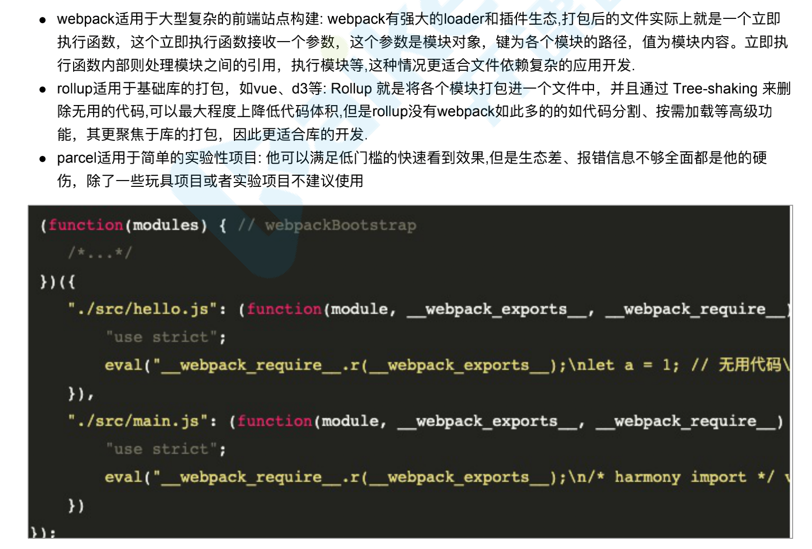

#

# 基础概念

## webpack、rollup、parcel 优劣？



## 分别介绍 bundle，chunk，module 是什么

- bundle：是由 webpack 打包出来的⽂件
- chunk：代码块，⼀个 chunk 由多个模块组合⽽成，⽤于代码的合并和分割
- module：是开发中的单个模块，在 webpack 的世界，⼀切皆模块，⼀个模块对应⼀个⽂件，webpack 会从配置的 entry 中递归开始找出所有依赖的模块

## Loader 和 Plugin 的不同？

1. 不同的作用

- Loader 直译为"加载器"。Webpack 将⼀切⽂件视为模块，但是 webpack 原⽣是只能解析 js ⽂件，如果想将其他⽂件 也打包的话，就会⽤到 loader 。 所以 Loader 的作⽤是让 webpack 拥有了加载和解析⾮ JavaScript ⽂件的能⼒。
- Plugin 直译为"插件"。Plugin 可以扩展 webpack 的功能，让 webpack 具有更多的灵活性。 在 Webpack 运⾏的⽣命 周期中会⼴播出许多事件，Plugin 可以监听这些事件，在合适的时机通过 Webpack 提供的 API 改变输出结果。

2. 不同的用法

- Loader 在 module.rules 中配置，也就是说他作为模块的解析规则⽽存在。 类型为数组，每⼀项都是⼀个 Object，⾥⾯描述了对于什么类型的⽂件（ test ），使⽤什么加载( loader )和使⽤的参数（ options ） \* Plugin 在 plugins 中单独配置。 类型为数组，每⼀项是⼀个 plugin 的实例，参数都通过构造函数传⼊。

## webpack 的构建流程是什么?

Webpack 的运⾏流程是⼀个串⾏的过程，从启动到结束会依次执⾏以下流程：

1. 初始化参数：从配置⽂件和 Shell 语句中读取与合并参数，得出最终的参数；
2. 开始编译：⽤上⼀步得到的参数初始化 Compiler 对象，加载所有配置的插件，执⾏对象的 run ⽅法开始执⾏编译；
3. 确定⼊⼝：根据配置中的 entry 找出所有的⼊⼝⽂件；
4. 编译模块：从⼊⼝⽂件出发，调⽤所有配置的 Loader 对模块进⾏翻译，再找出该模块依赖的模块，再递归本步骤直到所有⼊⼝依赖的⽂件都经过了本步骤的处理；
5. 完成模块编译：在经过第 4 步使⽤ Loader 翻译完所有模块后，得到了每个模块被翻译后的最终内容以及它们之间的 依赖关系；
6. 输出资源：根据⼊⼝和模块之间的依赖关系，组装成⼀个个包含多个模块的 Chunk，再把每个 Chunk 转换成⼀个单独的⽂件加⼊到输出列表，这步是可以修改输出内容的最后机会；
7. 输出完成：在确定好输出内容后，根据配置确定输出的路径和⽂件名，把⽂件内容写⼊到⽂件系统。

在以上过程中，Webpack 会在特定的时间点⼴播出特定的事件，插件在监听到感兴趣的事件后会执⾏特定的逻辑，并 且插件可以调⽤ Webpack 提供的 API 改变 Webpack 的运⾏结果。

## 是否写过 Loader 和 Plugin？描述⼀下编写 loader 或 plugin 的思路？

- Loader 像⼀个"翻译官"把读到的源⽂件内容转义成新的⽂件内容，并且每个 Loader 通过链式操作，将源⽂件⼀步步翻译 成想要的样⼦。

- 编写 Loader 时要遵循单⼀原则，每个 Loader 只做⼀种"转义"⼯作。 每个 Loader 的拿到的是源⽂件内容（ source ），可 以通过返回值的⽅式将处理后的内容输出，也可以调⽤ this.callback() ⽅法，将内容返回给 webpack。 还可以通过 this.async() ⽣成⼀个 callback 函数，再⽤这个 callback 将处理后的内容输出出去。 此外 webpack 还为开发者准备了 开发 loader 的⼯具函数集—— loader-utils 。

- 相对于 Loader ⽽⾔，Plugin 的编写就灵活了许多。 webpack 在运⾏的⽣命周期中会⼴播出许多事件，Plugin 可以监听这 些事件，在合适的时机通过 Webpack 提供的 API 改变输出结果。

## webpack 的热更新是如何做到的？说明其原理？

webpack 的热更新⼜称热替换（Hot Module Replacement），缩写为 HMR。 这个机制可以做到不⽤刷新浏览器⽽将新变更的模块替换掉旧的模块。


## 如何⽤ webpack 来优化前端性能？

## 如何提⾼ webpack 的打包速度?

1. 多⼊⼝情况下，使⽤ CommonsChunkPlugin 来提取公共代码
2. 通过 externals 配置来提取常⽤库
3. 利⽤ DllPlugin 和 DllReferencePlugin 预编译资源模块 通过 DllPlugin 来对那些我们引⽤但是绝对不会修改的 npm 包来进⾏预编译，再通过 DllReferencePlugin 将预编译的模块加载进来。
4. 使⽤ Happypack 实现多线程加速编译
5. 使⽤ webpack-uglify-parallel 来提升 uglifyPlugin 的压缩速度。 原理上 webpack-uglify-parallel 采⽤了多核并⾏ 压缩来提升压缩速度 webpack ⾯试题 112
6. 使⽤ Tree-shaking 和 Scope Hoisting 来剔除多余代码

# 构建配置

## 抽取公共代码和第三方库（代码分割）

```
optimization: {
  // 分割代码块
  splitChunks: {
    /*
    * initial: 入口 chunk, 不处理异步导入的文件
    * async: 异步 chunk, 只处理异步导入的文件
    * all：全部 chunk
    */
    chunks: 'all',  // 一般设置 all, 也可在缓存分组单独设置
    // 缓存分组
    cacheGroups: {
      // 第三方模块
      vendor: {
        name: 'vendor', // chunk 名称
        priority: 1, // 权限更高，优先抽离，重要!!
        test: /node_modules/, // 引用的是 node_modules 中的就判断为第三方模块
        minSize: 0, // 大小限制
        minChunks: 1, // 最少复用过几次
        // chunks: 'all'
      },
      // 公共代码
      common: {
        name: 'common', // chunk 名称
        priority: 0, // 优先级
        minSize: 0, // 大小限制
        minChunks: 2, // 最少复用过几次
      },
    }
  },
}

// 引入 chunk
new HTMLWebpackPlugin({
  chunks: ['index', 'vendor', 'common']
})
```
